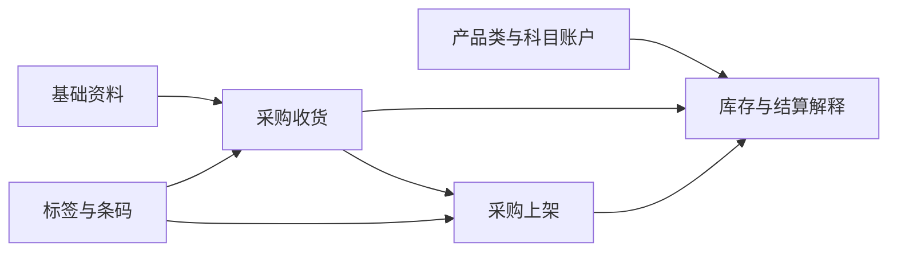

# WMS 基础数据

> 适用基线：测试环境 / `dev` 分支 / 2026-07-15。
> 阅读对象：测试、实施、运维（主）；财务/结算协同人员（顺带）。

## 这一组资料解决什么问题

WMS 基础数据把“仓库业务要按什么价格、结算口径和标签规则运行”落实为受控资料。它们不直接完成收货或上架，但会影响业务解释、打印识别、结算衔接和追溯结果。

## 建议学习与维护顺序

| 顺序 | 资料 | 使用时机 | 维护原则 |
| --- | --- | --- | --- |
| 1 | [销售价格单](01-销售价格单.md) | 需要按客户与物料识别价格时。 | 先明确适用客户、物料和生效期。 |
| 2 | [产品类](02-产品类.md)、[科目账户配置](03-科目账户配置.md) | 需要给库存差异、盘点或报废等结果确定结算归属时。 | 与财务口径一起确认，不在现场业务中临时补录。 |
| 3 | [ERP 成本中心](04-ERP成本中心.md)、[ERP 项目信息](05-ERP项目信息.md) | 配置科目账户或进行结算归集前。 | 以外部主数据口径为准，先确认同步状态。 |
| 4 | [标签与条码](06-标签与条码.md) | 收货、上架、库位标识和现场扫码前。 | 先完成规则、类型和模板验证，再批量生成或打印。 |

## 与入库链的关系

价格、结算和标签资料的具体读取时机仍应在测试环境按业务场景验证；本页不把尚未证实的关联写成既定规则。

## 页面清单与维护方式

| 页面 | 说明 |
| --- | --- |
| 销售价格单 | 客户、物料、币种、价格、生效期和启停。 |
| 产品类 | 产品分类及差异、重估、报废、盘点等结算归属。 |
| 科目账户配置 | 账户与成本中心、项目、产品类来源的对应关系。 |
| ERP 成本中心 / 项目信息 | WMS 内可维护；是否以 ERP 同步为权威源待确认（`WMS-SA-002`）。 |
| 标签与条码 | 规则、类型、模板、标签信息与各类标签操作入口。 |

## 当前边界与待确认事项

- 标签、条码和打印当前从 WMS 基础数据进入；其跨业务复用属性明确，后续应归入基础设施/平台能力统一治理，但本阶段不另建孤立模块（`WMS-LABEL-004`、`GAP-015`）。
- ERP 成本中心、项目信息在 WMS 内**已具备本地增删改与导入能力**；是否仍以 ERP 同步为唯一权威源、本地改动是否被覆盖，见 `WMS-SA-002`，使用前须与财务/集成责任方对齐。
- 销售价格单、产品类、科目账户的唯一性、引用保护与读取时机分别见 `WMS-SP`、`WMS-MSTR`、`WMS-SA`。
- 价格、科目账户和标签资料对采购收货、退货、上架的实际读取范围，随入库链业务页继续验证。

!!! example "📷 截图占位"
    基础数据菜单、价格维护、科目账户选择器、标签生成和打印入口。

!!! tip "📝 待补充"
    使用一笔脱敏收货，展示标签生成、上架扫码和结算资料查询的完整路径。
