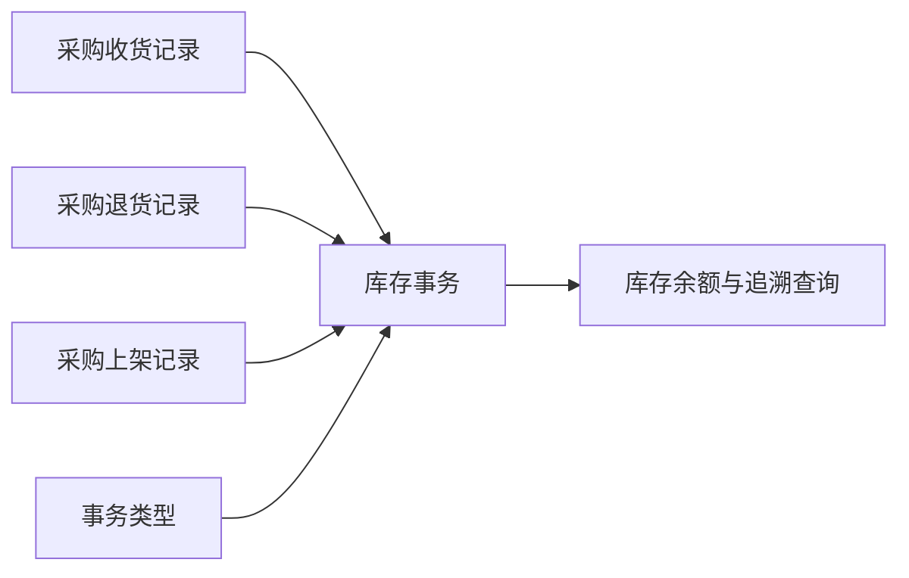

# 事务类型

> 适用基线：测试环境 / `dev` 分支 / 2026-07-15。
> 具体新增、编辑、导入和查询操作见[事务类型-维护与查询参考](05-事务类型-维护与查询参考.md)。

## 这项配置解决什么问题

事务类型为库存变化维护统一的业务动作、是否允许负数及有效期口径。收货、退货、上架等业务形成库存结果时，应通过事务类型解释“为什么发生这次变化”，而不是只看到数量增减。

事务类型不是普通分类。错误的库存动作或负数策略可能导致余额口径错误、异常业务被放行，或后续追溯无法解释。

## 它与入库链的关系

图中表达库存事务应使用受控事务类型；每类入库业务到底使用哪一个类型、是否存在冲销类型，仍需后续逐项核实。

## 维护时最重要的判断

| 需要判断什么 | 业务含义 | 建议做法 |
| --- | --- | --- |
| 库存动作是否正确 | 决定库存变化的业务解释。 | 先对照目标业务与库存模型，不凭名称猜测。 |
| 是否允许负数 | 决定库存不足时是否允许继续形成结果。 | 仅在已批准的业务场景启用，并验证异常追溯。 |
| 是否应修改已使用类型 | 可能改变后续业务的库存口径。 | 对在用类型优先新增替代配置，再完成受控切换。 |

## 当前边界与待确认事项

- 库存动作的可选范围、类型代码唯一性、已引用后的编辑/停用保护尚未确认。
- 当前导入模板的“是否可用”列名与业务语义不一致，正式导入前必须下载模板并试导确认。
- 负数策略在各类库存、冻结和异步业务中的实际效果需要专项测试。

## 待补充的图示与示例
!!! example "📷 截图占位"
    事务类型新增、库存动作/负数策略设置、导入错误和被业务引用的查询入口。

