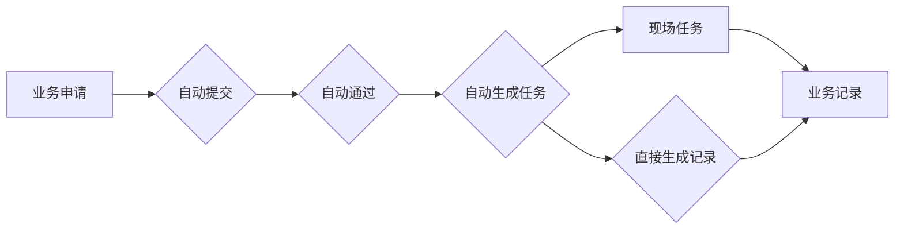

# 计划设置

> 适用基线：测试环境 / `dev` 分支 / 2026-07-15。
> 具体新增、编辑和查询操作见[计划设置-维护与查询参考](06-计划设置-维护与查询参考.md)。

## 这项配置解决什么问题

计划设置决定业务申请如何进入后续处理：是否自动提交、自动通过、自动生成任务，或跳过任务直接生成记录。它是申请—任务—记录通用模型在不同业务中的自动化开关。

对于采购收货、采购退货和采购上架，这些选项会直接影响谁需要审核、是否产生现场任务，以及是否可能绕过现场执行。因此它属于高风险配置，不应为临时提速而随意修改。

## 自动流转的影响

图中只说明配置可能影响的方向。各选项的优先级、互斥关系、失败回退和在不同业务类型中的适用范围，仍需端到端测试确认。

## 当前边界与待确认事项

- 代码、申请模式、四项自动处理选项与可用状态为当前输入模型必填。
- 当前未发现可确认的导入模型；如后续出现导入入口，应另行定义审批、模板和回退要求。
- 已创建的申请、任务、记录是否受后续配置变更影响尚未确认。

## 图示、截图与示例任务

!!! tip "📝 待补充"
    针对采购收货分别验证手工流转、自动生成任务和直接生成记录三种配置的结果。
