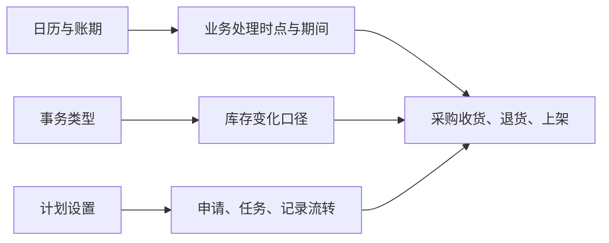

# WMS 系统设置

> 适用基线：测试环境 / `dev` 分支 / 2026-07-15。

## 这一组配置解决什么问题

系统设置维护影响 WMS 运行节奏和处理方式的受控资料：系统日历定义模块可用时段，账期日历定义业务期间，事务类型定义库存变化的业务口径，计划设置决定申请、任务与记录能否自动流转。

这组配置不是普通主数据。一次错误变更可能影响新业务的创建、库存是否允许出现负数、自动处理程度或期间归属；生产环境变更应先完成影响评估与测试验证。

## 建议学习与维护顺序

| 顺序 | 页面 | 先解决什么 | 与入库链的关系 |
| --- | --- | --- | --- |
| 1 | [系统日历](01-系统日历.md)、[账期日历](02-账期日历.md) | 确认业务处理时段和期间口径。 | 影响收货、退货、上架的时间与期间查询。 |
| 2 | [事务类型](03-事务类型.md) | 确认库存变化采用什么业务动作与负数策略。 | 是收货、退货、上架库存结果的共同口径。 |
| 3 | [计划设置](04-计划设置.md) | 确认申请、任务、记录的自动处理方式。 | 直接影响入库链怎样从申请进入现场执行与记录。 |

## 关键业务关系

图中表达当前可确认的配置影响方向；具体哪些入库业务读取每项配置、何时生效，需要在各业务事实页和测试环境中继续验证。

## 页面清单与写作状态

| 页面 | 文档形态 | 已说明内容 | 后续需补 |
| --- | --- | --- | --- |
| [系统日历](01-系统日历.md) | 主文档内含维护与查询说明 | 模块时段、导入、启停与变更风险。 | 时段校验与实际引用范围。 |
| [账期日历](02-账期日历.md) | 主文档内含维护与查询说明 | 年月期间、转换时间、导入与停用风险。 | 关账/跨期处理与实际引用范围。 |
| [事务类型](03-事务类型.md) | 主文档 + [维护与查询参考](05-事务类型-维护与查询参考.md) | 库存动作、负数策略、导入和库存影响。 | 实际动作映射、冲销和编辑保护。 |
| [计划设置](04-计划设置.md) | 主文档 + [维护与查询参考](06-计划设置-维护与查询参考.md) | 自动提交、自动通过、自动生成任务/记录的风险。 | 各业务类型的实际适用范围与回退行为。 |

## 图示、截图与示例任务

【截图占位：四个设置的列表、编辑界面、可用状态及高风险变更提示。】

【示例任务占位：以采购收货为例，分别验证期间、事务类型和计划设置对业务处理的影响。】
