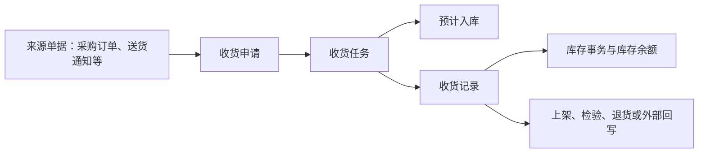

# 采购收货-维护与查询参考

> 适用基线：测试环境目标 / `dev` 分支 / 2026-07-15。
> 用途：配合[采购收货](index.md)使用。本页给测试、实施与日常操作：怎样发起、承接、执行、查询与定位异常。端到端主线、配置影响与建议验证点以主文档为准。

## 快速定位

| 你要做什么 | 先看哪里 |
| --- | --- |
| 理解配置如何改变现场行为、开验证场景 | 返回[采购收货主文档](index.md)「配置如何起作用」「建议验证点」 |
| 查选择器范围、联动、回填、采集与门禁 | 「字段业务语义」 |
| 从来源单据发起收货 | 「申请：建立待处理到货」 |
| 到现场收货或拒收 | 「任务：承接与现场执行」 |
| 查实际结果、上架或撤销 | 「记录：实际收货结果」 |
| 查库存为什么没有变化 | 「库存影响与追溯」 |
| 使用 PDA | 「终端执行参考」 |

## 业务对象关系

先判断自己在处理「待确认的申请」「待执行的任务」还是「已产生的收货记录」——三者可做动作与后续影响不同。

## 申请：建立待处理到货

### 应核对的信息

| 信息组 | 业务用途 |
| --- | --- |
| 来源单据与供应商 | 确认到货来自哪里、由谁送达 |
| 采购订单、发货单或计划信息 | 核对到货范围与后续追溯 |
| 物料、单位与数量 | 形成现场收货任务的基础 |
| 要求到货时间、运输与承运信息 | 到货协同和现场识别 |

可从[采购订单](../../10-SCP-供应链平台/02-采购订单/index.md)带入信息；可选范围受**已发布**状态与当前订单类型要求限制。业务类型按采购收货场景使用，不应由操作人员随意替换（策略入口见主文档「配置如何起作用」）。

### 常用动作

| 动作 | 目的 | 操作提醒 |
| --- | --- | --- |
| 新增/修改 | 建立或更正待处理到货 | 来源带回的供应商、订单类型等通常不应随意改写 |
| 提交、同意、驳回、处理 | 推进申请进入下一步 | 是否自动执行、由谁处理，取决于业务类型等配置 |
| 关闭、重新添加 | 结束或重新处理申请 | 先判断是否已生成任务或记录 |

!!! example "📷 截图占位"
    来源单据选择、供应商自动带入、申请提交与处理入口。

## 任务：承接与现场执行

任务是仓库现场真正要完成的工作。它保存来源申请、供应商、物料、数量、库位和批次/包装等执行信息，并在创建时形成预计入库。

| 现场要确认什么 | 为什么重要 |
| --- | --- |
| 任务号、来源申请和供应商 | 防止处理错到货 |
| 物料、单位、计划数量 | 核对实际到货 |
| 库位、库存状态、批次和包装 | 决定库存定位和追溯粒度 |
| 是否允许改数量、库位、批次、包装 | **由任务配置决定**，不能凭经验绕过 |

### 常用动作

| 动作 | 业务结果 |
| --- | --- |
| 承接 | 将待处理任务交给当前执行人 |
| 放弃 | 放回或退出当前执行责任；具体后续状态需测试确认 |
| 执行收货 | 按任务完成扫描和数量确认，形成实际收货结果 |
| 拒收 | 记录未接收的到货；PDA 拒收需要填写原因 |
| 关闭或撤销 | 结束未完成任务或取消任务；需同时检查预计入库和下游影响（`GAP-009`） |

!!! example "写实示例：任务配置 → 现场行为"
    **给定：** 任务开启「必须扫描库位」、关闭「允许修改数量」。  
    **期望：** PDA 未扫/校验库位不能提交；手工改实收数量被拒绝或不可编辑；按包装管理时直接改数量通常受限制。

!!! example "📷 截图占位"
    任务列表、承接操作、任务配置限制和拒收入口。

## 记录：实际收货结果

收货记录用于追溯「实际收了什么、收了多少、谁在何时执行」，并且是后续库存、上架、检验、退货和外部回写的重要来源。

| 你要查什么 | 推荐查看内容 |
| --- | --- |
| 实收结果 | 记录号、来源申请/任务、物料、实收数量、库位、批次、包装 |
| 后续处理 | 是否已创建[上架](../05-采购上架/index.md)、[检验](../../07-QMS-质量管理/02-来料检验/index.md)或[退货](../04-采购退货/index.md) |
| 库存结果 | 对应[库存事务](../09-库存管理/03-库存事务.md)和[库存余额](../09-库存管理/04-库存余额与追溯.md)是否已变化 |
| 撤销影响 | 原记录、撤销结果、库存反向影响和外部回写状态 |

### 常用动作

| 动作 | 何时使用 | 需要关注什么 |
| --- | --- | --- |
| 创建上架申请 | 收货后还需转入正式库位 | 上架完成前，位置/状态可能仍待处理 |
| 创建检验申请 | 到货需要质量检验 | 质量结果对可用范围的影响在质量页确认 |
| 创建采购退货记录 | 已收货需退回供应商 | 来源和数量须可追溯 |
| 撤销收货记录 | 已确认收货需要回退 | 核对库存、后续单据和外部系统是否同步回退 |

!!! example "📷 截图占位"
    收货记录详情、上架/检验/退货入口、撤销确认提示。

## 库存影响与追溯

| 发生时点 | 系统业务结果 | 如何追溯 |
| --- | --- | --- |
| 生成任务 | 形成预计入库 | 从任务号查[库存预期](../09-库存管理/02-库存预期.md) |
| 完成收货 | 形成收货记录和库存事务 | 从记录查[库存事务](../09-库存管理/03-库存事务.md) |
| 库存事务完成 | 更新库存余额 | 按物料、库位、批次、包装等查[余额与追溯](../09-库存管理/04-库存余额与追溯.md) |
| 后续处理 | 可进入上架、检验、退货或外部回写 | 从记录后续处理入口或关联号查询 |

若「收货完成但库存查不到」，依次检查：记录是否已生成 → 事务是否已生成 → 是否仍待上架或检验 → 权限或查询条件是否过窄。

## 终端执行参考

| 场景 | PDA 当前操作特点 |
| --- | --- |
| 定位任务 | 可按任务号或送货通知查询/扫描 |
| 承接任务 | 进入待处理任务详情时会自动承接 |
| 收货 | 可扫描包装标签，按配置扫描或校验目标库位 |
| 数量与库位修改 | 受任务配置控制；按包装管理时，直接改数量可能被限制 |
| 拒收 | 使用拒收模式，并填写拒收原因 |
| Web 对比 | Web 任务列表执行入口可能不可用（`GAP-010`）；现场以 PDA 详情为主 |

!!! example "📷 截图占位"
    PDA 任务定位、收货扫描、全单收货、拒收原因四个关键界面。

## 查询与详情参考

| 查询对象 | 建议默认看什么 | 常用筛选 |
| --- | --- | --- |
| 收货申请 | 单据号、状态、供应商、采购订单、发货单 | 单据号、采购订单号、供应商、发货单、订单类型 |
| 收货任务 | 单据号、来源申请、状态、供应商、采购订单、发货单 | 单据号、状态、供应商、发货单 |
| 收货记录 | 单据号、状态、来源申请/任务、供应商、采购订单、发货单 | 单据号、采购订单号、供应商、发货单 |

详情页宜按「基本信息、到货与明细、执行与差异、后续处理、系统信息」分组；实际页签与跳转过滤条件以测试环境为准。

## 操作前的快速核对

| 你准备做的操作 | 最少先核对什么 |
| --- | --- |
| 发起或修改申请 | 来源单据、供应商、物料、单位与计划数量 |
| 承接或执行任务 | 任务状态、执行人、扫描要求、库位/批次/包装和数量修改限制 |
| 拒收、少收、多收或撤销 | 差异原因、任务配置、是否已有后续上架/检验/退货及库存结果 |
| 查询「是否已入库」 | 收货记录、库存事务、库存余额及是否仍有待上架/检验 |

## 字段业务语义

跨页选择器通例见[通用选择器过滤惯例](../../02-业务模型/12-通用选择器过滤惯例.md)；库位级联见[库位与仓储级联惯例](../../02-业务模型/13-库位与仓储级联惯例.md)。库存粒度通例见[库存管理精度与唯一粒度](../../02-业务模型/08-库存管理精度与唯一粒度.md)。写法约定见[页面数据字典规范](../../02-业务模型/04-页面数据字典规范.md)。

下列专项表供深查与用例设计；**主线阅读不必先读本段**。模式编号仅作写作归类，不是读者操作步骤。

**本页覆盖的行为类型：** 来源单/物料/库位选择、包装/批次/托盘采集、来源与仓区级联、回填锁定、计划/实收数量、扫描采集、申请/任务/记录门禁、业务类型、权限裁剪（待确认）。**本页不维护**默认包装/默认库位的唯一规则（回主数据与任务配置）。

### 字段业务语义总表

| 字段（中文业务名） | 行为归类 | 业务作用 | 谁在何时维护/选择 | 业务约束摘要 | 影响哪些功能 | 变更或错选风险 |
| --- | --- | --- | --- | --- | --- | --- |
| 业务类型 | 策略入口 | 场景策略入口 | 申请建立时确定 | 按采购收货场景使用，勿随意替换 | 自动动作、编号、事务路径 | 错选导致流程与库存路径偏离 |
| 来源采购订单 | 选择 + 回填 | 确定到货范围 | 申请新增时选择 | 已发布 + 符合当前 ERP 订单类型 | 申请明细、任务、记录追溯 | 选错订单 → 整单物料错误 |
| 送货通知 / 发货单号 | 选择 | 到货识别与定位 | 申请或 PDA 定位 | 与来源协同；PDA 可按 ASN 查任务 | 任务定位、列表筛选 | 号错导致找不到任务 |
| 供应商 | 回填锁定 | 送货方 | 通常由来源回填 | 主表供应商代码非空；回填后通常锁定 | 核对、追溯、对账 | 与实物不符 |
| 明细物料 | 选择 + 回填 | 应收物料 | 来源明细带入/选择 | 来源单范围内；物料应可用 | 任务执行、库存事务 | 选不到时先查来源与物料状态 |
| 单位 / 采购单位 | 回填 + 数量 | 计量 | 带回或维护 | 库存单位与采购单位可能并存 | 数量核对、记账 | 单位混用导致数量偏差 |
| 计划数量 / 实收数量 | 数量 | 应收与实收 | 计划多来自来源；实收现场确认 | 少收/多收受任务配置 | 预计入、库存事务、余额 | 违规改量被拒或账实不符 |
| 转换率 | 数量 | 采购量与库存量换算 | 固定/非固定模板相关 | 生成与校验规则待专项核验 | 导入与记账 | 错误转换率导致入账数量错 |
| 仓库 / 库区 / 库位 | 选择 + 级联 | 收货落点 | 任务执行时选择或扫描 | 级联过滤；受任务是否允许改库位约束 | 库存余额位置 | 跨仓库位残留或扫错位 |
| 库存状态 | 分流 / 采集 | 收货后库存状态 | 任务/配置决定 | 参与余额业务键 | 可用范围、质检放行 | 状态错导致不可用或误用 |
| 批次 / 包装号 / 托盘号 | 采集 | 采集与追溯维度 | 现场按任务要求扫/录 | 构成余额唯一粒度 | 余额合并、追溯、盘点 | 漏采无法完成或粒度不足 |
| 申请/任务/记录状态 | 门禁 | 动作门禁 | 系统随动作迁移 | 具体状态码待测试 | 提交、承接、拒收、撤销等 | 非预期状态操作（`GAP-009`） |
| 拒收原因 | 分流 | 未接收说明 | PDA/Web 拒收时填写 | PDA 拒收必填 | 异常闭环、供应商协同 | 无原因无法完成拒收 |
| 创建人/时间等 | 审计 | 审计 | 系统写入 | 勿当业务可维护项 | 追溯 | — |

### 选择器范围表

| 选择字段 | 选择对象 | 可选范围（必须写清） | 范围依赖的前置字段/状态/权限 | 选中后带回或锁定什么 | 选不到时通常原因 |
| --- | --- | --- | --- | --- | --- |
| 来源采购订单 | 采购订单 | **已发布**，且符合**当前 ERP 订单类型**要求的订单 | 业务类型 / 订单类型配置；组织与数据权限是否再裁剪见文末待确认 | 供应商、订单类型、可收货明细行等；供应商等通常锁定 | 未发布、类型不符、已关闭/无剩余可收、权限外 |
| 送货通知等来源 | 送货/ASN 类单据 | 与当前收货场景匹配的可引用通知 | 供应商、订单关联 | 到货识别信息、可能的明细 | 通知未同步、已关闭、供应商不匹配 |
| 供应商 | 供应商主数据 | 通常**不由用户从全量自由选**，而来源回填 | 来源单据 | 名称等展示信息 | 主数据停用、未维护、权限外 |
| 明细物料 | 物料（来源明细内） | **来源单明细中的物料**；物料应可用 | 已选来源单、供应商 | 单位、计划数量、包装等（见回填表） | 不在来源明细、物料停用、权限外 |
| 库位 | 库位主数据 | 属于任务/配置允许的仓库（及库区）范围内的可用库位 | 仓库、库区；任务是否允许改库位；PDA 扫描校验 | 库区/仓库等定位信息 | 不在当前仓库、停用、扫码不匹配、任务禁止改库位 |
| 包装 / 批次 / 托盘 | 标签或库存维度 | 按任务采集要求；有标签时扫描合法包装标签 | 物料管理精度、任务扫描开关 | 锁定对应数量/物料信息 | 标签无效、与任务物料不符、未要求却强采或要求却未采 |
| 承运商等运输信息 | 承运主数据或字典 | 选择器与字典来源待核验 | — | 运输展示信息 | 主数据未维护 |

工厂/部门/货主等数据权限是否进一步裁剪上述选择器，尚无逐页实测矩阵（`GAP-014`），不得写成已确认全站规则。

### 联动链表

| 上游字段变化 | 受影响下游字段 | 系统行为（清空/重算/禁止/保持） | 业务原因 |
| --- | --- | --- | --- |
| 更换来源采购订单 | 供应商、明细物料/数量/单位等 | **重载**明细；供应商等按新来源**回填**；旧明细不应保留 | 到货范围整体替换 |
| 清空来源单据 | 已带回的供应商与明细 | **清空**或禁止保存不完整申请 | 无来源则无合法收货范围 |
| 变更仓库（若任务允许） | 库区、库位 | **清空**已选库区/库位后重选（通例） | 禁止跨仓库位残留 |
| 变更库区 | 库位 | **清空**库位后按新库区过滤 | 库位从属于库区 |
| 任务配置变更（改量/改位/扫描开关） | 数量、库位、批次、包装可编辑性 | **禁止**或**允许**现场修改；不自动改历史记录 | 现场控制以任务配置为准 |

### 回填与锁定表

| 触发选择 | 回填字段 | 可改/锁定 | 锁定解除条件 | 与手工录入冲突时以谁为准 |
| --- | --- | --- | --- | --- |
| 选择来源采购订单 | 供应商、订单类型、来源明细（物料、单位、计划数量等） | 供应商等**通常锁定**；计划数量等是否可改视申请编辑规则 | 更换来源单后重新回填 | 以最新来源回填为初始；手工改写不得突破来源范围 |
| 选择/带入明细物料 | 单位、名称、包装相关信息 | 单位多只读；数量按规则可改 | — | 物料主数据单位为准 |
| 任务生成 | 预计入库相关数量与定位草稿 | 执行前按任务配置 | 任务撤销/关闭时清理预期（见库存影响） | 任务数据为准 |
| PDA 扫描包装标签 | 包装号及关联物料/数量信息 | 按配置锁定或允许改 | 任务允许改包装时 | 扫描结果优先，配置允许时才可手改 |
| PDA 扫描/校验库位 | 目标库位 | 任务禁止改库位则锁定 | 任务允许改库位 | 校验失败则禁止提交 |

### 数量与换算表

| 数量字段 | 计量单位来源 | 换算关系 | 允许差异/超收欠收 | 记账落到哪一库存结果 |
| --- | --- | --- | --- | --- |
| 计划数量 | 多来自来源单明细单位 | 与采购数量/转换率相关 | 申请阶段以核对来源为主 | 进入任务与预计入库 |
| 实收数量 | 库存单位（任务/物料） | 采购量 ↔ 库存量经转换率 | 少收/多收/全单收货受**任务配置** | 收货记录 → 库存事务 → 库存余额 |
| 采购数量 / 供应商数量 | 采购/供应商单位 | 固定或非固定转换率模板 | 导入两类模板 | 与库存数量对照，避免混单位入账 |
| 短缺数量等记录字段 | 系统按计划与实收计算 | — | — | 支持后续补货/关闭判断 |

### 精度与采集表

| 精度/维度 | 何时必须采集 | 采集入口（Web/PDA） | 缺失时能否完成 | 对库存唯一粒度的影响 |
| --- | --- | --- | --- | --- |
| 包装号 | 任务要求扫描包装时 | PDA 扫描包装标签；Web 视配置 | 要求扫描时通常**不能**跳过 | 包装号为余额业务键之一 |
| 库位 | 任务要求扫描/校验库位时 | PDA 扫描或校验；Web 选择 | 校验失败则不能提交 | 库位为余额业务键之一 |
| 批次 | 物料/任务按批次管理时 | 扫码或录入 | 缺省时是否可完成待确认 | 批次为余额业务键之一 |
| 托盘 | 按托盘管理时 | 扫码或录入 | 待确认 | 托盘为余额业务键之一 |
| 库存状态 | 收货落位时 | 任务/默认配置 | 需有明确状态才能入账 | 库存状态为余额业务键之一 |
| 数量 | 始终需要确认实收 | Web/PDA；改量受配置 | 无数量不能完成收货 | 更新对应粒度余额数量 |

### 状态与动作摘要

具体状态编码与自动策略尚未测试闭合（`GAP-002`）。下表只列**已证实存在的动作入口**与业务结果，不承诺固定状态机。状态图见[主文档](index.md)。

| 对象 | 允许动作（入口存在） | 前置检查 | 成功后的下游影响 | 禁止或风险说明 |
| --- | --- | --- | --- | --- |
| 收货申请 | 新增、修改、删除、提交、同意、驳回、处理、关闭、重新添加 | 来源与明细完整；自动提交/同意取决于配置 | 推进为任务或结束申请 | 勿在已有任务/记录时随意删除 |
| 收货任务 | 承接、放弃、执行、拒收、关闭、撤销、调整任务配置 | PDA 进详情自动承接；Web 执行入口可能不可用（`GAP-010`） | 创建/清理预计入库；形成记录 | 撤销与状态校验一致性（`GAP-009`） |
| 收货记录 | 查询、创建上架/检验/退货、撤销 | 已有实际收货结果 | 库存事务与余额；后续单据 | 撤销须同步关注冲抵与外部回写 |

## 仍待确认（文末集中）

以下项**不改变**上文已写明的操作主线；开单或联调遇阻时对照主文档验证点与问题总账编号：

| 编号或主题 | 待确认内容 |
| --- | --- |
| `GAP-002` | 自动提交/同意/处理策略、状态码与真实审批主体 |
| `GAP-009` | 任务撤销前端可见状态与后端校验是否一致 |
| `GAP-010` | Web 任务列表执行入口可用性 |
| `GAP-014` | 角色/数据权限对选择器的逐页裁剪 |
| 转换率 | 采购量↔库存量生成与校验规则（专项核验） |
| 供应商手工改 | 回填锁定后是否允许手工改供应商 |
| 物料用途过滤 | 选择器是否强制「可采购」等用途开关 |
| 送货通知过滤 | 完整可选范围条件 |
| 库位是否按库存状态再过滤 | 选择器细节 |
| 清空来源后的页面提示 | 具体文案与禁止保存行为 |
| 本业务仓→区清空通例 | 是否与通例页完全一致 |
| 批次/托盘缺省 | 未采集时能否完成收货 |
| 承运商选择器来源 | 主数据或字典 |
| 详情页签与跳转过滤 | 实际分组与联查条件 |
| 撤销闭环 | 冲抵、采购订单回退、外部系统回写 |

!!! example "📐 图示占位"
    若需独立于主文档的状态细图，须在测试环境确认每个状态、动作前置条件、拒收/撤销分支后再绘；不得使用未验证历史草稿。

!!! example "📝 示例数据占位"
    正常收货、少收、拒收、撤销四笔脱敏业务数据；每笔应串联来源单据、申请、任务、记录、库存结果和后续处理（主文档已有一笔写实示例可先用）。
