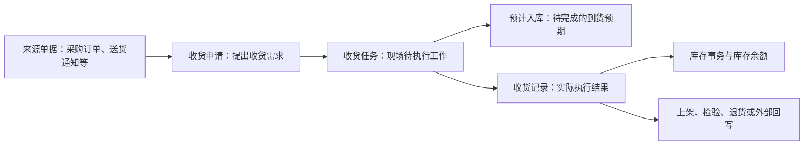

# 采购收货详细参考

> 适用基线：测试环境目标 / `dev` 分支 / 2026-07-15。
> 用途：配合[采购收货业务说明](index.md)使用。本页用于操作、查询、测试和异常定位；端到端业务背景和培训主线以主文档为准。

## 快速定位

| 你要做什么 | 先看哪里 |
| --- | --- |
| 从来源单据发起收货 | “申请：建立待处理到货” |
| 到现场收货或拒收 | “任务：承接与现场执行” |
| 查实际结果、上架或撤销 | “记录：实际收货结果” |
| 查库存为什么没有变化 | “库存影响与追溯” |
| 使用 PDA | “终端执行参考” |
| 想先理解收货为什么要经过申请、任务和记录 | 返回[采购收货业务说明](index.md)。 |

## 业务对象关系

现场操作应先判断自己正在处理的是“待确认的申请”“待执行的任务”还是“已经产生的收货记录”。三者名称相近，但可做的动作、需要核对的信息和后续影响不同。

## 申请：建立待处理到货

### 应核对的信息

| 信息组 | 业务用途 |
| --- | --- |
| 来源单据与供应商 | 确认本次到货来自哪里、由谁送达。 |
| 采购订单、发货单或计划信息 | 用于核对到货范围与后续追溯。 |
| 物料、单位与数量 | 形成现场收货任务的基础。 |
| 要求到货时间、运输与承运信息 | 用于到货协同和现场识别。 |

当前页面可从采购订单带入信息；可选范围受已发布状态和当前订单类型要求限制。业务类型按采购收货场景使用，不应由操作人员随意替换。

### 常用动作

| 动作 | 目的 | 操作提醒 |
| --- | --- | --- |
| 新增/修改 | 建立或更正待处理到货。 | 来源单据带入的供应商、订单类型等信息通常不应随意改写。 |
| 提交、同意、驳回、处理 | 推进申请进入下一步。 | 实际是否自动执行、由谁处理，取决于业务配置。 |
| 关闭、重新添加 | 结束或重新处理申请。 | 应先判断是否已经生成任务或记录。 |

【截图占位：来源单据选择、供应商自动带入、申请提交与处理入口。】

## 任务：承接与现场执行

任务是仓库现场真正要完成的工作。它保存来源申请、供应商、物料、数量、库位和批次/包装等执行信息，并在创建时形成预计入库。

| 现场要确认什么 | 为什么重要 |
| --- | --- |
| 任务号、来源申请和供应商 | 防止处理错到货。 |
| 物料、单位、计划数量 | 用于核对实际到货。 |
| 库位、库存状态、批次和包装 | 决定实际库存定位和追溯粒度。 |
| 是否允许改数量、库位、批次、包装 | 这些限制由任务配置决定，不能凭经验绕过。 |

### 常用动作

| 动作 | 业务结果 |
| --- | --- |
| 承接 | 将待处理任务交给当前执行人。 |
| 放弃 | 放回或退出当前执行责任；具体后续状态需测试确认。 |
| 执行收货 | 按任务完成扫描和数量确认，形成实际收货结果。 |
| 拒收 | 记录未接收的到货；PDA 拒收需要填写原因。 |
| 关闭或撤销 | 结束未完成任务或取消任务；需同时检查预计入库和下游影响。 |

【截图占位：任务列表、承接操作、任务配置限制和拒收入口。】

## 记录：实际收货结果

收货记录用于追溯“实际收了什么、收了多少、谁在何时执行”，并且是后续库存、上架、检验、退货和外部回写的重要来源。

| 你要查什么 | 推荐查看内容 |
| --- | --- |
| 实收结果 | 收货记录号、来源申请/任务、物料、实收数量、库位、批次、包装。 |
| 后续处理 | 是否已创建上架申请、检验申请或采购退货记录。 |
| 库存结果 | 对应库存事务和库存余额是否已产生变化。 |
| 撤销影响 | 原收货记录、撤销结果、库存反向影响和外部回写状态。 |

### 常用动作

| 动作 | 何时使用 | 需要关注什么 |
| --- | --- | --- |
| 创建上架申请 | 收货后还需将物料转入正式库位时。 | 后续上架完成前，库存位置/状态可能仍处于待处理状态。 |
| 创建检验申请 | 到货需要质量检验时。 | 质量结果对可用范围的影响需在质量页面确认。 |
| 创建采购退货记录 | 已收货物料需要退回供应商时。 | 需保证来源和数量可追溯。 |
| 撤销收货记录 | 已确认的收货需要回退时。 | 应核对库存、后续单据和外部系统是否同步回退。 |

【截图占位：收货记录详情、上架/检验/退货入口、撤销确认提示。】

## 库存影响与追溯

| 发生时点 | 系统业务结果 | 如何追溯 |
| --- | --- | --- |
| 生成任务 | 形成预计入库，表达待完成的到货预期。 | 从任务号查预计入库。 |
| 完成收货 | 形成收货记录和库存事务。 | 从收货记录查库存事务。 |
| 库存事务完成 | 更新库存余额。 | 按物料、库位、批次、包装等库存信息查询余额。 |
| 后续处理 | 可进入上架、检验、退货或外部回写。 | 从收货记录的后续处理入口或关联号查询。 |

如果“收货完成但库存查不到”，不要先认定为失败。应依次检查：收货记录是否已生成、库存事务是否已生成、是否仍待上架或检验、是否因权限或查询条件未显示。

## 终端执行参考

| 场景 | PDA 当前操作特点 |
| --- | --- |
| 定位任务 | 可按任务号或送货通知查询/扫描。 |
| 承接任务 | 进入待处理任务详情时会自动承接。 |
| 收货 | 可扫描包装标签，按配置扫描或校验目标库位。 |
| 数量与库位修改 | 受任务配置控制；按包装管理时，直接改数量可能被限制。 |
| 拒收 | 使用拒收模式，并填写拒收原因。 |

【截图占位：PDA 任务定位、收货扫描、全单收货、拒收原因四个关键界面。】

## 查询与详情参考

| 查询对象 | 建议默认看什么 | 常用筛选 |
| --- | --- | --- |
| 收货申请 | 单据号、状态、供应商、采购订单、发货单。 | 单据号、采购订单号、供应商、发货单、订单类型。 |
| 收货任务 | 单据号、来源申请、状态、供应商、采购订单、发货单。 | 单据号、状态、供应商、发货单。 |
| 收货记录 | 单据号、状态、来源申请/任务、供应商、采购订单、发货单。 | 单据号、采购订单号、供应商、发货单。 |

详情页宜按“基本信息、到货与明细、执行与差异、后续处理、系统信息”分组；后续需要在测试环境确认实际分组、页签和跳转过滤条件。

## 操作前的快速核对

| 你准备做的操作 | 最少先核对什么 |
| --- | --- |
| 发起或修改申请 | 来源单据、供应商、物料、单位与计划数量。 |
| 承接或执行任务 | 任务状态、执行人、扫描要求、库位/批次/包装和数量修改限制。 |
| 拒收、少收、多收或撤销 | 差异原因、任务配置、是否已有后续上架/检验/退货及库存结果。 |
| 查询“是否已入库” | 收货记录、库存事务、库存余额及是否仍有待上架/检验的后续处理。 |

## 待补充的状态图与示例

【图示占位：申请、任务、记录的状态图。需要通过测试环境确认每个状态、动作前置条件、拒收/撤销分支后绘制；不得使用历史草稿中的未验证状态。】

【示例数据占位：正常收货、少收、拒收、撤销四笔脱敏业务数据；每笔应串联来源单据、申请、任务、记录、库存结果和后续处理。】

## 仍待业务确认

- 自动提交、自动同意、自动处理和直接生成记录等策略的实际配置及适用场景；
- 少收、多收、重复扫码和数量/库位修改的默认策略；
- 撤销收货后的冲抵、采购订单回退和外部系统回写闭环；
- 实际详情分组、关联 Tab 和跳转过滤条件。
