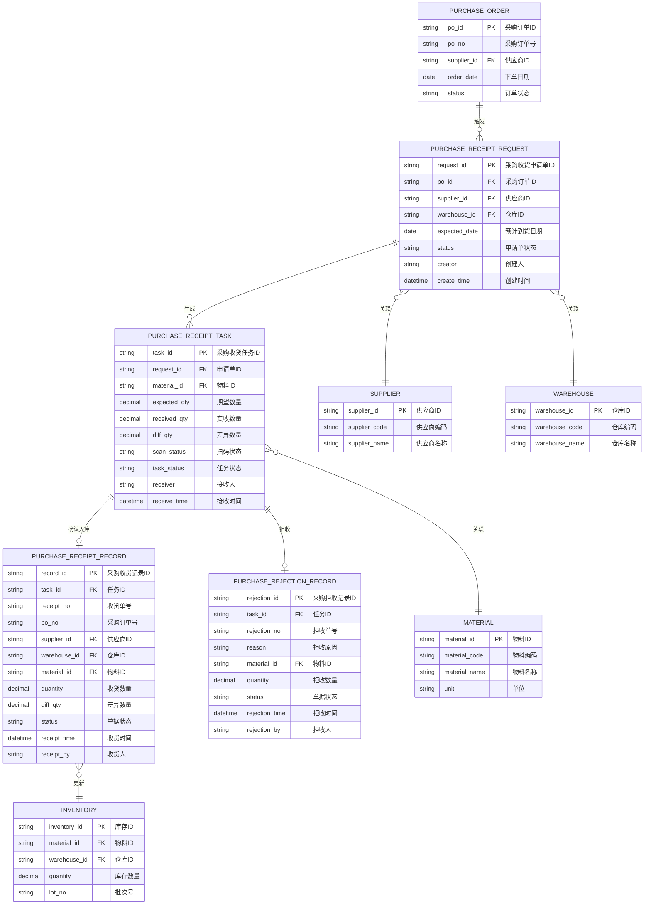
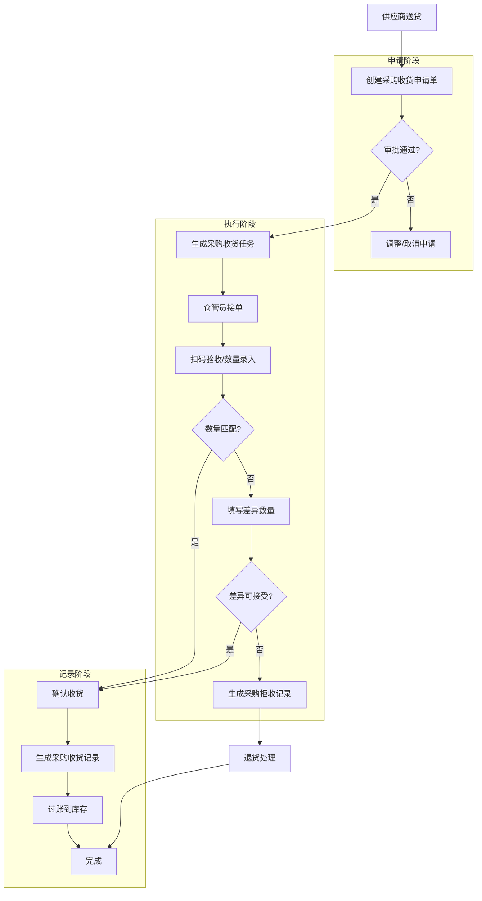

# 采购收货

## 概述

采购收货是WMS库房管理中连接供应商送货与内部库存的核心环节，负责将采购订单转化为实际入库库存，支持扫码验收、数量差异处理、拒收退货等业务场景。

## 领域模型



## 核心流程



## 功能说明

### 1. 采购收货申请

管理采购收货申请单的创建、编辑、审批流程。

**功能入口**: 采购收货管理 → 采购收货申请

| 字段名 | 中文名 | 类型 | 约束 | 影响业务 | 备注 |
|--------|--------|------|------|----------|------|
| request_no | 申请单号 | string | 系统自动生成 | 用于唯一标识本次收货申请 | 格式: PR-YYYYMMDD-XXXX |
| po_no | 采购订单号 | string | 必填, FK | 关联采购订单，获取供应商/物料信息 | (待截图确认) |
| supplier_id | 供应商 | string | 必填, FK | 确定送货方，影响后续供应商对账 | (待截图确认) |
| warehouse_id | 仓库 | string | 必填, FK | 确定收货仓库，影响库存归属 | (待截图确认) |
| expected_date | 预计到货日期 | date | 必填 | 用于提前备货和任务调度 | (待截图确认) |
| material_list | 物料明细 | array | 至少一条 | 明确本次收货的物料清单 | (待截图确认) |
| status | 申请单状态 | enum | 系统定义 | 控制流程走向: 待审批/已审批/已取消 | (待截图确认) |
| creator | 创建人 | string | 系统自动 | 记录操作人员 | (待截图确认) |
| create_time | 创建时间 | datetime | 系统自动 | 记录创建时间戳 | (待截图确认) |

### 2. 采购收货任务

执行层面的扫码验收和数量确认页面。

**功能入口**: 采购收货管理 → 采购收货任务

| 字段名 | 中文名 | 类型 | 约束 | 影响业务 | 备注 |
|--------|--------|------|------|----------|------|
| task_id | 任务ID | string | PK | 唯一标识一个收货任务 | (待截图确认) |
| request_no | 申请单号 | string | 显示 | 关联申请单信息 | (待截图确认) |
| material_code | 物料编码 | string | 扫码获取 | 扫码枪扫描获取 | (待截图确认) |
| material_name | 物料名称 | string | 显示 | 展示物料信息 | (待截图确认) |
| expected_qty | 期望数量 | decimal | 来自订单 | 采购订单中的订购数量 | (待截图确认) |
| received_qty | 实收数量 | decimal | 必填 | 仓管员实际清点数量 | (待截图确认) |
| diff_qty | 差异数量 | decimal | 计算字段 | received_qty - expected_qty | (待截图确认) |
| scan_status | 扫码状态 | enum | 系统定义 | 已扫码/未扫码 | (待截图确认) |
| task_status | 任务状态 | enum | 系统定义 | 待执行/执行中/已完成 | (待截图确认) |
| receiver | 接收人 | string | 系统自动 | 记录执行任务的仓管员 | (待截图确认) |
| receive_time | 接收时间 | datetime | 系统自动 | 记录任务完成时间 | (待截图确认) |

### 3. 采购收货记录

已完成收货单据的列表查询和详情查看。

**功能入口**: 采购收货管理 → 采购收货记录

| 字段名 | 中文名 | 类型 | 约束 | 影响业务 | 备注 |
|--------|--------|------|------|----------|------|
| receipt_no | 收货单号 | string | PK | 唯一标识本次收货记录 | (待截图确认) |
| po_no | 采购订单号 | string | 显示 | 关联采购订单 | (待截图确认) |
| supplier_id | 供应商 | string | FK | 影响供应商对账和发票匹配 | (待截图确认) |
| supplier_name | 供应商名称 | string | 显示 | 展示供应商信息 | (待截图确认) |
| warehouse_id | 仓库 | string | FK | 影响库存归属 | (待截图确认) |
| warehouse_name | 仓库名称 | string | 显示 | 展示仓库信息 | (待截图确认) |
| material_id | 物料ID | string | FK | 关联物料主数据 | (待截图确认) |
| material_code | 物料编码 | string | 显示 | 物料唯一标识 | (待截图确认) |
| material_name | 物料名称 | string | 显示 | 物料描述信息 | (待截图确认) |
| quantity | 收货数量 | decimal | 必填 | 实际入库数量 | (待截图确认) |
| diff_qty | 差异数量 | decimal | 显示 | 与期望数量的差异 | (待截图确认) |
| receipt_date | 收货日期 | date | 必填 | 记录实际收货日期 | (待截图确认) |
| receipt_time | 收货时间 | datetime | 系统自动 | 记录过账时间 | (待截图确认) |
| receipt_by | 收货人 | string | 系统自动 | 记录执行仓管员 | (待截图确认) |
| status | 单据状态 | enum | 系统定义 | 已完成/已冲销 | (待截图确认) |

### 4. 采购拒收记录

拒收单据的记录和查询。

**功能入口**: 采购收货管理 → 采购拒收记录

| 字段名 | 中文名 | 类型 | 约束 | 影响业务 | 备注 |
|--------|--------|------|------|----------|------|
| rejection_no | 拒收单号 | string | PK | 唯一标识本次拒收记录 | (待截图确认) |
| request_no | 申请单号 | string | FK | 关联收货申请 | (待截图确认) |
| task_id | 任务ID | string | FK | 关联收货任务 | (待截图确认) |
| material_id | 物料ID | string | FK | 拒收的物料 | (待截图确认) |
| material_code | 物料编码 | string | 显示 | 物料唯一标识 | (待截图确认) |
| material_name | 物料名称 | string | 显示 | 物料描述 | (待截图确认) |
| quantity | 拒收数量 | decimal | 必填 | 拒收的物料数量 | (待截图确认) |
| rejection_reason | 拒收原因 | string | 必填 | 质量问题/数量异常/包装破损等 | (待截图确认) |
| supplier_id | 供应商 | string | FK | 记录拒收供应商 | (待截图确认) |
| supplier_name | 供应商名称 | string | 显示 | 展示供应商信息 | (待截图确认) |
| rejection_date | 拒收日期 | date | 必填 | 记录拒收发生日期 | (待截图确认) |
| rejection_time | 拒收时间 | datetime | 系统自动 | 记录拒收时间戳 | (待截图确认) |
| rejection_by | 拒收人 | string | 系统自动 | 记录执行仓管员 | (待截图确认) |
| status | 单据状态 | enum | 系统定义 | 待处理/已退货 | (待截图确认) |

## 业务规则

### 数量差异处理

- **允许差异范围**: 可配置（如: ±5% 或 固定值），超出范围的差异需要上级审批
- **差异记账**: 差异数量单独记录，支持正向（多收）和负向（少收）两种场景
- **差异追溯**: 所有差异需要填写原因，便于供应商绩效考核

### 扫码验收规则

- 扫码枪扫描物料条码，系统自动匹配物料信息和期望数量
- 扫码匹配成功才允许确认收货
- 支持离线扫码，扫码记录暂存本地，网络恢复后自动同步

### 库存过账时机

- 收货任务确认后，实时生成收货记录
- 收货记录审核通过后，立即更新库存台账
- 库存过账支持事务回滚，异常时自动冲正

### 拒收处理流程

- 拒收记录生成后，触发退货申请流程
- 拒收物料不参与正常库存计算
- 拒收记录与供应商绩效考核挂钩

## 搜索条件说明

### 采购收货记录搜索

| 搜索字段 | 中文名 | 搜索类型 | 说明 |
|----------|--------|----------|------|
| supplier | 供应商 | 下拉选择 | 支持模糊搜索供应商名称 |
| warehouse | 仓库 | 下拉选择 | 支持多仓库筛选 |
| receipt_no | 收货单号 | 文本输入 | 支持精确和模糊搜索 |
| status | 单据状态 | 下拉选择 | 待处理/进行中/已完成/已冲销 |
| date_range | 收货日期范围 | 日期区间 | 支持自定义起止日期 |

### 采购拒收记录搜索

| 搜索字段 | 中文名 | 搜索类型 | 说明 |
|----------|--------|----------|------|
| supplier | 供应商 | 下拉选择 | 支持模糊搜索 |
| rejection_no | 拒收单号 | 文本输入 | 支持精确和模糊搜索 |
| material | 物料 | 下拉选择 | 支持按物料筛选 |
| date_range | 拒收日期范围 | 日期区间 | 支持自定义起止日期 |

## 菜单树结构

```
采购收货管理
  ├─ 采购收货申请（新建/审批）
  ├─ 采购收货任务（执行页面，含扫码/数量录入）
  ├─ 采购收货记录（已完成单据列表）
  └─ 采购拒收记录（拒收单据列表）
```

## 相关模块接口

### 依赖模块

| 模块 | 接口方向 | 说明 |
|------|----------|------|
| PURCHASE_ORDER | 采购订单 | 获取采购订单信息，触发收货申请 |
| DBC_MATERIAL | 物料主数据 | 获取物料信息、条码规则 |
| DBC_SUPPLIER | 供应商主数据 | 获取供应商信息 |
| WMS_WAREHOUSE | 仓库主数据 | 获取仓库信息 |
| QMS_INSPECTION | 质量检验 | 支持到货质检联动 |

### 被依赖模块

| 模块 | 接口方向 | 说明 |
|------|----------|------|
| WMS_INVENTORY | 库存管理 | 收货过账后更新库存台账 |
| SCP_PURCHASE | 采购供应链 | 收货数据同步至采购对账 |
| FM_PAYABLE | 应付管理 | 收货记录作为付款依据 |

## 版本历史

| 版本 | 日期 | 修改说明 |
|------|------|----------|
| 1.0 | 2026-05-19 | 初稿发布 |