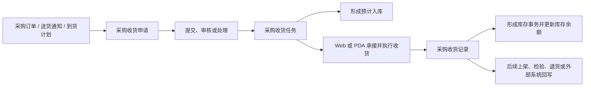
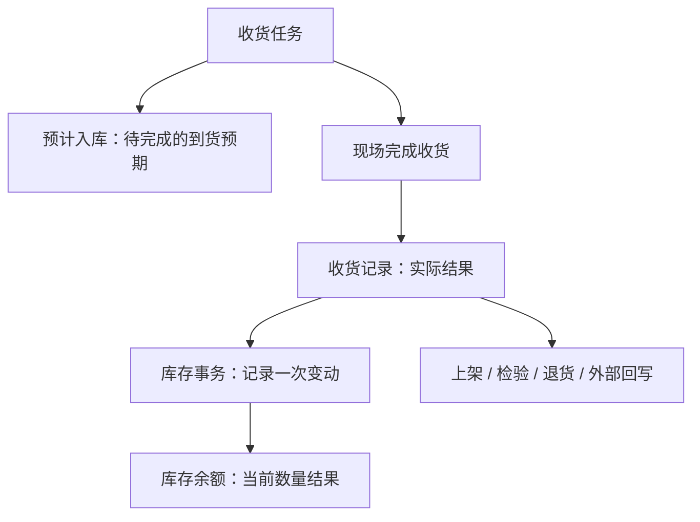

# 采购收货

> 适用基线：测试环境目标 / `dev` 分支 / 2026-07-15。
> 阅读对象：采购协同人员、仓库收货人员、现场执行人员、质量协同人员及需要追溯入库结果的业务人员。

## 业务目的与适用范围

采购收货把“供应商送达的物料”转化为可追溯的内部收货结果。它连接采购订单或送货通知、仓库现场执行、库存变化，以及后续的上架、检验、退货和外部系统回写。

本页说明从到货到收货完成的一条业务链。通用的申请、任务和记录概念见[申请、任务与记录模型](../../02-业务模型/01-申请任务记录模型.md)；本页只说明采购收货的来源、现场执行、库存影响和异常处理。

## 如何使用本组文档

| 你的目的 | 建议阅读 |
| --- | --- |
| 想理解采购到货如何变成可追溯的收货和库存结果 | 本页。按一笔收货、角色、关键决策和异常处理理解主线。 |
| 正在发起申请、承接任务、使用 PDA、撤销或追溯一笔收货 | [采购收货-维护与查询参考](01-采购收货-维护与查询参考.md)。该页按申请、任务、记录和查询任务展开。 |
| 需要核对字段技术名、服务链路或状态实现 | 由文档维护人员查询内部证据底稿；业务读者不需要阅读。 |

## 使用前准备

开始收货前，应确认以下条件：

| 需要确认什么 | 为什么重要 |
| --- | --- |
| 来源单据 | 当前可从采购订单、送货通知等来源带入收货信息；实际可选择范围受采购订单状态和类型限制。 |
| 供应商、物料和单位 | 这些信息构成到货核对基础，应与来源单据一致。 |
| 收货库位与库存状态 | 决定实际物料的落点和后续可用范围；是否必须扫描或可修改，取决于任务配置。 |
| 批次、包装和数量信息 | 对按批次、托盘或包装管理的物料，现场必须按任务要求采集。 |
| 执行权限与终端 | Web 和 PDA 都存在执行入口；具体谁可以发起、审批、承接或撤销，取决于当前权限和业务配置。 |

!!! example "📷 截图占位"
    采购收货申请新增页。标出来源单据选择、供应商带入、物料明细和收货相关信息；使用脱敏测试数据。

## 一笔采购收货如何完成

这条链路中，申请表达“需要对哪一批到货进行收货”，任务把工作分配给现场执行，记录保存实际执行结果。任务生成时会形成预计入库；实际收货记录完成后，系统再形成库存变动和余额结果。

!!! example "📝 示例数据占位"
    供应商送达 100 件物料。展示来源单据、收货申请、任务、实收数量、拒收数量、收货记录和库存结果如何关联。

### 收货过程中要作出的关键判断

| 判断点 | 应先确认什么 | 判断后的影响 |
| --- | --- | --- |
| 是否可以发起收货 | 来源单据、供应商、物料和数量是否与实际到货相符。 | 决定是否建立申请，避免把错误到货带入后续任务。 |
| 如何现场执行 | 任务是否要求扫描包装、批次、库位，是否允许修改数量或库位。 | 决定使用 Web 还是 PDA 及现场录入方式。 |
| 差异怎样处理 | 是少收、多收、质量问题、拒收还是需要撤销。 | 决定保留何种原因、是否继续上架/检验/退货。 |
| 收货后如何确认结果 | 收货记录、库存事务和库存余额是否可追溯。 | 决定是否已完成本次收货，或需转入后续处理。 |

## 三类业务对象分别做什么

| 对象 | 用业务语言理解 | 使用者最关心什么 |
| --- | --- | --- |
| 收货申请 | 对一批到货提出收货处理请求，汇集供应商、来源单据、物料和计划信息。 | 来源是否正确、供应商和物料是否匹配、是否可以进入处理。 |
| 收货任务 | 把申请转成现场可执行的工作。 | 谁来执行、收什么、收多少、到哪个库位、是否需要扫描或允许差异。 |
| 收货记录 | 保存已实际完成的收货结果。 | 实收多少、何时由谁执行、是否已影响库存、是否还要上架/检验/退货。 |
| 拒收/撤销结果 | 记录未接受到货或撤回收货后的业务结果。 | 原因、数量、对预计入库和库存的影响、后续退货或冲抵处理。 |

## 角色与操作分工

| 角色/岗位 | 典型工作 | 需要进一步确认的内容 |
| --- | --- | --- |
| 收货申请发起人 | 从来源单据创建申请，核对供应商、物料和到货信息。 | 是否由采购、计划或仓库发起，以组织流程配置为准。 |
| 审核或处理人员 | 对申请执行提交后的审核、同意、驳回或处理。 | 自动提交、自动同意、自动处理策略及实际审批主体。 |
| 仓库执行人员 | 承接任务，扫描或录入实际收货信息，完成或拒收任务。 | Web/PDA 权限、任务分配及数量/库位可修改范围。 |
| 质量或后续处理人员 | 对需要检验、上架、退货的结果继续处理。 | 检验触发条件、质量结果对库存状态的影响。 |

## 状态与关键动作

采购收货页面提供以下动作。动作是否在某个状态展示、是否受角色限制，需以测试环境和权限配置最终确认；培训时不能仅凭看到按钮就假定所有人都能执行。

| 所属对象 | 常见动作 | 业务结果 |
| --- | --- | --- |
| 收货申请 | 新增、修改、删除、提交、同意、驳回、处理、关闭、重新添加。 | 将到货信息从待处理申请推进为可执行任务，或结束本次申请。 |
| 收货任务 | 承接、放弃、执行收货、拒收、关闭、撤销、调整任务配置。 | 形成现场执行结果；创建任务时会建立对应的预计入库信息。 |
| 收货记录 | 查询、创建上架申请、创建检验申请、创建采购退货记录、撤销收货记录。 | 已完成收货会形成库存结果；撤销需要关注后续冲抵和外部回写。 |

!!! example "📐 图示占位"
    采购收货状态图。应明确申请、任务、记录各自的状态、允许动作、拒收和撤销分支；以测试环境状态值为准。

## 现场执行：Web 与 PDA

采购收货任务可以在 Web 端或 PDA 端执行。PDA 更适合库内扫码和现场确认，当前已发现以下执行特点：

- 进入待处理任务详情时，系统会承接该任务并使其进入执行中状态；
- 可按任务号或送货通知进行定位；
- 收货过程可要求扫描包装标签、扫描或校验目标库位；
- 是否允许修改数量、库位、批次、包装号，是否允许全单收货、少收、多收或重复扫码，受任务配置控制；
- 拒收模式需要填写拒收原因。

### 现场执行建议步骤

1. 扫描或查询任务，核对供应商、来源单据和物料。
2. 按任务要求扫描包装、批次和库位，或录入实际数量。
3. 出现数量或质量异常时，不要直接强行完成；根据配置选择少收、多收、拒收或转入后续处理。
4. 提交后查询收货记录，确认是否已进入上架、检验、退货或接口回写的后续环节。

!!! example "📷 截图占位"
    PDA 任务列表、收货详情、扫描库位/包装、拒收原因填写。每张截图都应标出操作顺序与关键校验。

## 对库存和相关业务的影响

采购收货不是“点击完成就直接改库存”的孤立动作。当前已确认的业务关系是：

1. 生成收货任务时，系统建立预计入库信息，用于表达待收货的库存预期。
2. 实际完成收货后，系统生成收货记录，并形成库存事务。
3. 库存事务再更新库存余额，因此库存余额的变化应从收货记录和库存事务追溯。
4. 收货记录还可以作为上架、检验、采购退货和外部系统回写的来源。

!!! example "📝 示例数据占位"
    计划 100、实收 98、拒收 2 的收货示例。应展示预计数量、实际数量、记录、库存变动和后续处理对象；具体状态以测试环境验证后补充。

## 数量差异、拒收与撤销

| 场景 | 当前可确认的处理方向 | 需要补充的内容 |
| --- | --- | --- |
| 少收/多收 | 任务结构支持数量修改、少收/多收等控制开关；是否允许取决于任务配置。 | 差异原因、审批要求、默认配置和页面提示。 |
| 拒收 | Web/PDA 都有拒收入口；PDA 拒收需要填写原因。 | 拒收后预计入库、退货和供应商协同的完整结果。 |
| 撤销收货 | 收货记录提供撤销入口，撤销会影响已形成的库存与后续业务。 | 冲抵记录、反向库存结果、采购订单和外部系统回退的测试证据。 |
| 扫码或库位不匹配 | 可由任务配置要求扫描、校验或限制修改。 | 常见提示、处理人和绕过规则。 |

!!! example "📷 截图占位"
    拒收原因输入、少收/多收提示或撤销确认窗口。

## 查询、详情与追溯

### 推荐查询方式

| 要找什么 | 推荐条件 | 可判断的问题 |
| --- | --- | --- |
| 一批待处理到货 | 收货申请号、采购订单号、供应商或发货单号。 | 是否已经进入申请、审核或任务阶段。 |
| 现场待执行工作 | 任务号、状态、供应商、发货单号。 | 谁可以承接、是否正在执行、是否被拒收或撤销。 |
| 实际入库结果 | 收货记录号、采购订单号、供应商、发货单号。 | 实收结果、后续上架/检验/退货及接口线索。 |

当前三个页面的列表均优先展示单据号、状态、来源申请/任务、采购订单、供应商和发货单等识别信息。业务查询应先使用单据号、采购订单或供应商定位，再查看明细数量与后续处理结果。

### 详情分组与快速跳转

| 分组 | 应展示什么 | 可联查什么 |
| --- | --- | --- |
| 基本信息 | 单据号、状态、供应商、来源单据、处理人和时间。 | 来源申请、来源任务或来源采购订单。 |
| 到货与明细 | 物料、单位、计划数量、实收数量、批次、包装和库位。 | 物料详情、库存相关查询。 |
| 执行与差异 | 承接信息、扫描结果、数量差异、拒收原因、撤销信息。 | PDA 执行记录、拒收或冲抵结果。 |
| 后续处理 | 上架、检验、退货、库存变动、外部回写。 | 采购上架、质量检验、采购退货、库存事务。 |
| 系统信息 | 创建、更新、接口结果和审计信息。 | 操作/接口日志（后续补齐）。 |

!!! example "📷 截图占位"
    申请、任务、记录详情页的分组和联查入口。后续确认实际 Tab 顺序与跳转过滤条件。

## 常见问题与处理

| 情况 | 建议处理 |
| --- | --- |
| 采购订单无法选择 | 先确认订单是否满足当前可选择的发布状态和订单类型要求；必要时联系采购业务负责人。 |
| 任务无法在 PDA 找到 | 用任务号或送货通知重新查询，并确认任务状态、执行人和终端权限。 |
| 不允许修改数量或库位 | 查看任务配置和现场扫描要求；不要绕过任务限制直接改写结果。 |
| 发现到货不合格或数量异常 | 使用拒收或差异处理入口，保留原因和现场证据；不要用正常收货代替异常处理。 |
| 收货完成但库存查询不到 | 先查收货记录，再查库存事务和库存余额；同时确认是否仍处于上架、检验或接口处理环节。 |

## 当前限制与待确认事项

- 申请、任务、记录的具体状态值、自动提交/自动同意/自动处理策略和真实审批主体尚需测试环境验证；在明确前，文档只描述已知业务动作，不承诺固定状态流转。
- `GAP-009`：任务撤销的前端可见状态与后端校验是否一致，待测试；勿在非预期状态下强行撤销。
- `GAP-010`：Web 任务列表执行入口可能不可用；现场收货以 PDA 详情执行为主。
- 数量差异、库存/库位修改、批次/包装扫描等规则由任务配置影响，需补充典型配置与现场截图后才能形成操作标准。
- 上架、检验、退货及外部系统回写的完整闭环尚待跨模块测试；当前可确认收货记录是这些后续业务的重要来源。

## 图示、截图与示例任务

| 类型 | 后续需要补充的内容 | 目的 |
| --- | --- | --- |
| 全流程图 | 来源单据到申请、任务、记录、库存和后续处理的路径。 | 支持入门培训。 |
| 状态图 | 申请、任务、记录的状态与动作，含拒收、撤销分支。 | 解释“什么状态能做什么”。 |
| Web 截图 | 申请、任务、记录列表与详情。 | 支持查询和业务角色培训。 |
| PDA 截图 | 任务承接、扫码、收货、拒收。 | 支持现场操作培训。 |
| 示例数据 | 正常收货、少收、拒收、撤销四类业务。 | 支持数量、库存影响与异常处理讲解。 |
