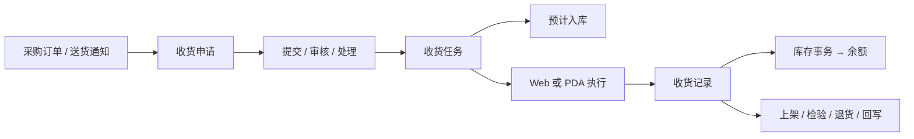
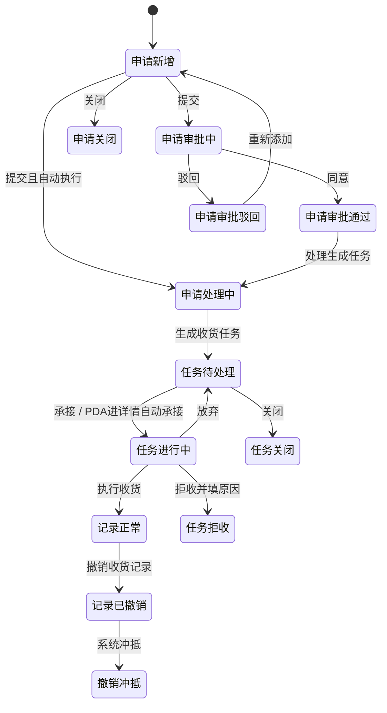
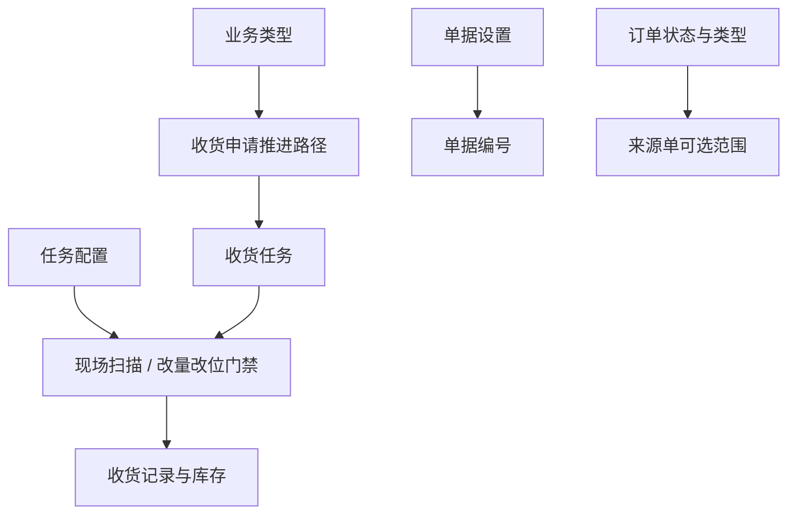
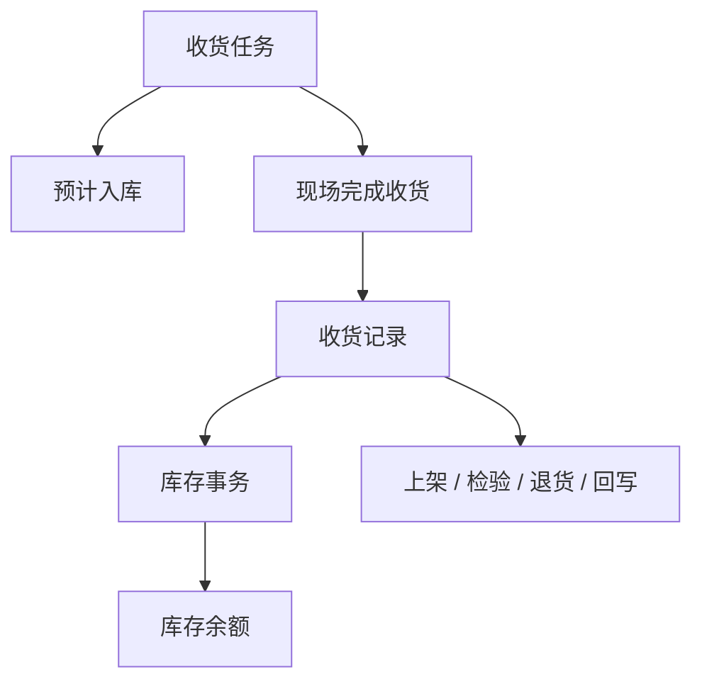

# 采购收货

> 适用基线：测试环境目标 / `dev` 分支 / 2026-07-15。
> 阅读对象：测试、实施（主）；采购协同、仓库收货、质量协同等现场角色（顺带）。

采购收货把「供应商送到的物料」登记成可追溯的内部收货结果，并驱动预计入库、库存事务与后续上架/检验/退货。读完本页应能说清：功能范围、申请→任务→记录主线、任务配置如何改变现场行为，以及如何开验证场景。

## 如何使用本组文档

| 你的目的 | 建议阅读 |
| --- | --- |
| 设计验证场景、讲解配置影响、讲清一笔收货主线 | **本页**（功能范围、逻辑、配置、验证点） |
| 发起/承接/执行/撤销、查选择器范围与字段细节 | [采购收货-维护与查询参考](01-采购收货-维护与查询参考.md) |
| 对照共享模型（申请/任务/记录、库存挂接、粒度） | [申请、任务与记录模型](../../02-业务模型/01-申请任务记录模型.md)、[库存数据挂接模型](../../02-业务模型/02-库存数据挂接模型.md)、[库存管理精度与唯一粒度](../../02-业务模型/08-库存管理精度与唯一粒度.md) |

售前/对外介绍请停在模块「解决什么问题」层，**不要**默认进入本页维护参考与字段长表。

## 一笔典型业务

**触发：** 供应商按[采购订单](../../10-SCP-供应链平台/02-采购订单/index.md)（或送货通知）送达物料。  
**处理：** 建收货申请 → 提交/审核/处理生成收货任务（同时形成预计入库）→ Web 或 PDA 承接并执行 → 形成收货记录。  
**结果：** 库存事务更新库存余额；记录可作为[采购上架](../05-采购上架/index.md)、[来料检验](../../07-QMS-质量管理/02-来料检验/index.md)、[采购退货](../04-采购退货/index.md)或外部回写的来源。

关键分支（同一主线内）：

| 分支 | 何时出现 | 期望结果 |
| --- | --- | --- |
| 正常全收 | 实收与计划一致，任务允许完成 | 记录正常；事务与余额按实收更新 |
| 少收 / 多收 | 任务配置允许改量 | 按实收入账；差异原因按现场 SOP 留痕 |
| 拒收 | 质量或到货不符 | 填拒收原因（PDA 必填）；不按正常收货入账 |
| 撤销 | 已形成记录需回退 | 冲抵库存与后续影响；前置状态见文末 `GAP-009` |

!!! example "写实示例：给定配置 → 期望行为"
    **给定：** 订单 PO-1001 已发布、物料 A 计划 100 件；收货任务开启「允许少收」、要求扫描包装与库位；现场实收 98、拒收 2。  
    **期望：**

    1. 申请从来源订单带回供应商与明细，供应商通常锁定不可改。
    2. 处理生成任务后，可查到对应预计入库（待收预期）。
    3. PDA 进待处理详情即自动承接；未扫包装/库位不能提交。
    4. 提交后：记录实收 98；库存事务与余额按 98 更新；拒收 2 走拒收原因，不计入正常实收。
    5. 需要时从记录创建上架/检验/退货；查余额应从记录 → 事务 → 余额联查。

## 使用前准备

| 需要确认什么 | 为什么重要 |
| --- | --- |
| 来源单据 | 从采购订单、送货通知等带入范围；可选范围受订单发布状态与订单类型限制 |
| 供应商、物料、单位 | 到货核对基础，应与来源单据一致 |
| 收货库位与库存状态 | 决定落点与后续可用范围；是否必扫/可改取决于**任务配置** |
| 批次、包装、托盘 | 按任务采集要求采集；构成库存唯一粒度的一部分 |
| 执行权限与终端 | Web 与 PDA 均有入口；谁可发起/审批/承接/撤销取决于权限与业务配置 |

上游订单口径见[采购订单](../../10-SCP-供应链平台/02-采购订单/index.md)；选择器通例见[通用选择器过滤惯例](../../02-业务模型/12-通用选择器过滤惯例.md)；仓→区→位见[库位与仓储级联惯例](../../02-业务模型/13-库位与仓储级联惯例.md)。

## 业务逻辑要点

### 三类对象

| 对象 | 业务含义 | 现场最关心 |
| --- | --- | --- |
| 收货申请 | 对一批到货提出处理请求 | 来源是否正确、能否进入处理 |
| 收货任务 | 把申请变成可执行工作；生成时建预计入库 | 收什么、收多少、到哪、能否改量/改位、是否必扫 |
| 收货记录 | 已完成的实际结果 | 实收多少、是否已动库存、后续上架/检验/退货 |

通用状态语义复用[申请、任务与记录模型](../../02-业务模型/01-申请任务记录模型.md)；本页只写采购收货已证实的动作与差异。

### 跨模块边界

| 边界 | 本页负责 | 不在本页展开 |
| --- | --- | --- |
| 上游 | 引用已发布且类型匹配的订单/送货通知 | 订单创建与发布规则 → [采购订单](../../10-SCP-供应链平台/02-采购订单/index.md) |
| 库存 | 任务→预计入库；记录→事务→余额 | 预期/事务/余额查询细则 → [库存预期](../09-库存管理/02-库存预期.md)、[库存事务](../09-库存管理/03-库存事务.md)、[库存余额与追溯](../09-库存管理/04-库存余额与追溯.md) |
| 下游 | 记录作为后续来源 | 上架执行 → [采购上架](../05-采购上架/index.md)；检验 → [来料检验](../../07-QMS-质量管理/02-来料检验/index.md)；退货 → [采购退货](../04-采购退货/index.md) |

### 状态与关键动作

动作是否在某状态展示、是否受角色限制，以测试环境与权限配置为准；**不能**仅凭看到按钮假定人人可执行。

| 所属对象 | 常见动作 | 业务结果 |
| --- | --- | --- |
| 收货申请 | 新增、修改、删除、提交、同意、驳回、处理、关闭、重新添加 | 推进为可执行任务，或结束本次申请 |
| 收货任务 | 承接、放弃、执行收货、拒收、关闭、撤销、调整任务配置 | 现场结果；创建任务时建立预计入库 |
| 收货记录 | 查询、创建上架/检验/退货、撤销收货记录 | 已完成收货形成库存结果；撤销须关注冲抵与外部回写 |

现场执行要点：

- PDA 进入待处理任务详情会自动承接；可按任务号或送货通知定位。
- 是否允许改数量/库位/批次/包装，是否要求扫包装或校验库位，由**任务配置**控制。
- Web 任务列表执行入口可能不可用（`GAP-010`）；现场收货以 PDA 详情执行为主。
- 拒收须填原因（PDA 必填）。

建议步骤：定位任务 → 核对来源与物料 → 按配置扫包装/批次/库位或录数量 → 差异走少收/多收/拒收 → 提交后查记录与库存。

## 关键判断或规则

| 判断点 | 应先确认什么 | 判断后的影响 |
| --- | --- | --- |
| 能否发起收货 | 来源单据、供应商、物料、数量是否与实物相符 | 避免错误到货进入任务与库存 |
| 如何现场执行 | 任务是否要求扫描、是否允许改量/改位 | 决定 Web/PDA 与录入方式 |
| 差异怎么处理 | 少收、多收、拒收还是撤销 | 决定原因留痕与后续上架/检验/退货路径 |
| 结果是否完成 | 记录、事务、余额是否可联查 | 决定是否转入下游或排查未入库 |

## 配置如何起作用

本业务**无独立「采购收货策略页」**；行为主要由上游策略与**任务级配置**共同约束。改配置前先分清改的是哪一层。

| 配置层 | 改什么 | 现场/流程会怎样变 | 实施注意 |
| --- | --- | --- | --- |
| [业务类型](../../04-DBC-主数据管理/05-策略设置/03-业务类型.md) | 采购收货场景的策略入口（自动提交/同意/处理、适用范围、入出库相关等） | 可能改变申请→任务推进路径、可选物料/库存范围、编号与事务路径 | 高风险；变更后必须用完整收货链回归；自动策略细节见 `GAP-002` |
| [单据设置](../../04-DBC-主数据管理/05-策略设置/04-单据设置.md) | 申请/任务/记录的编号规则 | 单据号前缀、日期段、流水变化 | 不替代业务类型；改在用规则易影响对账与外部对接 |
| 任务配置（收货任务上） | 是否允许改数量/库位/批次/包装；是否要求扫包装、校验库位；少收/多收/全单收货等 | **直接**决定 PDA/Web 能否提交、能否改量改位 | 与现场 SOP 不一致时表现为「扫不了 / 改不了 / 提不交」 |
| 来源订单侧约束 | 订单发布状态、ERP 订单类型等 | 决定申请时「选得到 / 选不到」哪些订单 | 选不到时先查订单状态与类型，而非只查收货权限 |
| 权限与数据范围 | 角色动作权限、组织/货主等范围 | 决定谁能看到按钮、选到哪些单据 | 逐页矩阵未闭合（`GAP-014`）；勿写成全站通例 |

共享策略概念见[单据类型、业务类型与单据配置](../../02-业务模型/05-单据类型、业务类型与单据配置.md)。

## 建议验证点

短列表，便于开单；不是完整用例集。操作步骤与选择器细节见[维护与查询参考](01-采购收货-维护与查询参考.md)。

1. **主链闭环：** 已发布订单 → 申请 → 处理生成任务 → 出现预计入库 → PDA 执行 → 记录 → 库存事务 → 余额可联查。
2. **来源过滤：** 未发布 / 类型不符订单不可选；符合条件订单带回供应商与明细且供应商通常锁定。
3. **任务配置差异：** 同一物料分别开/关「允许少收」「必须扫库位」；确认允许时能提交差异量，关闭时被拒绝。
4. **拒收：** PDA 拒收无原因不可完成；有原因后任务进入拒收结果，不按正常实收入账。
5. **终端差异：** Web 列表是否看不到执行入口（`GAP-010`）；PDA 进详情是否自动承接并可完成收货。
6. **下游入口：** 从记录可创建上架/检验/退货申请或记录；联查到对应模块单据。
7. **撤销风险：** 仅在预期状态撤销；非预期状态勿强撤（`GAP-009`）；撤销后核对预计入库清理、事务冲抵与余额。

## 做完影响什么

1. 生成收货任务 → 建立[预计入库](../09-库存管理/02-库存预期.md)（待收预期）。
2. 完成收货 → 生成收货记录，并形成[库存事务](../09-库存管理/03-库存事务.md)。
3. 事务更新[库存余额](../09-库存管理/04-库存余额与追溯.md)；查「有没有入库」应从记录 → 事务 → 余额追溯。
4. 记录可作为[采购上架](../05-采购上架/index.md)、[来料检验](../../07-QMS-质量管理/02-来料检验/index.md)、[采购退货](../04-采购退货/index.md)与外部回写来源。

## 异常与查询入口

| 情况 | 建议处理 |
| --- | --- |
| 采购订单无法选择 | 先确认发布状态与订单类型；再查权限与数据范围 |
| PDA 找不到任务 | 用任务号或送货通知重查；核对状态、执行人、终端权限 |
| 不允许改数量或库位 | 查任务配置与扫描要求；不要绕过限制改结果 |
| 到货不合格或数量异常 | 走拒收或差异入口并留原因；不要用正常收货顶替 |
| 收货完成但库存查不到 | 依次：记录是否生成 → 事务是否生成 → 是否仍待上架/检验 → 查询条件/权限 |

查询条件与详情分组见[维护与查询参考](01-采购收货-维护与查询参考.md)「查询与详情参考」。

### 推荐查询方式

| 要找什么 | 推荐条件 |
| --- | --- |
| 待处理到货 | 申请号、采购订单号、供应商、发货单号 |
| 现场待执行 | 任务号、状态、供应商、发货单号 |
| 实际入库结果 | 记录号、采购订单号、供应商、发货单号 |

## 关键字段业务角色

完整选择器、联动、回填与采集表见[维护与查询参考](01-采购收货-维护与查询参考.md)。本表只服务主线（约 8 项）。

| 字段/配置点 | 在系统中的作用 | 关键行为要点 | 操作时要警惕什么 |
| --- | --- | --- | --- |
| 来源采购订单 / 送货通知 | 确定到货范围并带回明细 | 订单须已发布且符合当前 ERP 订单类型；选中后回填供应商与明细 | 选错来源会带入错误物料与数量 |
| 供应商 | 到货责任方与核对基础 | 通常由来源回填并锁定 | 与实物送货方不一致会导致追溯错位 |
| 业务类型 | 采购收货场景的策略入口 | 按采购收货场景使用，不应随意替换 | 错选可能改变自动动作/编号/事务路径 |
| 明细物料 | 本次应收清单 | 来自来源单明细；应可用 | 选不到时先查来源明细与物料可用性 |
| 计划/实收数量与单位 | 核对到货量并记账 | 库存计量与采购计量可能并存；超收/欠收受任务配置 | 违规改量被拒或账实不符 |
| 库位 / 库存状态 | 收货落点与后续可用范围 | 受仓区级联与任务扫描配置约束 | 扫错库位导致库存位置错误 |
| 批次 / 包装 / 托盘 | 库存唯一粒度维度 | 按任务要求采集；见[库存管理精度与唯一粒度](../../02-业务模型/08-库存管理精度与唯一粒度.md) | 漏采导致无法完成或追溯粒度不足 |
| 申请/任务/记录状态 | 动作门禁 | 见上文状态与动作；具体状态码以测试为准 | 勿在非预期状态强行撤销 |

## 角色与操作分工

| 角色/岗位 | 典型工作 |
| --- | --- |
| 收货申请发起人 | 从来源单据创建申请，核对供应商、物料与到货信息 |
| 审核或处理人员 | 提交后的同意、驳回或处理（是否自动取决于业务类型等配置） |
| 仓库执行人员 | 承接任务，扫描或录入实收，完成或拒收 |
| 质量或后续处理 | 需要时继续检验、上架、退货 |

## 当前限制与待确认（文末）

正文已依赖的业务结论以上文为准。下列缺口**不改变**主线写法，验证或实施遇阻时再查：

- `GAP-002`：申请/任务/记录具体状态码、自动提交/同意/处理策略与真实审批主体，待测试闭合。
- `GAP-009`：任务撤销的前端可见状态与后端校验是否一致；勿在非预期状态强撤。
- `GAP-010`：Web 任务列表执行入口可能不可用；现场以 PDA 详情执行为主。
- `GAP-014`：角色/数据权限对选择器的逐页裁剪矩阵未闭合。
- 转换率、供应商是否可手工改、物料用途过滤等字段细节：见维护参考中的 ❓ 短标；不在此展开。
- 上架/检验/退货及外部回写的完整跨模块闭环，待联调；当前可确认收货记录是重要来源。

截图与脱敏样例见待截图执行清单；无图时以上文写实示例作为配置→行为对照。
