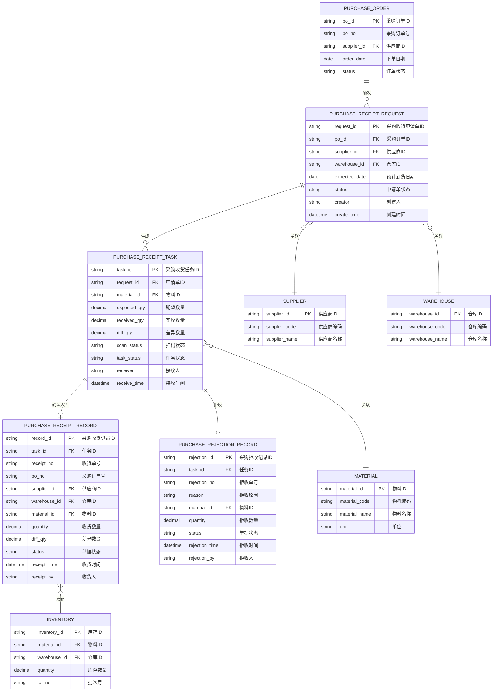
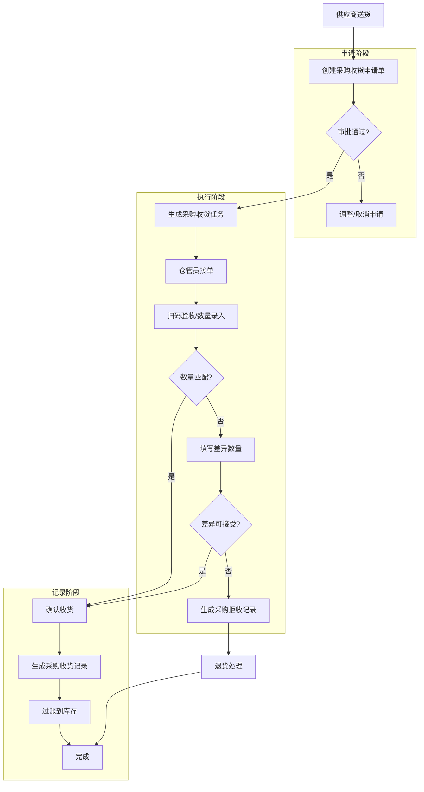

# 采购收货

## 概述

采购收货是WMS库房管理中连接供应商送货与内部库存的核心环节，负责将采购订单转化为实际入库库存，支持扫码验收、数量差异处理、拒收退货等业务场景。

## 当前基线取证（代码已证实）

> 适用基线：测试环境对应的 `dev` 分支，2026-07-15。以下是源码已证实的服务调用关系，尚未替代测试环境的端到端回归结果。

| 环节 | 当前实现证据 | 可确认的结论 |
| --- | --- | --- |
| 采购收货申请 | 请求主表以单据号、业务类型、状态和明细为公共结构；采购收货申请额外要求供应商代码。 | 申请用于汇集供应商、到货和物料明细等业务意图，是后续任务的来源。 |
| 采购收货任务 | 创建任务明细后，服务按任务号、业务类型、库位、货主、数量、库存状态、批次写入预计入。 | **任务创建会创建预计入库记录**；预计入与任务号关联，不应只作为独立查询数据理解。 |
| 采购收货记录 | 收货记录服务构建库存事务后调用库存事务服务。 | **记录执行会创建库存事务**；实际库存变化应从记录与事务之间追溯。 |
| 库存事务与余额 | 库存事务服务先合并余额变更请求，调用余额批量更新，再写入库存事务。 | **库存事务服务负责更新库存余额**；余额不是由采购收货页面直接维护。 |
| 外部接口 | 任务创建逻辑含 `ASN_DirectReceipt` 来源的接口信息分支。 | 已发现第三方接口挂接入口；具体接口对象、触发条件与结果回写待专项核对。 |

当前待测试验证项包括：实际状态流转、审批/自动通过策略、PDA 与线边端的具体入口，以及接口调用是否在测试环境成功闭环。相关问题已登记在[产品差距总账](../../15-版本路线图/产品差距总账.md)。

## 当前页面事实卡（代码已证实）

### 1. 采购收货申请

| 维度 | 当前实现 |
| --- | --- |
| 列表字段顺序 | 单据号、状态、供应商代码、供应商名称、发货单号；采购订单号、要求到货日期、订单类型等在页面配置中可查询或详情展示，但默认不在主列表展示。 |
| 查询字段 | 单据号、采购订单号、供应商代码、发货单号、订单类型。 |
| 新增来源 | 可从采购订单选择器带入。选择器限定采购订单为已发布状态（`status=2`）且 ERP 订单类型为 `Z001`。 |
| 已证实必填项 | 后端请求校验要求 `supplierCode` 非空；数据库同时要求单据号、业务类型、供应商代码非空。单据号的生成方式待测试环境确认。 |
| 页面限制 | 业务类型固定为 `PurchaseReceipt`；采购订单带入后的供应商代码、订单类型、ERP 订单类型、汇率和货币码在当前页面配置中禁用编辑。 |
| 可用动作 | 新增、修改、删除、关闭、重新添加、提交、同意、驳回、处理、标签生成、导入导出。动作存在不等于所有状态均可执行，状态前置条件待测试验证。 |
| 导入实现 | 已有固定转换率与非固定转换率两类模板；导入支持更新、追加、覆盖三种模式，错误数据会生成错误文件。模板字段与逐字段校验待在导入专项中补齐。 |

### 2. 采购收货任务

| 维度 | 当前实现 |
| --- | --- |
| 列表字段顺序 | 单据号、申请单号、状态、采购订单号、供应商代码、供应商名称、发货单号。 |
| 查询字段 | 单据号、状态、供应商代码、发货单号。 |
| 上游关联 | 主表保留 `request_number`，用于关联采购收货申请；任务创建时会创建以任务号为关联键的预计入库数据。 |
| 可配置执行限制 | 任务结构包含允许修改库位、数量、批次、包装号，允许多收、少收、重复扫码、扫描目标库位等开关。各开关的默认值、界面暴露方式和生效条件待测试验证。 |
| 可用动作 | 新增、修改、删除、关闭、接单、放弃、拒收、撤销、任务配置更新、导入导出。 |

### 3. 采购收货记录

| 维度 | 当前实现 |
| --- | --- |
| 列表字段顺序 | 单据号、状态、申请单号、任务单号、采购订单号、供应商代码、供应商名称、发货单号。 |
| 查询字段 | 单据号、采购订单号、供应商代码、发货单号。 |
| 上游关联 | 主表同时保留 `request_number` 与 `job_number`，用于追溯申请和任务。 |
| 下游影响 | 记录服务创建库存事务；库存事务服务再更新库存余额。记录页还提供创建上架申请、检验申请、采购退货记录和撤销收货记录的入口。 |
| 状态与接口线索 | 记录表包含状态、ERP 凭证号、ERP 推送标识、接口类型、入/出库事务类型等字段；这些字段的业务口径和接口回写规则待专项确认。 |

### 4. 字段类型与长度（主表关键字段）

| 对象 | 字段 | 数据库类型/长度 | 非空约束 | 说明 |
| --- | --- | --- | --- | --- |
| 申请 | `number` | `varchar(64)` | 是 | 单据号。 |
| 申请 | `business_type` | `varchar(64)` | 是 | 当前页面固定为 `PurchaseReceipt`。 |
| 申请 | `supplier_code` | `varchar(64)` | 是 | 当前后端也有非空校验。 |
| 申请 | `po_number`、`asn_number`、`pp_number` | `varchar(64)` | 否 | 分别为采购订单、发货单、要货计划关联信息。 |
| 申请 | `exchange_rate` | `numeric(24,6)` | 否 | 页面中只读。 |
| 任务 | `number`、`request_number` | `varchar(64)` | 单据号否、申请单号否 | 任务单号与申请单号的关联字段。 |
| 任务 | `supplier_code` | `varchar(64)` | 是 | 供应商代码。 |
| 记录 | `number` | `varchar(64)` | 是 | 收货记录单号。 |
| 记录 | `request_number`、`job_number` | `varchar(64)` | 否 | 上游申请、任务追溯键。 |
| 记录 | `status` | `varchar(20)` | 是 | 默认值为 `1`；实际字典含义待测试验证。 |
| 记录 | `erp_voucher_number` | `varchar(64)` | 否 | ERP 凭证号。 |

### 5. 主明细字段分层（DDL/DO 已证实）

> 字段技术名以 `request_purchasereceipt_*`、`job_purchasereceipt_*`、`record_purchasereceipt_*` 表和对应 DO 为准。后文历史草稿中的 `request_no`、`po_no`、`task_id`、`material_code`、`receipt_no` 等名称不再作为当前技术字段依据。

| 层级 | 对象 | 真实表名 | 关键字段 |
| --- | --- | --- | --- |
| 申请主表 | 采购收货申请 | `request_purchasereceipt_main` | `number`、`status`、`business_type`、`supplier_code`、`asn_number`、`pp_number`、`po_number`、`po_type`、`source_type`、`fix_rate`、`business_detail` |
| 申请明细 | 采购收货申请明细 | `request_purchasereceipt_detail` | `master_id`、`number`、`item_code`、`item_name`、`qty`、`uom`、`supplier_qty`、`supplier_uom`、`convert_rate`、`po_number`、`po_line`、`batch_id`、`package_number`、`pallet_number`、`inventory_status`、`location_code` |
| 任务主表 | 采购收货任务 | `job_purchasereceipt_main` | `number`、`request_number`、`status`、`business_type`、`supplier_code`、`asn_number`、`po_number`、`source_type`、执行限制开关 |
| 任务明细 | 采购收货任务明细 | `job_purchasereceipt_detail` | `master_id`、`number`、`item_code`、`qty`、`supplier_qty`、`convert_rate`、`po_number`、`po_line`、`batch_id`、`package_number`、`pallet_number`、`inventory_status`、`location_code` |
| 记录主表 | 采购收货记录 | `record_purchasereceipt_main` | `number`、`request_number`、`job_number`、`business_type`、`supplier_code`、`asn_number`、`po_number`、`in_transaction_type`、`interface_type`、`erp_interface_pushed`、`erp_voucher_number`、`status` |
| 记录明细 | 采购收货记录明细 | `record_purchasereceipt_detail` | `master_id`、`number`、`item_code`、`qty`、`supplier_qty`、`convert_rate`、`po_number`、`po_line`、`batch_id`、`package_number`、`pallet_number`、`inventory_status`、`location_code`、`receivable_qty`、`shortage_qty`、`putaway_request_number`、`inspect_result` |

### 6. 库存挂接字段（DDL/DO 已证实）

| 业务含义 | 申请明细 | 任务明细 | 记录明细 | 下游库存对象 |
| --- | --- | --- | --- | --- |
| 物料 | `item_code` | `item_code` | `item_code` | `transaction_expectin.item_code`、`transaction_transaction.item_code`、`transaction_balance.item_code` |
| 批次 | `batch_id` | `batch_id` | `batch_id` | `batch_id` |
| 托包装号 | `pallet_number` | `pallet_number` | `pallet_number` | `pallet_number` |
| 箱包装号 | `package_number` | `package_number` | `package_number` | `package_number` |
| 库存状态 | `inventory_status` | `inventory_status` | `inventory_status` | `inventory_status` |
| 库位 | `location_code` | `location_code` | `location_code` | `location_code` |
| 数量 | `qty` | `qty` | `qty` | 预计入、事务和余额的 `qty` |

说明：预计入通过任务号 `job_number` 挂任务；库存事务通过记录号 `record_number` 挂记录；余额只保存数量结果和最后事务号 `last_trans_number`。

### 7. DTO/VO 与前端页面层证据（第一轮）

| 层级 | 证据 | 当前结论 |
| --- | --- | --- |
| 申请主表接口 | `PurchasereceiptRequestMainBaseVO.java` | 接口层显式要求供应商代码、单据号、部门、自动提交、自动通过、自动执行、直接生成记录等字段。单据号、部门和自动策略的默认填充来源仍需结合页面调用继续核验。 |
| 申请明细接口 | `PurchasereceiptRequestDetailBaseVO.java` | 明细层覆盖包装号、批次、到货/生产/过期日期、库存状态、库位、物料、数量、订单号、订单行等字段，是采购收货进入库存粒度的主要载体。 |
| 前端采购订单选择器 | `purchasereceiptRequestMain.data.ts` | 新增申请可从采购订单明细选择器带入，选择器筛选已发布状态 `status=2` 且 ERP 订单类型 `Z001` 的采购订单数据。 |
| 前端只读字段 | `purchasereceiptRequestMain.data.ts` | 采购订单带入后，订单类型、ERP 订单类型、汇率、货币码、供应商代码等字段在当前页面配置中禁用编辑。 |
| 业务类型默认策略 | `purchasereceiptRequestMain.data.ts` | 页面按 `PurchaseReceipt` 读取业务类型配置，得到自动提交、自动通过、自动执行和直接生成记录的默认值。 |
| 固定换算率导入 | `PurchasereceiptRequestMainImportFixHxVO.java` | 模板列包括单据号、发货单号、供应商代码、承运商、运输方式、车牌号、要求到货日期、订单号、订单行、到库位代码、物料代码、数量、计量单位、生产日期、备注。 |
| 非固定换算率导入 | `PurchasereceiptRequestMainImportNoFixHxVO.java` | 与固定换算率模板相比，数量字段拆为库存计量数量和采购计量数量；库存计量单位、采购计量单位、过期日期、包装数量、包装规格等字段在代码中存在注释痕迹，不能直接写入当前模板。 |

### 8. 动作按钮、状态前置条件与服务流转（第一轮）

> 本节用于回答培训材料中最常见的问题：什么状态下可以做什么操作，操作后会生成或影响哪些数据。以下内容来自前端按钮配置、后端状态枚举和服务方法的第一轮代码取证，尚未替代测试环境端到端验证。

#### 8.1 状态字典

| 对象 | 状态码 | 状态名称 | 当前用途 |
| --- | --- | --- | --- |
| 申请 | `1` | 新增 | 可提交；也可关闭。 |
| 申请 | `2` | 审批中 | 可同意、驳回；也可关闭。 |
| 申请 | `3` | 审批通过 | 可处理生成任务；也可关闭。 |
| 申请 | `4` | 审批驳回 | 可关闭；后端通用服务支持重新添加为新增。 |
| 申请 | `5` | 关闭 | 申请终态之一。 |
| 申请 | `6` | 处理中 | 已进入处理链路；当前前端显示标签打印入口，也允许关闭。 |
| 申请 | `7` | 部分完成 | 可关闭。 |
| 申请 | `8` | 已完成 | 完成态。 |
| 任务 | `1` | 待处理 | 可承接、关闭；采购收货任务生成后的默认状态。 |
| 任务 | `2` | 进行中 | 可放弃、拒收；任务执行完成后生成收货记录。 |
| 任务 | `3` | 完成 | 任务完成态。 |
| 任务 | `4` | 关闭 | 任务关闭态。 |
| 任务 | `5` | 拒收 | 拒收后任务状态。 |
| 任务 | `6` | 撤销 | 撤销后任务状态。 |
| 记录 | `1` | 正常 | 可撤销。 |
| 记录 | `2` | 已撤销 | 原记录撤销后的状态。 |
| 记录 | `3` | 撤销冲抵 | 系统生成的撤销冲抵记录状态。 |

#### 8.2 采购收货申请动作

| 动作 | 前端显示状态 | 后端状态前置条件 | 执行后影响 | 当前结论 |
| --- | --- | --- | --- | --- |
| 提交 | `1` 新增 | 仅新增可提交。 | 根据业务类型自动通过、自动执行配置，状态可能进入审批中、审批通过或处理中；若进入处理中，则生成任务。 | 前后端状态基本一致。 |
| 同意 | `2` 审批中 | 仅审批中可同意。 | 根据自动执行配置，状态进入审批通过或处理中；若进入处理中，则生成任务。 | 前后端状态基本一致。 |
| 驳回 | `2` 审批中 | 仅审批中可驳回。 | 状态变为审批驳回。 | 前后端状态基本一致。 |
| 处理 | `3` 审批通过 | 后端状态机允许审批通过或部分完成进入处理中。 | 状态变为处理中，并调用任务生成服务。 | 前端只在审批通过展示；部分完成场景待测试确认是否存在人工入口。 |
| 关闭 | `1`、`2`、`3`、`4`、`6`、`7` | 后端允许新增、审批中、审批通过、审批驳回、处理中、部分完成关闭；但若存在进行中任务则阻止关闭。 | 申请变为关闭，并关闭相关任务。 | 关闭不是单纯改状态，会联动任务状态。 |
| 重新添加 | 待继续核验 | 后端通用服务支持关闭或审批驳回重新添加为新增。 | 申请状态回到新增。 | 前端存在 `mainReAdd` 处理分支，但第一轮未确认按钮配置来源。 |
| 标签生成/打印 | `6` 处理中 | 后端存在生成标签、删除旧标签接口。 | 重新生成标签会删除旧标签；前端提示需销毁旧标签、打印并粘贴新标签。 | 应在培训材料中显著提示“重打标签会作废旧标签”。 |

#### 8.3 采购收货任务动作

| 动作 | 前端显示状态 | 后端状态前置条件 | 执行后影响 | 当前结论 |
| --- | --- | --- | --- | --- |
| 承接 | `1` 待处理 | 通用任务状态机要求待处理。 | 状态变为进行中，并记录承接人和承接时间。 | 前后端状态基本一致。 |
| 放弃 | `2` 进行中 | 通用任务状态机要求进行中。 | 状态回到待处理，并清空承接信息。 | 前后端状态基本一致。 |
| 关闭 | `1` 待处理 | 通用任务状态机要求待处理。 | 状态变为关闭，并执行预计入/预计出关闭后的处理。 | 前后端状态基本一致。 |
| 执行 | 当前列表按钮被注释，终端/PDA入口待核验 | 通用任务状态机要求进行中。 | 状态变为完成，并在执行后创建收货记录。 | 需继续核验 PDA、线边端或详情页入口。 |
| 拒收 | `2` 进行中 | 服务代码显式禁止待处理状态拒收。 | 状态变为拒收，删除任务关联预计入/预计出，并生成拒收类收货记录及接口消息。 | 需补充拒收原因字段、接口回写和采购订单影响。 |
| 撤销 | `1` 待处理 | 第一轮服务片段未发现明确状态机校验，直接置为撤销。 | 删除任务关联预计入/预计出，并生成撤销类记录。 | 这是产品差距候选：需测试确认是否应限制为待处理，或补后端校验。 |

#### 8.4 采购收货记录动作

| 动作 | 前端显示状态 | 后端状态前置条件 | 执行后影响 | 当前结论 |
| --- | --- | --- | --- | --- |
| 撤销 | `1` 正常 | 后端要求记录状态为正常；非正常状态会报“已撤销”类错误。 | 校验实物库存，关闭关联上架任务，创建库存撤销事务，原记录置为已撤销，生成撤销冲抵记录，并触发 SAP 取消与采购订单已收数量回退逻辑。 | 记录撤销会影响库存、上架、ERP/SAP 和采购订单数量，不能按普通删除理解。 |
| 生成采购退货记录申请 | 待继续核验 | 后端存在创建采购退货记录申请接口。 | 预计生成采购退货后续处理对象。 | 第一轮尚未确认当前页面按钮入口和状态前置条件。 |

#### 8.5 取证路径与待确认项

| 类型 | 证据路径 | 说明 |
| --- | --- | --- |
| 前端申请按钮 | `sourcecode/frontend/ui/src/views/wms/purchasereceiptManage/purchasereceipt/purchasereceiptRequestMain/index.vue` | 提交、同意、驳回、处理、关闭、标签打印按钮及状态控制。 |
| 前端任务按钮 | `sourcecode/frontend/ui/src/views/wms/purchasereceiptManage/purchasereceipt/purchasereceiptJobMain/index.vue` | 承接、关闭、放弃、拒收、撤销按钮及原因弹窗。 |
| 前端记录按钮 | `sourcecode/frontend/ui/src/views/wms/purchasereceiptManage/purchasereceipt/purchasereceiptRecordMain/index.vue` | 记录撤销按钮和撤销确认。 |
| 后端申请通用服务 | `BaseRequestMainService.java`、`RequestStatusState.java`、`RequestStatusEnum.java` | 申请提交、同意、驳回、处理、关闭、重新添加状态机。 |
| 后端任务通用服务 | `BaseJobMainService.java`、`JobStatusState.java`、`JobStatusEnum.java` | 任务承接、放弃、关闭、执行状态机。 |
| 后端采购收货任务服务 | `PurchasereceiptJobMainService.java` | 采购收货任务生成、预计入创建、拒收、撤销。 |
| 后端采购收货记录服务 | `PurchasereceiptRecordMainService.java` | 采购收货记录撤销、库存撤销事务、冲抵记录、SAP/采购订单影响。 |

待确认项：

- 采购收货任务“撤销”当前前端在待处理状态显示，但服务片段未见明确状态机校验，需测试环境验证或补后端约束。
- 采购收货任务“执行”列表按钮被注释，需继续从 PDA、线边端、详情页或接口调用路径核验实际入口。
- 申请“重新添加”后端能力存在，前端处理分支存在，但按钮配置来源尚未在第一轮取证中闭环。
- 子类 Controller 中部分通用接口存在注释代码，需要结合继承路由、前端 API 文件和运行时接口确认实际可调用入口。

### 9. 图示、截图与示例内容占位

| 内容类型 | 建议放置位置 | 目的 | 状态 |
| --- | --- | --- | --- |
| 采购收货申请表单截图 | “采购收货申请事实卡”之后 | 说明采购订单选择器、供应商带出、只读字段和业务类型默认策略。 | 占位，待测试环境截图。 |
| 申请-任务-记录-库存事务流程图 | “当前基线取证”之后 | 用一张图说明申请生成任务、任务生成预计入、记录生成库存事务、事务更新余额。 | 占位，可后续自动生成 Mermaid 或 SVG。 |
| 固定/非固定换算率导入样例 | “导入实现”之后 | 通过两行样例说明 `qty`、`supplierQty`、`uom` 的差异，避免用户误填。 | 占位，待导入规则专项确认。 |
| 库存挂接字段示例数据 | “库存挂接字段”之后 | 展示一笔收货明细如何映射到预计入、库存事务和库存余额的关键字段。 | 占位，待根据测试数据构造。 |
| 异常流转示例 | “业务规则”之前 | 用少收、拒收、撤销三个场景说明状态变化和下游影响。 | 占位，待状态流转专项确认。 |

## 领域模型



## 核心流程



## 功能说明（历史草稿，待逐项核验）

> 下列内容保留为业务说明草稿，不作为当前字段、状态、扫码、离线或库存规则的唯一依据。当前实现以“当前基线取证”和“当前页面事实卡”为准；未证实内容将按试点任务逐项修订或移入产品差距总账。

### 1. 采购收货申请

管理采购收货申请单的创建、编辑、审批流程。

**功能入口**: 采购收货管理 → 采购收货申请

| 字段名 | 中文名 | 类型 | 约束 | 影响业务 | 备注 |
|--------|--------|------|------|----------|------|
| request_no | 申请单号 | VARCHAR(50) | 系统自动生成 | 用于唯一标识本次收货申请 | 格式: PR-YYYYMMDD-XXXX |
| po_no | 采购订单号 | VARCHAR(50) | 必填, FK | 关联[采购订单](../../10-SCP-供应链平台/02-采购订单/index.md)，获取供应商/物料信息 | 来源采购模块 |
| supplier_code | 供应商代码 | VARCHAR(50) | 必填 | 确定送货方，影响后续[供应商对账](../../10-SCP-供应链平台/07-发票结算/index.md) | 来自供应商主数据 |
| order_type | 订单类型 | ENUM | 字典项 | 区分离散/标准采购等 | 离散/标准采购 |
| material_code | 物料编码 | VARCHAR(50) | 必填 | 关联物料主数据 | |
| material_name | 物料名称 | VARCHAR(200) | 显示 | 展示物料信息 | |
| unit | 计量单位 | VARCHAR(20) | 显示 | 物料计量单位 | |
| order_qty | 订单数量 | DECIMAL(12,3) | 必填 | [采购订单](../../10-SCP-供应链平台/02-采购订单/index.md)中的订购数量 | |
| expected_date | 预计到货日期 | DATE | 必填 | 用于提前备货和任务调度 | |
| status | 申请单状态 | ENUM | 系统定义 | 控制流程走向: 待审批/已审批/已取消 | |
| tax_rate | 税率 | DECIMAL(5,2) | 显示 | 税率百分比 | |
| creator | 创建人 | VARCHAR(50) | 系统自动 | 记录操作人员 | |
| create_time | 创建时间 | DATETIME | 系统自动 | 记录创建时间戳 | |

### 2. 采购收货任务

执行层面的扫码验收和数量确认页面。

**功能入口**: 采购收货管理 → 采购收货任务

| 字段名 | 中文名 | 类型 | 约束 | 影响业务 | 备注 |
|--------|--------|------|------|----------|------|
| task_id | 任务ID | VARCHAR(50) | PK | 唯一标识一个收货任务 | |
| request_no | 申请单号 | VARCHAR(50) | FK | 关联申请单信息 | |
| po_no | 采购订单号 | VARCHAR(50) | 显示 | 关联[采购订单](../../10-SCP-供应链平台/02-采购订单/index.md) | |
| supplier_code | 供应商代码 | VARCHAR(50) | 显示 | 展示供应商信息 | |
| material_code | 物料编码 | VARCHAR(50) | 扫码获取 | 扫码枪扫描获取 | |
| material_name | 物料名称 | VARCHAR(200) | 显示 | 展示物料信息 | |
| unit | 计量单位 | VARCHAR(20) | 显示 | 物料计量单位 | |
| order_qty | 订单数量 | DECIMAL(12,3) | 来自订单 | [采购订单](../../10-SCP-供应链平台/02-采购订单/index.md)中的订购数量 | |
| expected_qty | 期望数量 | DECIMAL(12,3) | 计算 | order_qty - 已收货数量 | |
| received_qty | 实收数量 | DECIMAL(12,3) | 必填 | 仓管员实际清点数量 | |
| diff_qty | 差异数量 | DECIMAL(12,3) | 计算字段 | received_qty - expected_qty | 正值多收，负值少收 |
| scan_status | 扫码状态 | ENUM | 系统定义 | 已扫码/未扫码 | |
| task_status | 任务状态 | ENUM | 系统定义 | 待执行/执行中/已完成 | |
| receiver | 接收人 | VARCHAR(50) | 系统自动 | 记录执行任务的仓管员 | |
| receive_time | 接收时间 | DATETIME | 系统自动 | 记录任务完成时间 | |

### 3. 采购收货记录

已完成收货单据的列表查询和详情查看。

**功能入口**: 采购收货管理 → 采购收货记录

| 字段名 | 中文名 | 类型 | 约束 | 影响业务 | 备注 |
|--------|--------|------|------|----------|------|
| receipt_no | 收货单号 | VARCHAR(50) | PK | 唯一标识本次收货记录 | 格式: PR-YYYYMMDD-XXXX |
| po_no | 采购订单号 | VARCHAR(50) | FK | 关联[采购订单](../../10-SCP-供应链平台/02-采购订单/index.md) | 来自采购模块 |
| supplier_code | 供应商代码 | VARCHAR(50) | 必填 | 确定送货方 | 影响后续供应商对账 |
| supplier_name | 供应商名称 | VARCHAR(200) | 显示 | 展示供应商信息 | (待截图确认) |
| order_type | 订单类型 | ENUM | 字典项 | 区分离散/标准等订单 | 离散/标准等 |
| status | 单据状态 | ENUM | 系统定义 | 控制流程走向 | 待处理/进行中/已完成/已冲销 |
| receipt_date | 收货日期 | DATE | 必填 | 记录实际收货日期 | |
| warehouse_code | 仓库编码 | VARCHAR(50) | FK | 确定收货仓库 | 影响库存归属 |
| material_code | 物料编码 | VARCHAR(50) | 必填 | 关联物料主数据 | |
| material_name | 物料名称 | VARCHAR(200) | 显示 | 展示物料信息 | |
| unit | 计量单位 | VARCHAR(20) | 显示 | 物料计量单位 | |
| quantity | 收货数量 | DECIMAL(12,3) | 必填 | 实际入库数量 | |
| diff_qty | 差异数量 | DECIMAL(12,3) | 显示 | 与期望数量的差异 | 正值多收，负值少收 |
| tax_rate | 税率 | DECIMAL(5,2) | 显示 | 税率百分比 | |
| receipt_time | 收货时间 | DATETIME | 系统自动 | 记录过账时间 | |
| receipt_by | 收货人 | VARCHAR(50) | 系统自动 | 记录执行仓管员 | |

### 4. 采购拒收记录

拒收单据的记录和查询。

**功能入口**: 采购收货管理 → 采购拒收记录

| 字段名 | 中文名 | 类型 | 约束 | 影响业务 | 备注 |
|--------|--------|------|------|----------|------|
| rejection_no | 拒收单号 | string | PK | 唯一标识本次拒收记录 | (待截图确认) |
| request_no | 申请单号 | string | FK | 关联收货申请 | (待截图确认) |
| task_id | 任务ID | string | FK | 关联收货任务 | (待截图确认) |
| material_id | 物料ID | string | FK | 拒收的物料 | (待截图确认) |
| material_code | 物料编码 | string | 显示 | 物料唯一标识 | (待截图确认) |
| material_name | 物料名称 | string | 显示 | 物料描述 | (待截图确认) |
| quantity | 拒收数量 | decimal | 必填 | 拒收的物料数量 | (待截图确认) |
| rejection_reason | 拒收原因 | string | 必填 | 质量问题/数量异常/包装破损等 | (待截图确认) |
| supplier_id | 供应商 | string | FK | 记录拒收供应商 | (待截图确认) |
| supplier_name | 供应商名称 | string | 显示 | 展示供应商信息 | (待截图确认) |
| rejection_date | 拒收日期 | date | 必填 | 记录拒收发生日期 | (待截图确认) |
| rejection_time | 拒收时间 | datetime | 系统自动 | 记录拒收时间戳 | (待截图确认) |
| rejection_by | 拒收人 | string | 系统自动 | 记录执行仓管员 | (待截图确认) |
| status | 单据状态 | enum | 系统定义 | 待处理/已退货 | (待截图确认) |

## 业务规则（待核验）

### 数量差异处理

- **允许差异范围**: 可配置（如: ±5% 或 固定值），超出范围的差异需要上级审批
- **差异记账**: 差异数量单独记录，支持正向（多收）和负向（少收）两种场景
- **差异追溯**: 所有差异需要填写原因，便于供应商绩效考核

### 扫码验收规则

- 扫码枪扫描物料条码，系统自动匹配物料信息和期望数量
- 扫码匹配成功才允许确认收货
- 支持离线扫码，扫码记录暂存本地，网络恢复后自动同步

### 库存过账时机

- 收货任务确认后，实时生成收货记录
- 收货记录审核通过后，立即更新库存台账
- 库存过账支持事务回滚，异常时自动冲正

### 拒收处理流程

- 拒收记录生成后，触发退货申请流程
- 拒收物料不参与正常库存计算
- 拒收记录与供应商绩效考核挂钩

## 搜索条件说明（待核验）

### 采购收货记录搜索

| 搜索字段 | 中文名 | 搜索类型 | 说明 |
|----------|--------|----------|------|
| supplier | 供应商 | 下拉选择 | 支持模糊搜索供应商名称 |
| warehouse | 仓库 | 下拉选择 | 支持多仓库筛选 |
| receipt_no | 收货单号 | 文本输入 | 支持精确和模糊搜索 |
| status | 单据状态 | 下拉选择 | 待处理/进行中/已完成/已冲销 |
| date_range | 收货日期范围 | 日期区间 | 支持自定义起止日期 |

### 采购拒收记录搜索

| 搜索字段 | 中文名 | 搜索类型 | 说明 |
|----------|--------|----------|------|
| supplier | 供应商 | 下拉选择 | 支持模糊搜索 |
| rejection_no | 拒收单号 | 文本输入 | 支持精确和模糊搜索 |
| material | 物料 | 下拉选择 | 支持按物料筛选 |
| date_range | 拒收日期范围 | 日期区间 | 支持自定义起止日期 |

## 菜单树结构（待菜单与终端映射核验）

```
采购收货管理
  ├─ 采购收货申请（新建/审批）
  ├─ 采购收货任务（执行页面，含扫码/数量录入）
  ├─ 采购收货记录（已完成单据列表）
  └─ 采购拒收记录（拒收单据列表）
```

## 相关模块接口（待接口专项核验）

### 依赖模块

| 模块 | 接口方向 | 说明 |
|------|----------|------|
| PURCHASE_ORDER | 采购订单 | 获取采购订单信息，触发收货申请 |
| DBC_MATERIAL | [物料主数据](../../04-DBC-主数据管理/01-物料管理/01-物料基本信息.md) | 获取物料信息、条码规则 |
| DBC_SUPPLIER | [供应商主数据](../../04-DBC-主数据管理/02-供应商管理/01-供应商.md) | 获取供应商信息 |
| WMS_WAREHOUSE | [仓库主数据](../01-基础数据/index.md) | 获取仓库信息 |
| QMS_INSPECTION | [质量检验](../../07-QMS-质量管理/index.md) | 支持到货质检联动 |

### 被依赖模块

| 模块 | 接口方向 | 说明 |
|------|----------|------|
| WMS_INVENTORY | [库存管理](../09-库存管理/index.md) | 收货过账后更新库存台账 |
| SCP_PURCHASE | [采购供应链](../../10-SCP-供应链平台/index.md) | 收货数据同步至采购对账 |
| FM_PAYABLE | 应付管理 | 收货记录作为付款依据 |

## 版本历史

| 版本 | 日期 | 修改说明 |
|------|------|----------|
| 1.2 | 2026-07-15 | 按 P0 字段证据底表补充真实表名、主明细字段分层和库存挂接字段。 |
| 1.1 | 2026-07-15 | 新增基线取证和申请、任务、记录页面事实卡；原有未证实内容调整为待核验草稿。 |
| 1.0 | 2026-05-19 | 初稿发布 |
