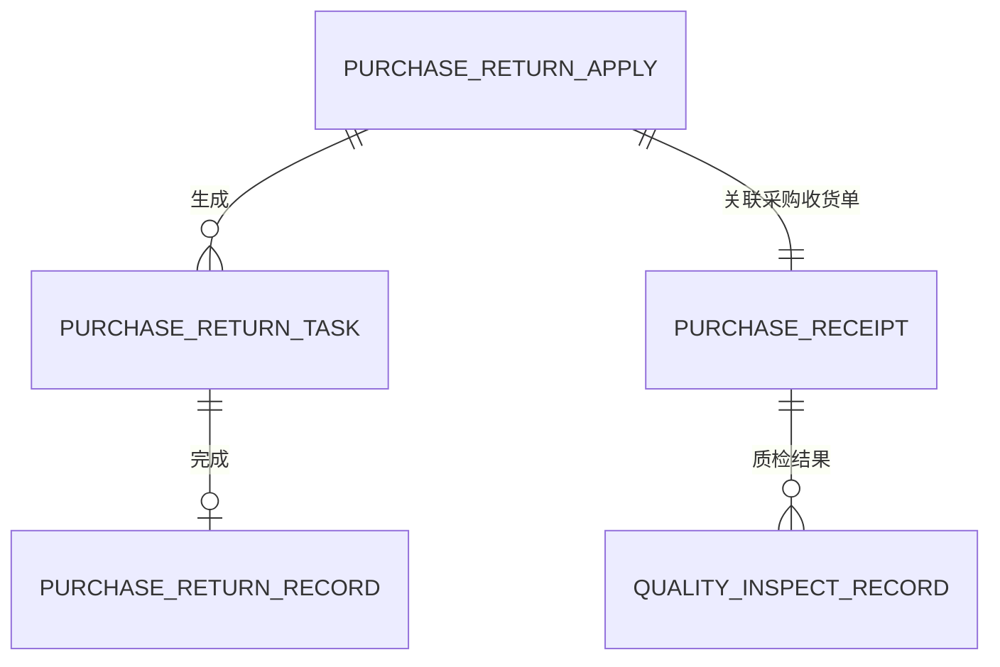
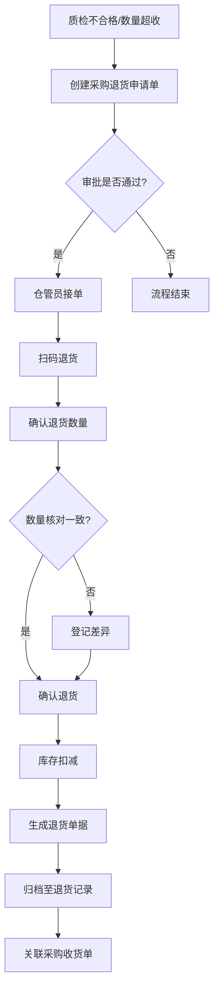

# 采购退货

## 概述

采购退货是 MOM 系统中处理采购收货后因质检不合格、数量超收等原因将货物退回供应商的业务模块。该模块与采购收货、质量检验（QMS）模块紧密关联，构成完整的采购履约闭环。

## 领域模型

### 实体关系图


```

### 核心实体说明

| 实体                 | 说明           | 生命周期                     |
| -------------------- | -------------- | ---------------------------- |
| PurchaseReturnApply  | 采购退货申请单 | 创建→审批中→已批准→已拒绝 |
| PurchaseReturnTask   | 采购退货任务   | 待处理→处理中→已完成       |
| PurchaseReturnRecord | 采购退货记录   | 已完成单据的归档记录         |
| PurchaseReceipt      | 采购收货单     | 关联来源，记录原始收货信息   |

## 核心流程

### 业务流程图



### 流程说明

| 阶段     | 触发条件            | 操作动作                                 | 结果                           |
| -------- | ------------------- | ---------------------------------------- | ------------------------------ |
| 退货申请 | 质检不合格/数量超收 | 创建退货申请单，填写退货物料、数量、原因 | 申请单进入审批流程             |
| 审批     | 审批人收到待办      | 审核退货申请单据                         | 通过则下发任务；拒绝则流程终止 |
| 任务执行 | 仓管员接单          | 扫码识别物料，确认退货数量               | 生成退货记录，扣减库存         |
| 记录归档 | 退货完成            | 系统自动归档至退货记录列表               | 单据状态变为已完成             |

## 字段说明

### 采购退货申请单 (PurchaseReturnApply)

| 字段名           | 中文名       | 类型          | 约束     | 影响业务                     | 备注                                     |
| ---------------- | ------------ | ------------- | -------- | ---------------------------- | ---------------------------------------- |
| returnApplyNo    | 退货申请单号 | VARCHAR(50)   | 必填     | 所有业务单据的唯一标识       | 系统自动生成，格式：RTN-YYYYMMDD-XXXX    |
| supplier         | 供应商       | VARCHAR(100)  | 必填     | 退货对象指定、财务核算依据   | 从供应商主数据选择                       |
| relatedReceiptNo | 关联收货单号 | VARCHAR(50)   | 必填     | 退货与收货的关联追溯         | 关联采购收货单，支持扫码带入             |
| inspectResult    | 质检结果     | ENUM          | 必填     | 判断是否允许退货             | 字典值：不合格/数量超收/品质异常         |
| returnReason     | 退货原因     | VARCHAR(500)  | 非必填   | 退货原因追溯、财务扣款依据   | 如：外观破损、数量短缺、参数不达标       |
| materialCode     | 物料号       | VARCHAR(50)   | 必填     | 退货物料的唯一标识           | 从物料主数据选择                         |
| materialName     | 物料名称     | VARCHAR(200)  | 必填     | 物料展示                     | 自动带出，可编辑                         |
| returnQty        | 退货数量     | DECIMAL(18,6) | 必填     | 退货数量的计量、库存扣减依据 | 必须小于等于关联收货单的收货数量         |
| unit             | 单位         | VARCHAR(10)   | 必填     | 数量计量单位                 | 自动带出物料的基本单位                   |
| status           | 申请状态     | ENUM          | 系统控制 | 流程流转控制                 | 字典值：草稿/审批中/已批准/已拒绝/已取消 |
| applicant        | 申请人       | VARCHAR(50)   | 系统控制 | 追溯单据责任人               | 自动记录当前操作人                       |
| applyDate        | 申请日期     | DATE          | 系统控制 | 单据日期追溯                 | 默认当前日期                             |

### 采购退货任务 (PurchaseReturnTask)

| 字段名          | 中文名       | 类型          | 约束     | 影响业务         | 备注                                       |
| --------------- | ------------ | ------------- | -------- | ---------------- | ------------------------------------------ |
| taskNo          | 退货任务编号 | VARCHAR(50)   | 必填     | 任务唯一标识     | 系统自动生成，格式：TASK-RTN-YYYYMMDD-XXXX |
| returnApplyNo   | 退货申请单号 | VARCHAR(50)   | 必填     | 任务与申请的关联 | 关联采购退货申请单                         |
| materialCode    | 物料号       | VARCHAR(50)   | 必填     | 退货物料标识     | 自动从申请单带出                           |
| materialName    | 物料名称     | VARCHAR(200)  | 必填     | 物料展示         | 自动带出                                   |
| warehouse       | 仓库         | VARCHAR(50)   | 必填     | 退货入库仓库指定 | 从仓库主数据选择                           |
| location        | 库位         | VARCHAR(50)   | 非必填   | 退货入库库位指定 | 从库区/库位主数据选择                      |
| returnQty       | 退货数量     | DECIMAL(18,6) | 必填     | 计划退货数量     | 自动从申请单带出                           |
| actualReturnQty | 实际退货数量 | DECIMAL(18,6) | 必填     | 实际退货数量确认 | 由仓管员扫码确认后录入                     |
| unitPrice       | 单价         | DECIMAL(18,4) | 非必填   | 财务核算依据     | 自动从采购价格单带出                       |
| totalAmount     | 总金额       | DECIMAL(18,2) | 计算字段 | 退货金额统计     | returnQty × unitPrice                     |
| status          | 任务状态     | ENUM          | 系统控制 | 任务流转控制     | 字典值：待处理/处理中/已完成/已取消        |
| handler         | 处理人       | VARCHAR(50)   | 系统控制 | 任务责任人追溯   | 自动记录接单仓管员                         |
| handleDate      | 处理日期     | DATETIME      | 系统控制 | 任务完成时间追溯 | 任务完成时自动记录                         |

### 采购退货记录 (PurchaseReturnRecord)

| 字段名         | 中文名       | 类型          | 约束     | 影响业务             | 备注                                      |
| -------------- | ------------ | ------------- | -------- | -------------------- | ----------------------------------------- |
| returnRecordNo | 退货记录编号 | VARCHAR(50)   | 必填     | 记录唯一标识         | 系统自动生成，格式：REC-RTN-YYYYMMDD-XXXX |
| taskNo         | 退货任务编号 | VARCHAR(50)   | 必填     | 记录与任务的关联     | 关联采购退货任务                          |
| returnApplyNo  | 退货申请单号 | VARCHAR(50)   | 必填     | 追溯原始申请         | 关联采购退货申请单                        |
| materialCode   | 物料号       | VARCHAR(50)   | 必填     | 退货物料标识         | 自动从任务带出                            |
| materialName   | 物料名称     | VARCHAR(200)  | 必填     | 物料展示             | 自动带出                                  |
| supplier       | 供应商       | VARCHAR(100)  | 必填     | 供应商追溯、财务核算 | 自动从申请单带出                          |
| returnQty      | 退货数量     | DECIMAL(18,6) | 必填     | 实际退货数量         | 以扫码确认为准                            |
| unitPrice      | 单价         | DECIMAL(18,4) | 必填     | 财务核算依据         | 自动从采购价格单带出                      |
| totalAmount    | 总金额       | DECIMAL(18,2) | 计算字段 | 退货金额统计         | returnQty × unitPrice                    |
| receiptDocNo   | 收货单据号   | VARCHAR(50)   | 非必填   | 关联[采购收货](../03-采购收货/index.md)单据号   | 支持追溯原始收货单                        |
| returnDate     | 退货日期     | DATETIME      | 系统控制 | 退货时间追溯         | 任务完成时自动记录                        |
| status         | 记录状态     | ENUM          | 系统控制 | 单据状态             | 字典值：已完成                            |

### 字段约束说明

| 约束类型 | 说明                                                                                                                              |
| -------- | --------------------------------------------------------------------------------------------------------------------------------- |
| 字典项   | inspectResult（不合格/数量超收/品质异常）、status（草稿/审批中/已批准/已拒绝/已取消/待处理/处理中/已完成）、unit（PCS/KG/SET 等） |
| 联动影响 | relatedReceiptNo 关联后自动带出 supplier、materialCode、receiptQty；actualReturnQty 变化时自动重算 totalAmount                    |
| 业务规则 | returnQty 必须小于等于关联收货单的收货数量；退货完成后库存扣减对应物料的可用数量                                                  |

## 关联关系

```
采购收货单 ←→ 采购退货申请（通过 relatedReceiptNo 关联）
采购退货申请 ←→ 采购退货任务（通过 returnApplyNo 一对多生成）
采购退货任务 ←→ 采购退货记录（通过 taskNo 单一对应）
质检结果（QMS）→ 触发采购退货申请（通过 inspectResult 判断）
```

## 备注

- 采购退货申请支持批量创建，可基于同一收货单多次发起退货申请
- 退货任务执行时需扫码确认，确保退货物料与申请单一致
- 退货完成后自动生成财务凭证（若系统集成 ERP）
- 已完成的退货记录支持查询、导出，不支持编辑和删除
