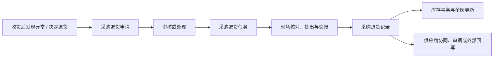

# 采购退货

> 适用基线：测试环境 / `dev` 分支 / 2026-07-15。
> 阅读对象：测试、实施、运维（主）；采购协同、仓库、质量协同人员（顺带）。

## 业务目的与适用范围

采购退货用于把不应继续留在企业库存中的来料，按可追溯的流程退回供应商。它通常发生在收货后发现质量不合格、数量或规格不符、超收，或业务决定不再接收时。采购退货不是直接删除库存，而是保留退货原因、来源、数量、执行人与库存影响的业务闭环。

相对[采购收货](../03-采购收货/index.md)：收货是「到货进入库存」；退货是「从已收结果按可退范围扣减并退回供应商」。同属申请—任务—记录链，但来源与数量方向相反。读完本页，应能判断：一笔来料该不该退、能退多少（可退范围）、实退后库存是否扣减到位，以及供应商协同/外部回写是否还缺一环。

## 如何使用本组文档

| 你的目的 | 建议阅读 |
| --- | --- |
| 理解一笔退货怎样从问题来料走到扣减闭环 | 本页：准备 → 一笔退货 → 关键判断 → 库存影响 |
| 弄清可退范围、原因门禁与配置约束，或据此验证/排障 | 本页主线中的配置说明、「建议验证点」「常见问题与处理」 |
| 具体发起、承接、查字段细节或撤销联查 | [采购退货-维护与查询参考](采购退货-维护与查询参考.md) |

## 使用前准备

| 需要确认什么 | 为什么重要 |
| --- | --- |
| 来源收货或待处理到货 | 明确要退的物料从何而来，避免处理错供应商或错批次。 |
| 供应商、物料、数量与单位 | 形成退货对象和数量核对基础。 |
| 退货原因与质量结论 | 区分质量不合格、数量异常、规格不符或其它业务原因。 |
| 当前库存地点、状态、批次和包装 | 决定可退数量及后续库存追溯范围。 |
| 是否存在上架、检验或其它后续处理 | 避免已经进入后续环节后重复退货或遗漏冲抵。 |

!!! example "📷 截图占位"
    从收货记录或检验结果发起采购退货的页面，标出来源单据、供应商、物料、可退数量和退货原因。

## 一笔采购退货如何完成

申请表达“为什么要退、退什么”；任务把退货工作交给现场；记录保存已实际交接的结果。任何一步出现数量、质量或来源差异，都应按异常处理保留原因，而不是跳过申请直接改库存。

可退数量通常受「已收 − 已退 − 已占用（如上架/其它处置）」约束；现场是否必须扫描库位/批次/包装、是否允许改量，多随任务所属[业务类型](../../04-DBC-主数据管理/05-策略设置/03-业务类型.md)下发。单据号规则见[单据设置](../../04-DBC-主数据管理/05-策略设置/04-单据设置.md)。变更前应在测试环境走通「收货→（可选上架/检验）→退货→余额扣减」并核对协同回写。

!!! example "📝 示例数据占位"
    采购收货 100 件，其中 2 件检验不合格。展示来源收货、退货申请、任务、退货记录和库存减少结果。

!!! example "写实示例：给定配置 → 期望行为"
    **给定：** 收货记录 RCV-3001 实收物料 A 100 件；其中 2 件检验不合格并拟退；可退数量显示为 2；任务要求扫描批次/包装；现场实退 2。
    **期望：**

    1. 可从来源收货（或质量不合格入口）带出退货申请；供应商通常回填锁定，不可随意改写。
    2. 可退数量不超过仍可退余量；试图实退超过可退时应被拦截（默认策略细节 ❓）。
    3. 须保留退货原因；质量退货应能联查到检验结论，不得用“正常出库”代替退货闭环。
    4. 提交后形成退货记录：实退 2；库存事务与余额按对应库位/批次/包装扣减 2。
    5. 查询应按「退货记录 → 库存事务 → 库存余额」确认扣减；若有供应商协同/外部回写，应能看到处理线索（回写范围 ❓）。

### 退货过程中要作出的关键判断

| 判断点 | 应先确认什么 | 对业务的影响 |
| --- | --- | --- |
| 是否应退货 | 问题是否能由检验、数量核对或业务决定证明。 | 决定是否发起退货及采用何种原因。 |
| 是否可以退 | 来源、可退数量、库存地点和后续处理是否一致。 | 避免超退、错退或重复退货。 |
| 如何现场执行 | 是否需要扫描批次、包装、库位或交接信息。 | 决定现场核对方式和追溯完整性。 |
| 如何结束退货 | 是否已形成退货记录和库存结果，供应商是否完成交接。 | 决定本次退货是否可以关闭。 |

典型分工为：采购或质量人员说明退货原因，仓库人员承接和执行现场退货，管理或业务处理人员确认异常与后续协同。具体审核主体和动作权限须以测试环境配置为准。

### 关键字段业务角色

完整选择器范围、可退范围与门禁见[维护与查询参考](采购退货-维护与查询参考.md)。与[采购收货](../03-采购收货/index.md)同属申请—任务—记录链，但**来源与数量方向相反**；下列只列主线差异项。拣选库位级联通例见[库位与仓储级联惯例](../../02-业务模型/13-库位与仓储级联惯例.md)；来源/余额选择通例见[通用选择器过滤惯例](../../02-业务模型/12-通用选择器过滤惯例.md)。

| 字段/配置点 | 在系统中的作用 | 关键行为要点（取值/范围/联动/门禁） | 维护或操作时要警惕什么 |
| --- | --- | --- | --- |
| 来源收货记录 / 可退范围 | 确定退哪一次到货、退哪些明细 | 通常从已完成收货结果发起；可选范围受已收、已退、已上架/检验等消耗约束（❓ 精确过滤待确认） | 选错来源会退错供应商或批次 |
| 供应商 | 退回对象 | 多由来源收货回填并锁定 | 与实物交接方不一致导致对账失败 |
| 可退/实退数量 | 控制退货量 | 不得超过可退范围；超退应被拦截（❓ 默认策略待确认） | 强改数量造成账实与供应商协同错位 |
| 退货原因 / 质量结论 | 分流质量退、超收退、业务退等 | PDA/Web 退货需保留原因；质量触发场景应可联查检验结论 | 无原因无法闭环异常 |
| 库位 / 批次 / 包装 | 从哪一笔余额拣出退货 | 按库存唯一粒度定位，见[库存管理精度与唯一粒度](../../02-业务模型/08-库存管理精度与唯一粒度.md) | 漏采或错位导致扣错库存 |
| 申请/任务/记录/撤销状态 | 动作门禁 | 另有撤销记录入口；状态码 ❓ | 勿把撤销当删除历史 |

### 建议验证点

- 从已完成收货发起退货，核对可退数量 = 仍可退余量；超退应失败。
- 质量不合格触发退货时，原因与检验结论可联查，库存按批次/包装正确扣减。
- 已部分上架或已部分退后，再次退货的可退范围是否收紧。
- 退货完成后依次查退货记录 → 库存事务 → 库存余额；余额未变时勿先认定失败。
- 撤销退货后，冲抵、可退余量恢复与外部回写是否一致（条件 ❓）。
- 现场反馈“找不到可退来源”时，先查收货是否完成、是否已退完/已占用，再查权限与过滤条件。

## 库存与相关业务影响

采购退货应以实际退货记录作为追溯依据，并形成相应库存变动。查询时应能从退货记录反查来源收货、物料和库存变化；如果退货前已经上架、检验或发生其它处置，还应确认这些后续对象是否需要同步处理。

| 关联业务 | 应关注什么 |
| --- | --- |
| 采购收货 | 退的是哪次收货、原始供应商和数量是否一致。 |
| 质量检验 | 是否由不合格或隔离结果触发，质量结论如何保存。 |
| 库存管理 | 退货后哪些批次、包装、库位和库存状态发生变化。 |
| 采购上架 | 已上架物料退货时，是否先完成拣出或库位处理。 |
| 外部协同 | 供应商、采购订单或第三方系统是否需要接收退货结果。 |

## 查询、详情与联查

| 想解决的问题 | 推荐定位方式 | 建议联查 |
| --- | --- | --- |
| 某批来料为何退回 | 退货申请号、来源收货单、供应商或物料。 | 收货记录、检验结果、退货原因。 |
| 谁还需要执行退货 | 退货任务号、状态、执行人或供应商。 | 申请、任务明细和现场交接信息。 |
| 退货是否已影响库存 | 退货记录号、物料、批次/包装。 | 库存事务、库存余额。 |
| 退货后是否已关闭后续问题 | 来源收货、检验、上架和外部协同结果。 | 对应业务记录或接口处理结果。 |

### 详情分组与快速跳转

| 分组 | 应展示什么 | 可联查什么 |
| --- | --- | --- |
| 来源与原因 | 来源收货、供应商、退货原因/质量结论。 | 采购收货、来料检验。 |
| 退货明细 | 物料、可退/实退数量、批次/包装。 | 物料、库存余额。 |
| 现场执行 | 库位拣出、扫描、交接信息。 | PDA 执行、任务承接。 |
| 库存影响 | 扣减结果与事务线索。 | 库存事务、库存余额。 |
| 后续协同 | 供应商协同、订单/接口回写。 | 采购订单、外部回写结果。 |
| 系统信息 | 创建、更新、撤销痕迹。 | 撤销记录。 |

!!! example "📷 截图占位"
    退货申请/任务/记录详情分组与收货/检验/库存联查；状态：待截图。

## 常见问题与处理

| 情况 | 建议处理 |
| --- | --- |
| 找不到可退来源 | 先核对收货记录、供应商、物料、批次/包装和当前库存状态。 |
| 退货数量超过可退数量 | 暂停执行，核对已上架、已处理或已退数量；不得强行修改结果。 |
| 检验不合格但无法退货 | 确认质量结论、隔离状态和退货权限，再决定是否需要转其它处置。 |
| 已退货但余额未变化 | 依次检查退货记录、库存事务、库存余额及是否仍有异步处理。 |

## 当前限制与待确认事项

- 申请、任务、记录的真实状态值、自动处理策略和审核主体尚需测试环境确认；
- 质量不合格、隔离、已上架等不同来源的退货前置条件需补端到端样例；
- 退货对采购订单、供应商协同和外部系统的回写范围需进一步验证；
- 详情页实际 Tab、按钮可见条件和 PDA 执行入口待补截图与权限实测。

## 待补充的图示与示例
| 类型 | 后续需要补充的内容 | 目的 |
| --- | --- | --- |
| 流程图 | 收货/检验异常到申请、任务、记录和库存结果。 | 支持退货业务培训。 |
| 状态图 | 申请、任务、记录的状态与拒绝/撤销分支。 | 说明何时可以继续处理。 |
| Web/PDA 截图 | 发起、承接、扫描、交接和查询。 | 支持现场执行。 |
| 示例数据 | 质量不合格、超收、已上架后退货三类样例。 | 支持异常处理和追溯。 |
