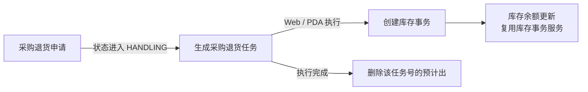
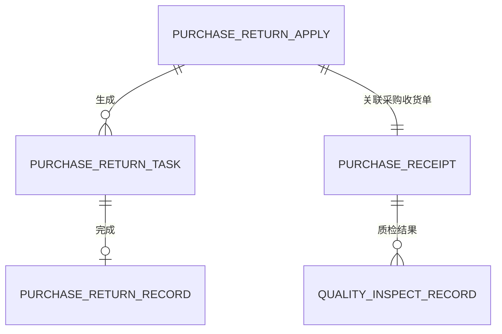
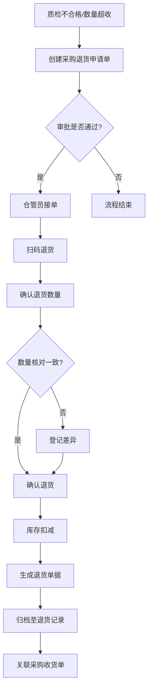
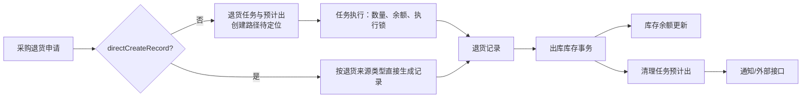

# 采购退货

## 概述

采购退货是 MOM 系统中处理采购收货后因质检不合格、数量超收等原因将货物退回供应商的业务模块。该模块与采购收货、质量检验（QMS）模块紧密关联，构成完整的采购履约闭环。

## BATCH-01 标准占位

> 状态：首轮占位，待基于 DDL、DO、DTO、前端页面、后端服务和测试环境继续核验。下方历史字段和流程说明未完成字段真实性校正前，不作为接口、导入或测试依据。

采购退货属于申请、任务、记录类业务，应引用[申请、任务与记录模型](../../02-业务模型/01-申请任务记录模型.md)。本页后续只补采购退货特有的来源、字段、状态差异、库存影响、接口影响、终端入口和异常分支。

| 主题 | 当前占位 | 后续取证 |
| --- | --- | --- |
| 字段真实性 | 保留历史草稿，新增字段事实需待核验。 | 从 WMS DDL、DO、DTO、VO、前端配置校正真实字段名。 |
| 新增/编辑/导入 | 待补采购退货申请、任务、记录的新增约束、编辑限制和导入规则。 | 前端表单、导入类、后端校验、测试环境。 |
| 列表与详情 | 待补默认列表字段、查询字段、详情分组和快速跳转。 | 前端列表配置、详情组件、用户关注字段。 |
| 动作与状态 | 待补提交、审批、执行、撤销、关闭等动作的前置条件。 | 前端按钮、后端服务、状态枚举/字典。 |
| 库存挂接 | 预计应影响预计出、库存事务和库存余额，具体对象待核验。 | 库存服务调用、事务类型、余额更新逻辑。 |
| 权限与日志 | 按 [RBAC 与动作权限取证模板](../../15-版本路线图/RBAC与动作权限取证模板.md) 逐项补。 | 菜单权限、按钮权限、接口权限、数据范围、操作日志。 |
| 终端操作 | 待确认 PDA/线边端是否存在采购退货执行入口。 | 终端菜单、路由、扫码页面和接口。 |
| 图示与示例 | 保留流程图；待补库存扣减示例和异常退货样例。 | 测试数据、服务规则、业务确认。 |

## 当前页面事实卡（第二轮源码已证实）

> 以下内容覆盖当前实现的主干链路，并优先于本页后续历史草稿。历史草稿内的英文字段、审批状态、QMS 触发和财务回写尚未逐项校正，不得作为培训或接口依据。

### 实体与关联键

采购退货采用“申请主/明细 → 任务主/明细 → 记录主/明细”的实际表结构：`request_purchasereturn_*`、`job_purchasereturn_*`、`record_purchasereturn_*`。主表通过 `number` 表示本层单据号，任务主表保存 `request_number`，记录主表保存 `request_number` 与 `job_number`；三层还可保留 `purchase_receipt_record_number`、`asn_number`、`pp_number` 等来源追溯键。

| 对象 | 当前已证实的业务字段 | 使用边界 |
| --- | --- | --- |
| 申请主表 | `number`、`purchase_receipt_record_number`、`asn_number`、`pp_number`、`supplier_code`、`request_time`、`due_time`、`return_source_type`、`return_order_number`、`erp_location_code`、`business_detail`。 | 是退货业务意图和来源信息的承载体；`return_source_type` 说明同一模型兼容采购、维修备件、M 类型采购退货。 |
| 申请明细 | 继承物料、批次、库存状态、库位、数量等通用申请明细字段，并有 `reason`、`reason_type`、`po_number`、`po_line`、`pallet_unit`、`pallet_std_qty`、`produce_date`。 | 退货可用库存的查询按物料、批次、库存状态、来源库位等维度组织。 |
| 任务主表 | `request_number`、`status`、`accept_user_id/name/time`、`complete_user_id/name/time`，以及是否允许改库位、数量、批次、箱码、重复扫描和扫描目标库位等策略字段。 | 现场执行控制在任务层；Web 和 PDA 均有任务执行入口。 |
| 记录主表 | `request_number`、`job_number`、`purchase_receipt_record_number`、`execute_time`、`active_date`、`number`、`business_type`。 | 记录层保留实际执行后的追溯信息。 |

### 已证实的单据与库存链路



1. 申请保存后，状态为 `HANDLING` 时生成采购退货任务。
2. 任务执行服务调用 `transactionService.createTransaction(...)` 创建库存事务；库存事务对库存余额的更新遵循[库存数据挂接模型](../../02-业务模型/02-库存数据挂接模型.md)的统一规则。
3. 执行后服务会按任务单号删除预计出记录；趋势日志记录“执行了采购退货任务”。
4. Web 任务页存在“承接”动作；PDA 具备采购退货任务、明细、扫码组件和记录页面。具体状态码、扫码校验和按钮权限仍需单独取证。

### 当前重要待确认项

| 编号 | 发现 | 当前处理 |
| --- | --- | --- |
| PRT-INV-001 | 生成任务时构造预计出数据的调用在当前 `PurchasereturnRequestMainService` 中被注释，不能据此说明“申请/任务一定创建预计出”。 | 登记总账；页面只保留“执行时删除同任务预计出”的已证实事实。 |
| PRT-RULE-001 | 历史草稿宣称 QMS 不合格、数量超收、审批通过等为统一前置条件，但本轮未逐项验证。 | 不作为当前规则；后续按状态枚举、按钮与测试环境回填。 |
| PRT-IF-001 | 代码存在外部消息、ERP 库位/凭证、采购订单相关字段，但实际同步时点、幂等与失败补偿尚未完成取证。 | 保留接口占位，继续其它 WMS 页面。 |

## 历史草稿校正说明

本页下方早期段落使用 `returnApplyNo`、`returnQty`、`relatedReceiptNo` 等推导字段，并写入了固定的审批状态、QMS 触发、ERP 凭证和退货数量规则。它们与当前 `request_purchasereturn_*`、`job_purchasereturn_*`、`record_purchasereturn_*` 模型并非一一对应，现降级为待校正草稿；后续页面回填应以本节事实卡为起点。

## 领域模型

### 实体关系图


```

### 核心实体说明

| 实体                 | 说明           | 生命周期                     |
| -------------------- | -------------- | ---------------------------- |
| PurchaseReturnApply  | 采购退货申请单 | 创建→审批中→已批准→已拒绝 |
| PurchaseReturnTask   | 采购退货任务   | 待处理→处理中→已完成       |
| PurchaseReturnRecord | 采购退货记录   | 已完成单据的归档记录         |
| PurchaseReceipt      | 采购收货单     | 关联来源，记录原始收货信息   |

## 核心流程

### 业务流程图



### 流程说明

| 阶段     | 触发条件            | 操作动作                                 | 结果                           |
| -------- | ------------------- | ---------------------------------------- | ------------------------------ |
| 退货申请 | 质检不合格/数量超收 | 创建退货申请单，填写退货物料、数量、原因 | 申请单进入审批流程             |
| 审批     | 审批人收到待办      | 审核退货申请单据                         | 通过则下发任务；拒绝则流程终止 |
| 任务执行 | 仓管员接单          | 扫码识别物料，确认退货数量               | 生成退货记录，扣减库存         |
| 记录归档 | 退货完成            | 系统自动归档至退货记录列表               | 单据状态变为已完成             |

## 字段说明

### 采购退货申请单 (PurchaseReturnApply)

| 字段名           | 中文名       | 类型          | 约束     | 影响业务                     | 备注                                     |
| ---------------- | ------------ | ------------- | -------- | ---------------------------- | ---------------------------------------- |
| returnApplyNo    | 退货申请单号 | VARCHAR(50)   | 必填     | 所有业务单据的唯一标识       | 系统自动生成，格式：RTN-YYYYMMDD-XXXX    |
| supplier         | 供应商       | VARCHAR(100)  | 必填     | 退货对象指定、财务核算依据   | 从供应商主数据选择                       |
| relatedReceiptNo | 关联收货单号 | VARCHAR(50)   | 必填     | 退货与收货的关联追溯         | 关联采购收货单，支持扫码带入             |
| inspectResult    | 质检结果     | ENUM          | 必填     | 判断是否允许退货             | 字典值：不合格/数量超收/品质异常         |
| returnReason     | 退货原因     | VARCHAR(500)  | 非必填   | 退货原因追溯、财务扣款依据   | 如：外观破损、数量短缺、参数不达标       |
| materialCode     | 物料号       | VARCHAR(50)   | 必填     | 退货物料的唯一标识           | 从物料主数据选择                         |
| materialName     | 物料名称     | VARCHAR(200)  | 必填     | 物料展示                     | 自动带出，可编辑                         |
| returnQty        | 退货数量     | DECIMAL(18,6) | 必填     | 退货数量的计量、库存扣减依据 | 必须小于等于关联收货单的收货数量         |
| unit             | 单位         | VARCHAR(10)   | 必填     | 数量计量单位                 | 自动带出物料的基本单位                   |
| status           | 申请状态     | ENUM          | 系统控制 | 流程流转控制                 | 字典值：草稿/审批中/已批准/已拒绝/已取消 |
| applicant        | 申请人       | VARCHAR(50)   | 系统控制 | 追溯单据责任人               | 自动记录当前操作人                       |
| applyDate        | 申请日期     | DATE          | 系统控制 | 单据日期追溯                 | 默认当前日期                             |

### 采购退货任务 (PurchaseReturnTask)

| 字段名          | 中文名       | 类型          | 约束     | 影响业务         | 备注                                       |
| --------------- | ------------ | ------------- | -------- | ---------------- | ------------------------------------------ |
| taskNo          | 退货任务编号 | VARCHAR(50)   | 必填     | 任务唯一标识     | 系统自动生成，格式：TASK-RTN-YYYYMMDD-XXXX |
| returnApplyNo   | 退货申请单号 | VARCHAR(50)   | 必填     | 任务与申请的关联 | 关联采购退货申请单                         |
| materialCode    | 物料号       | VARCHAR(50)   | 必填     | 退货物料标识     | 自动从申请单带出                           |
| materialName    | 物料名称     | VARCHAR(200)  | 必填     | 物料展示         | 自动带出                                   |
| warehouse       | 仓库         | VARCHAR(50)   | 必填     | 退货入库仓库指定 | 从仓库主数据选择                           |
| location        | 库位         | VARCHAR(50)   | 非必填   | 退货入库库位指定 | 从库区/库位主数据选择                      |
| returnQty       | 退货数量     | DECIMAL(18,6) | 必填     | 计划退货数量     | 自动从申请单带出                           |
| actualReturnQty | 实际退货数量 | DECIMAL(18,6) | 必填     | 实际退货数量确认 | 由仓管员扫码确认后录入                     |
| unitPrice       | 单价         | DECIMAL(18,4) | 非必填   | 财务核算依据     | 自动从采购价格单带出                       |
| totalAmount     | 总金额       | DECIMAL(18,2) | 计算字段 | 退货金额统计     | returnQty × unitPrice                     |
| status          | 任务状态     | ENUM          | 系统控制 | 任务流转控制     | 字典值：待处理/处理中/已完成/已取消        |
| handler         | 处理人       | VARCHAR(50)   | 系统控制 | 任务责任人追溯   | 自动记录接单仓管员                         |
| handleDate      | 处理日期     | DATETIME      | 系统控制 | 任务完成时间追溯 | 任务完成时自动记录                         |

### 采购退货记录 (PurchaseReturnRecord)

| 字段名         | 中文名       | 类型          | 约束     | 影响业务             | 备注                                      |
| -------------- | ------------ | ------------- | -------- | -------------------- | ----------------------------------------- |
| returnRecordNo | 退货记录编号 | VARCHAR(50)   | 必填     | 记录唯一标识         | 系统自动生成，格式：REC-RTN-YYYYMMDD-XXXX |
| taskNo         | 退货任务编号 | VARCHAR(50)   | 必填     | 记录与任务的关联     | 关联采购退货任务                          |
| returnApplyNo  | 退货申请单号 | VARCHAR(50)   | 必填     | 追溯原始申请         | 关联采购退货申请单                        |
| materialCode   | 物料号       | VARCHAR(50)   | 必填     | 退货物料标识         | 自动从任务带出                            |
| materialName   | 物料名称     | VARCHAR(200)  | 必填     | 物料展示             | 自动带出                                  |
| supplier       | 供应商       | VARCHAR(100)  | 必填     | 供应商追溯、财务核算 | 自动从申请单带出                          |
| returnQty      | 退货数量     | DECIMAL(18,6) | 必填     | 实际退货数量         | 以扫码确认为准                            |
| unitPrice      | 单价         | DECIMAL(18,4) | 必填     | 财务核算依据         | 自动从采购价格单带出                      |
| totalAmount    | 总金额       | DECIMAL(18,2) | 计算字段 | 退货金额统计         | returnQty × unitPrice                    |
| receiptDocNo   | 收货单据号   | VARCHAR(50)   | 非必填   | 关联[采购收货](../03-采购收货/index.md)单据号   | 支持追溯原始收货单                        |
| returnDate     | 退货日期     | DATETIME      | 系统控制 | 退货时间追溯         | 任务完成时自动记录                        |
| status         | 记录状态     | ENUM          | 系统控制 | 单据状态             | 字典值：已完成                            |

### 字段约束说明

| 约束类型 | 说明                                                                                                                              |
| -------- | --------------------------------------------------------------------------------------------------------------------------------- |
| 字典项   | inspectResult（不合格/数量超收/品质异常）、status（草稿/审批中/已批准/已拒绝/已取消/待处理/处理中/已完成）、unit（PCS/KG/SET 等） |
| 联动影响 | relatedReceiptNo 关联后自动带出 supplier、materialCode、receiptQty；actualReturnQty 变化时自动重算 totalAmount                    |
| 业务规则 | returnQty 必须小于等于关联收货单的收货数量；退货完成后库存扣减对应物料的可用数量                                                  |

## 关联关系

```
采购收货单 ←→ 采购退货申请（通过 relatedReceiptNo 关联）
采购退货申请 ←→ 采购退货任务（通过 returnApplyNo 一对多生成）
采购退货任务 ←→ 采购退货记录（通过 taskNo 单一对应）
质检结果（QMS）→ 触发采购退货申请（通过 inspectResult 判断）
```

## 相关模块接口

### 依赖模块

| 模块 | 接口方向 | 说明 |
|------|----------|------|
| WMS_RECEIVING | [采购收货](../03-采购收货/index.md) | 获取收货单数据作为退货申请来源 |
| QMS_IQC | [来料检验](../../07-QMS-质量管理/02-来料检验/index.md) | 质检结果触发退货申请 |
| DBC_MATERIAL | [物料主数据](../../04-DBC-主数据管理/01-物料管理/01-物料基本信息.md) | 获取退货物料编码、名称、单位 |
| DBC_SUPPLIER | [供应商主数据](../../04-DBC-主数据管理/02-供应商管理/01-供应商.md) | 获取供应商信息 |
| DBC_WAREHOUSE | [仓库主数据](../../04-DBC-主数据管理/04-工厂建模/01-仓库管理.md) | 获取退货仓库信息 |
| WMS_INVENTORY | [库存管理](../09-库存管理/index.md) | 退货完成后扣减库存可用量 |

### 被依赖模块

| 模块 | 接口方向 | 说明 |
|------|----------|------|
| SCP_PURCHASE | [采购供应链](../../10-SCP-供应链平台/index.md) | 退货数量同步至采购对账扣减 |
| ERP_FINANCE | [ERP 财务](../../01-总体框架/architecture.md) | 退货完成生成财务冲销凭证 |

## 备注

- 采购退货申请支持批量创建，可基于同一收货单多次发起退货申请
- 退货任务执行时需扫码确认，确保退货物料与申请单一致
- 退货完成后自动生成财务凭证（若系统集成 ERP）
- 已完成的退货记录支持查询、导出，不支持编辑和删除

## 当前实现事实（BATCH-01 第二轮取证）

> 本节以 `dev` 分支 WMS 后端为准，优先于上方未完成字段真实性校正的历史字段表、状态图和接口说明。上述历史内容不得作为导入、接口或测试依据。

采购退货由申请、任务、记录及取消记录主/明细对象组成，对应 `request_purchasereturn_*`、`job_purchasereturn_*`、`record_purchasereturn_*`、`record_purchasereturn_cancel_*` 表。它不是单一“采购退货单”。

| 环节 | 当前可证实的实现 | 业务含义 |
| --- | --- | --- |
| 申请 | 申请主对象包含采购收货记录号、ASN、供应商、承运商、月台、退货来源类型、采购订单、ERP 库位代码和入/出库存状态范围等。 | 可关联原采购收货与供应商物流，但各字段是否必填/可编辑需分入口验证。 |
| 任务生成 | 正常路径按规则引擎的任务拆分结果生成待处理任务，并快照复制业务类型的可改库位/数量/批次/包装、部分/超量完成、重复扫描和目标库位扫描策略。 | 任务是现场执行边界；不应从申请字段推断实际扫码权限。 |
| 直接记录 | `directCreateRecord=true` 时，按退货来源类型走专用直接记录分支，不生成普通任务。 | 申请—任务—记录不是所有退货类型都完整经过三层。 |
| 任务执行 | 明细 `handleQty` 必须大于零；同一任务受 Redis 锁保护；执行前按物料、包装、批次、库位、库存状态查余额，数量不得超过余额。 | 后端承担数量与并发校验。 |
| 过账 | 执行顺序为记录主/明细、申请状态推进、出库库存事务、清理任务号对应的预计出、通知/接口消息。 | 记录驱动库存事务；库存事务再更新余额。任务创建预计出的具体调用路径仍待定位。 |

### 动作、列表与详情规划

| 区域 | 当前建议 |
| --- | --- |
| 申请列表 | 单号、业务类型、供应商、关联收货记录/采购订单、退货来源类型、状态、申请/截止时间、更新时间。 |
| 任务列表 | 任务号、申请号、供应商、业务类型、优先级、状态、要求截止时间、执行人；明细在展开/详情展示。 |
| 记录列表 | 记录号、任务号、供应商、关联收货记录、执行时间、状态、QAD/ERP 回写标识。 |
| 详情分组 | 单据与来源、供应商与物流、退货明细与批次、执行与库存影响、接口与取消记录、审计与趋势。 |
| 快速跳转 | 原采购收货记录、关联申请/任务/记录、库存事务、预计出、余额、取消记录、供应商、接口日志。 |



### 待核验与差距标记

1. 普通任务创建预计出的具体调用链，以及取消时是否恢复预计出。
2. 直接记录分支与普通任务分支的状态、字段、库存和接口差异。
3. 取消记录的反向库存事务、外部接口补偿、Web/PDA 按钮和状态前置条件。
4. 多套申请导入 VO 的模板字段、覆盖模式和系统填充字段。

详见《产品差距总账》GAP-064。本页已记录可证实主链，未确认内容继续按问题登记处理。
