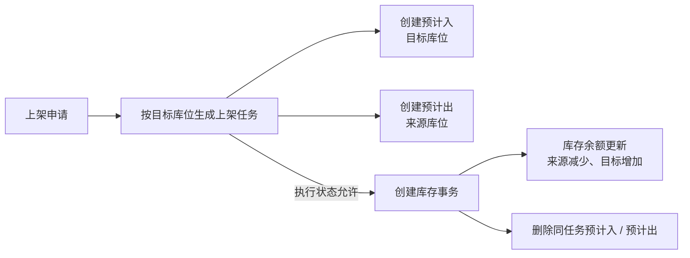
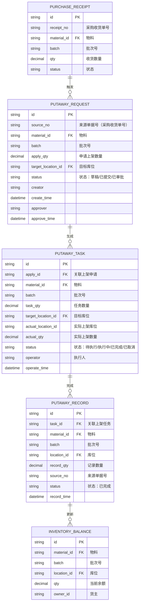
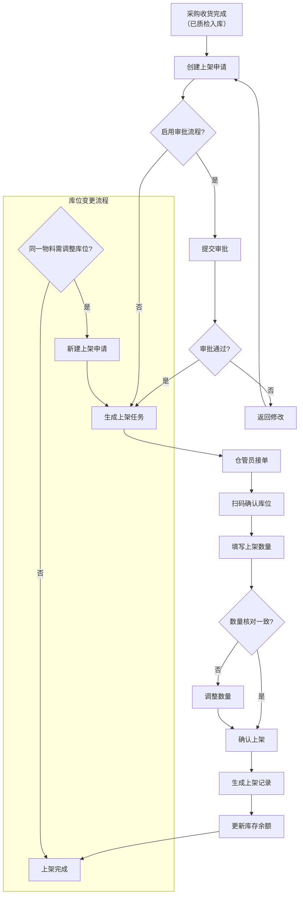
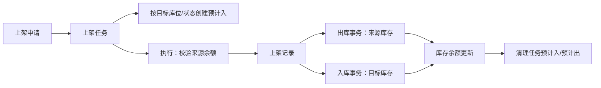

# 采购上架

> 第一阶段状态：本分组已建立学习导航和页面大纲；具体字段、状态、权限和测试截图按各叶页的后续任务补充。

## 这一组业务解决什么问题

将已收货或待处理物料转入目标库位或库存状态的仓储作业。

## 建议学习与操作顺序

| 顺序 | 建议先看什么 | 为什么 |
| --- | --- | --- |
| 1 | 本页的对象关系和边界 | 收货结果如何转为可存放、可追溯的上架结果。 |
| 2 | 本分组的主业务页或查询页 | 理解一笔典型业务如何开始、执行和结束。 |
| 3 | 对应的库存管理和终端操作页面 | 追溯库存结果，并理解 Web 与现场执行差异。 |

## 关键业务对象与关系

【图示占位：收货结果 → 上架申请/任务/记录 → 库存位置或状态变化。需以业务对象表达，不使用表名、字段或服务调用；状态和分支待测试验证后补充。】

## 页面清单与写作状态

| 页面 | 文档形态 | 已说明内容 | 后续需补 |
| --- | --- | --- | --- |
| 本分组业务说明 | 一页完成或主文档 | 已建立业务定位、阅读路径和大纲。 | 按业务补典型流程、状态、异常、查询和截图。 |
| 详细参考（如适用） | 仅复杂高频页面拆分 | 采购收货已采用主文档 + 详细参考样板。 | 其它页面按复杂度决定是否拆分，不机械新增。 |
| 终端与库存追溯 | 关联说明 | 仅说明与本分组相关的执行入口和结果对象。 | 补扫码规则、查询过滤、状态验证和示例。 |

## 常见问题与相关分组

【待补充：说明本分组中最常见的“找不到任务、数量/地点不一致、完成后查不到结果、需要转后续处理”等问题，以及应转到哪个分组继续处理。】

## 图示、截图与示例任务

【图示占位：补充本分组从来源、任务、记录到库存或后续处理的业务流程/关系图。】

【截图占位：补充业务列表、详情、现场执行或异常提示页面；使用脱敏测试数据。】

【示例数据占位：补充一笔正常业务和一笔常见异常的脱敏样例，串联来源、执行、结果和查询。】
## 模块概述

采购上架是 WMS 库房管理中连接采购收货与库存存储的核心环节。当采购物料完成收货、质检并确认合格后，系统生成待上架任务，由仓管员执行实际上架操作——扫码库位、确认物料、填入上架数量，最终将物料与库位关联、更新库存余额。

采购上架模块包含三个子功能：

| 功能 | 说明 |
|------|------|
| 上架申请 | 为待上架物料分配目标库位，支持新建和审批流程 |
| 上架任务 | 仓管员执行页面，扫码确认库位、填写上架数量 |
| 上架记录 | 已完成上架单据的查询列表，支持追溯和调整 |

## BATCH-01 标准占位

> 状态：首轮占位，待基于 DDL、DO、DTO、前端页面、后端服务和测试环境继续核验。下方历史字段和流程说明未完成字段真实性校正前，不作为接口、导入或测试依据。

采购上架属于申请、任务、记录类业务，应引用[申请、任务与记录模型](../../02-业务模型/01-申请任务记录模型.md)。本页后续只补采购上架特有的来源、字段、状态差异、库存影响、接口影响、终端入口和异常分支。

| 主题 | 当前占位 | 后续取证 |
| --- | --- | --- |
| 字段真实性 | 保留历史草稿，新增字段事实需待核验。 | 从 WMS DDL、DO、DTO、VO、前端配置校正真实字段名。 |
| 新增/编辑/导入 | 待补上架申请、任务、记录的新增约束、编辑限制和导入规则。 | 前端表单、导入类、后端校验、测试环境。 |
| 列表与详情 | 待补默认列表字段、查询字段、详情分组和快速跳转。 | 前端列表配置、详情组件、用户关注字段。 |
| 动作与状态 | 待补提交、审批、承接、执行、撤销、关闭等动作的前置条件。 | 前端按钮、后端服务、状态枚举/字典。 |
| 库存挂接 | 预计应影响库存事务和库存余额，是否影响预计入/预计出待核验。 | 库存服务调用、事务类型、余额更新逻辑。 |
| 权限与日志 | 按 RBAC 与动作权限取证模板 逐项补。 | 菜单权限、按钮权限、接口权限、数据范围、操作日志。 |
| 终端操作 | 待确认 PDA/线边端是否存在采购上架执行入口。 | 终端菜单、路由、扫码页面和接口。 |
| 图示与示例 | 保留流程图；待补库位扫描、上架过账和异常上架样例。 | 测试数据、服务规则、业务确认。 |

## 当前页面事实卡（第二轮源码已证实）

> 以下内容覆盖当前“采购上架”标准实现，并优先于本页后续历史草稿。历史草稿的字段、审批状态与数量规则尚未逐项校正，不得作为接口或测试依据。

### 实体与执行边界

采购上架使用 `request_putaway_*`、`job_putaway_*`、`record_putaway_*` 三层主明细表，属于[申请、任务与记录模型](../../02-业务模型/01-申请任务记录模型.md)的双向库存移动场景。申请主表的特有字段包括 `request_time`、`due_time`、`type`、`purchase_receipt_record_number`、`business_detail`；申请明细继承来源/目标库位、批次、包装、库存状态和数量等双向明细字段，并额外有 `project_code`、`package_qty`。

| 层级 | 当前已证实职责 | 关键事实 |
| --- | --- | --- |
| 申请 | 承载采购收货记录来源与上架类型。 | 申请主表保留 `purchase_receipt_record_number`，可追溯采购收货记录。 |
| 任务 | 承载现场上架执行和策略。 | 支持通过规则按目标库位分组生成任务；任务类型为 `Auto` 时存在 AGV 调用分支。 |
| 记录 | 承载执行后的业务凭证。 | 当申请配置 `directCreateRecord = true` 时，服务可跳过任务、直接创建记录；因此不能假定每笔上架一定经过人工任务。 |

### 已证实的库存挂接

1. 常规任务生成时，服务按来源库位创建预计出、按目标库位创建预计入；若目标托盘为空才会进入该库存余额移动的预计入/出创建分支。
2. 执行任务时，`JobStatusState.execute()` 必须允许当前状态执行，否则抛出状态错误；随后服务创建库存事务、调用统一“记录创建后”规则，并删除同任务号的预计入、预计出。
3. 库存事务写入后由统一库存事务服务更新库存余额，因此上架的本质是来源与目标库存粒度之间的移动，不能简化成“仅增加库存”。
4. 当前代码有 WMS—ERP 库存移动调用路径，也有规则引擎入口；实际外部接口是否启用、幂等和失败补偿须在测试环境继续核验。

### 终端、详情与后续回填重点

| 项目 | 已证实内容 | 仍待核验 |
| --- | --- | --- |
| 终端入口 | PDA 有上架任务、任务明细、任务列表、信息卡片和记录页面；另有生产上架终端，二者不能混用。 | PDA 的扫码前置、异常提示、可修改字段和权限。 |
| 详情分组建议 | 来源与申请、移动目标、执行与库存、审计与接口四组。 | 实际详情组件字段和跳转链接。 |
| 快速跳转建议 | 采购收货记录、任务、上架记录、来源/目标库存余额、库存事务。 | 页面实际 Tab / 路由能力。 |

## 历史草稿校正说明

下方草稿中 `material_id`、`source_no`、`target_location_id` 等字段名是早期推导，不能视为当前后端字段；“收货完成后必经质检、审批、人工接单”也不是本轮已证实的统一规则。后续字段、状态、选择器、导入和权限回填均以本节事实卡及对应 VO/前端页面为准。

## 领域模型

### 实体关系

### 关键聚合

- **上架申请聚合**：承载上游采购收货单的下达需求，控制审批流和库位分配策略
- **上架任务聚合**：现场执行单元，关联执行人与实际库位映射
- **上架记录聚合**：业务完结凭证，触发库存余额变更的事务记录

## 核心流程

### 上架全流程

### 流程说明

| 阶段 | 触发条件 | 执行动作 | 状态变更 |
|------|---------|---------|---------|
| 上架申请 | 采购收货单状态变为"已质检入库" | 仓管员填写目标库位，提交申请 | 草稿 → 已提交 → 已审批 |
| 上架任务 | 审批通过后自动生成 / 或直接生成 | 系统推送任务至仓管员待办 | 待执行 → 执行中 → 已完成 |
| 上架执行 | 仓管员在执行页面接单 | 扫码库位二维码、确认物料信息、填写实际上架数量 | 执行中 → 已完成 |
| 库位变更 | 同一物料需调整存放位置 | 新建上架申请（来源选择原采购单），走新流程 | 循环至新上架记录 |

## 字段说明

### 上架申请

| 字段名 | 中文名 | 类型 | 约束 | 影响业务 | 备注 |
|--------|--------|------|------|----------|------|
| apply_no | 上架申请单号 | string | 非空、唯一 | 生成任务时传递 | 系统自动编号 (待截图确认) |
| source_no | 来源单据号 | string | 非空 | 关联[采购收货](../03-采购收货/index.md)单 | 显示来源采购收货单号 (待截图确认) |
| material_id | 物料 | string | 非空 | 上架任务传递 | 显示物料编码和名称 (待截图确认) |
| material_name | 物料名称 | string | - | UI展示 | 由物料主数据带入 (待截图确认) |
| batch | 批次号 | string | 启用批次时非空 | 库存追溯 | 若启用批次管理则必填 (待截图确认) |
| apply_qty | 申请上架数量 | decimal | 非空、>0 | 任务数量上限 | 默认等于采购收货数量 (待截图确认) |
| target_location_id | 目标库位 | string | 非空 | 任务分配 | 仓管员选择目标库位 (待截图确认) |
| location_name | 库位名称 | string | - | UI展示 | 由库位主数据带入 (待截图确认) |
| status | 状态 | enum | 非空 | 审批和任务生成 | 草稿 / 已提交 / 已审批 / 已拒绝 (待截图确认) |
| approver | 审批人 | string | - | 审批记录 | 审批通过时记录用户名 (待截图确认) |
| approve_time | 审批时间 | datetime | - | 审批记录 | 审批通过时记录 (待截图确认) |
| creator | 创建人 | string | 非空 | 操作审计 | 创建时自动记录当前用户 (待截图确认) |
| create_time | 创建时间 | datetime | 非空 | 操作审计 | 创建时自动记录 (待截图确认) |
| remark | 备注 | string | - | 业务备注 | 可填写特殊说明 (待截图确认) |

### 上架任务

| 字段名 | 中文名 | 类型 | 约束 | 影响业务 | 备注 |
|--------|--------|------|------|----------|------|
| task_no | 上架任务编号 | string | 非空、唯一 | 任务追溯 | 系统自动编号 (待截图确认) |
| apply_no | 上架申请单号 | string | 非空 | 关联申请单 | 关联来源上架申请 (待截图确认) |
| material_id | 物料编码 | string | 非空 | 执行确认 | 与申请单一致 (待截图确认) |
| material_name | 物料名称 | string | - | UI展示 | 由物料主数据带入 (待截图确认) |
| batch | 批次号 | string | 启用批次时非空 | 库存追溯 | 与申请单一致 (待截图确认) |
| task_qty | 任务数量 | decimal | 非空、>0 | 执行参考 | 等于申请数量 (待截图确认) |
| target_location_id | 目标库位 | string | 非空 | 扫码预填 | 仓管员扫码后可修改 (待截图确认) |
| target_location_name | 目标库位名称 | string | - | UI展示 | 由库位主数据带入 (待截图确认) |
| actual_location_id | 实际上架库位 | string | 执行时非空 | 库存余额更新 | 扫码确认或手动选择 (待截图确认) |
| actual_location_name | 实际上架库位名称 | string | - | UI展示 | 由库位主数据带入 (待截图确认) |
| actual_qty | 实际上架数量 | decimal | 非空、>=0 | 库存余额变更量 | 可小于等于任务数量 (待截图确认) |
| status | 状态 | enum | 非空 | 任务分配 | 待执行 / 执行中 / 已完成 / 已取消 (待截图确认) |
| operator | 执行人 | string | 执行时非空 | 操作审计 | 执行时记录当前用户 (待截图确认) |
| operate_time | 执行时间 | datetime | 执行时非空 | 操作审计 | 执行完成时记录 (待截图确认) |
| remark | 备注 | string | - | 业务备注 | 可填写差异原因等 (待截图确认) |

### 上架记录

| 字段名 | 中文名 | 类型 | 约束 | 影响业务 | 备注 |
|--------|--------|------|------|----------|------|
| record_no | 上架记录编号 | string | 非空、唯一 | 记录追溯 | 系统自动编号 (待截图确认) |
| task_no | 上架任务编号 | string | 非空 | 关联任务 | 关联来源上架任务 (待截图确认) |
| material_id | 物料编码 | string | 非空 | 记录明细 | 与任务一致 (待截图确认) |
| material_name | 物料名称 | string | - | UI展示 | 由物料主数据带入 (待截图确认) |
| batch | 批次号 | string | 启用批次时非空 | 库存追溯 | 与任务一致 (待截图确认) |
| location_id | 上架库位 | string | 非空 | 库存余额更新 | 实际上架库位 (待截图确认) |
| location_name | 库位名称 | string | - | UI展示 | 由库位主数据带入 (待截图确认) |
| record_qty | 记录数量 | decimal | 非空 | 库存变更量 | 等于实际上架数量 (待截图确认) |
| source_no | 来源单据号 | string | 非空 | 单据追溯 | 来源采购收货单号 (待截图确认) |
| record_time | 记录时间 | datetime | 非空 | 操作审计 | 上架完成时自动记录 (待截图确认) |
| owner_id | 货主 | string | 非空 | 库存归属 | 继承采购收货单的货主 (待截图确认) |

## 业务规则

| 规则 | 说明 |
|------|------|
| 库位容量校验 | 上架后库位库存数量不能超过库位容量上限 |
| 批次一致性 | 同一上架任务内批次号必须一致 |
| 数量上限 | 实际上架数量不能大于任务数量 |
| 库位变更 | 支持同一物料重新上架到新库位，生成新的上架记录 |

## 相关模块接口

### 依赖模块

| 模块 | 接口方向 | 说明 |
|------|----------|------|
| WMS_RECEIVING | [采购收货](../03-采购收货/index.md) | 上架申请来源，获取收货数量和批次信息 |
| QMS_IQC | [来料检验](../../07-QMS-质量管理/02-来料检验/index.md) | 质检合格后触发上架任务 |
| DBC_MATERIAL | [物料主数据](../../04-DBC-主数据管理/01-物料管理/01-物料基本信息.md) | 获取物料存储属性和包装信息 |
| DBC_LOCATION | [库位管理](../../04-DBC-主数据管理/04-工厂建模/03-库位管理.md) | 库位容量、属性校验 |

### 被依赖模块

| 模块 | 接口方向 | 说明 |
|------|----------|------|
| WMS_INVENTORY | [库存管理](../09-库存管理/index.md) | 上架完成更新库存余额 |

## 接口规范

（待补充）

## 相关单据

| 单据 | 关系 |
|------|------|
| 采购收货单 | 上架的来源单据，完成质检后触发上架申请 |
| 库存余额 | 上架完成后更新余额，关联物料+批次+库位 |

## 当前实现事实（BATCH-01 第二轮取证）

> 本节以 `dev` 分支 WMS 后端为准，优先于上方未完成字段真实性校正的历史流程、字段与接口描述。历史内容不得直接用于培训、导入或测试。

采购上架使用 `request_putaway_*`、`job_putaway_*`、`record_putaway_*` 主/明细对象，业务类型为 `PurchasePutaway`。它是库存位置/状态转换作业，而非从外部获得库存的收货动作。

| 环节 | 当前可证实的实现 | 业务含义 |
| --- | --- | --- |
| 任务生成 | 申请服务创建任务时，以目标批次、目标库存状态、目标库位和任务号创建预计入。 | 采购上架任务会生成预计入，预计入表示上架后的预期库存落点。 |
| 执行校验 | 任务执行按物料、来源包装、批次、来源库位及目标库存状态查余额；找不到余额时终止。 | 上架以前置库存余额为依据，不应将上架理解为无来源库存的入库。 |
| 过账 | 任务执行会组装入、出两组库存事务并调用事务服务；随后清理该任务的预计入和预计出。 | 上架的本质是库存转移/状态转换，事务服务负责余额更新；预计数据在执行后释放。 |
| 规则与策略 | 任务创建/执行读取 `PurchasePutaway` 业务类型；执行过程中还会读取规则配置。 | 库位、状态、数量和拆分行为不能仅由页面静态字段推断。 |
| 直接记录 | 服务存在从记录入口创建上架记录并生成双向库存事务的路径。 | 普通任务执行与直接记录的状态/权限边界需分别验证。 |

### 列表、详情与图示样板

| 区域 | 当前建议 |
| --- | --- |
| 申请列表 | 单号、业务类型、来源收货/检验单、物料摘要、来源/目标库位、来源/目标库存状态、状态、更新时间。 |
| 任务列表 | 任务号、申请号、物料、来源包装/批次、来源与目标库位、目标库存状态、状态、执行人、截止时间。 |
| 记录列表 | 记录号、任务号、物料、来源/目标库位、处理数量、库存状态、执行时间、库存事务跳转。 |
| 详情分组 | 来源单据、上架明细与批次、来源/目标库位与状态、预计库存、执行与事务、规则/接口/审计。 |
| 快速跳转 | 采购收货或检验来源、上架申请/任务/记录、预计入/预计出、库存事务、库存余额、库位与批次。 |

### 待核验与差距标记

1. 目标库位、目标库存状态和规则配置的选择器/自动推荐来源。
2. Web、PDA 与直接记录入口的动作按钮、状态前置条件和权限边界。
3. 上架任务创建时同时存在预计出清理逻辑的业务语义，以及取消/撤销后的预计库存恢复。
4. 申请导入模板与系统生成的批次、任务号、状态、预计库存字段边界。

详见《产品差距总账》GAP-065：采购上架的双向事务、预计入/预计出、规则配置与多入口状态边界仍需端到端验证；本页已记录可证实主链。
