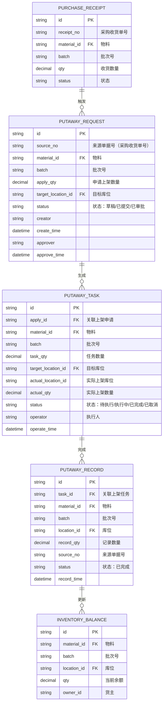
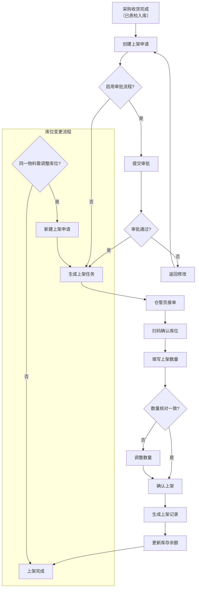

# 采购上架

## 模块概述

采购上架是 WMS 库房管理中连接采购收货与库存存储的核心环节。当采购物料完成收货、质检并确认合格后，系统生成待上架任务，由仓管员执行实际上架操作——扫码库位、确认物料、填入上架数量，最终将物料与库位关联、更新库存余额。

采购上架模块包含三个子功能：

| 功能 | 说明 |
|------|------|
| 上架申请 | 为待上架物料分配目标库位，支持新建和审批流程 |
| 上架任务 | 仓管员执行页面，扫码确认库位、填写上架数量 |
| 上架记录 | 已完成上架单据的查询列表，支持追溯和调整 |

## 领域模型

### 实体关系

### 关键聚合

- **上架申请聚合**：承载上游采购收货单的下达需求，控制审批流和库位分配策略
- **上架任务聚合**：现场执行单元，关联执行人与实际库位映射
- **上架记录聚合**：业务完结凭证，触发库存余额变更的事务记录

## 核心流程

### 上架全流程

### 流程说明

| 阶段 | 触发条件 | 执行动作 | 状态变更 |
|------|---------|---------|---------|
| 上架申请 | 采购收货单状态变为"已质检入库" | 仓管员填写目标库位，提交申请 | 草稿 → 已提交 → 已审批 |
| 上架任务 | 审批通过后自动生成 / 或直接生成 | 系统推送任务至仓管员待办 | 待执行 → 执行中 → 已完成 |
| 上架执行 | 仓管员在执行页面接单 | 扫码库位二维码、确认物料信息、填写实际上架数量 | 执行中 → 已完成 |
| 库位变更 | 同一物料需调整存放位置 | 新建上架申请（来源选择原采购单），走新流程 | 循环至新上架记录 |

## 字段说明

### 上架申请

| 字段名 | 中文名 | 类型 | 约束 | 影响业务 | 备注 |
|--------|--------|------|------|----------|------|
| apply_no | 上架申请单号 | string | 非空、唯一 | 生成任务时传递 | 系统自动编号 (待截图确认) |
| source_no | 来源单据号 | string | 非空 | 关联[采购收货](../03-采购收货/index.md)单 | 显示来源采购收货单号 (待截图确认) |
| material_id | 物料 | string | 非空 | 上架任务传递 | 显示物料编码和名称 (待截图确认) |
| material_name | 物料名称 | string | - | UI展示 | 由物料主数据带入 (待截图确认) |
| batch | 批次号 | string | 启用批次时非空 | 库存追溯 | 若启用批次管理则必填 (待截图确认) |
| apply_qty | 申请上架数量 | decimal | 非空、>0 | 任务数量上限 | 默认等于采购收货数量 (待截图确认) |
| target_location_id | 目标库位 | string | 非空 | 任务分配 | 仓管员选择目标库位 (待截图确认) |
| location_name | 库位名称 | string | - | UI展示 | 由库位主数据带入 (待截图确认) |
| status | 状态 | enum | 非空 | 审批和任务生成 | 草稿 / 已提交 / 已审批 / 已拒绝 (待截图确认) |
| approver | 审批人 | string | - | 审批记录 | 审批通过时记录用户名 (待截图确认) |
| approve_time | 审批时间 | datetime | - | 审批记录 | 审批通过时记录 (待截图确认) |
| creator | 创建人 | string | 非空 | 操作审计 | 创建时自动记录当前用户 (待截图确认) |
| create_time | 创建时间 | datetime | 非空 | 操作审计 | 创建时自动记录 (待截图确认) |
| remark | 备注 | string | - | 业务备注 | 可填写特殊说明 (待截图确认) |

### 上架任务

| 字段名 | 中文名 | 类型 | 约束 | 影响业务 | 备注 |
|--------|--------|------|------|----------|------|
| task_no | 上架任务编号 | string | 非空、唯一 | 任务追溯 | 系统自动编号 (待截图确认) |
| apply_no | 上架申请单号 | string | 非空 | 关联申请单 | 关联来源上架申请 (待截图确认) |
| material_id | 物料编码 | string | 非空 | 执行确认 | 与申请单一致 (待截图确认) |
| material_name | 物料名称 | string | - | UI展示 | 由物料主数据带入 (待截图确认) |
| batch | 批次号 | string | 启用批次时非空 | 库存追溯 | 与申请单一致 (待截图确认) |
| task_qty | 任务数量 | decimal | 非空、>0 | 执行参考 | 等于申请数量 (待截图确认) |
| target_location_id | 目标库位 | string | 非空 | 扫码预填 | 仓管员扫码后可修改 (待截图确认) |
| target_location_name | 目标库位名称 | string | - | UI展示 | 由库位主数据带入 (待截图确认) |
| actual_location_id | 实际上架库位 | string | 执行时非空 | 库存余额更新 | 扫码确认或手动选择 (待截图确认) |
| actual_location_name | 实际上架库位名称 | string | - | UI展示 | 由库位主数据带入 (待截图确认) |
| actual_qty | 实际上架数量 | decimal | 非空、>=0 | 库存余额变更量 | 可小于等于任务数量 (待截图确认) |
| status | 状态 | enum | 非空 | 任务分配 | 待执行 / 执行中 / 已完成 / 已取消 (待截图确认) |
| operator | 执行人 | string | 执行时非空 | 操作审计 | 执行时记录当前用户 (待截图确认) |
| operate_time | 执行时间 | datetime | 执行时非空 | 操作审计 | 执行完成时记录 (待截图确认) |
| remark | 备注 | string | - | 业务备注 | 可填写差异原因等 (待截图确认) |

### 上架记录

| 字段名 | 中文名 | 类型 | 约束 | 影响业务 | 备注 |
|--------|--------|------|------|----------|------|
| record_no | 上架记录编号 | string | 非空、唯一 | 记录追溯 | 系统自动编号 (待截图确认) |
| task_no | 上架任务编号 | string | 非空 | 关联任务 | 关联来源上架任务 (待截图确认) |
| material_id | 物料编码 | string | 非空 | 记录明细 | 与任务一致 (待截图确认) |
| material_name | 物料名称 | string | - | UI展示 | 由物料主数据带入 (待截图确认) |
| batch | 批次号 | string | 启用批次时非空 | 库存追溯 | 与任务一致 (待截图确认) |
| location_id | 上架库位 | string | 非空 | 库存余额更新 | 实际上架库位 (待截图确认) |
| location_name | 库位名称 | string | - | UI展示 | 由库位主数据带入 (待截图确认) |
| record_qty | 记录数量 | decimal | 非空 | 库存变更量 | 等于实际上架数量 (待截图确认) |
| source_no | 来源单据号 | string | 非空 | 单据追溯 | 来源采购收货单号 (待截图确认) |
| record_time | 记录时间 | datetime | 非空 | 操作审计 | 上架完成时自动记录 (待截图确认) |
| owner_id | 货主 | string | 非空 | 库存归属 | 继承采购收货单的货主 (待截图确认) |

## 业务规则

| 规则 | 说明 |
|------|------|
| 库位容量校验 | 上架后库位库存数量不能超过库位容量上限 |
| 批次一致性 | 同一上架任务内批次号必须一致 |
| 数量上限 | 实际上架数量不能大于任务数量 |
| 库位变更 | 支持同一物料重新上架到新库位，生成新的上架记录 |

## 相关模块接口

### 依赖模块

| 模块 | 接口方向 | 说明 |
|------|----------|------|
| WMS_RECEIVING | [采购收货](../03-采购收货/index.md) | 上架申请来源，获取收货数量和批次信息 |
| QMS_IQC | [来料检验](../../07-QMS-质量管理/02-来料检验/index.md) | 质检合格后触发上架任务 |
| DBC_MATERIAL | [物料主数据](../../04-DBC-主数据管理/01-物料管理/01-物料基本信息.md) | 获取物料存储属性和包装信息 |
| DBC_LOCATION | [库位管理](../../04-DBC-主数据管理/04-工厂建模/03-库位管理.md) | 库位容量、属性校验 |

### 被依赖模块

| 模块 | 接口方向 | 说明 |
|------|----------|------|
| WMS_INVENTORY | [库存管理](../09-库存管理/index.md) | 上架完成更新库存余额 |

## 接口规范

（待补充）

## 相关单据

| 单据 | 关系 |
|------|------|
| 采购收货单 | 上架的来源单据，完成质检后触发上架申请 |
| 库存余额 | 上架完成后更新余额，关联物料+批次+库位 |