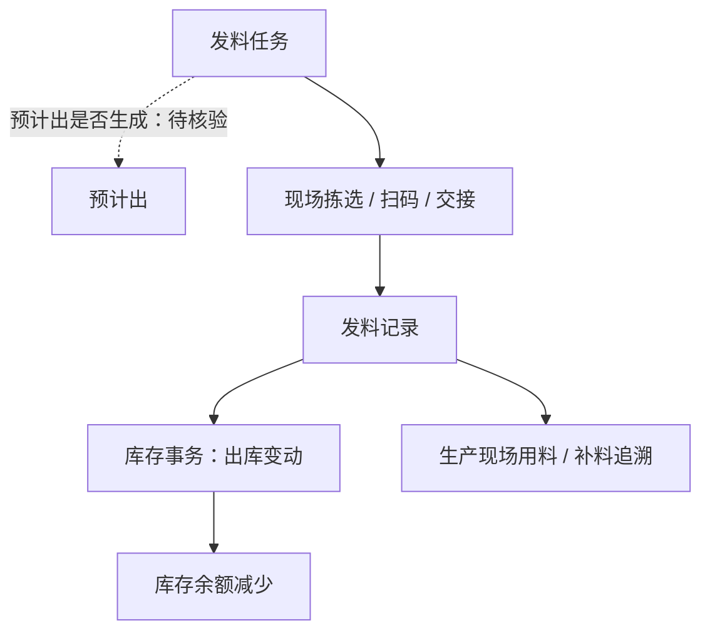

# 发料管理

> 适用基线：测试环境 / `dev` 分支 / 2026-07-15。
> 阅读对象：生产计划人员、仓库备料/发料人员、线边人员及需要追溯生产用料的业务人员。

## 业务目的与适用范围

发料管理把生产需求转化为仓库可执行的备料、发料和补料工作，使物料在正确时间、以正确数量和追溯维度进入生产现场。它连接生产计划或工单、库存可用量、现场扫码执行和生产用料记录，避免无来源、无记录的随意出库。

本页讲清生产用料的主线。具体页面、导入、列表、详情与快速跳转见[发料管理-维护与查询参考](发料管理-维护与查询参考.md)。

## 使用前准备

| 需要确认什么 | 为什么重要 |
| --- | --- |
| 生产需求、工单或备料计划 | 明确为什么要发、发给哪个生产对象。 |
| 物料、单位、计划数量和需求时间 | 用于核对发料范围与优先级。 |
| 可用库存、库位、批次和包装 | 决定从哪里拣出、是否满足追溯要求。 |
| 领用地点、产线或工位 | 决定物料实际去向和后续追溯。 |
| 高低储或补料规则 | 在适用场景下决定何时生成补料或备料建议。 |

!!! example "📷 截图占位"
    备料计划、发料任务或补料任务页面，标出需求来源、物料、数量、拣货库位、领用地点和状态。

## 生产用料如何完成

需求、任务和记录分别表达“为什么需要物料”“仓库要做什么”“实际上发了什么”。补料应沿用同一追溯原则：先确认原需求和实际缺口，再建立可追溯的补料工作。

!!! example "📝 示例数据占位"
    工单需领用 100 件物料，仓库先发 80 件、后补 20 件。展示备料、任务、发料记录、补料和库存变化。

## 关键判断、角色与动作

| 判断点 | 应先确认什么 | 对业务的影响 |
| --- | --- | --- |
| 是否应发料 | 需求来源、物料用途、数量和领用地点是否正确。 | 决定是否建立备料/发料工作。 |
| 从哪里发 | 可用库存、库位、批次/包装和库存状态。 | 决定实际拣选对象和可追溯性。 |
| 是否需要补料 | 已发数量、现场缺口和高低储/计划规则。 | 决定补料申请或任务是否建立。 |
| 是否可以完成 | 扫描、数量、批次、领用地点和交接是否一致。 | 决定是否形成正式发料记录和库存结果。 |

计划或生产人员通常提供需求，仓库人员执行拣选和发料，线边/生产人员负责接收或确认用料。任务分配、审批与动作权限需以实际配置为准。

### 关键字段业务角色

完整选择器与库存拣选范围见[维护与查询参考](发料管理-维护与查询参考.md)。发料是**出库拣选**主链；补料、生产退料为相邻入口，规则不可混用。余额选择与可用量通例见[通用选择器过滤惯例](../../02-业务模型/12-通用选择器过滤惯例.md)；仓/区/位级联见[库位与仓储级联惯例](../../02-业务模型/13-库位与仓储级联惯例.md)。

| 字段/配置点 | 在系统中的作用 | 关键行为要点（取值/范围/联动/门禁） | 维护或操作时要警惕什么 |
| --- | --- | --- | --- |
| 生产来源（工单/计划等） | 确定为何发、发给谁 | 须指向有效生产需求；可选范围受计划/工单状态约束（❓） | 选错来源导致线边错料 |
| 领用地点 / 产线 / 工位 | 物料去向 | 与工厂建模对象关联；变更后下游明细可能需重核（❓） | 发到错误工位 |
| 明细物料与计划数量 | 应发范围 | 来自需求明细；用途应为可生产/可发料等（❓） | 需求外物料不应随意加入 |
| 拣选库存余额 | 从哪一笔余额出库 | 按物料+库位+状态+批次/包装过滤；核验可用量，见[库存管理精度与唯一粒度](../../02-业务模型/08-库存管理精度与唯一粒度.md) | 状态不可用或粒度不符则“有数发不出” |
| 实发数量 | 实际出库量 | 少发/超发受任务配置；缺料应保留原因 | 强改数量掩盖缺口 |
| 申请/任务/记录状态 | 动作门禁 | 补料、生产退料另有独立 ATR，勿套用本链状态 | 非预期状态执行 |

## 库存与相关业务影响

发料记录应形成库存变动，并可回查到来源需求、执行任务和实际领用地点。发生少发、超发、错料、错批次或退料时，应走对应异常或退料业务，不应直接修改余额掩盖问题。

公共挂接规则见[库存数据挂接模型](../../02-业务模型/02-库存数据挂接模型.md)。本业务对预计出的创建与清理时点尚未按采购收货/销售出库同级取证，培训时不要把虚线路径当成已证实结论。

| 关联业务 | 应关注什么 |
| --- | --- |
| 生产计划/工单 | 发料是否匹配需求来源、时间和数量。 |
| 库存管理 | 拣选前后的可用量、批次/包装、库位和库存状态。 |
| 生产管理 | 物料是否到达正确产线、工位或线边地点。 |
| 生产收料/退料 | 生产结果、余料或异常物料如何继续处理。 |
| 终端操作 | 扫码、拣货、交接和现场异常处理的差异。 |

## 查询、详情与联查

| 想解决的问题 | 推荐定位方式 | 建议联查 |
| --- | --- | --- |
| 哪些物料待备料/待发料 | 工单、计划、发料任务状态、物料或需求日期。 | 备料计划、来源申请。 |
| 某物料为什么被领用 | 发料记录号、工单、物料或领用地点。 | 来源任务、生产对象。 |
| 实际发了多少 | 发料记录、批次/包装、数量和执行时间。 | 库存事务、库存余额。 |
| 为什么还需补料 | 原需求、已发数量、现场缺口和补料任务。 | 备料计划、高低储规则（如适用）。 |

### 详情分组与快速跳转

| 分组 | 应展示什么 | 可联查什么 |
| --- | --- | --- |
| 需求来源 | 工单/计划、领用地点、申请状态。 | 生产计划/工单、发料申请。 |
| 物料与数量 | 计划量、实发量、单位。 | 物料、BOM/备料需求。 |
| 拣选与交接 | 库位/批次/包装、扫描与交接。 | 库存余额、终端执行。 |
| 执行差异 | 少发/超发/错料原因。 | 补料任务、异常记录。 |
| 库存影响 | 出库事务与余额变化。 | 库存事务、库存余额。 |
| 系统信息 | 创建、更新与审计。 | — |

!!! example "📷 截图占位"
    发料申请/任务/记录详情分组与工单/库存联查；状态：待截图。

## 常见问题与处理

| 情况 | 建议处理 |
| --- | --- |
| 库存有数量但无法发料 | 核对库存状态、冻结、库位、批次/包装和任务分配条件。 |
| 领用数量与需求不一致 | 保留少发/超发原因，回查需求和现场实际，不要直接覆盖数量。 |
| 扫描物料或包装不匹配 | 停止执行，核对任务明细和追溯规则。 |
| 发料完成但生产侧查不到 | 先查发料记录和库存事务，再确认生产对象、接口或线边处理。 |

## 当前限制与待确认事项

- 高低储、自动备料、自动补料等策略的启用条件和默认规则尚需配置与测试验证；
- 发料、补料、退料的真实状态、审批主体和允许数量差异需补端到端场景；
- 批次、包装、序列号和 FIFO 等拣选规则不能只依据历史草稿，应由当前任务配置验证；
- Web/PDA/线边端的职责分工、离线或扫码异常处理需补实际素材。

## 待补充的图示与示例
| 类型 | 后续需要补充的内容 | 目的 |
| --- | --- | --- |
| 流程图 | 需求到备料、发料、补料和库存结果。 | 支持生产物流培训。 |
| 关系图 | 工单、任务、发料记录、库存和线边地点。 | 解释信息流与物流衔接。 |
| 终端截图 | 拣选、扫码、交接、补料和异常提示。 | 支持现场执行。 |
| 示例数据 | 正常发料、少发补料、扫码不匹配三类样例。 | 支持异常和追溯讲解。 |
