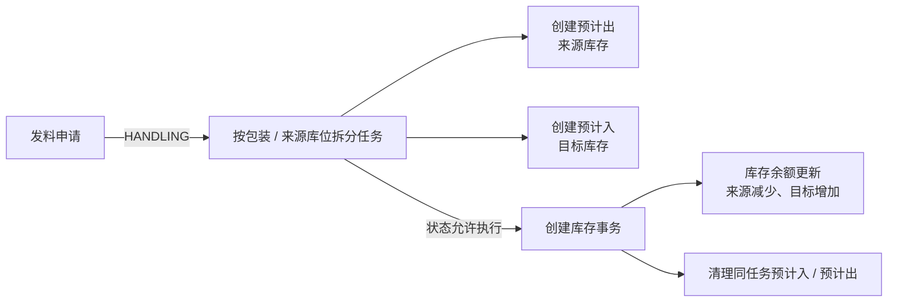

# 发料管理

## 概述

发料管理是 WMS 库房管理模块的核心业务子模块，负责生产投料环节的物料出库、备料计划、高低储预警及补料处理。发料管理连接 MES 生产执行与 WMS 库存管理，实现从工单释放到物料投料的全链路闭环。

发料管理涉及的核心业务实体包括：高低储规则、备料计划、发料申请单、发料任务、发料记录、补料申请单、补料任务、补料记录。

## BATCH-01 标准占位

> 状态：首轮占位，待基于 DDL、DO、DTO、前端页面、后端服务和测试环境继续核验。下方历史字段和流程说明未完成字段真实性校正前，不作为接口、导入或测试依据。

发料管理包含申请、任务、记录及补料类业务，应引用[申请、任务与记录模型](../../02-业务模型/01-申请任务记录模型.md)。本页后续只补发料、补料、备料和高低储特有的来源、字段、状态差异、库存影响、接口影响、终端入口和异常分支。

| 主题 | 当前占位 | 后续取证 |
| --- | --- | --- |
| 字段真实性 | 保留历史草稿，新增字段事实需待核验。 | 从 WMS DDL、DO、DTO、VO、前端配置校正真实字段名。 |
| 新增/编辑/导入 | 待补高低储、备料、发料、补料相关对象的维护规则。 | 前端表单、导入类、后端校验、测试环境。 |
| 列表与详情 | 待补默认列表字段、查询字段、详情分组和快速跳转。 | 前端列表配置、详情组件、用户关注字段。 |
| 动作与状态 | 待补备料生成、发料申请、任务执行、补料、撤销等动作前置条件。 | 前端按钮、后端服务、状态枚举/字典。 |
| 库存挂接 | 预计应影响预计出、库存事务和库存余额。 | 库存服务调用、事务类型、余额更新逻辑。 |
| 权限与日志 | 按 [RBAC 与动作权限取证模板](../../15-版本路线图/02-标准与方法/RBAC与动作权限取证模板.md) 逐项补。 | 菜单权限、按钮权限、接口权限、数据范围、操作日志。 |
| 终端操作 | 待补 PDA/线边端发料、扫码、投料、补料入口。 | 终端菜单、路由、扫码页面和接口。 |
| 图示与示例 | 保留流程图；待补工单发料、补料和库存扣减样例。 | 测试数据、服务规则、业务确认。 |

## 当前页面事实卡（第二轮源码已证实）

> 本节的“发料”指标准 `request_issue_*`、`job_issue_*`、`record_issue_*` 链路。计划外发料、委外发料、调拨发料等另有独立对象和页面，不能将本节规则直接套用。

### 实体与来源

发料申请、任务、记录分别使用 `request_issue_*`、`job_issue_*`、`record_issue_*` 主明细表，属于[申请、任务与记录模型](../../02-业务模型/01-申请任务记录模型.md)的双向库存移动场景。

| 对象 | 当前已证实字段 / 行为 | 说明 |
| --- | --- | --- |
| 发料申请主表 | `workshop_code`、`request_time`、`due_time`、`preparetoissue_plan_number`、`production_line_code`、`work_station_code`、`business_detail`。 | 可关联备料计划、生产线和工位，但本轮未确认这些关联在所有来源下均为必填。 |
| 发料申请明细 | 继承来源/目标库位、批次、包装、库存状态和数量等双向明细字段；另有 `unexecuted_qty`。 | `unexecuted_qty` 用于未执行数量，不应被历史草稿中的 `pickedQty` 等推导字段替代。 |
| 任务生成 | 在申请状态进入 `HANDLING` 时调用任务生成；支持按包装规格拆分，或按来源库位拆分。 | 创建任务前会以库存余额减预计出计算可用量；库存不足时会限制或提示，而不是无条件创建任务。 |
| 现场入口 | Web 有发料申请、任务、记录页面；PDA 有申请创建/扫描、任务、明细、扫码包装和记录页面。 | PDA 与 Web 的字段可编辑性、扫码校验和权限仍待逐项验证。 |

### 已证实的库存链路



1. 任务生成服务会创建预计入、预计出；生成预计出时显式将任务明细的 `fromBatchId`、`fromPackageNumber` 映射到预计出对象，说明发料预占按来源批次和包装粒度处理。
2. 可用量计算为库存余额合计减同范围预计出合计；源代码说明还会考虑合格库存、有效期与盘点冻结等条件，但其精确范围要以具体业务类型和测试环境为准。
3. 任务执行前通过 `JobStatusState.execute()` 校验状态；执行完成后创建发料记录、调用库存事务服务，并删除同任务号的预计入、预计出。
4. 库存事务写入后按统一规则更新库存余额；发料不能仅描述为“扣减库存”，因为实现同时维护来源与目标库存事实。

### 当前可见动作与权限取证边界

| 页面 | 当前前端动作 | 状态前置的已证实部分 |
| --- | --- | --- |
| 发料申请 | 关闭、重新添加、提交审批、驳回、审批通过、处理、编辑。 | Web 配置中提交仅对状态代码 `1` 显示；驳回/审批对 `2` 显示；处理对 `3` 显示。具体代码语义应以状态枚举和测试环境复核。 |
| 发料任务 | 执行、放弃、关闭、承接、调度等入口。 | 后端仅在任务状态机允许时执行；操作按钮的前端隐藏不能单独证明接口权限。 |
| 发料记录 | 查询、导出及记录层操作入口。 | 是否允许人工新增/修改、记录重放和撤销需继续按控制器和服务取证。 |

### 后续回填与历史草稿校正

1. 高低储、备料计划、补料存在源码入口，但尚未完成与标准发料链路的逐对象字段、触发时点和库存影响校正；本页不将它们写成标准发料的固定前置。
2. 下方草稿中的 `IssueApplication`、`IssueTask`、`materialCode`、`applicationNo` 等名称为早期推导，不是当前后端实体或字段技术名。后续字段表、导入模板、列表顺序和详情分组须从实际 VO 与前端配置回填。
3. 建议详情分为“申请与生产来源”“来源/目标库存”“任务执行与扫描”“记录与审计”四组，并提供备料计划、任务、记录、库存余额和库存事务的快速跳转；具体页面路由待 UI 取证后落地。

## 领域模型

```
┌─────────────────┐     ┌─────────────────┐     ┌─────────────────┐
│   高低储规则     │     │   备料计划      │     │   发料申请单     │
│ (StockLimitRule) │     │(MaterialPlan)   │     │(IssueApplication)│
├─────────────────┤     ├─────────────────┤     ├─────────────────┤
│ ruleId          │     │ planId          │     │ applicationId   │
│ materialCode    │────▶│ materialCode    │────▶│ applicationNo   │
│ locationId      │     │ workOrderId     │     │ planId(FK)      │
│ minQty          │     │ requiredQty     │     │ workOrderId     │
│ maxQty          │     │ planStatus      │     │ productionLineId│
│ enableMinAlert  │     │ plannedDate     │     │ applicantId     │
│ enableMaxAlert  │     │ BomVersion      │     │ applicationStatus│
│ alertEmail      │     └─────────────────┘     │ approvedBy      │
└─────────────────┘            │                └────────┬────────┘
       │                       │                         │
       │                       ▼                         ▼
       │              ┌─────────────────┐     ┌─────────────────┐
       │              │   发料任务      │     │   发料记录      │
       │              │  (IssueTask)   │     │  (IssueRecord) │
       │              ├─────────────────┤     ├─────────────────┤
       │              │ taskId          │     │ recordId        │
       │              │ applicationId   │────▶│ taskId(FK)      │
       │              │ materialCode    │     │ actualQty       │
       │              │ locationId      │     │ operatorId      │
       │              │ taskQty         │     │ issueTime       │
       │              │ pickedQty       │     │ scanCode        │
       │              │ taskStatus      │     │ sourceBatch     │
       │              │ productionLineId│     │ targetLocationId│
       │              │ workStationId  │     └─────────────────┘
       │              └───────┬─────────┘
       │                      │
       │                      ▼
       │              ┌─────────────────┐     ┌─────────────────┐
       │              │   补料任务      │     │   补料记录      │
       │              │ (ReplenishTask) │     │(ReplenishRecord)│
       │              ├─────────────────┤     ├─────────────────┤
       │              │ replenishTaskId │     │ recordId        │
       │              │ originalTaskId  │────▶│ replenishTaskId │
       │              │ materialCode    │     │ actualQty       │
       │              │ reason          │     │ operatorId      │
       │              │ requestQty      │     │ recordTime      │
       │              │ approvedQty     │     └─────────────────┘
       │              │ taskStatus      │
       └──────────────┴─────────────────┘
```

**实体说明**：

| 实体 | 中文名 | 说明 |
|------|--------|------|
| StockLimitRule | 高低储规则 | 物料+库位的库存上下限配置，触发预警 |
| MaterialPlan | 备料计划 | MES工单释放后基于BOM展开生成的备料需求 |
| IssueApplication | 发料申请单 | 仓管员确认备料需求后创建的发料申请 |
| IssueTask | 发料任务 | 执行发料的操作单元，按产线/工位拆分 |
| IssueRecord | 发料记录 | 物料出库的明细台账，扫码确认后生成 |
| ReplenishApplication | 补料申请单 | 工单损耗超预期触发的追加发料申请 |
| ReplenishTask | 补料任务 | 补料申请确认后创建的执行任务 |
| ReplenishRecord | 补料记录 | 补料出库的明细台账 |

**实体关联关系**：

```
高低储规则 ←→ 物料（多对一）
高低储规则 ←→ 库位（多对一）
备料计划 ←→ BOM版本（多对一）
备料计划 ←→ 工单（多对一）
发料申请单 ←→ 备料计划（一对一）
发料申请单 ←→ 工单（多对一）
发料任务 ←→ 发料申请单（多对一）
发料记录 ←→ 发料任务（多对一）
补料任务 ←→ 原始发料任务（多对一）
补料记录 ←→ 补料任务（多对一）
```

## 核心流程

### 业务流程总览

```
┌──────────┐    ┌──────────┐    ┌──────────┐    ┌──────────┐    ┌──────────┐
│ 高低储   │    │ 备料计划  │    │ 发料申请  │    │ 发料任务  │    │ 发料记录  │
│ 配置     │───▶│ 生成      │───▶│ 创建      │───▶│ 执行     │───▶│ 归档     │
└──────────┘    └──────────┘    └──────────┘    └──────────┘    └──────────┘
                                            │
                                            ▼
                                       ┌──────────┐
                                       │  补料    │
                                       │  流程    │
                                       └──────────┘
```

### 流程一：高低储配置

```
开始 → 配置物料+库位上下限阈值
     → 设置预警规则（邮件/系统通知）
     → 启用监控
     → 当库存低于最低阈值或高于最高阈值时
     → 触发库存预警通知
     → 结束
```

### 流程二：备料计划生成

```
开始 → MES工单释放
     → 系统自动获取工单BOM版本
     → BOM展开计算各层级物料需求量
     → 按物料+库位汇总备料需求
     → 生成备料计划单
     → 状态：待确认
     → 仓管员确认备料需求
     → 备料计划状态：已确认
     → 结束
```

### 流程三：发料申请与执行

```
开始 → 仓管员基于备料计划创建发料申请单
     → 关联工单、产线信息
     → 申请单状态：待审核
     → 主管审核通过
     → 申请单状态：已审核
     → 系统自动按产线/工位拆分发料任务
     → 仓管员领取发料任务
     → 按任务到库位拣货
     → 扫码确认物料（校验物料编码+批次）
     → 输入实发数量
     → 任务状态：已完成
     → 生成发料记录（库存扣减）
     → 结束
```

### 流程四：补料流程

```
开始 → 工单损耗超预期
     → 操作员发起补料申请
     → 关联原始发料记录/任务
     → 选择补料原因（物料不良/工艺损耗/人为失误/其他）
     → 填写申请数量
     → 补料申请单状态：待审核
     → 主管审核（可现场快速审核）
     → 申请单状态：已审核
     → 生成补料任务
     → 仓管员执行补料
     → 扫码确认出库
     → 生成补料记录
     → 补料任务状态：已完成
     → 结束
```

## 字段说明

### 高低储规则 (StockLimitRule)

| 字段名 | 中文名 | 类型 | 约束 | 影响业务 | 备注 |
|--------|--------|------|------|----------|------|
| ruleId | 规则ID | VARCHAR(36) | 主键 | 规则查询、修改、删除 | UUID格式 |
| materialCode | 物料编码 | VARCHAR(50) | 必填，外键 | 发料/备料时校验库存是否在阈值内 | 引用物料主数据 |
| materialName | 物料名称 | VARCHAR(200) | 只读 | 规则列表显示 | 根据materialCode带出 |
| locationId | 库位编码 | VARCHAR(50) | 必填，外键 | 按库位独立监控库存上下限 | 引用库位主数据 |
| locationName | 库位名称 | VARCHAR(100) | 只读 | 规则列表显示 | 根据locationId带出 |
| minQty | 最低库存 | DECIMAL(18,6) | 必填 | 库存低于此值触发低储预警 | 必须小于maxQty |
| maxQty | 最高库存 | DECIMAL(18,6) | 必填 | 库存高于此值触发高储预警 | 必须大于minQty |
| enableMinAlert | 启用低储预警 | BOOLEAN | 默认true | 关闭后不触发低储提醒 | 低储通常更紧急 |
| enableMaxAlert | 启用高储预警 | BOOLEAN | 默认false | 关闭后不触发高储提醒 | 高储占用资金 |
| alertEmail | 预警邮箱 | VARCHAR(200) | 非必填 | 触发预警时发送邮件通知 | 多个邮箱用分号分隔 |
| alertMobile | 预警手机 | VARCHAR(200) | 非必填 | 触发预警时发送短信通知 | 多个手机用分号分隔 |
| alertInterval | 预警间隔(分钟) | INT | 默认30 | 重复预警的最小时间间隔 | 避免预警风暴 |
| isEnabled | 是否启用 | BOOLEAN | 默认true | 关闭后该规则不参与库存监控 | 用于临时屏蔽某规则 |
| remark | 备注 | VARCHAR(500) | 非必填 | 规则补充说明 | |

### 备料计划 (MaterialPlan)

| 字段名 | 中文名 | 类型 | 约束 | 影响业务 | 备注 |
|--------|--------|------|------|----------|------|
| planId | 计划ID | VARCHAR(36) | 主键 | 计划查询、关联 | UUID格式 |
| planNo | 计划编号 | VARCHAR(50) | 唯一 | 计划唯一标识，用于追溯 | 格式：PL+年份+序号 |
| workOrderId | 工单ID | VARCHAR(36) | 必填，外键 | 关联MES工单 | 引用工单主数据 |
| workOrderNo | 工单编号 | VARCHAR(50) | 只读 | 计划列表显示 | 根据workOrderId带出 |
| bomVersionId | BOM版本ID | VARCHAR(36) | 必填，外键 | BOM展开的基准版本 | 引用BOM版本 |
| materialCode | 物料编码 | VARCHAR(50) | 必填，外键 | 备料物料 | 即工单产品物料编码 |
| materialName | 物料名称 | VARCHAR(200) | 只读 | 计划列表显示 | 根据materialCode带出 |
| planQty | 计划数量 | DECIMAL(18,6) | 必填 | 工单数量 | 即工单的计划生产数量 |
| requiredQty | 需求数量 | DECIMAL(18,6) | 必填 | BOM展开计算的物料总需求 | 考虑不良率损耗 |
| pickedQty | 已拣数量 | DECIMAL(18,6) | 默认0 | 已确认发料的物料数量 | 实时更新 |
| pendingQty | 待拣数量 | DECIMAL(18,6) | 只读 | requiredQty - pickedQty | 计划执行进度 |
| planStatus | 计划状态 | ENUM | 字典项 | 计划列表筛选、流程控制 | 待确认/已确认/已完成/已取消 |
| plannedDate | 计划日期 | DATE | 必填 | 备料完成的截止日期 | 通常为工单开工日前1天 |
| actualFinishDate | 实际完成日期 | DATETIME | 非必填 | 计划实际完成时间 | 最后一笔发料记录时间 |
| applicantId | 申请人 | VARCHAR(36) | 必填，外键 | 备料责任人 | 引用用户主数据 |
| applicantName | 申请人姓名 | VARCHAR(100) | 只读 | 计划列表显示 | 根据applicantId带出 |
| remark | 备注 | VARCHAR(500) | 非必填 | 计划补充说明 | |

### 发料申请单 (IssueApplication)

| 字段名 | 中文名 | 类型 | 约束 | 影响业务 | 备注 |
|--------|--------|------|------|----------|------|
| applicationId | 申请ID | VARCHAR(36) | 主键 | 申请查询、审核 | UUID格式 |
| applicationNo | 申请编号 | VARCHAR(50) | 唯一 | 申请单唯一标识 | 格式：SA+年份+序号 |
| planId | 备料计划ID | VARCHAR(36) | 非必填，外键 | 关联备料计划 | 可独立创建不依赖计划 |
| workOrderId | 工单ID | VARCHAR(36) | 必填，外键 | 关联MES工单 | 引用工单主数据 |
| workOrderNo | 工单编号 | VARCHAR(50) | 只读 | 申请列表显示 | 根据workOrderId带出 |
| productionLineId | 产线ID | VARCHAR(36) | 必填，外键 | 按产线发料 | 引用产线主数据 |
| productionLineName | 产线名称 | VARCHAR(100) | 只读 | 申请列表显示 | 根据productionLineId带出 |
| workStationId | 工位ID | VARCHAR(36) | 非必填，外键 | 精确到工位的发料 | 引用工位主数据 |
| applicantId | 申请人 | VARCHAR(36) | 必填，外键 | 发料申请人 | 仓管员 |
| applicantName | 申请人姓名 | VARCHAR(100) | 只读 | 申请列表显示 | 根据applicantId带出 |
| applicationStatus | 申请状态 | ENUM | 字典项 | 申请列表筛选、流程控制 | 待审核/已审核/已驳回/已关闭 |
| totalQty | 申请总量 | DECIMAL(18,6) | 只读 | 汇总的发料物料总量 | 系统自动汇总 |
| approvedBy | 审核人 | VARCHAR(36) | 非必填，外键 | 审核该申请的主管 | 引用用户主数据 |
| approvedTime | 审核时间 | DATETIME | 非必填 | 审核时间 | |
| rejectReason | 驳回原因 | VARCHAR(500) | 非必填 | 驳回时填写 | |
| scheduledDate | 计划发料日期 | DATE | 必填 | 安排的发料时间 | 用于排程参考 |
| remark | 备注 | VARCHAR(500) | 非必填 | 申请补充说明 | |

### 发料任务 (IssueTask)

| 字段名 | 中文名 | 类型 | 约束 | 影响业务 | 备注 |
|--------|--------|------|------|----------|------|
| taskId | 任务ID | VARCHAR(36) | 主键 | 任务查询、执行 | UUID格式 |
| taskNo | 任务编号 | VARCHAR(50) | 唯一 | 任务唯一标识 | 格式：ST+年份+序号 |
| applicationId | 申请ID | VARCHAR(36) | 必填，外键 | 关联发料申请单 | |
| materialCode | 物料编码 | VARCHAR(50) | 必填，外键 | 发料物料 | 引用物料主数据 |
| materialName | 物料名称 | VARCHAR(200) | 只读 | 任务列表显示 | 根据materialCode带出 |
| locationId | 库位编码 | VARCHAR(50) | 必填，外键 | 拣货库位 | 引用库位主数据 |
| locationName | 库位名称 | VARCHAR(100) | 只读 | 任务列表显示 | 根据locationId带出 |
| batchNo | 批次号 | VARCHAR(50) | 非必填 | 特定批次发料 | 如有批次要求则必填 |
| taskQty | 任务数量 | DECIMAL(18,6) | 必填 | 本次任务的发料数量 | |
| pickedQty | 已拣数量 | DECIMAL(18,6) | 默认0 | 实际拣货数量 | 可能小于taskQty |
| remainingQty | 剩余数量 | DECIMAL(18,6) | 只读 | taskQty - pickedQty | 待继续拣货 |
| taskStatus | 任务状态 | ENUM | 字典项 | 任务列表筛选、执行控制 | 待领取/已领取/进行中/已完成/已取消 |
| productionLineId | 产线ID | VARCHAR(36) | 必填，外键 | 发料目标产线 | 引用产线主数据 |
| productionLineName | 产线名称 | VARCHAR(100) | 只读 | 任务列表显示 | 根据productionLineId带出 |
| workStationId | 工位ID | VARCHAR(36) | 非必填，外键 | 发料目标工位 | 引用工位主数据 |
| workStationName | 工位名称 | VARCHAR(100) | 非必填 | 任务列表显示 | 根据workStationId带出 |
| assigneeId | 领取人 | VARCHAR(36) | 非必填，外键 | 领取任务的仓管员 | 引用用户主数据 |
| assigneeName | 领取人姓名 | VARCHAR(100) | 只读 | 任务列表显示 | 根据assigneeId带出 |
| pickupTime | 领取时间 | DATETIME | 非必填 | 任务被领取的时间 | |
| startTime | 开始时间 | DATETIME | 非必填 | 开始拣货时间 | 第一件物料扫码时间 |
| finishTime | 完成时间 | DATETIME | 非必填 | 任务完成时间 | 最后一笔记录时间 |
| remark | 备注 | VARCHAR(500) | 非必填 | 任务补充说明 | |

### 发料记录 (IssueRecord)

| 字段名 | 中文名 | 类型 | 约束 | 影响业务 | 备注 |
|--------|--------|------|------|----------|------|
| recordId | 记录ID | VARCHAR(36) | 主键 | 记录查询、追溯 | UUID格式 |
| recordNo | 记录编号 | VARCHAR(50) | 唯一 | 记录唯一标识 | 格式：SR+年份+序号 |
| taskId | 任务ID | VARCHAR(36) | 必填，外键 | 关联发料任务 | |
| taskNo | 任务编号 | VARCHAR(50) | 只读 | 记录列表追溯 | 根据taskId带出 |
| materialCode | 物料编码 | VARCHAR(50) | 必填，外键 | 出库物料 | 引用物料主数据 |
| materialName | 物料名称 | VARCHAR(200) | 只读 | 记录列表显示 | 根据materialCode带出 |
| locationId | 库位编码 | VARCHAR(50) | 必填，外键 | 出库库位 | 引用库位主数据 |
| locationName | 库位名称 | VARCHAR(100) | 只读 | 记录列表显示 | 根据locationId带出 |
| batchNo | 批次号 | VARCHAR(50) | 非必填 | 出库批次 | 扫码获取 |
| stockId | 库存ID | VARCHAR(36) | 必填，外键 | 关联库存记录 | 出库时扣减该库存 |
| actualQty | 实发数量 | DECIMAL(18,6) | 必填 | 实际出库数量 | |
| unit | 单位 | VARCHAR(10) | 只读 | 计量单位 | 根据物料带出 |
| operatorId | 操作人 | VARCHAR(36) | 必填，外键 | 执行出库操作 | 仓管员扫码确认 |
| operatorName | 操作人姓名 | VARCHAR(100) | 只读 | 记录列表显示 | 根据operatorId带出 |
| issueTime | 发料时间 | DATETIME | 必填 | 实际出库时间 | 系统自动记录 |
| scanCode | 扫码编码 | VARCHAR(100) | 非必填 | 物料标签二维码 | 扫码时记录 |
| targetLocationId | 目标工位 | VARCHAR(50) | 非必填 | 发料到位工位 | 用于齐套校验 |
| workOrderId | 工单ID | VARCHAR(36) | 必填，外键 | 物料消耗归属 | 引用工单主数据 |
| workOrderNo | 工单编号 | VARCHAR(50) | 只读 | 记录列表显示 | 根据workOrderId带出 |
| productionLineId | 产线ID | VARCHAR(36) | 必填，外键 | 物料消耗产线 | 引用产线主数据 |
| productionLineName | 产线名称 | VARCHAR(100) | 只读 | 记录列表显示 | 根据productionLineId带出 |
| remark | 备注 | VARCHAR(500) | 非必填 | 记录补充说明 | |

### 补料申请单 (ReplenishApplication)

| 字段名 | 中文名 | 类型 | 约束 | 影响业务 | 备注 |
|--------|--------|------|------|----------|------|
| applicationId | 申请ID | VARCHAR(36) | 主键 | 申请查询、审核 | UUID格式 |
| applicationNo | 申请编号 | VARCHAR(50) | 唯一 | 补料申请唯一标识 | 格式：RA+年份+序号 |
| originalTaskId | 原发料任务ID | VARCHAR(36) | 必填，外键 | 关联原始发料任务 | 用于追溯原发料情况 |
| originalTaskNo | 原任务编号 | VARCHAR(50) | 只读 | 申请列表追溯 | 根据originalTaskId带出 |
| workOrderId | 工单ID | VARCHAR(36) | 必填，外键 | 关联MES工单 | 引用工单主数据 |
| workOrderNo | 工单编号 | VARCHAR(50) | 只读 | 申请列表显示 | 根据workOrderId带出 |
| materialCode | 物料编码 | VARCHAR(50) | 必填，外键 | 补料物料 | 引用物料主数据 |
| materialName | 物料名称 | VARCHAR(200) | 只读 | 申请列表显示 | 根据materialCode带出 |
| originalIssueQty | 原发料数量 | DECIMAL(18,6) | 只读 | 原始发料的数量 | 作为补料参考 |
| requestQty | 申请数量 | DECIMAL(18,6) | 必填 | 本次申请补料的数量 | |
| reason | 补料原因 | ENUM | 字典项 | 补料原因统计、分析 | 物料不良/工艺损耗/人为失误/其他 |
| reasonDetail | 原因说明 | VARCHAR(500) | 非必填 | 补料原因详细描述 | |
| applicationStatus | 申请状态 | ENUM | 字典项 | 申请列表筛选、流程控制 | 待审核/已审核/已驳回/已关闭 |
| applicantId | 申请人 | VARCHAR(36) | 必填，外键 | 补料申请人 | 通常为产线操作员 |
| applicantName | 申请人姓名 | VARCHAR(100) | 只读 | 申请列表显示 | 根据applicantId带出 |
| applicantTime | 申请时间 | DATETIME | 必填 | 申请提交时间 | 系统自动记录 |
| approvedBy | 审核人 | VARCHAR(36) | 非必填，外键 | 审核该申请的主管 | 引用用户主数据 |
| approvedTime | 审核时间 | DATETIME | 非必填 | 审核时间 | |
| approvedQty | 审核数量 | DECIMAL(18,6) | 非必填 | 审核时批准的数量 | 可能小于申请数量 |
| rejectReason | 驳回原因 | VARCHAR(500) | 非必填 | 驳回时填写 | |
| remark | 备注 | VARCHAR(500) | 非必填 | 申请补充说明 | |

### 补料任务 (ReplenishTask)

| 字段名 | 中文名 | 类型 | 约束 | 影响业务 | 备注 |
|--------|--------|------|------|----------|------|
| taskId | 任务ID | VARCHAR(36) | 主键 | 任务查询、执行 | UUID格式 |
| taskNo | 任务编号 | VARCHAR(50) | 唯一 | 任务唯一标识 | 格式：RT+年份+序号 |
| applicationId | 申请ID | VARCHAR(36) | 必填，外键 | 关联补料申请单 | |
| materialCode | 物料编码 | VARCHAR(50) | 必填，外键 | 补料物料 | 引用物料主数据 |
| materialName | 物料名称 | VARCHAR(200) | 只读 | 任务列表显示 | 根据materialCode带出 |
| locationId | 库位编码 | VARCHAR(50) | 必填，外键 | 拣货库位 | 引用库位主数据 |
| locationName | 库位名称 | VARCHAR(100) | 只读 | 任务列表显示 | 根据locationId带出 |
| batchNo | 批次号 | VARCHAR(50) | 非必填 | 特定批次发料 | |
| requestQty | 申请数量 | DECIMAL(18,6) | 只读 | 申请单中的申请数量 | |
| approvedQty | 批准数量 | DECIMAL(18,6) | 必填 | 审核批准的补料数量 | 可能小于申请数量 |
| taskQty | 任务数量 | DECIMAL(18,6) | 只读 | 与approvedQty相同 | 系统同步 |
| pickedQty | 已拣数量 | DECIMAL(18,6) | 默认0 | 实际拣货数量 | |
| taskStatus | 任务状态 | ENUM | 字典项 | 任务列表筛选、执行控制 | 待领取/已领取/进行中/已完成/已取消 |
| productionLineId | 产线ID | VARCHAR(36) | 必填，外键 | 补料目标产线 | 引用产线主数据 |
| productionLineName | 产线名称 | VARCHAR(100) | 只读 | 任务列表显示 | 根据productionLineId带出 |
| workStationId | 工位ID | VARCHAR(36) | 非必填，外键 | 补料目标工位 | 引用工位主数据 |
| assigneeId | 领取人 | VARCHAR(36) | 非必填，外键 | 领取任务的仓管员 | 引用用户主数据 |
| assigneeName | 领取人姓名 | VARCHAR(100) | 只读 | 任务列表显示 | 根据assigneeId带出 |
| pickupTime | 领取时间 | DATETIME | 非必填 | 任务被领取的时间 | |
| finishTime | 完成时间 | DATETIME | 非必填 | 任务完成时间 | |
| remark | 备注 | VARCHAR(500) | 非必填 | 任务补充说明 | |

### 补料记录 (ReplenishRecord)

| 字段名 | 中文名 | 类型 | 约束 | 影响业务 | 备注 |
|--------|--------|------|------|----------|------|
| recordId | 记录ID | VARCHAR(36) | 主键 | 记录查询、追溯 | UUID格式 |
| recordNo | 记录编号 | VARCHAR(50) | 唯一 | 记录唯一标识 | 格式：RR+年份+序号 |
| taskId | 任务ID | VARCHAR(36) | 必填，外键 | 关联补料任务 | |
| taskNo | 任务编号 | VARCHAR(50) | 只读 | 记录列表追溯 | 根据taskId带出 |
| materialCode | 物料编码 | VARCHAR(50) | 必填，外键 | 出库物料 | 引用物料主数据 |
| materialName | 物料名称 | VARCHAR(200) | 只读 | 记录列表显示 | 根据materialCode带出 |
| locationId | 库位编码 | VARCHAR(50) | 必填，外键 | 出库库位 | 引用库位主数据 |
| locationName | 库位名称 | VARCHAR(100) | 只读 | 记录列表显示 | 根据locationId带出 |
| batchNo | 批次号 | VARCHAR(50) | 非必填 | 出库批次 | 扫码获取 |
| stockId | 库存ID | VARCHAR(36) | 必填，外键 | 关联库存记录 | 出库时扣减该库存 |
| actualQty | 实发数量 | DECIMAL(18,6) | 必填 | 实际出库数量 | |
| unit | 单位 | VARCHAR(10) | 只读 | 计量单位 | 根据物料带出 |
| operatorId | 操作人 | VARCHAR(36) | 必填，外键 | 执行出库操作 | 仓管员扫码确认 |
| operatorName | 操作人姓名 | VARCHAR(100) | 只读 | 记录列表显示 | 根据operatorId带出 |
| recordTime | 记录时间 | DATETIME | 必填 | 实际出库时间 | 系统自动记录 |
| scanCode | 扫码编码 | VARCHAR(100) | 非必填 | 物料标签二维码 | 扫码时记录 |
| workOrderId | 工单ID | VARCHAR(36) | 必填，外键 | 物料消耗归属 | 引用工单主数据 |
| productionLineId | 产线ID | VARCHAR(36) | 必填，外键 | 物料消耗产线 | 引用产线主数据 |
| originalIssueRecordId | 原发料记录ID | VARCHAR(36) | 非必填，外键 | 关联原发料记录 | 用于追溯完整链路 |
| remark | 备注 | VARCHAR(500) | 非必填 | 记录补充说明 | |

## 字段约束说明

| 约束类型 | 涉及字段 | 说明 |
|----------|----------|------|
| 字典项 | materialType（原材料/半成品/成品/辅料/包材）、planStatus（待确认/已确认/已完成/已取消）、applicationStatus（待审核/已审核/已驳回/已关闭）、taskStatus（待领取/已领取/进行中/已完成/已取消）、reason（物料不良/工艺损耗/人为失误/其他） |
| 数量校验 | minQty < maxQty（高低储规则）、taskQty >= pickedQty（发料任务）、approvedQty <= requestQty（补料申请） |
| 状态联动 | 备料计划状态变更后联动更新发料申请单可用性；发料任务完成后自动汇总到备料计划的pickedQty；补料任务完成后更新原发料任务的损耗统计 |
| 库存扣减 | 发料记录/补料记录确认时同步扣减关联库存数量（stockId）；批次管理时需校验批次可用性 |
| 追溯链路 | 补料申请必须关联originalTaskId；补料记录可选关联originalIssueRecordId形成完整追溯链 |

## 枚举值说明

### 计划状态 (planStatus)

| 枚举值 | 中文名 | 说明 |
|--------|--------|------|
| PENDING | 待确认 | 备料计划刚生成，等待仓管员确认 |
| CONFIRMED | 已确认 | 仓管员确认备料需求，可以开始发料 |
| COMPLETED | 已完成 | 所有物料已完成发料 |
| CANCELLED | 已取消 | 备料计划取消，不参与后续流程 |

### 申请状态 (applicationStatus)

| 枚举值 | 中文名 | 说明 |
|--------|--------|------|
| PENDING | 待审核 | 发料申请/补料申请提交，等待主管审核 |
| APPROVED | 已审核 | 审核通过，可以执行 |
| REJECTED | 已驳回 | 审核不通过，申请关闭 |
| CLOSED | 已关闭 | 申请已处理完成（无论成功与否） |

### 任务状态 (taskStatus)

| 枚举值 | 中文名 | 说明 |
|--------|--------|------|
| PENDING | 待领取 | 任务创建，等待仓管员领取 |
| ASSIGNED | 已领取 | 仓管员已领取任务，等待开始执行 |
| IN_PROGRESS | 进行中 | 仓管员正在执行拣货 |
| COMPLETED | 已完成 | 任务执行完毕 |
| CANCELLED | 已取消 | 任务取消 |

### 补料原因 (reason)

| 枚举值 | 中文名 | 说明 |
|--------|--------|------|
| MATERIAL_DEFECT | 物料不良 | 物料本身质量问题导致损耗 |
| PROCESS_LOSS | 工艺损耗 | 生产工艺导致的正常损耗 |
| HUMAN_ERROR | 人为失误 | 操作不当导致的损耗 |
| OTHER | 其他 | 其他原因导致的补料 |

## 相关模块接口

### 依赖模块

| 模块 | 接口方向 | 说明 |
|------|----------|------|
| MES_PLANNING | [计划管理](../../06-MES-生产管理/03-计划管理/index.md) | 生产工单驱动投料需求 |
| DBC_MATERIAL | [物料主数据](../../04-DBC-主数据管理/01-物料管理/01-物料基本信息.md) | 获取物料基础信息 |
| WMS_INVENTORY | [库存管理](../09-库存管理/index.md) | 检查库存可用量决定发料可行性 |
| WMS_PROD_RECEIVE | [生产收料](../07-生产收料/index.md) | 线边库库存管理 |

### 被依赖模块

| 模块 | 接口方向 | 说明 |
|------|----------|------|
| MES_PRODUCTION | [MES 生产管理](../../06-MES-生产管理/index.md) | 投料结果同步至 MES 工单执行 |
| SCP_PURCHASE | [采购供应链](../../10-SCP-供应链平台/index.md) | 补料数据作为采购需求参考 |

## 当前实现事实（BATCH-01 第二轮取证）

> 本节以 `dev` 分支 WMS 后端为准，优先于上方未完成字段真实性校正的历史描述。发料、补料、备料、委外发料和计划外发料不可混写为同一套字段或状态。

标准生产发料的核心对象位于 `issue` 服务域；补料（`repleinsh`）、备料（`preparetoissue`）和委外发料（`outissue`）是独立服务域。标准生产发料申请会从符合业务类型库区/库存状态条件的余额中推荐来源批次、库位和包装，生成任务及预计出；任务执行后创建库存事务并清理任务预计出。

| 环节 | 当前可证实的实现 |
| --- | --- |
| 来源推荐 | 申请服务按业务类型库存状态、库区/库区类型和需求数量查询余额，将来源批次、库位、包装写入任务明细。 |
| 预计出 | 任务明细生成后按任务号、来源库位、批次、包装等创建预计出，表示已分配未过账库存。 |
| 执行校验 | 任务和记录路径按物料、包装/父包装、批次、来源库位、库存状态查余额；找不到余额则终止。 |
| 过账 | 任务执行调用库存事务服务，随后按任务号清理预计出，并同步申请完成/部分完成状态。 |
| 补料联动 | 发料服务按低储补料配置、余额和预计入数量参与补料判断；不代表每次发料均生成补料。 |

### 列表、详情与图示样板

| 区域 | 当前建议 |
| --- | --- |
| 发料申请列表 | 单号、业务类型、工单/生产计划、物料摘要、需求数量、状态、来源推荐状态、更新时间。 |
| 发料任务列表 | 任务号、申请号、物料、来源库位/批次/包装、需求与处理数量、状态、执行人、预计出跳转。 |
| 发料记录列表 | 记录号、任务号、工单、物料、来源库存、处理数量、执行时间、库存事务跳转。 |
| 详情分组 | 需求来源、发料明细、来源库存与包装、预计出与分配、执行与库存事务、补料/接口/审计。 |


待继续核验：各子业务的菜单/字段/状态机，PDA/线边端扫码与部分完成/撤销，预计出覆盖与重算，以及 MES、ERP、SCP 回写和失败补偿。详见《产品差距总账》GAP-066。
