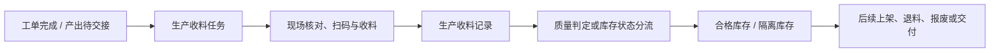

# 生产收料

> 适用基线：测试环境目标 / `dev` 分支 / 2026-07-15。
> 阅读对象：生产现场人员、仓库收料人员、质量协同人员及需要追溯完工入库的业务人员。

## 业务目的与适用范围

生产收料把产线完工的制品或半成品转化为可追溯的仓库收料结果。它连接工单完工、现场交接、质量分流和库存入账，使合格品、隔离品、退料或报废等不同去向不会混在同一库存结果中。

本页说明生产产出从工单到库存的业务主线。具体字段、状态、质量判定规则、生产退料与隔离退料的操作细节，需要在后续生产收料-维护与查询参考和测试环境中逐项验证。

## 使用前准备

| 需要确认什么 | 为什么重要 |
| --- | --- |
| 工单或生产来源 | 明确本次产出来自哪项生产工作。 |
| 物料、数量、单位和产出时间 | 核对实际产出是否与生产结果一致。 |
| 批次、包装和追溯信息 | 支持后续库存、质量和交付追溯。 |
| 收料库位和库存状态 | 决定产出进入合格、待检或隔离等何种范围。 |
| 质量处理结论 | 避免不合格或待确认产出误进入可用库存。 |

【截图占位：生产收料任务页面。标出工单来源、物料、数量、批次/包装、收料库位、库存状态和质量处理入口。】

## 一笔生产收料如何完成

生产收料任务表示仓库待完成的接收工作；收料记录保存实际结果。若质量结论或现场核对发现异常，应先进入隔离、退料或报废等路径，不能以正常收料记录替代异常处理。

【示例数据占位：工单完工 100 件，其中 96 件合格、4 件隔离。展示收料任务、记录、库存状态分流和后续处置。】

## 关键判断、角色与动作

| 判断点 | 应先确认什么 | 对业务的影响 |
| --- | --- | --- |
| 是否可收料 | 工单来源、产出物料、数量和现场交接是否正确。 | 决定是否承接收料任务。 |
| 收到何种状态 | 质量结论、待检/隔离要求和收料地点。 | 决定是否进入可用库存或隔离范围。 |
| 出现数量差异如何处理 | 完工数量、实收数量、批次/包装和异常原因。 | 决定保留差异、补收、退料或其它后续处理。 |
| 是否完成 | 收料记录、库存结果和质量去向是否齐全。 | 决定能否关闭本次任务。 |

生产人员负责提供产出与来源信息，仓库人员负责接收与扫描，质量人员负责需要质量分流的判定或协同。具体任务分配、审批和按钮权限由当前配置决定。

## 生产退料与隔离处理

生产收料并不只处理“正常完工入库”。发生规格不符、质量异常、剩余物料或隔离品处置时，系统还需要保留退料或隔离处理的来源、数量和去向。

| 场景 | 业务目标 | 需要继续确认 |
| --- | --- | --- |
| 生产退料 | 将不应继续留在仓库收料结果中的物料退回产线或其它明确去向。 | 适用条件、申请/任务/记录链路和库存影响。 |
| 隔离处理 | 将质量待确认或异常物料与可用库存隔离。 | 隔离库位、状态和后续检验/退料/报废规则。 |
| 报废处理 | 对无法继续使用的物料形成可追溯处置。 | 审批、责任、财务和库存冲抵要求。 |

## 库存与相关业务影响

生产收料记录应形成可追溯的库存变动，库存余额应按物料、地点、批次/包装和库存状态反映结果。合格、待检、隔离等状态的实际可用范围必须以质量和库存配置为准。

| 关联业务 | 应关注什么 |
| --- | --- |
| MES/工单 | 来源、完工数量和生产对象是否一致。 |
| 库存管理 | 收料后余额、地点、批次/包装、库存状态和事务记录。 |
| 质量管理 | 检验或判定是否决定可用、隔离或后续处置。 |
| 采购/生产退料 | 异常物料如何回退或转入其它流程。 |
| 终端操作 | 扫码、批次采集、数量输入和现场异常处理。 |

## 查询、详情与联查

| 想解决的问题 | 推荐定位方式 | 建议联查 |
| --- | --- | --- |
| 哪些产出待收料 | 工单、任务号、物料、产出日期或状态。 | 生产来源、任务明细。 |
| 实际收了多少、谁收的 | 收料记录号、工单、物料或执行人。 | 库存事务、库存余额。 |
| 为什么进入隔离 | 收料记录、库存状态、质量结论或异常原因。 | 检验/隔离处理、后续退料。 |
| 产出是否已入库 | 收料记录、库存事务、库存余额。 | 上架、质量或接口处理结果。 |

详情页建议按“生产来源、物料与数量、批次/包装、质量与状态、现场执行、库存影响、后续处理、系统信息”分组。

## 常见问题与处理

| 情况 | 建议处理 |
| --- | --- |
| 找不到待收料任务 | 核对工单完成状态、物料、产出地点和任务分配。 |
| 实收与完工数量不一致 | 保留差异原因，回查工单、批次/包装和现场实物。 |
| 收料后不能用于后续业务 | 检查库存状态、质量结论、上架或隔离要求。 |
| 隔离物料被误当合格品 | 停止后续使用，核对状态、地点和质量处理记录。 |

## 当前限制与待确认事项

- 工单完成后生成收料任务的时点、自动化策略和状态值需测试环境确认；
- 质量判定如何改变库存状态、是否自动生成隔离或后续任务需跨模块验证；
- 生产退料、隔离退料和报废的真实动作、审批与库存反向影响需补样例；
- PDA/线边端的扫码、批次/包装录入和异常提示需补实际截图。

## 图示、截图与示例任务

| 类型 | 后续需要补充的内容 | 目的 |
| --- | --- | --- |
| 流程图 | 工单完工到收料、质量分流、库存和后续处置。 | 讲清生产—仓储—质量协作。 |
| 状态图 | 收料任务、记录、隔离/退料分支。 | 说明何时可以执行什么动作。 |
| Web/PDA 截图 | 待收料、扫码、质量状态和异常处理。 | 支持现场培训。 |
| 示例数据 | 正常收料、数量差异、隔离品处置三类样例。 | 支持追溯与异常讲解。 |
