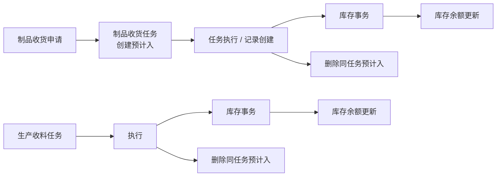
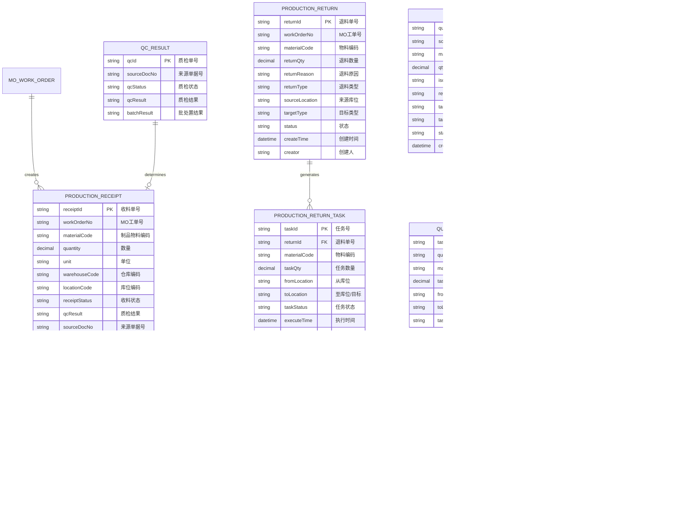
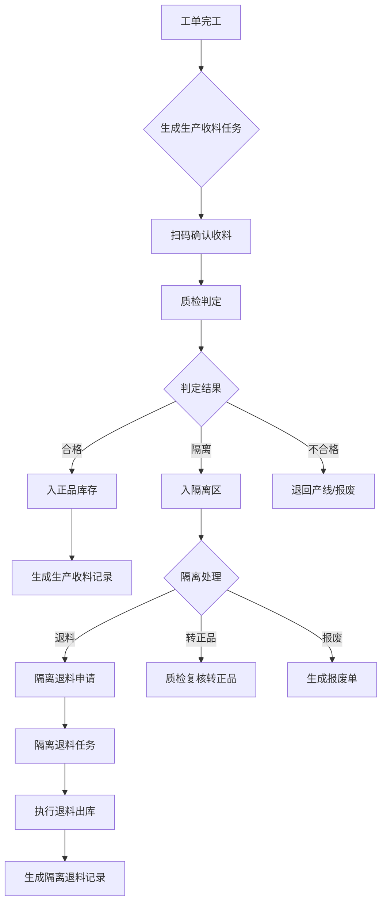
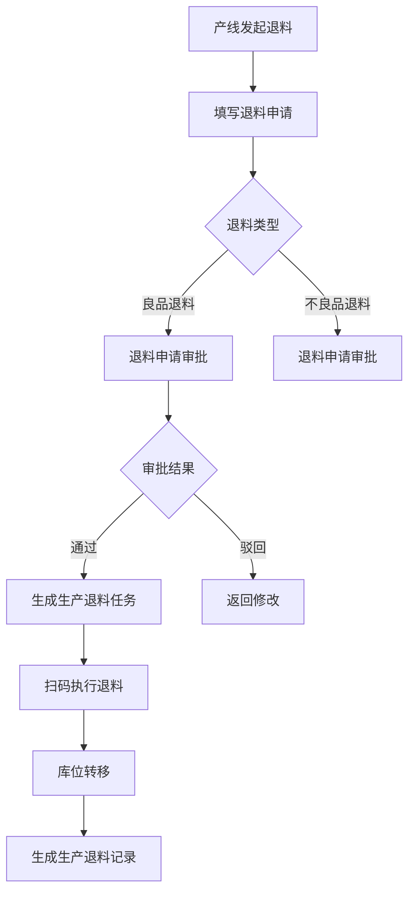
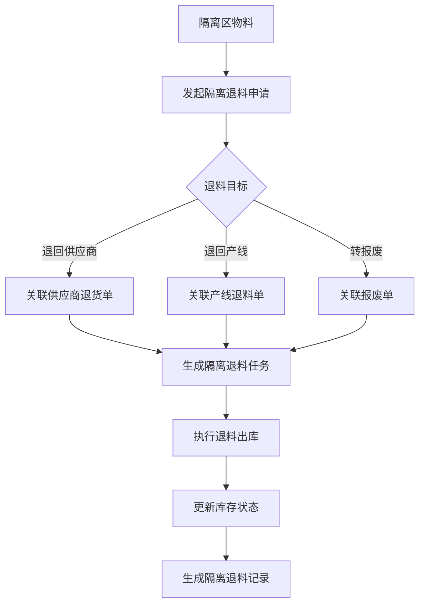
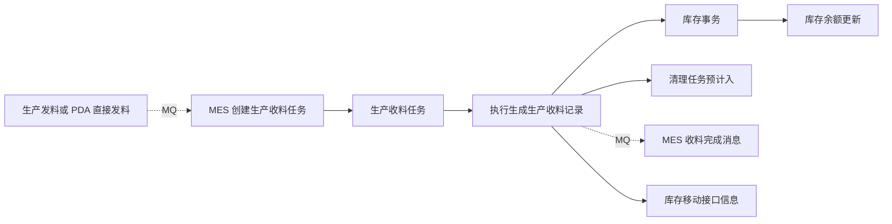

# 生产收料

## 概述

生产收料是 WMS 库房管理中连接生产与库存的核心业务模块，承担着制品从产线完工到仓库入库的质量分流职能。当工单完成生产后，制品通过生产收料任务送回仓库，经质量判定后分流至正品库存或隔离区。隔离区物料可选择退料（退回供应商或产线）或报废处理。

该模块与 MES 工单、WMS 库存、QMS 质量三大系统深度耦合，是离散制造业实现物流与信息流同步的关键节点。

## BATCH-01 标准占位

> 状态：首轮占位，待基于 DDL、DO、DTO、前端页面、后端服务和测试环境继续核验。下方历史字段和流程说明未完成字段真实性校正前，不作为接口、导入或测试依据。

生产收料包含任务、记录、生产退料和隔离退料等业务，应引用[申请、任务与记录模型](../../02-业务模型/01-申请任务记录模型.md)。本页后续只补生产收料特有的 MES 来源、QMS 分流、库存影响、终端入口和异常分支。

| 主题 | 当前占位 | 后续取证 |
| --- | --- | --- |
| 字段真实性 | 保留历史草稿，新增字段事实需待核验。 | 从 WMS DDL、DO、DTO、VO、前端配置校正真实字段名。 |
| 新增/编辑/导入 | 待补生产收料、退料、隔离退料对象的维护规则。 | 前端表单、导入类、后端校验、测试环境。 |
| 列表与详情 | 待补默认列表字段、查询字段、详情分组和快速跳转。 | 前端列表配置、详情组件、用户关注字段。 |
| 动作与状态 | 待补收料、质检分流、退料、报废、撤销等动作前置条件。 | 前端按钮、后端服务、状态枚举/字典。 |
| 库存挂接 | 预计应影响预计入、库存事务和库存余额；隔离/报废影响待核验。 | 库存服务调用、事务类型、余额更新逻辑。 |
| 权限与日志 | 按 RBAC 与动作权限取证模板 逐项补。 | 菜单权限、按钮权限、接口权限、数据范围、操作日志。 |
| 终端操作 | 待补 PDA/线边端收料、扫码、分流、退料入口。 | 终端菜单、路由、扫码页面和接口。 |
| 图示与示例 | 保留流程图；待补完工入库、隔离退料和库存过账样例。 | 测试数据、服务规则、业务确认。 |

## 当前页面事实卡（第二轮源码已证实）

### 当前页面存在两组相近但不可混写的实现

当前源码至少存在两条不同对象族：

| 对象族 | 主要对象 | 当前已证实边界 |
| --- | --- | --- |
| 制品收货 | `request_productreceipt_*`、`job_productreceipt_*`、`record_productreceipt_*` | 具备申请、任务、记录完整链路；申请生成任务时创建预计入；任务或记录完成时创建库存事务。 |
| 生产收料 | `job_productionreceipt_*`、`record_productionreceipt_*` | 当前可证实任务、记录和执行链路；服务中存在以发料任务为输入的处理分支。其与制品收货的业务分工、菜单映射及来源规则尚待确认。 |

因此，历史文档中用一个“生产收料”概念同时描述制品收货、完工入库、质量分流与退料，不足以反映当前实现；本页先按对象族保留边界，后续再按菜单和测试环境拆分页面或补充子章节。

### 已证实的库存挂接



1. 制品收货申请生成任务时调用预计入服务；制品收货任务执行前也由任务状态机校验状态。
2. 制品收货任务完成时，在未启用“库存移动确认”开关的分支中立即创建库存事务并删除预计入；记录服务创建记录时也创建库存事务。
3. 生产收料任务执行同样创建库存事务并删除同任务预计入；两条链路均通过统一库存事务服务更新余额。
4. 制品收货记录服务对 `NOK` 或 `HOLD` 库存状态存在“增加质量评审”分支。是否等同于“所有生产收料先质检、再分流”尚未证实，不能写成统一流程。

### 终端与跨模块事实

| 范围 | 已证实内容 | 待核验内容 |
| --- | --- | --- |
| PDA | 存在 `productReceipt` 与 `productionReceipt` 两组任务/明细页面，并区分半成品、成品、报废、完工接收等终端入口。 | 各入口对应的对象族、状态、扫码规则与权限。 |
| 发料关联 | 生产收料服务中存在以发料任务作为输入的执行分支；发料服务也存在创建生产收料任务的代码路径。 | 触发条件、消息可靠性、失败补偿及与 MES 工单的确切关联键。 |
| QMS / 质量 | 制品收货记录对 `NOK`、`HOLD` 状态有质量评审处理分支。 | QMS 检验任务的创建、回写和最终库存状态决策。 |
| 退料 / 隔离退料 | 源码存在独立 `productionreturn_*` 申请/任务/记录模型和 PDA 页面。 | 与本页的具体入口、库存方向、隔离与报废的状态规则。 |

### 历史草稿校正与后续任务

下方 `PRODUCTION_RECEIPT`、`MO_WORK_ORDER`、`qcResult`、`qualifiedQty` 等字段及“工单完成后先质检、统一分流”的流程为早期推导，尚未完成字段真实性校正。后续必须分别回填制品收货、生产收料、生产退料和隔离退料的真实 DO/VO、状态机、导入与终端规则；在完成前，不得将它们汇总为单一业务模型。

## 菜单结构

```
生产收料
  ├─ 生产收料任务         # 制品完工送回仓库的待处理任务
  ├─ 生产收料记录         # 已完成入库的收料单据列表
  ├─ 生产退料
  │   ├─ 生产退料申请     # 退料原因登记与审批
  │   ├─ 生产退料任务     # 退料执行任务
  │   └─ 生产退料记录     # 已完成退料的单据列表
  └─ 隔离退料
      ├─ 隔离退料申请     # 隔离区物料退料申请
      ├─ 隔离退料任务     # 隔离退料执行任务
      └─ 隔离退料记录     # 已完成隔离退料的单据列表
```

## 领域模型

### ER 图



### 核心实体说明

| 实体 | 中文名 | 说明 |
|------|--------|------|
| PRODUCTION_RECEIPT | 生产收料单 | 工单完工制品送回仓库的收料单据，记录收料任务与执行结果 |
| PRODUCTION_RECEIPT_RECORD | 生产收料记录 | 已完成入库的正式记录，关联正品库存 |
| PRODUCTION_RETURN | 退料单 | 生产退料申请单，记录退料原因与目标 |
| PRODUCTION_RETURN_TASK | 退料任务 | 退料执行任务，对应实际库位转移 |
| QUARANTINE_RETURN | 隔离退料单 | 隔离区物料的退料申请单 |
| QUARANTINE_RETURN_TASK | 隔离退料任务 | 隔离退料执行任务 |
| INVENTORY | 库存 | 物料的库位库存实体，状态分正品/隔离/冻结 |
| QC_RESULT | 质检结果 | 质检判定结果，影响收料单的分流方向 |

## 核心流程

### 生产收料标准流程



### 生产退料流程



### 隔离退料流程



## 生产收料任务

### 功能说明

生产收料任务是制品从 MES 工单完工后送回仓库的待处理任务列表。仓管员通过扫码确认收料，系统根据质检结果自动分流至正品库存或隔离区。

### 字段说明

| 字段名 | 中文名 | 类型 | 约束 | 影响业务 | 备注 |
|--------|--------|------|------|----------|------|
| taskId | 任务号 | VARCHAR(50) | 必填 | 任务唯一标识 | 系统自动生成，格式PR-YYYYMMDD-XXXX |
| workOrderNo | MO工单号 | VARCHAR(50) | 必填 | 关联工单、计算成本、工单追溯 | MES工单编号，是收料任务的核心关联字段 |
| materialCode | 制品物料编码 | VARCHAR(50) | 必填 | 库存入库、成本归集 | 工单完工的制品物料编码 |
| materialName | 制品名称 | VARCHAR(200) | 必填 | 界面展示、报表 | 制品物料的名称 |
| quantity | 数量 | DECIMAL(18,6) | 必填 | 入库数量、入账成本 | 工单完工的实际数量 |
| unit | 单位 | VARCHAR(10) | 必填 | 计量、换算 | 物料的基本计量单位 |
| sourceLocation | 来源产线 | VARCHAR(50) | 必填 | 追溯来源、工序归集 | 制品完工的产线/车间 |
| targetWarehouse | 目标仓库 | VARCHAR(50) | 必填 | 库存入库库区判断 | 默认目标仓库，可按物料配置 |
| targetLocation | 目标库位 | VARCHAR(50) | 非必填 | 库存精确到位 | 可指定具体库位或按策略分配 |
| receiptStatus | 收料状态 | ENUM | 必填 | 任务筛选、进度跟踪 | 待收料/已收料/已取消 |
| qcResult | 质检结果 | ENUM | 必填 | 库存分流方向 | 合格/隔离/不合格 |
| batchNo | 批号 | VARCHAR(50) | 非必填 | 批次追溯、质量追踪 | 可按规则自动生成或手工指定 |
| receiptTime | 收料时间 | DATETIME | 非必填 | 库存账龄、入库时间 | 实际扫码收料的时间 |
| receiver | 收货人 | VARCHAR(50) | 非必填 | 责任追溯、操作审计 | 执行收料操作的仓管员 |
| remark | 备注 | VARCHAR(500) | 非必填 | 特殊说明 | 收料异常说明 |

### 业务规则

- 收料任务由 MES 工单完工自动触发生成
- 扫码确认时校验物料编码与工单是否匹配
- 质检结果为合格时自动入正品库存
- 质检结果为隔离时自动进入隔离库区
- 同一工单可分多次收料，但累计数量不可超过工单完工数量

## 生产收料记录

### 功能说明

生产收料记录是已完成入库的生产收料单据列表，作为库存变动的正式凭证，支持追溯查询与财务对账。

### 字段说明

| 字段名 | 中文名 | 类型 | 约束 | 影响业务 | 备注 |
|--------|--------|------|------|----------|------|
| recordId | 记录ID | VARCHAR(50) | 必填 | 记录唯一标识 | 系统自动生成，格式RCD-YYYYMMDD-XXXX |
| receiptId | 收料单号 | VARCHAR(50) | 必填 | 单据追溯、关联查询 | 来源生产收料任务编号 |
| workOrderNo | MO工单号 | VARCHAR(50) | 必填 | 工单追溯、成本归集 | 关联的MES工单编号 |
| materialCode | 物料编码 | VARCHAR(50) | 必填 | 库存主体、账务处理 | 实际入库的物料编码 |
| materialName | 物料名称 | VARCHAR(200) | 必填 | 界面展示 | 物料名称 |
| acceptedQty | 接收数量 | DECIMAL(18,6) | 必填 | 入库数量、入账成本 | 本次实际接收的数量 |
| qualifiedQty | 合格数量 | DECIMAL(18,6) | 必填 | 正品库存、成本计算 | 质检判定合格的数量 |
| unqualifiedQty | 不合格数量 | DECIMAL(18,6) | 非必填 | 不良品处理 | 质检判定不合格的数量 |
| locationCode | 入库库位 | VARCHAR(50) | 必填 | 库存定位 | 实际入库的库位编码 |
| lotNo | 批号 | VARCHAR(50) | 非必填 | 批次追溯 | 物料批次号 |
| storedTime | 入库时间 | DATETIME | 必填 | 库存账龄、报表取数 | 实际入库时间 |
| storeOperator | 入库操作员 | VARCHAR(50) | 非必填 | 责任追溯 | 执行入库操作的人员 |
| qcReportNo | 质检报告号 | VARCHAR(50) | 非必填 | 质量追溯 | 关联质检单据 |
| inventoryStatus | 库存状态 | ENUM | 必填 | 库存分类、可用性判断 | 正品/隔离/冻结 |

### 业务规则

- 收料记录由收料任务完成自动生成，不可手工创建
- 合格数量与接收数量相等时，库存状态为正品
- 存在不合格数量时，系统自动生成对应数量的隔离记录
- 记录生成后触发库存台账更新

## 生产退料

### 功能说明

生产退料是制品因质量异常、规格不符、剩余用料等原因从仓库退回产线的业务过程。退料需经过申请审批后执行，支持良品与不良品两种退料类型。

### 字段说明

#### 生产退料申请

| 字段名 | 中文名 | 类型 | 约束 | 影响业务 | 备注 |
|--------|--------|------|------|----------|------|
| returnId | 退料单号 | VARCHAR(50) | 必填 | 单据唯一标识 | 系统自动生成，格式SRT-YYYYMMDD-XXXX |
| workOrderNo | MO工单号 | VARCHAR(50) | 必填 | 工单关联、追溯 | 退料对应的工单编号 |
| materialCode | 物料编码 | VARCHAR(50) | 必填 | 退料物料、库存更新 | 需退料的物料编码 |
| materialName | 物料名称 | VARCHAR(200) | 必填 | 界面展示 | 物料名称 |
| returnQty | 退料数量 | DECIMAL(18,6) | 必填 | 退料规模、库存减少 | 本次申请退料的数量 |
| unit | 单位 | VARCHAR(10) | 必填 | 计量 | 物料单位 |
| returnType | 退料类型 | ENUM | 必填 | 流程分支、处理方式 | 良品退料/不良品退料 |
| returnReason | 退料原因 | VARCHAR(200) | 必填 | 原因分析、质量追溯 | 如：质量异常、规格不符、剩余用料 |
| sourceLocation | 来源库位 | VARCHAR(50) | 必填 | 库位定位、出库库位 | 退料从哪个库位出库 |
| targetType | 目标类型 | ENUM | 必填 | 退料去向 | 退回产线/退回供应商 |
| targetId | 目标ID | VARCHAR(50) | 条件必填 | 退料关联 | 当 targetType 为退回供应商时必填供应商ID |
| status | 状态 | ENUM | 必填 | 流程进度、审批判断 | 草稿/待审批/已审批/已驳回/已执行 |
| createTime | 创建时间 | DATETIME | 必填 | 时间追溯 | 申请创建时间 |
| creator | 创建人 | VARCHAR(50) | 必填 | 责任追溯 | 申请人 |
| approveTime | 审批时间 | DATETIME | 非必填 | 审批时效 | 审批通过/驳回时间 |
| approver | 审批人 | VARCHAR(50) | 非必填 | 责任追溯 | 审批人 |
| remark | 备注 | VARCHAR(500) | 非必填 | 特殊说明 | 退料补充说明 |

#### 生产退料任务

| 字段名 | 中文名 | 类型 | 约束 | 影响业务 | 备注 |
|--------|--------|------|------|----------|------|
| taskId | 任务号 | VARCHAR(50) | 必填 | 任务唯一标识 | 系统自动生成，格式SRT-TASK-XXXX |
| returnId | 退料单号 | VARCHAR(50) | 必填 | 任务关联 | 关联的退料申请单号 |
| materialCode | 物料编码 | VARCHAR(50) | 必填 | 物料识别 | 退料物料编码 |
| materialName | 物料名称 | VARCHAR(200) | 必填 | 界面展示 | 物料名称 |
| taskQty | 任务数量 | DECIMAL(18,6) | 必填 | 执行数量、库存减少 | 需执行退料的数量 |
| fromLocation | 从库位 | VARCHAR(50) | 必填 | 出库库位 | 退料从哪个库位出库 |
| toLocation | 至库位/目标 | VARCHAR(50) | 必填 | 退料目标 | 产线工位/供应商交货库位 |
| taskStatus | 任务状态 | ENUM | 必填 | 执行进度、状态筛选 | 待执行/执行中/已完成/已取消 |
| executeTime | 执行时间 | DATETIME | 非必填 | 时间追溯 | 实际执行时间 |
| executor | 执行人 | VARCHAR(50) | 非必填 | 责任追溯 | 执行人 |
| scanCode | 扫码校验 | VARCHAR(100) | 条件必填 | 防错校验 | 退料时需扫码校验物料一致性 |

#### 生产退料记录

| 字段名 | 中文名 | 类型 | 约束 | 影响业务 | 备注 |
|--------|--------|------|------|----------|------|
| recordId | 记录ID | VARCHAR(50) | 必填 | 记录唯一标识 | 系统自动生成，格式RRT-YYYYMMDD-XXXX |
| returnId | 退料单号 | VARCHAR(50) | 必填 | 单据追溯 | 关联退料申请单号 |
| taskId | 任务号 | VARCHAR(50) | 必填 | 任务追溯 | 关联退料任务号 |
| materialCode | 物料编码 | VARCHAR(50) | 必填 | 物料追溯 | 退料物料编码 |
| returnQty | 退料数量 | DECIMAL(18,6) | 必填 | 库存减少量 | 实际退料数量 |
| fromLocation | 从库位 | VARCHAR(50) | 必填 | 出库库位 | 原库位 |
| toLocation | 至库位/目标 | VARCHAR(50) | 必填 | 退料目标 | 实际退到目标 |
| returnTime | 退料时间 | DATETIME | 必填 | 时间追溯 | 实际退料完成时间 |
| executor | 执行人 | VARCHAR(50) | 必填 | 责任追溯 | 执行人 |
| targetType | 目标类型 | ENUM | 必填 | 去向分类 | 退回产线/退回供应商 |
| lotNo | 批号 | VARCHAR(50) | 非必填 | 批次追溯 | 物料批号 |

### 业务规则

- 退料数量不可超过来源库位的可用库存
- 良品退料需经过质量复检确认
- 不良品退料需关联质检报告
- 退料执行后库存立即更新，库存状态保持原值
- 退回供应商需生成对应的[采购退货](../04-采购退货/index.md)单据

## 隔离退料

### 功能说明

隔离退料是针对质检判定隔离的物料进行退库处理的操作。隔离区物料通常因质量异常、规格不符或来料问题被单独存放，需通过退料流程处理至其他去向。

### 字段说明

#### 隔离退料申请

| 字段名 | 中文名 | 类型 | 约束 | 影响业务 | 备注 |
|--------|--------|------|------|----------|------|
| quarantineReturnId | 隔离退料单号 | VARCHAR(50) | 必填 | 单据唯一标识 | 系统自动生成，格式QRT-YYYYMMDD-XXXX |
| sourceDocNo | 来源单据号 | VARCHAR(50) | 必填 | 追溯来源 | 关联的收料单号或质检单号 |
| materialCode | 物料编码 | VARCHAR(50) | 必填 | 物料识别 | 隔离物料编码 |
| materialName | 物料名称 | VARCHAR(200) | 必填 | 界面展示 | 物料名称 |
| qty | 数量 | DECIMAL(18,6) | 必填 | 退料规模 | 申请退料数量 |
| unit | 单位 | VARCHAR(10) | 必填 | 计量 | 物料单位 |
| isolationStatus | 隔离标识 | ENUM | 必填 | 隔离分类 | 来料隔离/在制隔离/成品隔离 |
| returnReason | 退料原因 | VARCHAR(200) | 必填 | 原因分析 | 如：来料不良、品质异常、规格不符 |
| targetType | 目标类型 | ENUM | 必填 | 退料去向 | 退回供应商/退回产线/转报废 |
| targetId | 目标ID | VARCHAR(50) | 条件必填 | 退料关联 | 供应商ID/产线ID，根据 targetType 必填 |
| status | 状态 | ENUM | 必填 | 流程进度 | 草稿/待审批/已审批/已驳回/已执行 |
| createTime | 创建时间 | DATETIME | 必填 | 时间追溯 | 申请创建时间 |
| creator | 创建人 | VARCHAR(50) | 必填 | 责任追溯 | 申请人 |
| approveTime | 审批时间 | DATETIME | 非必填 | 审批时效 | 审批通过/驳回时间 |
| approver | 审批人 | VARCHAR(50) | 非必填 | 责任追溯 | 审批人 |
| qcReportNo | 质检报告号 | VARCHAR(50) | 非必填 | 质量追溯 | 关联质检报告 |
| remark | 备注 | VARCHAR(500) | 非必填 | 特殊说明 | 退料补充说明 |

#### 隔离退料任务

| 字段名 | 中文名 | 类型 | 约束 | 影响业务 | 备注 |
|--------|--------|------|------|----------|------|
| taskId | 任务号 | VARCHAR(50) | 必填 | 任务唯一标识 | 系统自动生成，格式QRT-TASK-XXXX |
| quarantineReturnId | 隔离退料单号 | VARCHAR(50) | 必填 | 任务关联 | 关联的隔离退料申请单号 |
| materialCode | 物料编码 | VARCHAR(50) | 必填 | 物料识别 | 退料物料编码 |
| materialName | 物料名称 | VARCHAR(200) | 必填 | 界面展示 | 物料名称 |
| taskQty | 任务数量 | DECIMAL(18,6) | 必填 | 执行数量 | 需执行退料的数量 |
| fromLocation | 从库位 | VARCHAR(50) | 必填 | 出库库位 | 隔离库位 |
| toLocation | 至库位/目标 | VARCHAR(50) | 必填 | 退料目标 | 供应商库位/产线工位/报废区 |
| taskStatus | 任务状态 | ENUM | 必填 | 执行进度 | 待执行/执行中/已完成/已取消 |
| lotNo | 批号 | VARCHAR(50) | 非必填 | 批次追溯 | 物料批号 |
| executeTime | 执行时间 | DATETIME | 非必填 | 时间追溯 | 实际执行时间 |
| executor | 执行人 | VARCHAR(50) | 非必填 | 责任追溯 | 执行人 |
| scanCode | 扫码校验 | VARCHAR(100) | 条件必填 | 防错校验 | 退料时需扫码校验物料一致性 |

#### 隔离退料记录

| 字段名 | 中文名 | 类型 | 约束 | 影响业务 | 备注 |
|--------|--------|------|------|----------|------|
| recordId | 记录ID | VARCHAR(50) | 必填 | 记录唯一标识 | 系统自动生成，格式QRR-YYYYMMDD-XXXX |
| quarantineReturnId | 隔离退料单号 | VARCHAR(50) | 必填 | 单据追溯 | 关联隔离退料申请单号 |
| taskId | 任务号 | VARCHAR(50) | 必填 | 任务追溯 | 关联隔离退料任务号 |
| materialCode | 物料编码 | VARCHAR(50) | 必填 | 物料追溯 | 退料物料编码 |
| qty | 退料数量 | DECIMAL(18,6) | 必填 | 库存减少量 | 实际退料数量 |
| fromLocation | 从库位 | VARCHAR(50) | 必填 | 出库库位 | 原隔离库位 |
| toLocation | 至库位/目标 | VARCHAR(50) | 必填 | 退料目标 | 实际退到目标 |
| targetType | 目标类型 | ENUM | 必填 | 去向分类 | 退回供应商/退回产线/转报废 |
| lotNo | 批号 | VARCHAR(50) | 非必填 | 批次追溯 | 物料批号 |
| returnTime | 退料时间 | DATETIME | 必填 | 时间追溯 | 实际退料完成时间 |
| executor | 执行人 | VARCHAR(50) | 必填 | 责任追溯 | 执行人 |
| relatedDocNo | 关联单据号 | VARCHAR(50) | 非必填 | 业务关联 | 生成的采购退货单号/报废单号 |

### 业务规则

- 隔离退料申请必须关联有效的隔离单据（收料单或质检单）
- 退料数量不可超过隔离库的可用库存
- 退回供应商时系统自动生成[采购退货](../04-采购退货/index.md)单并同步至供应商协同平台
- 转报废时系统自动生成报废单并更新库存台账
- 隔离退料完成后，库存状态从隔离更新为目标状态

## 关联关系

```
MES工单 ──完工触发──> 生产收料任务 ──扫码收料──> 生产收料记录
                                        │
                                        ├──合格──> 正品库存
                                        └──隔离──> 隔离库

隔离库 ──隔离退料申请──> 隔离退料任务 ──执行出库──> 隔离退料记录
                        │
                        ├──退回供应商──> 采购退货单
                        ├──退回产线──> 生产退料单
                        └──转报废──> 报废单

生产退料申请 ──审批通过──> 生产退料任务 ──执行出库──> 生产退料记录
```

## 状态流转

### 生产收料状态

```
待收料 --> 已收料
     └──> 已取消
```

### 生产退料状态

```
草稿 --> 待审批 --> 已审批 --> 已执行
  │         │
  │         └──> 已驳回
  └──> 已取消
```

### 隔离退料状态

```
草稿 --> 待审批 --> 已审批 --> 已执行
  │         │
  │         └──> 已驳回
  └──> 已取消
```

## 相关模块接口

### 依赖模块

| 模块 | 接口方向 | 说明 |
|------|----------|------|
| MES_PRODUCTION | [MES 生产管理](../../06-MES-生产管理/index.md) | 工单完工信号触发收料申请 |
| WMS_PROD_MGMT | [生产管理](../08-生产管理/index.md) | 隔离品进入返修/拆解子流程 |
| DBC_MATERIAL | [物料主数据](../../04-DBC-主数据管理/01-物料管理/01-物料基本信息.md) | 获取物料信息 |

### 被依赖模块

| 模块 | 接口方向 | 说明 |
|------|----------|------|
| WMS_PUTAWAY | [采购上架](../05-采购上架/index.md) | 合格品上架入库 |
| WMS_INVENTORY | [库存管理](../09-库存管理/index.md) | 收料完成后更新线边库/在检库存 |

## 当前实现事实（BATCH-01 第二轮取证）

> 本节以 `dev` 分支 WMS 后端为准，优先于上方未完成字段真实性校正的历史描述。当前已确认生产收料任务/记录与 MES 消息、预计入和库存事务存在挂接，但实际触发来源和质量分流需分支验证。

生产收料服务域包含任务、记录及 Redis MQ 协作服务。任务执行后会创建库存事务并按任务号清理预计入；生产发料执行或 PDA 直接发料可通过 MQ 向 MES 发送“创建生产收料任务”消息，生产收料任务完成后也会向 MES 发送完成消息。服务还会生成接口信息记录用于库存移动/外部处理。

| 环节 | 当前可证实的实现 |
| --- | --- |
| 任务来源 | WMS 发料执行或 PDA 直接发料可向 MES 发送创建生产收料任务消息；其它来源待核验。 |
| 预计入 | 生产收料任务执行完成后按任务号清理预计入，表明任务执行前存在关联预计入。创建预计入的具体调用点待继续定位。 |
| 过账 | 任务执行路径会创建库存事务，库存事务服务负责余额更新。 |
| MES 挂接 | 任务完成后通过 Redis MQ 调用 MES 的收料记录服务；消息失败、幂等与补偿需实测。 |
| 接口追踪 | 服务创建库存移动类接口信息，关联生产收料记录号和记录 ID。 |

### 列表、详情与图示样板

| 区域 | 当前建议 |
| --- | --- |
| 任务列表 | 任务号、来源发料/工单、物料摘要、数量、库存状态、状态、MES 消息状态、预计入跳转。 |
| 记录列表 | 记录号、任务号、物料、处理数量、库存状态、执行时间、库存事务、接口状态。 |
| 详情分组 | 来源与工单、收料明细与批次、库存状态/库位、预计入与库存事务、MES/接口消息、质量分流与审计。 |



待继续核验：任务创建预计入的完整路径、QMS 判定/隔离/合格分流、Web/PDA 状态按钮、上架后续链、接口失败补偿与权限。详见《产品差距总账》GAP-067。
