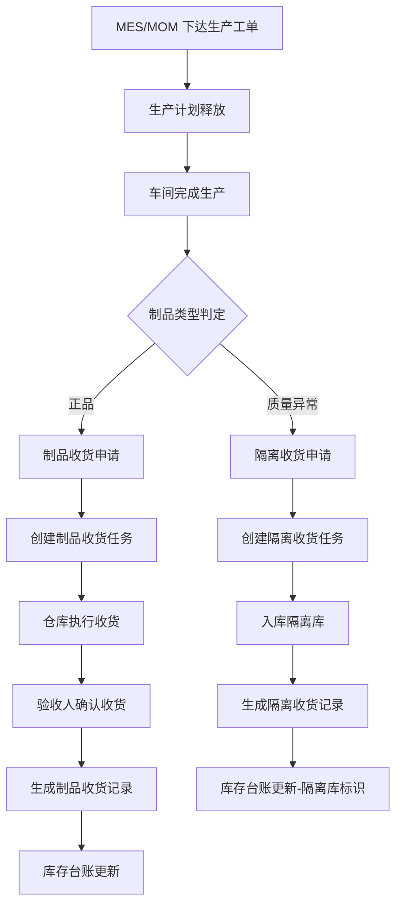
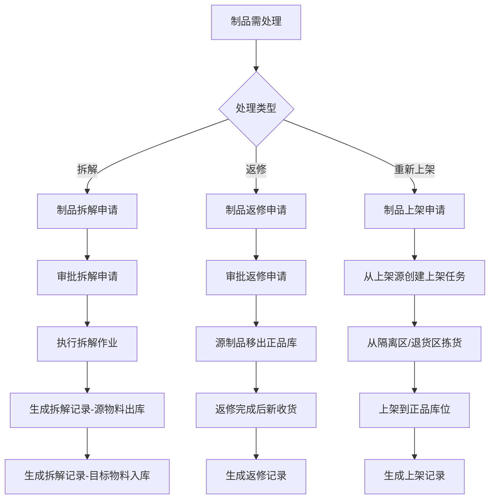
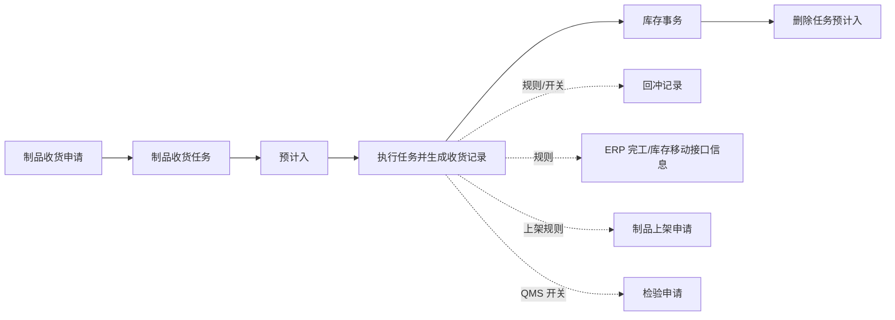

# 08-生产管理

> 第一阶段状态：本分组已建立学习导航和页面大纲；具体字段、状态、权限和测试截图按各叶页的后续任务补充。

## 这一组业务解决什么问题

汇总生产计划、制品收货、完工撤销、拆解、返修和上架等与仓储衔接的生产结果处理场景。

## 建议学习与操作顺序

| 顺序 | 建议先看什么 | 为什么 |
| --- | --- | --- |
| 1 | 本页的对象关系和边界 | 不同生产结果如何进入或回退库存。 |
| 2 | 本分组的主业务页或查询页 | 理解一笔典型业务如何开始、执行和结束。 |
| 3 | 对应的库存管理和终端操作页面 | 追溯库存结果，并理解 Web 与现场执行差异。 |

## 关键业务对象与关系

【图示占位：生产结果 → 收货/拆解/返修/上架 → 相关库存结果。需以业务对象表达，不使用表名、字段或服务调用；状态和分支待测试验证后补充。】

## 页面清单与写作状态

| 页面 | 文档形态 | 已说明内容 | 后续需补 |
| --- | --- | --- | --- |
| 本分组业务说明 | 一页完成或主文档 | 已建立业务定位、阅读路径和大纲。 | 按业务补典型流程、状态、异常、查询和截图。 |
| 详细参考（如适用） | 仅复杂高频页面拆分 | 采购收货已采用主文档 + 详细参考样板。 | 其它页面按复杂度决定是否拆分，不机械新增。 |
| 终端与库存追溯 | 关联说明 | 仅说明与本分组相关的执行入口和结果对象。 | 补扫码规则、查询过滤、状态验证和示例。 |

## 常见问题与相关分组

【待补充：说明本分组中最常见的“找不到任务、数量/地点不一致、完成后查不到结果、需要转后续处理”等问题，以及应转到哪个分组继续处理。】

## 图示、截图与示例任务

【图示占位：补充本分组从来源、任务、记录到库存或后续处理的业务流程/关系图。】

【截图占位：补充业务列表、详情、现场执行或异常提示页面；使用脱敏测试数据。】

【示例数据占位：补充一笔正常业务和一笔常见异常的脱敏样例，串联来源、执行、结果和查询。】
## 概述

生产管理模块承接 MES/MOM 下达的生产指令，负责管理车间完工制品的入库全流程。包括生产计划、制品收货（含正品/隔离）、完工撤销、制品拆解、制品返修、制品上架六大核心业务功能，覆盖从工单释放到成品入库的全生命周期管理。

## BATCH-01 标准占位

> 状态：首轮占位，待基于 DDL、DO、DTO、前端页面、后端服务和测试环境继续核验。下方历史字段和流程说明未完成字段真实性校正前，不作为接口、导入或测试依据。

生产管理包含生产计划、制品收货、完工撤销、拆解、返修、上架等库存相关业务，应引用[申请、任务与记录模型](../../02-业务模型/01-申请任务记录模型.md)。本页后续只补各子业务特有的来源、字段、状态差异、库存影响、接口影响、终端入口和异常分支。

| 主题 | 当前占位 | 后续取证 |
| --- | --- | --- |
| 字段真实性 | 保留历史草稿，新增字段事实需待核验。 | 从 WMS DDL、DO、DTO、VO、前端配置校正真实字段名。 |
| 新增/编辑/导入 | 待补生产计划、制品收货、拆解、返修、上架等对象的维护规则。 | 前端表单、导入类、后端校验、测试环境。 |
| 列表与详情 | 待补默认列表字段、查询字段、详情分组和快速跳转。 | 前端列表配置、详情组件、用户关注字段。 |
| 动作与状态 | 待补收货、撤销、拆解、返修、上架等动作前置条件。 | 前端按钮、后端服务、状态枚举/字典。 |
| 库存挂接 | 预计应影响预计入/预计出、库存事务和库存余额；不同子业务需拆开取证。 | 库存服务调用、事务类型、余额更新逻辑。 |
| 权限与日志 | 按 RBAC 与动作权限取证模板 逐项补。 | 菜单权限、按钮权限、接口权限、数据范围、操作日志。 |
| 终端操作 | 待补 PDA/线边端生产入库、拆解、返修和上架入口。 | 终端菜单、路由、扫码页面和接口。 |
| 图示与示例 | 保留流程图；待补制品入库、拆解、返修和库存过账样例。 | 测试数据、服务规则、业务确认。 |

## 当前事实卡（BATCH-01 首轮取证）

> 取证范围：`dev` 基线的 WMS DDL、后端服务、Web/PDA 目录和菜单。以下事实优先于本页历史 ER 图和流程草稿；未被本节确认的字段、状态、审批与质量规则仍为待核验内容。

### 实际对象族与边界

| 业务 | 已确认实现对象 | 当前可证实的库存关系 | 文档边界 |
| --- | --- | --- | --- |
| 制品收货 | `request_productreceipt_*`、`job_productreceipt_*`、`record_productreceipt_*` | 申请—任务—记录链路已在[生产收料](../07-生产收料/index.md)说明；记录创建库存事务并清理关联预计入。 | 本页仅保留其作为生产管理入口的关系，不重复定义收货字段和状态。 |
| 制品上架/隔离上架 | **复用** `request_putaway_*`、`job_putaway_*`、`record_putaway_*`；服务位于 `putaway/product` 与 `putaway/producthold`。 | 制品上架任务生成预计入与预计出；任务执行生成记录和双向库存事务，并清理同任务号的预计入/预计出。 | 历史图中的 `PRODUCT_PUTAWAY_*` 不能理解为独立数据库表族；应以共享上架对象和业务类型区分。 |
| 制品拆解 | `request_productdismantle_*`、`record_productdismantle_*`，且存在 BOM/明细 A、B 对象。 | 拆解申请与记录均有独立对象；记录服务接入库存事务服务。 | 需按源制品、拆出物料、BOM 明细及事务方向进一步取证，不能沿用“单源单目标”的历史字段模型。 |
| 制品返修 | `request_productrepair_*`、`record_productrepair_*`，并包含返修消耗明细对象。 | 申请、记录与消耗明细为独立实现；当前服务结构接入库存事务服务。 | 实际返修消耗、返修产出和质量状态处理尚未完成端到端核验。 |
| 完工撤销 | `request_productredress_*`、`job_productredress_*`、`record_productredress_*`。 | 任务执行生成撤销记录，之后按任务号清理预计入；服务覆写通用执行过程以避免错误使用采购收货的申请状态更新。 | 撤销原收货、事务方向、可撤销数量和 MES 回写规则待专项取证。 |

### 当前菜单与终端关联

- WMS 菜单中存在制品收货申请/任务/记录、制品上架申请/任务/记录，以及装配制品上架的对应入口；隔离收货、制品拆解、返修、完工撤销等入口还需逐条对照菜单状态与当前可见性。
- PDA 源码包含 `productReceipt`、`productionReceipt`、`productPutaway`、`productionReturn`、`productRecycle` 等多个目录。终端目录反映对象族的拆分，不应直接合并为单一“生产入库”流程。
- 制品上架的直接记录模式由业务类型配置控制；是否在当前环境启用、可由哪些角色执行，需通过测试环境和 RBAC 矩阵确认。

### 当前文档校正与下一轮取证

- 本页历史 ER 图中的英文对象名、字段名及“生产计划必然下达收货申请”的连接关系尚未与 VO/DO/DDL 对齐，不能用于导入模板、接口或测试用例。
- 下一轮优先补齐：制品上架的来源单据、源/目标库存字段、任务状态和终端扫码；其次补制品拆解、返修、完工撤销的实际交易方向与接口回写。
- 生产收料页面的 `productreceipt` 与 `productionreceipt` 对象混合问题仍以产品差距总账中的 GAP-041 为准，本页不做合并性结论。

## 领域模型

```mermaid
erDiagram
    PRODUCTION_PLAN {
        string workOrderNo "工单号"
        string materialCode "物料编码"
        decimal planQty "计划数量"
        string unit "单位"
        string status "状态"
        date startDate "开始日期"
        date endDate "结束日期"
        string workCenter "工作中心"
        string productionLine "产线"
    }

    PRODUCT_RECEIPT_REQUEST {
        string applicationNo "申请单号"
        string workOrderNo "工单号"
        string materialCode "物料编码"
        decimal applyQty "申请数量"
        string unit "单位"
        string warehouseCode "仓库编码"
        string status "状态"
        string applicant "申请人"
        date applyDate "申请日期"
    }

    PRODUCT_RECEIPT_TASK {
        string taskNo "任务编号"
        string applicationNo "申请单号"
        string materialCode "物料编码"
        decimal taskQty "任务数量"
        string targetLocation "目标库位"
        string assignee "执行人"
        string status "状态"
        date assignDate "分配日期"
    }

    PRODUCT_RECEIPT_RECORD {
        string receiptNo "收货单号"
        string applicationNo "申请单号"
        string taskNo "任务编号"
        string materialCode "物料编码"
        decimal receivedQty "收货数量"
        string lotNo "批次号"
        date receiptDate "收货日期"
        string warehouseCode "仓库编码"
        string locationCode "库位编码"
        string inspector "验收人"
        string status "状态"
    }

    COMPLETION_REVOKE {
        string revokeNo "撤销单号"
        string workOrderNo "工单号"
        string receiptNo "原收货单号"
        decimal revokeQty "撤销数量"
        string reason "撤销原因"
        date revokeDate "撤销日期"
        string applicant "申请人"
        string status "状态"
    }

    HOLD_RECEIPT_REQUEST {
        string applicationNo "申请单号"
        string workOrderNo "工单号"
        string materialCode "物料编码"
        decimal applyQty "申请数量"
        string reason "隔离原因"
        string isHold "是否隔离"
        string warehouseCode "目标仓库"
        string status "状态"
    }

    HOLD_RECEIPT_TASK {
        string taskNo "任务编号"
        string applicationNo "申请单号"
        string materialCode "物料编码"
        decimal taskQty "任务数量"
        string targetLocation "隔离库位"
        string assignee "执行人"
        string status "状态"
    }

    HOLD_RECEIPT_RECORD {
        string receiptNo "收货单号"
        string applicationNo "申请单号"
        string materialCode "物料编码"
        decimal receivedQty "收货数量"
        string lotNo "批次号"
        date receiptDate "收货日期"
        string warehouseCode "仓库编码"
        string locationCode "库位编码"
        string status "状态"
        string holdReason "隔离原因"
    }

    DISMANTLE_REQUEST {
        string applicationNo "申请单号"
        string sourceReceiptNo "源收货单号"
        string materialCode "物料编码"
        decimal applyQty "申请数量"
        string targetMaterialCode "目标物料编码"
        string status "状态"
        date applyDate "申请日期"
    }

    DISMANTLE_RECORD {
        string recordNo "记录编号"
        string applicationNo "申请单号"
        string sourceReceiptNo "源收货单号"
        string materialCode "源物料编码"
        decimal sourceQty "源数量"
        string targetMaterialCode "目标物料编码"
        decimal targetQty "目标数量"
        string warehouseCode "仓库编码"
        date dismantleDate "拆解日期"
        string status "状态"
    }

    REPAIR_REQUEST {
        string applicationNo "申请单号"
        string sourceReceiptNo "源收货单号"
        string materialCode "物料编码"
        decimal applyQty "返修数量"
        string reason "返修原因"
        string status "状态"
        date applyDate "申请日期"
    }

    REPAIR_RECORD {
        string recordNo "记录编号"
        string applicationNo "申请单号"
        string sourceReceiptNo "源收货单号"
        string materialCode "物料编码"
        decimal repairQty "返修数量"
        decimal newReceiptQty "新收货数量"
        string warehouseCode "仓库编码"
        date repairDate "返修日期"
        string status "状态"
    }

    PRODUCT_PUTAWAY_REQUEST {
        string applicationNo "申请单号"
        string sourceReceiptNo "源收货单号"
        string materialCode "物料编码"
        decimal applyQty "申请数量"
        string sourceWarehouse "源仓库"
        string targetWarehouse "目标仓库"
        string status "状态"
        date applyDate "申请日期"
    }

    PRODUCT_PUTAWAY_TASK {
        string taskNo "任务编号"
        string applicationNo "申请单号"
        string materialCode "物料编码"
        decimal taskQty "任务数量"
        string sourceLocation "源库位"
        string targetLocation "目标库位"
        string assignee "执行人"
        string status "状态"
    }

    PRODUCT_PUTAWAY_RECORD {
        string recordNo "记录编号"
        string applicationNo "申请单号"
        string taskNo "任务编号"
        string materialCode "物料编码"
        decimal shelfQty "上架数量"
        string lotNo "批次号"
        date shelfDate "上架日期"
        string warehouseCode "仓库编码"
        string locationCode "库位编码"
        string status "状态"
    }

    PRODUCTION_PLAN ||--o{ PRODUCT_RECEIPT_REQUEST : "下达"
    PRODUCT_RECEIPT_REQUEST ||--o{ PRODUCT_RECEIPT_TASK : "分配"
    PRODUCT_RECEIPT_REQUEST ||--o{ PRODUCT_RECEIPT_RECORD : "确认"
    COMPLETION_REVOKE ||--o{ PRODUCT_RECEIPT_RECORD : "冲销"
    HOLD_RECEIPT_REQUEST ||--o{ HOLD_RECEIPT_TASK : "分配"
    HOLD_RECEIPT_REQUEST ||--o{ HOLD_RECEIPT_RECORD : "确认"
    DISMANTLE_REQUEST ||--o{ DISMANTLE_RECORD : "执行"
    REPAIR_REQUEST ||--o{ REPAIR_RECORD : "执行"
    PRODUCT_PUTAWAY_REQUEST ||--o{ PRODUCT_PUTAWAY_TASK : "分配"
    PRODUCT_PUTAWAY_REQUEST ||--o{ PRODUCT_PUTAWAY_RECORD : "确认"
```

## 核心流程

### 8.1 制品收货流程

### 8.2 完工撤销流程

### 8.3 制品拆解/返修/上架流程

## 字段说明

### 8.1 生产计划

| 字段名 | 中文名 | 类型 | 约束 | 影响业务 | 备注 |
|--------|--------|------|------|----------|------|
| workOrderNo | 工单号 | VARCHAR(50) | 必填 | 制品收货/完工撤销/返修/拆解（工单唯一标识） | 工单在系统中的唯一身份标识 |
| materialCode | 物料编码 | VARCHAR(50) | 必填 | 制品收货（收货物料判定）、库存台账（入库物料） | 引用物料主数据 |
| planQty | 计划数量 | DECIMAL(18,6) | 必填 | 制品收货（收货上限控制）、完工率统计 | 工单下达时的计划生产数量 |
| unit | 单位 | VARCHAR(10) | 必填 | 数量统计、成本核算 | 工单计量单位 |
| status | 状态 | ENUM | 字典项 | 制品收货（下单状态才可收货）、[报表统计](../../06-MES-生产管理/05-报表统计/index.md) | 如：已释放、生产中、已完工、已关闭 |
| startDate | 开始日期 | DATE | 非必填 | 生产调度、齐套检查 | 工单计划开始日期 |
| endDate | 结束日期 | DATE | 非必填 | 生产调度、逾期预警 | 工单计划结束日期 |
| workCenter | 工作中心 | VARCHAR(50) | 非必填 | 报工、产能计算 | 引用工作中心主数据 |
| productionLine | 产线 | VARCHAR(50) | 非必填 | 报工、车间级统计 | 引用产线主数据 |

### 8.2 制品收货申请

| 字段名 | 中文名 | 类型 | 约束 | 影响业务 | 备注 |
|--------|--------|------|------|----------|------|
| applicationNo | 申请单号 | VARCHAR(50) | 必填 | 制品收货任务（关联申请单）、收货记录（追溯申请来源） | 申请单唯一标识，格式如：SC-YYYYMMDD-XXXX |
| workOrderNo | 工单号 | VARCHAR(50) | 必填 | 制品收货任务（工单追溯）、完工撤销（关联撤销） | 引用生产工单 |
| materialCode | 物料编码 | VARCHAR(50) | 必填 | 制品收货任务（物料信息）、库存台账（入库物料） | 引用物料主数据 |
| applyQty | 申请数量 | DECIMAL(18,6) | 必填 | 制品收货任务（任务数量上限）、库存预期 | 本次申请收货的数量 |
| unit | 单位 | VARCHAR(10) | 必填 | 数量展示、统计 | 计量单位 |
| warehouseCode | 仓库编码 | VARCHAR(50) | 必填 | 库存台账（入库仓库）、[报表统计](../../06-MES-生产管理/05-报表统计/index.md) | 目标仓库，引用仓库主数据 |
| status | 状态 | ENUM | 字典项 | 制品收货任务（只有生效状态才可分配任务） | 如：草稿、已提交、已分配、已完成、已取消 |
| applicant | 申请人 | VARCHAR(50) | 必填 | 审批流程、追溯 | 申请人用户编码 |
| applyDate | 申请日期 | DATE | 必填 | [报表统计](../../06-MES-生产管理/05-报表统计/index.md)、时效分析 | 申请日期 |

### 8.3 制品收货任务

| 字段名 | 中文名 | 类型 | 约束 | 影响业务 | 备注 |
|--------|--------|------|------|----------|------|
| taskNo | 任务编号 | VARCHAR(50) | 必填 | 制品收货记录（关联任务）、执行追溯 | 任务唯一标识，格式如：RCT-YYYYMMDD-XXXX |
| applicationNo | 申请单号 | VARCHAR(50) | 必填 | 制品收货记录（追溯申请来源） | 引用制品收货申请 |
| materialCode | 物料编码 | VARCHAR(50) | 必填 | 仓库作业（物料识别）、库存台账 | 引用物料主数据 |
| taskQty | 任务数量 | DECIMAL(18,6) | 必填 | 制品收货记录（收货数量上限控制） | 本次任务要求收货的数量 |
| targetLocation | 目标库位 | VARCHAR(50) | 必填 | 制品收货记录（默认入库库位） | 引用库位主数据 |
| assignee | 执行人 | VARCHAR(50) | 必填 | 任务指派、执行追溯 | 仓库作业员 |
| status | 状态 | ENUM | 字典项 | 仓库作业（待执行/执行中/已完成） | 如：待指派、待执行、执行中、已完成、已取消 |
| assignDate | 分配日期 | DATE | 必填 | 任务调度、时效统计 | 任务分配日期 |

### 8.4 制品收货记录

| 字段名 | 中文名 | 类型 | 约束 | 影响业务 | 备注 |
|--------|--------|------|------|----------|------|
| receiptNo | 收货单号 | VARCHAR(50) | 必填 | 完工撤销（关联原收货单）、库存台账（关联入库单据） | 收货单唯一标识，格式如：RC-YYYYMMDD-XXXX |
| applicationNo | 申请单号 | VARCHAR(50) | 必填 | 追溯申请来源、统计收货效率 | 引用制品收货申请 |
| taskNo | 任务编号 | VARCHAR(50) | 必填 | 追溯任务执行情况 | 引用制品收货任务 |
| materialCode | 物料编码 | VARCHAR(50) | 必填 | 库存台账（入库物料） | 引用物料主数据 |
| receivedQty | 收货数量 | DECIMAL(18,6) | 必填 | 库存台账（入库数量）、成本核算 | 实际收货数量 |
| lotNo | 批次号 | VARCHAR(50) | 非必填 | 库存台账（批次管理）、追溯查询 | 如无批次管理可不填 |
| receiptDate | 收货日期 | DATE | 必填 | 库存台账（入库时间）、[报表统计](../../06-MES-生产管理/05-报表统计/index.md) | 实际收货日期 |
| warehouseCode | 仓库编码 | VARCHAR(50) | 必填 | 库存台账（入库仓库） | 引用仓库主数据 |
| locationCode | 库位编码 | VARCHAR(50) | 必填 | 库存台账（入库库位） | 引用库位主数据 |
| inspector | 验收人 | VARCHAR(50) | 必填 | 质量追溯（验收责任人） | 质量验收人员 |
| status | 状态 | ENUM | 字典项 | 完工撤销（下单/部分收货状态才可撤销） | 如：已收货、已撤销、部分撤销 |

### 8.5 完工撤销记录

| 字段名 | 中文名 | 类型 | 约束 | 影响业务 | 备注 |
|--------|--------|------|------|----------|------|
| revokeNo | 撤销单号 | VARCHAR(50) | 必填 | 制品收货记录（关联撤销单）、[报表统计](../../06-MES-生产管理/05-报表统计/index.md) | 撤销单唯一标识，格式如：CRV-YYYYMMDD-XXXX |
| workOrderNo | 工单号 | VARCHAR(50) | 必填 | 工单状态更新（撤销后工单可重新下达）、追溯 | 引用原生产工单 |
| receiptNo | 原收货单号 | VARCHAR(50) | 必填 | 制品收货记录（状态更新为已撤销）、库存红冲 | 引用原制品收货记录 |
| revokeQty | 撤销数量 | DECIMAL(18,6) | 必填 | 库存台账（红字回冲数量）、成本核算 | 本次撤销的数量 |
| reason | 撤销原因 | VARCHAR(500) | 必填 | 审批判断、追溯分析 | 撤销原因说明 |
| revokeDate | 撤销日期 | DATE | 必填 | [报表统计](../../06-MES-生产管理/05-报表统计/index.md)、时效分析 | 实际撤销日期 |
| applicant | 申请人 | VARCHAR(50) | 必填 | 审批流程、追溯 | 申请人用户编码 |
| status | 状态 | ENUM | 字典项 | 工单状态更新、[报表统计](../../06-MES-生产管理/05-报表统计/index.md) | 如：已提交、已审批、已执行、已驳回 |

### 8.6 隔离收货申请

| 字段名 | 中文名 | 类型 | 约束 | 影响业务 | 备注 |
|--------|--------|------|------|----------|------|
| applicationNo | 申请单号 | VARCHAR(50) | 必填 | 隔离收货任务（关联申请）、隔离收货记录（追溯） | 申请单唯一标识，格式如：IC-YYYYMMDD-XXXX |
| workOrderNo | 工单号 | VARCHAR(50) | 必填 | 追溯来源工单 | 引用生产工单 |
| materialCode | 物料编码 | VARCHAR(50) | 必填 | 隔离收货任务、库存台账 | 引用物料主数据 |
| applyQty | 申请数量 | DECIMAL(18,6) | 必填 | 隔离收货任务（数量上限） | 本次申请隔离收货的数量 |
| reason | 隔离原因 | VARCHAR(500) | 必填 | 质量追溯、隔离库管理 | 如：来料不良、过程异常、客诉冻结 |
| isHold | 是否隔离 | BOOLEAN | 必填 | 库存台账（隔离标识）、报表筛选 | 标识进入隔离库 |
| warehouseCode | 目标仓库 | VARCHAR(50) | 必填 | 库存台账（入库仓库） | 隔离库仓库编码 |
| status | 状态 | ENUM | 字典项 | 隔离收货任务（生效才可分配任务） | 如：草稿、已提交、已分配、已完成、已取消 |

### 8.7 隔离收货任务

| 字段名 | 中文名 | 类型 | 约束 | 影响业务 | 备注 |
|--------|--------|------|------|----------|------|
| taskNo | 任务编号 | VARCHAR(50) | 必填 | 隔离收货记录（关联任务） | 任务唯一标识，格式如：ICT-YYYYMMDD-XXXX |
| applicationNo | 申请单号 | VARCHAR(50) | 必填 | 追溯申请来源 | 引用隔离收货申请 |
| materialCode | 物料编码 | VARCHAR(50) | 必填 | 仓库作业、库存台账 | 引用物料主数据 |
| taskQty | 任务数量 | DECIMAL(18,6) | 必填 | 隔离收货记录（收货数量上限） | 本次任务要求收货的数量 |
| targetLocation | 隔离库位 | VARCHAR(50) | 必填 | 隔离收货记录（入库库位） | 隔离区专用库位 |
| assignee | 执行人 | VARCHAR(50) | 必填 | 任务指派、执行追溯 | 仓库作业员 |
| status | 状态 | ENUM | 字典项 | 仓库作业调度 | 如：待指派、待执行、执行中、已完成、已取消 |

### 8.8 隔离收货记录

| 字段名 | 中文名 | 类型 | 约束 | 影响业务 | 备注 |
|--------|--------|------|------|----------|------|
| receiptNo | 收货单号 | VARCHAR(50) | 必填 | 制品上架（源单据）、库存台账 | 收货单唯一标识，格式如：ICR-YYYYMMDD-XXXX |
| applicationNo | 申请单号 | VARCHAR(50) | 必填 | 追溯申请来源 | 引用隔离收货申请 |
| materialCode | 物料编码 | VARCHAR(50) | 必填 | 库存台账（入库物料） | 引用物料主数据 |
| receivedQty | 收货数量 | DECIMAL(18,6) | 必填 | 库存台账（入库数量） | 实际收货数量 |
| lotNo | 批次号 | VARCHAR(50) | 非必填 | 批次追溯、[库存管理](../09-库存管理/index.md) | 批次号 |
| receiptDate | 收货日期 | DATE | 必填 | 库存台账（入库时间）、[报表统计](../../06-MES-生产管理/05-报表统计/index.md) | 实际收货日期 |
| warehouseCode | 仓库编码 | VARCHAR(50) | 必填 | 库存台账（入库仓库-隔离库） | 引用仓库主数据 |
| locationCode | 库位编码 | VARCHAR(50) | 必填 | 库存台账（入库库位） | 隔离区库位 |
| status | 状态 | ENUM | 字典项 | 制品上架（可上架状态才可申请上架） | 如：已收货、已上架、部分上架、已取消 |
| holdReason | 隔离原因 | VARCHAR(500) | 必填 | 质量追溯、隔离库统计 | 原隔离原因 |

### 8.9 制品拆解申请

| 字段名 | 中文名 | 类型 | 约束 | 影响业务 | 备注 |
|--------|--------|------|------|----------|------|
| applicationNo | 申请单号 | VARCHAR(50) | 必填 | 制品拆解记录（关联申请） | 申请单唯一标识，格式如：DC-YYYYMMDD-XXXX |
| sourceReceiptNo | 源收货单号 | VARCHAR(50) | 必填 | 制品拆解记录（源物料来源）、原收货单状态更新 | 引用制品收货记录 |
| materialCode | 物料编码 | VARCHAR(50) | 必填 | 制品拆解记录（源物料信息） | 引用物料主数据 |
| applyQty | 申请数量 | DECIMAL(18,6) | 必填 | 制品拆解记录（拆解数量控制） | 本次申请拆解的数量 |
| targetMaterialCode | 目标物料编码 | VARCHAR(50) | 必填 | 制品拆解记录（目标物料入库） | 拆解后生成的子物料编码 |
| status | 状态 | ENUM | 字典项 | 制品拆解记录（生效才可执行） | 如：草稿、已提交、已审批、已完成、已取消 |
| applyDate | 申请日期 | DATE | 必填 | [报表统计](../../06-MES-生产管理/05-报表统计/index.md)、时效分析 | 申请日期 |

### 8.10 制品拆解记录

| 字段名 | 中文名 | 类型 | 约束 | 影响业务 | 备注 |
|--------|--------|------|------|----------|------|
| recordNo | 记录编号 | VARCHAR(50) | 必填 | 追溯查询、[报表统计](../../06-MES-生产管理/05-报表统计/index.md) | 记录唯一标识，格式如：DCR-YYYYMMDD-XXXX |
| applicationNo | 申请单号 | VARCHAR(50) | 必填 | 追溯申请来源 | 引用制品拆解申请 |
| sourceReceiptNo | 源收货单号 | VARCHAR(50) | 必填 | 原收货单状态更新、库存出库 | 引用制品收货记录 |
| materialCode | 源物料编码 | VARCHAR(50) | 必填 | 库存台账（源物料出库） | 被拆解的物料 |
| sourceQty | 源数量 | DECIMAL(18,6) | 必填 | 库存台账（出库数量） | 拆解的源物料数量 |
| targetMaterialCode | 目标物料编码 | VARCHAR(50) | 必填 | 库存台账（目标物料入库） | 拆解后生成的子物料 |
| targetQty | 目标数量 | DECIMAL(18,6) | 必填 | 库存台账（入库数量） | 拆解后生成的子物料数量 |
| warehouseCode | 仓库编码 | VARCHAR(50) | 必填 | 库存台账（出库/入库仓库） | 引用仓库主数据 |
| dismantleDate | 拆解日期 | DATE | 必填 | [报表统计](../../06-MES-生产管理/05-报表统计/index.md)、追溯 | 实际拆解日期 |
| status | 状态 | ENUM | 字典项 | 库存台账更新、[报表统计](../../06-MES-生产管理/05-报表统计/index.md) | 如：已拆解、已取消 |

### 8.11 制品返修申请

| 字段名 | 中文名 | 类型 | 约束 | 影响业务 | 备注 |
|--------|--------|------|------|----------|------|
| applicationNo | 申请单号 | VARCHAR(50) | 必填 | 制品返修记录（关联申请） | 申请单唯一标识，格式如：RR-YYYYMMDD-XXXX |
| sourceReceiptNo | 源收货单号 | VARCHAR(50) | 必填 | 制品返修记录（源物料来源）、原收货单状态更新 | 引用制品收货记录 |
| materialCode | 物料编码 | VARCHAR(50) | 必填 | 制品返修记录（物料信息） | 引用物料主数据 |
| applyQty | 返修数量 | DECIMAL(18,6) | 必填 | 制品返修记录（返修数量控制） | 本次申请返修的数量 |
| reason | 返修原因 | VARCHAR(500) | 必填 | 审批判断、追溯分析 | 返修原因说明 |
| status | 状态 | ENUM | 字典项 | 制品返修记录（生效才可执行） | 如：草稿、已提交、已审批、返修中、已完成、已取消 |
| applyDate | 申请日期 | DATE | 必填 | [报表统计](../../06-MES-生产管理/05-报表统计/index.md)、时效分析 | 申请日期 |

### 8.12 制品返修记录

| 字段名 | 中文名 | 类型 | 约束 | 影响业务 | 备注 |
|--------|--------|------|------|----------|------|
| recordNo | 记录编号 | VARCHAR(50) | 必填 | 追溯查询、[报表统计](../../06-MES-生产管理/05-报表统计/index.md) | 记录唯一标识，格式如：RRR-YYYYMMDD-XXXX |
| applicationNo | 申请单号 | VARCHAR(50) | 必填 | 追溯申请来源 | 引用制品返修申请 |
| sourceReceiptNo | 源收货单号 | VARCHAR(50) | 必填 | 原收货单状态更新（标识返修中） | 引用制品收货记录 |
| materialCode | 物料编码 | VARCHAR(50) | 必填 | 新收货记录（物料信息） | 引用物料主数据 |
| repairQty | 返修数量 | DECIMAL(18,6) | 必填 | 原收货单状态更新、库存出库 | 移出正品库的返修数量 |
| newReceiptQty | 新收货数量 | DECIMAL(18,6) | 必填 | 库存台账（正品入库数量） | 返修完成后重新入库的数量 |
| warehouseCode | 仓库编码 | VARCHAR(50) | 必填 | 库存台账（正品入库仓库） | 返修后重新入库的仓库 |
| repairDate | 返修日期 | DATE | 必填 | [报表统计](../../06-MES-生产管理/05-报表统计/index.md)、追溯 | 返修完成日期 |
| status | 状态 | ENUM | 字典项 | 库存台账更新、[报表统计](../../06-MES-生产管理/05-报表统计/index.md) | 如：已受理、返修中、已收货、已完成 |

### 8.13 制品上架申请

| 字段名 | 中文名 | 类型 | 约束 | 影响业务 | 备注 |
|--------|--------|------|------|----------|------|
| applicationNo | 申请单号 | VARCHAR(50) | 必填 | 制品上架任务（关联申请）、制品上架记录（追溯） | 申请单唯一标识，格式如：SA-YYYYMMDD-XXXX |
| sourceReceiptNo | 源收货单号 | VARCHAR(50) | 必填 | 制品上架任务（源物料来源）、源单据状态更新 | 引用隔离收货记录或退货记录 |
| materialCode | 物料编码 | VARCHAR(50) | 必填 | 制品上架任务、库存台账 | 引用物料主数据 |
| applyQty | 申请数量 | DECIMAL(18,6) | 必填 | 制品上架任务（任务数量上限） | 本次申请上架的数量 |
| sourceWarehouse | 源仓库 | VARCHAR(50) | 必填 | 制品上架任务（拣货源） | 隔离库或退货仓 |
| targetWarehouse | 目标仓库 | VARCHAR(50) | 必填 | 制品上架任务（上架目标）、库存台账 | 正品仓库 |
| status | 状态 | ENUM | 字典项 | 制品上架任务（生效才可分配任务） | 如：草稿、已提交、已分配、已完成、已取消 |
| applyDate | 申请日期 | DATE | 必填 | [报表统计](../../06-MES-生产管理/05-报表统计/index.md)、时效分析 | 申请日期 |

### 8.14 制品上架任务

| 字段名 | 中文名 | 类型 | 约束 | 影响业务 | 备注 |
|--------|--------|------|------|----------|------|
| taskNo | 任务编号 | VARCHAR(50) | 必填 | 制品上架记录（关联任务） | 任务唯一标识，格式如：SAT-YYYYMMDD-XXXX |
| applicationNo | 申请单号 | VARCHAR(50) | 必填 | 追溯申请来源 | 引用制品上架申请 |
| materialCode | 物料编码 | VARCHAR(50) | 必填 | 仓库作业、库存台账 | 引用物料主数据 |
| taskQty | 任务数量 | DECIMAL(18,6) | 必填 | 制品上架记录（上架数量上限） | 本次任务要求上架的数量 |
| sourceLocation | 源库位 | VARCHAR(50) | 必填 | 仓库作业（拣货库位） | 隔离区/退货区库位 |
| targetLocation | 目标库位 | VARCHAR(50) | 必填 | 制品上架记录（入库库位） | 正品库位 |
| assignee | 执行人 | VARCHAR(50) | 必填 | 任务指派、执行追溯 | 仓库作业员 |
| status | 状态 | ENUM | 字典项 | 仓库作业调度 | 如：待指派、待执行、执行中、已完成、已取消 |

### 8.15 制品上架记录

| 字段名 | 中文名 | 类型 | 约束 | 影响业务 | 备注 |
|--------|--------|------|------|----------|------|
| recordNo | 记录编号 | VARCHAR(50) | 必填 | 追溯查询、[报表统计](../../06-MES-生产管理/05-报表统计/index.md) | 记录唯一标识，格式如：SAR-YYYYMMDD-XXXX |
| applicationNo | 申请单号 | VARCHAR(50) | 必填 | 追溯申请来源 | 引用制品上架申请 |
| taskNo | 任务编号 | VARCHAR(50) | 必填 | 追溯任务执行情况 | 引用制品上架任务 |
| materialCode | 物料编码 | VARCHAR(50) | 必填 | 库存台账（入库物料） | 引用物料主数据 |
| shelfQty | 上架数量 | DECIMAL(18,6) | 必填 | 库存台账（入库数量） | 实际上架数量 |
| lotNo | 批次号 | VARCHAR(50) | 非必填 | 库存台账（批次管理）、追溯查询 | 沿用原批次或新生批次 |
| shelfDate | 上架日期 | DATE | 必填 | 库存台账（入库时间）、[报表统计](../../06-MES-生产管理/05-报表统计/index.md) |实际上架日期 |
| warehouseCode | 仓库编码 | VARCHAR(50) | 必填 | 库存台账（入库仓库-正品库） | 引用仓库主数据 |
| locationCode | 库位编码 | VARCHAR(50) | 必填 | 库存台账（入库库位） | 正品库位 |
| status | 状态 | ENUM | 字典项 | 源单据状态更新、[报表统计](../../06-MES-生产管理/05-报表统计/index.md) | 如：已上架、部分上架、已取消 |

## 字段约束说明

| 约束类型 | 说明 |
|----------|------|
| 字典项 | status（工单/申请/任务/记录各状态枚举）、lotNo（批次号规则）、receiptNo/recordNo（单据编号规则） |
| 联动影响 | 制品收货申请 status=已完成 → 不可再新增收货任务；完工撤销执行后 → 原收货单 status 变更为已撤销，库存台账红字回冲；制品拆解执行后 → 源收货单关联数量减少，目标物料新增入库；制品返修执行后 → 原收货单标记返修中，返修完成后新收货记录替换；制品上架执行后 → 源单据（隔离收货记录/退货记录）状态更新，库存从源仓库转至目标仓库 |
| 业务规则 | 收货数量不能超过工单剩余未交货数量；完工撤销数量不能超过原收货数量；拆解后目标物料数量按 BOM 换算；返修后新收货走正品收货流程；上架源单据必须处于可上架状态 |

## 相关模块接口

### 依赖模块

| 模块 | 接口方向 | 说明 |
|------|----------|------|
| MES_PRODUCTION | [MES 生产管理](../../06-MES-生产管理/index.md) | 获取工单信息触发完工入库 |
| WMS_PROD_RECEIVE | [生产收料](../07-生产收料/index.md) | 收料隔离品进入返修/拆解流程 |
| DBC_MATERIAL | [物料主数据](../../04-DBC-主数据管理/01-物料管理/01-物料基本信息.md) | 获取物料基础信息 |
| DBC_BOM | [BOM 主数据](../../04-DBC-主数据管理/01-物料管理/02-BOM.md) | 拆解物料按 BOM 换算数量 |

### 被依赖模块

| 模块 | 接口方向 | 说明 |
|------|----------|------|
| WMS_INVENTORY | [库存管理](../09-库存管理/index.md) | 完工入库/返修/拆解结果更新库存 |
| WMS_PUTAWAY | [采购上架](../05-采购上架/index.md) | 上架申请引用生产收货记录 |

## 当前实现事实（BATCH-01 第二轮取证）

> 本节在首轮“对象边界”基础上补充 dev 基线已能确认的制品收货主链。它不把产品收货、生产收料、生产退料、拆解、返修和完工撤销混为一个对象或一条状态机。

### 制品收货的执行主链

制品收货使用 `request_productreceipt_*`、`job_productreceipt_*`、`record_productreceipt_*` 三层对象。任务执行生成制品收货记录；在“库存移动确认”开关未启用的分支中，服务创建库存事务并按任务号删除预计入。由此，库存事实发生在任务执行，而非申请/任务创建阶段。

任务生成和执行使用业务类型、规则和单据开关共同决定动作范围。记录执行后还可能出现三类异步后续动作：

| 后续动作 | 已证实的触发边界 | 不能据此推定的内容 |
|---|---|---|
| 回冲 | 由单据开关 `createBackflushRecordAfterProductreceiptRecordCreated` 控制。 | 回冲范围、BOM 版本、失败补偿和实际启用状态尚未验证。 |
| 外部系统 | “执行后规则”同时启用外部系统推送且接口类型包含完工接口或库存移转接口时，服务通过 Redis 消息创建接口信息。 | 接口信息已创建不等于 ERP/SAP 已成功接收、过账或可重放。 |
| 制品上架 | 上架规则筛出符合条件的收货记录明细后，异步调用创建上架申请。 | 哪些物料/质量状态/库位满足规则、申请失败如何补偿尚未验证。 |
| QMS | `enableQmsByProductreceipt` 为真时创建检验申请。 | 检验结论如何改变库存状态、是否阻断上架及与 QMS 的完成回写尚未验证。 |

### 生产管理各子域的边界

| 子域 | 现有对象与已证实动作 | 文档处理原则 |
|---|---|---|
| 制品收货 | 申请—任务—记录；执行会创建库存事务、清理预计入，并可能触发回冲、上架、QMS 和接口。 | 作为本页可培训的主链，但所有后续均应标示为条件动作。 |
| 完工撤销 | `productredress` 有独立申请—任务—记录；其任务执行显式覆写通用执行逻辑，避免误更新采购收货申请状态。 | 不能假设它只是制品收货的反向按钮；可撤数量、反向事务、MES/接口需专项取证。 |
| 制品拆解 | `productdismantle` 有申请、记录及 A/B 两类明细；记录创建库存事务，WMS—ERP 库存移转还受规则控制。 | 应单列源制品扣减、拆出物料增加、BOM/批次/包装与撤销规则。 |
| 制品返修 | `productrepair` 有独立申请、记录与 A/B 消耗明细对象。 | 不把返修产出、返修消耗和质量处置假定为普通收货或拆解。 |
| 生产退料 | `productionreturn` 存在独立申请、任务、记录及存/隔离明细。 | 需要与发料、隔离、质量状态和库存事务分别取证。 |

### 建议列表、详情与跳转样板

| 页面 | 列表优先字段 | 详情分组建议 | 快速跳转 |
|---|---|---|---|
| 制品收货申请 | 申请号、状态、生产来源/工单、业务类型、需求时间、创建时间 | 基本信息；生产来源；物料明细；审批与处理；关联任务 | 工单/生产来源、收货任务、预计入、趋势 |
| 制品收货任务 | 任务号、状态、申请号、业务类型、物料、目标库位、预计数量、需求时间 | 执行要求；库存与预计入；批次/包装；执行记录；规则结果 | 收货申请、预计入、收货记录、库存事务、检验申请、上架申请、接口信息 |
| 制品收货记录 | 记录号、任务号、状态、物料、实际数量、执行人、执行时间、接口状态 | 执行快照；库存事务；质量与上架；回冲；外部接口与趋势 | 收货任务、库存余额/事务、检验申请、上架申请、回冲记录、接口信息 |

### 待补齐的问题

- `productreceipt` 与[生产收料](../07-生产收料/index.md)的 `productionreceipt` 是不同实现对象；菜单、前端和业务定义的归属仍需形成统一术语表。
- 库存移动确认开关启用时的事务与预计入处理、任务部分执行/取消、回冲/接口/QMS/上架异步失败补偿均未闭合。
- 完工撤销、拆解、返修和生产退料的动作前置条件、字段、导入、终端、RBAC、接口与测试样例尚未完成逐页取证。
- 上方历史 ER 图、字段表和状态流转仍含未校正英文名与未验证规则；在完成 VO/DO/DDL/前端对齐前，不可用于导入模板或接口字段映射。
