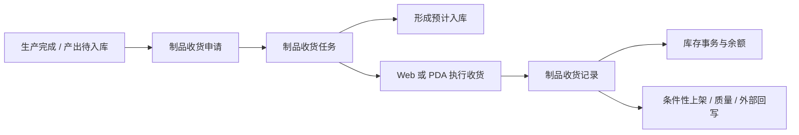
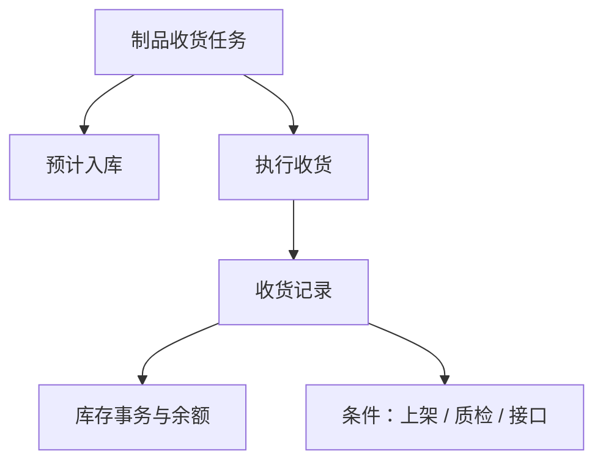

# 生产管理

> 适用基线：测试环境目标 / `dev` 分支 / 2026-07-15。
> 阅读对象：测试、实施、运维（主）；生产协同、仓库收货/上架、质量协同人员（顺带）。

## 业务目的与适用范围

WMS 生产管理处理生产结果如何进入、回退或转换仓储库存，例如制品收货、完工撤销、隔离收货、制品上架，以及拆解、返修等相邻场景。它连接生产完成事实、仓库接收、库存结果，以及可能触发的上架、质量或外部回写。

本页是 WMS 侧生产结果处理说明，不是 MES 生产计划/执行模块。生产发料、生产收料、生产退料分属[发料管理](../06-发料管理/index.md)与[生产收料](../07-生产收料/index.md)，不要与本分组混写。通用申请、任务和记录概念见[申请、任务与记录模型](../../02-业务模型/01-申请任务记录模型.md)。

## 如何使用本组文档

| 你的目的 | 建议阅读 |
| --- | --- |
| 想理解生产结果如何变成可追溯库存 | 本页。以制品收货为主线，其它对象看边界。 |
| 正在执行制品收货、上架、撤销或查询 | [生产管理-维护与查询参考](生产管理-维护与查询参考.md)。 |

## 使用前准备

| 需要确认什么 | 为什么重要 |
| --- | --- |
| 生产来源与完成事实 | 明确为何收货、收什么、收多少。 |
| 产出物料、数量、批次/包装 | 形成库存追溯基础。 |
| 收料地点与库存状态 | 决定落点和后续可用范围。 |
| 质量/隔离要求 | 避免把待检或隔离产出按合格库存处理。 |
| 是否需要上架或外部回写 | 决定收货后的后续动作是否自动触发。 |

!!! example "📷 截图占位"
    制品收货任务或申请页面，标出生产来源、物料、数量、库位/状态和后续动作线索。

## 一笔制品收货如何完成

申请表达“哪些生产结果需要入库”，任务组织仓库执行，记录保存实际接收结果。申请可形成预计入；任务执行后形成库存事务、更新余额并清理预计入。回冲、外部接口、自动上架、质量检验等后续动作受单据开关和规则控制，不能写成每笔收货的固定必经步骤。

!!! example "📝 示例数据占位"
    工单完工 100 件，仓库实收 100 件并形成库存；其中需上架或送检的分支单独标注为条件动作。

### 关键判断

| 判断点 | 应先确认什么 | 对业务的影响 |
| --- | --- | --- |
| 是否应做制品收货 | 生产结果是否已具备入库条件，且不是生产收料菜单对象。 | 决定进入本分组还是生产收料。 |
| 库存状态如何落 | 合格、隔离或其它状态要求。 | 决定后续可用与质量处理。 |
| 是否继续上架/送检 | 上架规则、QMS 开关和现场流程。 | 决定收货后是否自动或手工进入后续。 |
| 是否需要撤销 | 是否已形成库存和后续单据。 | 决定走完工撤销还是其它回退。 |

### 关键字段业务角色

完整语义见[维护与查询参考](生产管理-维护与查询参考.md)。本分组主链是**制品收货**；与[生产收料](../07-生产收料/index.md)的对象族边界见 `GAP-041`。落点选择通例见[库位与仓储级联惯例](../../02-业务模型/13-库位与仓储级联惯例.md)、[通用选择器过滤惯例](../../02-业务模型/12-通用选择器过滤惯例.md)。

| 字段/配置点 | 在系统中的作用 | 关键行为要点（取值/范围/联动/门禁） | 维护或操作时要警惕什么 |
| --- | --- | --- | --- |
| 业务类型（制品/隔离等） | 区分合格收货与隔离收货等入口 | 隔离收货复用制品收货对象、以业务类型区分 | 进错入口导致状态落错 |
| 生产来源与完成事实 | 入库范围 | 申请选择或带入；须具备入库条件 | 与生产收料菜单任务不可混查 |
| 物料 / 数量 / 单位 | 入账对象 | 与完成事实一致 | 差异须留原因 |
| 库位 / 库存状态 | 落点与可用范围 | 隔离状态走隔离入口；仓区位级联 | 合格/隔离混用 |
| 批次 / 包装 / 托盘 | 入账粒度 | 见[库存管理精度与唯一粒度](../../02-业务模型/08-库存管理精度与唯一粒度.md) | 漏采 |
| 条件后续（上架/质检/接口） | 收货后是否自动继续 | **受开关控制**，非每笔必发（`GAP-069`） | 勿培训为固定必经步骤 |
| 申请/任务/记录状态 | 门禁 | 申请可建预计入；任务执行建事务并清理预计入 | 完工撤销是独立链 |

## 对象族与边界

| 对象族 | 业务目标 | 对象形态 |
| --- | --- | --- |
| 制品收货 | 将生产产出纳入仓储库存。 | 申请—任务—记录齐全。 |
| 隔离收货 | 按隔离/报废类状态接收产出。 | 菜单独立，执行上复用制品收货对象并区分业务类型。 |
| 完工撤销 | 回退已完成的生产入库相关结果。 | 申请—任务—记录齐全；不可当成普通收货。 |
| 制品上架 | 将已接收产出转到目标库位/状态。 | 申请—任务—记录齐全，复用上架对象族。 |
| 制品拆解 | 拆分已有制品库存。 | 申请—记录为主，未见独立任务菜单。 |
| 制品返修 | 处理返修相关库存变化。 | 申请—记录为主；菜单可见性需以环境为准。 |

以下对象**不属于**本分组主文档范围：

- 生产收料、生产退料、发料/补料；
- MES 生产订单、工单完工等 MES 菜单；
- 仅因条件开关触发、但未在本笔业务证实的外部接口结果。

## 角色与关键动作

| 角色/岗位 | 典型工作 |
| --- | --- |
| 生产/计划协同 | 提供完成事实和待入库范围。 |
| 仓库执行 | 承接制品收货或上架任务，完成扫描与确认。 |
| 质量协同 | 在隔离、送检或放行场景给出处理方向。 |

| 所属对象 | 常见动作 | 业务结果 |
| --- | --- | --- |
| 制品收货申请/任务/记录 | 处理、承接、执行、查询。 | 形成或清理预计入，并生成库存事务。 |
| 完工撤销 | 申请、任务执行、记录。 | 回退相关库存结果；具体冲抵细节待实测。 |
| 制品上架 | 申请、任务、记录。 | 改变地点/状态并形成库存事务。 |

## 对库存和相关业务的影响

制品收货主链当前可确认：

1. 申请可创建预计入；
2. 任务执行生成库存事务并清理预计入；
3. 记录保存实际结果，并可继续触发受开关控制的后续动作。

| 关联业务 | 应关注什么 |
| --- | --- |
| 库存管理 | 预计入、事务、余额和库存状态。 |
| 生产收料/发料 | 是否误入了另一套生产仓储对象。 |
| 质量管理 | 隔离收货、检验申请是否被规则触发。 |
| 终端操作 | PDA 制品收货、上架、完工撤销入口。 |

## 查询、详情与联查

| 想解决的问题 | 推荐定位方式 | 建议联查 |
| --- | --- | --- |
| 哪些产出待入库 | 申请/任务状态、生产来源、物料。 | 生产来源、任务明细。 |
| 实际收了什么 | 记录号、物料、数量、批次/包装、库位。 | 库存事务、库存余额。 |
| 为何又做了上架/送检 | 收货记录后的关联申请或规则线索。 | 上架任务、质量申请。 |
| 如何回退 | 完工撤销单号、原收货记录。 | 库存事务、原记录。 |

### 详情分组与快速跳转

| 分组 | 应展示什么 | 可联查什么 |
| --- | --- | --- |
| 生产来源 | 完成事实、业务类型（制品/隔离）。 | 生产来源、MES 线索。 |
| 物料与数量 | 入账物料、数量、单位。 | 物料基本信息。 |
| 执行与状态 | 库位、库存状态、扫描结果。 | 库位资料。 |
| 库存影响 | 预计入、事务与余额。 | 库存预期、事务、余额。 |
| 条件后续 | 上架/质检/接口是否触发。 | 制品上架、质量申请。 |
| 系统信息 | 创建、更新与审计。 | 完工撤销记录（如适用）。 |

!!! example "📷 截图占位"
    制品收货申请/任务/记录详情分组与库存/上架联查；状态：待截图。勿与生产收料混看。

## 常见问题与处理

| 情况 | 建议处理 |
| --- | --- |
| 找不到制品收货任务 | 核对生产来源、业务类型，并确认不是生产收料菜单。 |
| 收货后还要不要上架 | 查看是否已生成上架任务或是否需手工发起；不要假定每笔都自动上架。 |
| 隔离品被当成合格库存 | 停止使用，核对库存状态和隔离收货入口。 |
| 想用同一套规则解释拆解/返修 | 回到对应对象族；它们不是制品收货的简单变体。 |
| 完成后库存查不到 | 先查收货记录和库存事务，再查预计入是否已清理。 |

## 当前限制与待确认事项

- 回冲、外部完工/库存移转接口、自动上架、QMS 检验等条件动作未形成固定矩阵，只能按开关/规则分别验证；
- 拆解、返修菜单可见性和完整状态机待环境确认；
- 完工撤销对后续上架、接口和质检的冲抵闭环待实测；
- Web/PDA 权限、导入和截图待补。

## 待补充的图示与示例
| 类型 | 后续需要补充的内容 | 目的 |
| --- | --- | --- |
| 对象关系图 | 制品收货与撤销、上架、隔离、拆解、返修的边界。 | 防止对象混写。 |
| 流程图 | 制品收货主链及条件后续。 | 支持培训。 |
| Web/PDA 截图 | 收货、上架、撤销和异常提示。 | 支持现场执行。 |
| 示例数据 | 正常入库、隔离入库、完工撤销三类样例。 | 支持异常与追溯。 |
