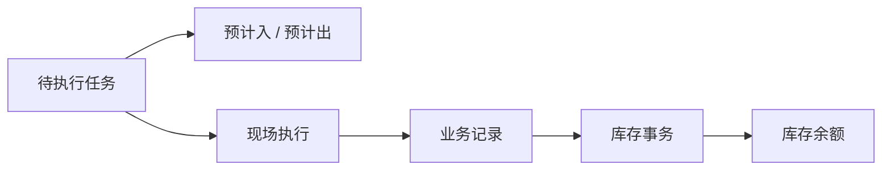

# 库存预期

> 适用基线：测试环境 / `dev` 分支 / 2026-07-15。
> 阅读对象：测试、实施、运维（主）。
> 库存预期包括预计入库与预计出库；具体查询操作见[库存管理-维护与查询参考](01-库存管理-维护与查询参考.md)。

## 这项查询解决什么问题

库存预期展示**已经安排、但尚未形成实际库存结果**的工作。预计入库回答「将会进入什么」，预计出库回答「将会占用或离开什么」。读完本页，应能判断：任务是否仍在等待、预期数量/地点/状态是什么，以及何时该离开本页去查事务或余额。

**与另外两层的边界：**

| 本页（预期） | 不是本页 |
| --- | --- |
| 待完成：任务带来的入/出预期仍在 | [库存事务](03-库存事务.md)：一次**已发生**变动的事实 |
| 回答「还在等什么」 | [库存余额与追溯](04-库存余额与追溯.md)：回答「现在账上有多少」 |
| 预期仍在 ≠ 已入账 | 要确认生效：业务记录 → 事务 → 余额 |

三类对象总览与「先查哪一层」见[库存管理](index.md)。

## 与入库链的关系

采购收货任务已确认会形成预计入库。采购退货、采购上架以及其它业务是否形成预计入或预计出，应按各自任务与状态逐项验证，不能因业务名称相近而推断。

!!! example "写实示例：给定业务 → 期望行为"
    **给定：** 采购收货任务 T-5001 已生成，物料 A 计划 100；现场尚未提交收货。
    **期望：**

    1. 按任务号在预计入库能查到约 100 的待完成预期（地点/状态随任务带回）。
    2. 此时用同一物料查余额，通常**不应**把这 100 当成已入账可用量。
    3. 收货提交实收 98 后：对应预期应消失或清理；变动改在[库存事务](03-库存事务.md)与[库存余额与追溯](04-库存余额与追溯.md)核对。

### 建议验证点

- 收货任务创建后能按任务号定位预计入；完成后预期清理/消失。
- 「只见预计不见余额」时，确认任务是否已执行并产生记录与事务。
- 若列表出现批量删除入口，不得当清账工具（`GAP-019`）。

## 查询时看什么

| 要点 | 说明 |
| --- | --- |
| 谁创建/释放 | 原则上由源业务任务创建与清理；采购收货任务形成预计入已证实，其它业务逐项验证 |
| 查询条件 | 任务号、业务类型、物料、数量、库位、库存状态、批次/包装 |
| 动作边界 | 以查询为主（`GAP-012`）；出现批量删除入口时**不得**当清账工具（`GAP-019`） |
| 与余额关系 | 预期仍在 ≠ 已入账；要确认生效须联查业务记录 → 事务 → 余额 |

完整字段与选择器语义见[维护与查询参考](01-库存管理-维护与查询参考.md)。

## 查询与维护说明

| 目的 | 推荐条件 | 应继续联查 |
| --- | --- | --- |
| 查待到货/待上架 | 任务、物料、地点、库存状态 | 来源单据、任务状态、收货/上架记录 |
| 查待出库影响 | 业务类型、物料、地点、库存状态 | 来源任务、可用余额和后续出库记录 |
| 判断是否已实际生效 | 预期是否仍存在 | 业务记录、库存事务、库存余额 |

当前存在预计入与预计出页面及后端维护对象；是否允许业务人员人工新增、修改或删除，及相应审计边界待测试环境确认（`GAP-012`）。

特别注意：预计入若出现「批量删除」类入口，不得用于日常清账；预计入原则上随任务创建/释放（`GAP-019`）。删除类接口参数与鉴权边界另见 `GAP-020`、`GAP-021`。

!!! example "📷 截图占位"
    预计入、预计出列表与从任务跳转、从预期追溯实际结果的入口。
