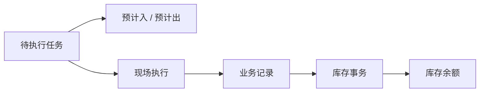

# 库存预期

> 适用基线：测试环境 / `dev` 分支 / 2026-07-15。库存预期包括预计入库与预计出库；具体查询操作见[库存管理-维护与查询参考](01-库存管理-维护与查询参考.md)。

## 这项查询解决什么问题

库存预期展示已经安排、但尚未形成实际库存结果的工作。预计入库回答“将会进入什么”，预计出库回答“将会占用或离开什么”；它们都不能替代库存余额。

## 字段行为要点（P3 / P8 / P9）
本页关注：按任务/业务类型检索、与余额相同的库存维度展示、随任务创建/释放。表内「行为模式」列（P 码）仅作辅证。数量变更回到源业务，本页不单列单据维护向专表。完整总表见[库存管理-维护与查询参考](01-库存管理-维护与查询参考.md)「字段说明」。

| 要点 | 说明 |
| --- | --- |
| 谁创建/释放 | 原则上由源业务任务创建与清理；采购收货任务形成预计入已证实，其它业务逐项验证 |
| 查询时看什么 | 任务号、业务类型、物料、数量、库位、库存状态、批次/包装 |
| 门禁 | 以查询为主（`GAP-012`）；出现批量删除入口时**不得**当清账工具（`GAP-019`） |
| 与余额关系 | 预期仍在 ≠ 已入账；要确认生效须联查业务记录 → 事务 → 余额 |

## 与入库链的关系

采购收货任务已确认会形成预计入库。采购退货、采购上架以及其它业务是否形成预计入或预计出，应按各自任务与状态逐项验证，不能因业务名称相近而推断。

## 查询与维护说明

| 目的 | 推荐条件 | 应继续联查 |
| --- | --- | --- |
| 查待到货/待上架 | 任务、物料、地点、库存状态。 | 来源单据、任务状态、收货/上架记录。 |
| 查待出库影响 | 业务类型、物料、地点、库存状态。 | 来源任务、可用余额和后续出库记录。 |
| 判断是否已实际生效 | 预期是否仍存在。 | 业务记录、库存事务、库存余额。 |

当前存在预计入与预计出页面及后端维护对象；是否允许业务人员人工新增、修改或删除，及相应审计边界待测试环境确认（`GAP-012`）。

特别注意：预计入若出现「批量删除」类入口，不得用于日常清账；预计入原则上随任务创建/释放（`GAP-019`）。删除类接口参数与鉴权边界另见 `GAP-020`、`GAP-021`。

!!! example "📷 截图占位"
    预计入、预计出列表与从任务跳转、从预期追溯实际结果的入口。

