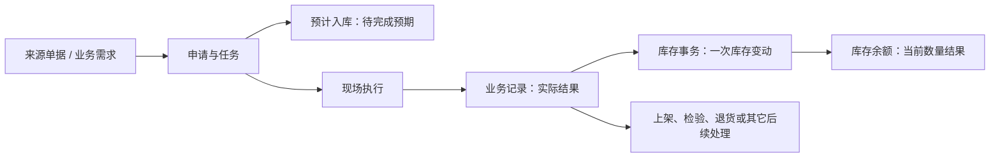
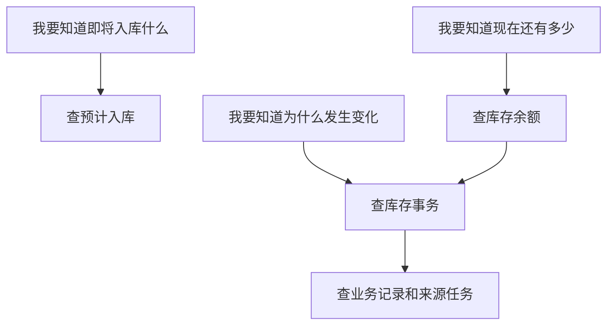

# 库存管理

> 适用基线：测试环境 / `dev` 分支 / 2026-07-15。
> 阅读对象：仓库主管、库存查询人员、收发料执行人员及需要追溯库存变化的业务人员。

## 业务目的与适用范围

库存管理回答三个不同的问题：已经安排但尚未完成的入库会带来什么预期、某一次实际业务做了什么库存变动、现在某物料在何处还剩多少。为避免把“待完成”“一次变化”和“当前结果”混为一谈，系统分别使用预计入库、库存事务和库存余额三个对象承载。

本页讲清三类对象如何衔接、何时查询哪一种结果、怎样从结果追溯回业务来源。具体查询字段、库存粒度、列表/详情规划和验证事项见[库存管理-维护与查询参考](01-库存管理-维护与查询参考.md)。

## 如何使用本组文档

| 你的目的 | 建议阅读 |
| --- | --- |
| 想知道采购收货、生产收料、发料或库内作业为何影响库存 | 本页的对象关系、业务影响和追溯路径。 |
| 想查待完成预期 | [库存预期](02-库存预期.md)。 |
| 想解释一次库存变化 | [库存事务](03-库存事务.md)。 |
| 想查询当前结果并追溯原因 | [库存余额与追溯](04-库存余额与追溯.md)。 |
| 想获得统一的查询条件和详情规划 | [库存管理-维护与查询参考](01-库存管理-维护与查询参考.md)。 |
| 想理解收货业务如何生成库存结果 | [采购收货](../03-采购收货/index.md)。 |
| 需要核对字段技术名、余额粒度或实现差异 | 由文档维护人员查询内部证据底稿；业务读者不需要阅读。 |

## 关键业务对象与关系

采购收货已确认采用“收货任务形成预计入、收货记录形成库存事务、事务更新余额”的链路。其它业务应按自身来源、任务和记录规则分别确认，不能仅因为都涉及库存就直接套用采购收货的状态或动作。

## 三类对象分别解决什么问题

| 对象 | 用业务语言理解 | 最适合回答的问题 |
| --- | --- | --- |
| 预计入库 | 已经安排、但尚未形成实际库存的入库预期。 | 哪些任务正在等待收货或完成？预计会进入什么物料、数量、状态和地点？ |
| 库存事务 | 某一笔实际业务造成的库存变化记录。 | 为什么数量或状态发生变化？变化来自哪条业务记录？ |
| 库存余额 | 按物料、地点和库存属性汇总后的当前结果。 | 现在还有多少、在什么位置、处于什么库存状态？ |

!!! example "📝 示例数据占位"
    以采购计划 100 件、实收 98 件、拒收 2 件为例，展示任务中的预计入、收货记录、库存事务和余额查询结果。

## 日常业务如何影响库存

1. 业务来源先形成申请、任务或其他待执行工作；是否生成预计入/预计出取决于具体业务。
2. 现场执行产生实际业务记录；记录应保留来源、物料、数量、批次、包装、库存状态和库位等关键业务信息。
3. 实际记录形成库存事务，库存事务是追溯“为什么变了”的主要入口。
4. 库存余额反映事务处理后的当前结果；如查询结果异常，应从余额反查事务，再反查业务记录和任务。

## 库存数量与位置的关键判断

库存余额不是只按“物料”汇总。当前业务口径至少需要同时关注批次、托盘、包装、物料、库存状态和库位等维度；同一物料在不同库位、不同批次或不同状态下应被视为不同可用结果。

因此，在查询“库存不足”“账实不一致”或“为何不能发料”前，应先确认查询条件是否覆盖了正确的物料、库位、批次/包装和库存状态，不能只看物料总数。

### 关键字段业务角色（查询页）

三类对象以**查询/追溯**为主（`GAP-012`），不是日常改账入口。完整语义见[维护与查询参考](01-库存管理-维护与查询参考.md)；粒度通例见[库存管理精度与唯一粒度](../../02-业务模型/08-库存管理精度与唯一粒度.md)。

| 字段/配置点 | 行为模式 | 在系统中的作用 | 关键行为要点 | 维护或操作时要警惕什么 |
| --- | --- | --- | --- | --- |
| 任务号 / 业务类型（预期） | P2 / P9 | 定位待完成预期来自哪项任务 | 预期随任务创建/释放；完成应收发后应消失或清理 | 勿把预计当已入账；禁止用批量删除清账（`GAP-019`） |
| 业务记录号 / 事务类型（事务） | P2 / P1 | 解释一次已发生变动 | 从来源业务记录反查，不手工造事务 | 人工维护边界见 `GAP-012` |
| 物料+库位+状态+批次+托盘+包装（余额） | P3 / P8 | 当前结果唯一粒度 | 六维共同构成业务键；缺维会误判可用量 | 反查事务时过滤可能未带齐维度（`GAP-022`） |
| 冻结 / 库存状态 | P1 / P9 | 是否可用于下游选择器 | 影响发料/出库/转移可选范围（细节 ❓） | “有数不能用”先查状态与冻结 |

!!! example "📐 图示占位"
    库存余额粒度图。展示同一物料因批次、托盘、包装、库存状态和库位不同而分成多条余额结果；不展示数据库字段名。

## 查询、详情与快速跳转

| 想解决的问题 | 优先入口 | 建议继续联查 |
| --- | --- | --- |
| 待完成到货或预计入库 | 预计入库查询。 | 来源任务、来源单据和物料。 |
| 某次收货/发料/调整为何改变数量 | 库存事务查询。 | 业务记录、来源任务、物料和批次/包装。 |
| 某物料当前在哪里、可用多少 | 库存余额查询。 | 最近库存事务、相关业务记录、库位与库存状态。 |
| 收货完成却找不到库存 | 先查收货记录，再查事务和余额。 | 上架、检验、退货或接口处理结果。 |

详情页应按“库存识别与数量、地点与状态、批次/包装与追溯、来源与最近事务、系统信息”组织。实际 Tab、跳转入口和过滤条件需以测试环境确认后补充。

!!! example "📷 截图占位"
    预计入、库存事务、库存余额三类列表与详情；标出从余额反查事务、从事务反查业务记录的入口。

## 常见问题与处理

| 情况 | 建议处理 |
| --- | --- |
| 只看到预计入，看不到余额 | 预计入表示待完成预期；先确认任务是否已执行并产生业务记录和库存事务。 |
| 余额数量与预期不一致 | 分别核对实际记录、事务数量、批次/包装、库位和库存状态，不要只比较物料总数。 |
| 找到余额但不能用于业务 | 核对库存状态、冻结/可用范围、库位和所在业务的选择条件。 |
| 无法追溯数量变化 | 先以物料、库位、批次/包装定位余额，再查最近事务和对应业务记录。 |
| 需要修正库存 | 不要直接修改余额替代业务处理；先确认应走盘点、退货、调拨、报废或其它对应业务。 |

## 当前限制与待确认事项

- `GAP-012`：预计入、库存事务、库存余额以**查询与追溯**为主，不应作为日常手工改库存的入口。
- `GAP-019`：预计入列表仍可能暴露「批量删除」类入口；培训上预计入应由任务创建/释放，禁止把它当清账工具。
- `GAP-020`：预计入删除相关接口参数定义存在错位风险；单条删除入口多已隐藏，恢复或外部调用前须先核接口契约。
- `GAP-021`：导出等动作前端可有权限码，后端强制鉴权证据不足；授权结论须结合实测（并挂 `GAP-014`）。
- `GAP-005` / `GAP-022`：余额业务粒度已确认，但 DDL 唯一约束与余额详情反查事务的过滤条件可能未带齐托盘/库存状态/库位等维度；查询与判断须人工带齐完整维度，勿只看物料总数。
- 各类来源业务生成预计入/预计出的时点不能一概而论，当前仅确认采购收货任务会形成预计入；
- 库存状态、冻结、质量处理和上架对可用量的最终影响，需在 WMS/QMS 跨模块测试中补充。

## 图示、截图与示例任务

| 类型 | 后续需要补充的内容 | 目的 |
| --- | --- | --- |
| 对象关系图 | 来源、任务、记录、预计入、事务与余额的关系。 | 帮助新人区分三类库存对象。 |
| 粒度图 | 同一物料按地点、批次/包装、状态拆分余额。 | 避免误用物料总数。 |
| 查询截图 | 三类列表、详情分组和反查入口。 | 支持日常库存追溯。 |
| 示例数据 | 正常收货、差异收货、库位/状态不同的余额样例。 | 支持数量变化讲解。 |
