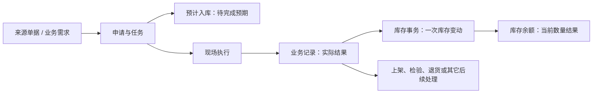
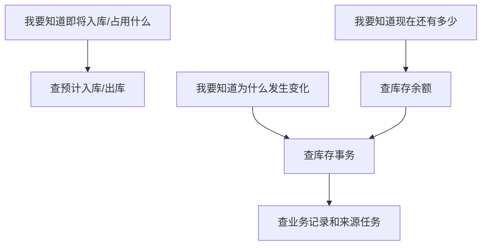
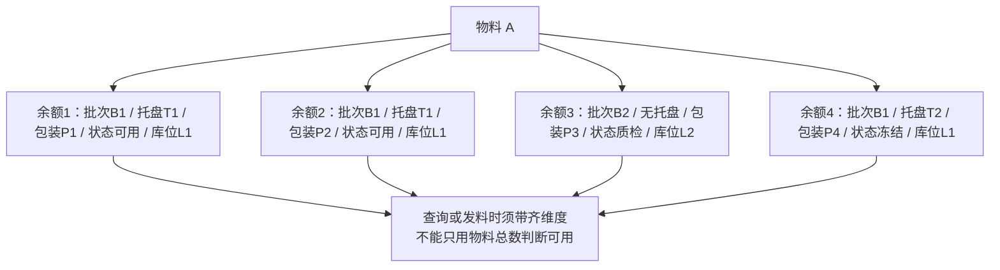

# 库存管理

> 适用基线：测试环境 / `dev` 分支 / 2026-07-15。
> 阅读对象：测试、实施、运维（主）；仓库主管、库存查询、收发料执行人员（顺带）。

## 业务目的与适用范围

库存查询常混成一件事，其实要分三层看：**预计入库/出库**回答「已经安排、尚未完成」；**库存事务**回答「某一次业务造成了什么变动」；**库存余额**回答「现在某处还剩多少」。读完本页，应能按问题选对入口——例如「任务还在等收货」先查预期，「收货完了为什么账变了」先查事务，「现在能不能发」先查余额——再沿「余额 → 事务 → 业务记录」或「任务 → 预期 → 记录 → 事务 → 余额」联查，而不是把三张表当同一份结果反复对。

本页讲清三类对象如何衔接、何时查哪一层、怎样从结果追溯回业务来源。具体查询字段、库存粒度、列表/详情规划和验证细节见[库存管理-维护与查询参考](01-库存管理-维护与查询参考.md)。

## 如何使用本组文档

| 你的目的 | 建议阅读 |
| --- | --- |
| 分清「待完成 / 一次变化 / 当前结果」，并选对先查哪一层 | 本页：对象关系 → 三类对象 → 写实示例 → 查询入口 |
| 弄清收发/上架等业务如何落到预期、事务、余额，或据此验证/排障 | 本页「日常业务如何影响库存」「建议验证点」「常见问题与处理」 |
| 只查待完成预期 | [库存预期](02-库存预期.md) |
| 只解释一次已发生变动 | [库存事务](03-库存事务.md) |
| 查当前结果并反查原因 | [库存余额与追溯](04-库存余额与追溯.md) |
| 统一查询条件、详情分组与字段语义 | [库存管理-维护与查询参考](01-库存管理-维护与查询参考.md) |
| 对照收货如何生成库存结果 | [采购收货](../03-采购收货/index.md) |

不确定时：先用本页「想解决什么 → 优先入口」表选层；字段与联查细节再下沉维护参考。

## 关键业务对象与关系

采购收货已确认采用「收货任务形成预计入 → 收货记录形成库存事务 → 事务更新余额」。其它业务应按自身来源、任务和记录规则分别确认，不能仅因为都涉及库存就直接套用采购收货的状态或动作。

## 三类对象分别解决什么问题

| 对象 | 用业务语言理解 | 最适合回答的问题 | 不要用它回答 |
| --- | --- | --- | --- |
| 预计入库/出库 | 已经安排、但尚未形成实际库存的预期。 | 哪些任务还在等待收货/出库？预计物料、数量、状态、地点是什么？ | 「现在账上有多少」——那是余额。 |
| 库存事务 | 某一笔实际业务造成的一次库存变化。 | 为什么数量/地点/状态变了？来自哪条业务记录？ | 「还在等什么任务」——那是预期。 |
| 库存余额 | 按物料、地点和库存属性汇总后的当前结果。 | 现在还有多少、在什么位置、处于什么库存状态？ | 「这次业务做了什么」——应先落到事务再反查记录。 |

!!! example "📝 示例数据占位"
    以采购计划 100 件、实收 98 件、拒收 2 件为例，展示任务中的预计入、收货记录、库存事务和余额查询结果。

!!! example "写实示例：给定业务 → 该查哪一层"
    **给定：** 采购订单 PO-1001 物料 A 计划 100；收货任务 T-5001 已生成；现场实收 98、拒收 2 并已提交收货记录；随后部分上架至库位 B-01。
    **期望（分层核对）：**

    1. **任务刚生成、尚未收货：** 在[库存预期](02-库存预期.md)按任务号能看到预计入约 100；此时余额通常尚无这笔「已入账」结果，勿把预计当已收。
    2. **收货提交后：** 预计入应随完成而消失或清理；[库存事务](03-库存事务.md)能按收货记录号看到 +98 的变动；拒收 2 不计入正常实收。
    3. **查「现在还有多少」：** 在[库存余额与追溯](04-库存余额与追溯.md)按物料 + 库位 + 库存状态 + 批次/托盘/包装定位；上架前后地点可能不同，不能只按物料总数判断可用。
    4. **「收货完了但查不到库存」：** 先查收货记录是否存在 → 再查事务是否生成 → 再查余额维度是否带齐；同时确认是否仍待上架/检验/接口处理。
    5. **「有数却不能发料」：** 先看余额行的库存状态与冻结，再看下游业务对地点/状态的选择条件（细节 ❓），不要只看物料汇总数量。

## 日常业务如何影响库存

1. 业务来源先形成申请、任务或其他待执行工作；是否生成预计入/预计出取决于具体业务。
2. 现场执行产生实际业务记录；记录应保留来源、物料、数量、批次、包装、库存状态和库位等关键信息。
3. 实际记录形成库存事务——解释「为什么变了」的主要入口。
4. 库存余额反映事务处理后的当前结果；异常时应「余额 → 事务 → 业务记录/任务」，不要直接改余额消差。

三类对象以**查询与追溯**为主（`GAP-012`），不是日常手工改账入口。修正库存应走盘点、退货、调拨、报废等对应业务，而不是在库存查询页改数。

### 建议验证点

- 走通一笔采购收货：任务生成后能查到预计入；收货完成后预计入清理/消失，事务与余额按实收更新。
- 同一物料在不同库位或库存状态下拆成多条余额；查询或发料时漏维会误判可用量（`GAP-005` / `GAP-022`）。
- 「只见预计不见余额」：确认任务是否已执行并产生记录与事务，勿把预计当已入账。
- 余额详情反查事务时，人工带齐物料/库位/状态/批次/托盘/包装，核对过滤是否漏维（`GAP-022`）。
- 预计入若出现批量删除入口，确认培训口径禁止当清账工具（`GAP-019`）；接口参数/鉴权见 `GAP-020`、`GAP-021`。
- 现场反馈「有数不能用」：先查余额状态与冻结，再查下游选择条件，再查最近事务是否状态变更未完成。

## 库存数量与位置的关键判断

库存余额不是只按「物料」汇总。当前业务口径至少同时关注批次、托盘、包装、物料、库存状态和库位；同一物料在不同库位、批次或状态下应视为不同可用结果。

因此，在查询「库存不足」「账实不一致」或「为何不能发料」前，应先确认条件是否覆盖正确的物料、库位、批次/包装和库存状态，不能只看物料总数。

### 关键字段业务角色（查询页）

完整语义见[维护与查询参考](01-库存管理-维护与查询参考.md)；粒度通例见[库存管理精度与唯一粒度](../../02-业务模型/08-库存管理精度与唯一粒度.md)。

| 字段/配置点 | 在系统中的作用 | 关键行为要点 | 维护或操作时要警惕什么 |
| --- | --- | --- | --- |
| 任务号 / 业务类型（预期） | 定位待完成预期来自哪项任务 | 预期随任务创建/释放；完成应收发后应消失或清理 | 勿把预计当已入账；禁止用批量删除清账（`GAP-019`） |
| 业务记录号 / 事务类型（事务） | 解释一次已发生变动 | 从来源业务记录反查，不手工造事务 | 人工维护边界见 `GAP-012` |
| 物料+库位+状态+批次+托盘+包装（余额） | 当前结果唯一粒度 | 六维共同构成业务键；缺维会误判可用量 | 反查事务时过滤可能未带齐维度（`GAP-022`） |
| 冻结 / 库存状态 | 是否可用于下游选择器 | 影响发料/出库/转移可选范围（细节 ❓） | 「有数不能用」先查状态与冻结 |

同一物料在业务上可拆成多条余额。业务键为：物料 + 批次 + 托盘 + 包装 + 库存状态 + 库位（见[库存管理精度与唯一粒度](../../02-业务模型/08-库存管理精度与唯一粒度.md)）。数据库是否有等价唯一约束仍属 `GAP-005`，图中不把它画成已实现约束。

过账与对象挂接见[库存数据挂接模型](../../02-业务模型/02-库存数据挂接模型.md)。本分组没有独立策略页；可选范围与过账行为主要受上游业务类型、源业务记录与库存状态约束。变更前请在测试环境走通「源业务 → 事务 → 余额」并留回退路径。

## 查询、详情与快速跳转

| 想解决的问题 | 优先入口 | 建议继续联查 |
| --- | --- | --- |
| 待完成到货或预计入库 | 预计入库查询 | 来源任务、来源单据和物料 |
| 某次收货/发料/调整为何改变数量 | 库存事务查询 | 业务记录、来源任务、物料和批次/包装 |
| 某物料当前在哪里、可用多少 | 库存余额查询 | 最近库存事务、相关业务记录、库位与库存状态 |
| 收货完成却找不到库存 | 先查收货记录，再查事务和余额 | 上架、检验、退货或接口处理结果 |

### 详情分组与快速跳转

| 分组 | 应展示什么 | 可联查什么 |
| --- | --- | --- |
| 库存识别与数量 | 物料、数量、单位、冻结线索 | 物料基本信息 |
| 地点与状态 | 仓库/库区/库位、库存状态 | 仓库、库位资料 |
| 批次/包装与追溯 | 批次、托盘、包装等粒度维度 | 同键其它余额（防混查） |
| 来源与最近事务 | 来源业务记录、最近事务 | 库存事务、业务记录 |
| 系统信息 | 创建、更新与查询审计 | — |

!!! example "📷 截图占位"
    预计入/事务/余额详情分组与反查入口；状态：待截图。反查过滤须带齐业务键（`GAP-022`）。

## 常见问题与处理

| 情况 | 建议处理 |
| --- | --- |
| 只看到预计入，看不到余额 | 预计入表示待完成预期；先确认任务是否已执行并产生业务记录和库存事务。 |
| 余额数量与预期不一致 | 分别核对实际记录、事务数量、批次/包装、库位和库存状态，不要只比较物料总数。 |
| 找到余额但不能用于业务 | 核对库存状态、冻结/可用范围、库位和所在业务的选择条件。 |
| 无法追溯数量变化 | 先以物料、库位、批次/包装定位余额，再查最近事务和对应业务记录。 |
| 需要修正库存 | 不要直接修改余额替代业务处理；先确认应走盘点、退货、调拨、报废或其它对应业务。 |

## 当前限制与待确认事项

- `GAP-012`：预计入、库存事务、库存余额以**查询与追溯**为主，不应作为日常手工改库存的入口。
- `GAP-019`：预计入列表仍可能暴露「批量删除」类入口；培训上预计入应由任务创建/释放，禁止把它当清账工具。
- `GAP-020`：预计入删除相关接口参数定义存在错位风险；单条删除入口多已隐藏，恢复或外部调用前须先核接口契约。
- `GAP-021`：导出等动作前端可有权限码，后端强制鉴权证据不足；授权结论须结合实测（并挂 `GAP-014`）。
- `GAP-005` / `GAP-022`：余额业务粒度已确认，但 DDL 唯一约束与余额详情反查事务的过滤条件可能未带齐托盘/库存状态/库位等维度；查询与判断须人工带齐完整维度，勿只看物料总数。
- 各类来源业务生成预计入/预计出的时点不能一概而论，当前仅确认采购收货任务会形成预计入；
- 库存状态、冻结、质量处理和上架对可用量的最终影响，需在 WMS/QMS 跨模块测试中补充。

## 待补充的图示与示例
| 类型 | 后续需要补充的内容 | 目的 | 状态 |
| --- | --- | --- | --- |
| 对象关系图 | 来源、任务、记录、预计入、事务与余额的关系。 | 帮助新人区分三类库存对象。 | 本页与公共挂接模型已有 |
| 粒度图 | 同一物料按地点、批次/包装、状态拆分余额。 | 避免误用物料总数。 | 已挂业务键示意；`GAP-005` 约束待核 |
| 查询截图 | 三类列表、详情分组和反查入口。 | 支持日常库存追溯。 | 见待截图执行清单 |
| 示例数据 | 正常收货、差异收货、库位/状态不同的余额样例。 | 支持数量变化讲解。 | 待补充 |
