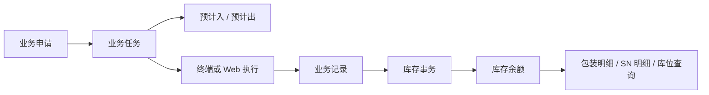

# 库存管理

## 概述

库存管理是 WMS 库房管理模块的核心子系统，贯穿所有库存变动业务场景。当前库存余额以物料、批次、包装、托包装、库存状态和库位为核心业务粒度，实时记录全厂区的库存数量，并通过库存事务实现库存流转追溯。

库存管理的核心价值：

- **实时准确**：库存余额按物料、批次、包装、托包装、库存状态和库位粒度实时更新，支持冻结、可用等状态区分
- **完整追溯**：所有库存变动（入库、出库、调拨、盘点调整）均记录事务日志，可追溯每一度库存变化
- **智能预计**：基于工单、采购单、MES工单等单据自动推算预计入库/出库，辅助库容规划
- **容量管控**：库位容量管理防止爆仓，支持使用率监控和预警

## 当前基线模型（代码、DDL 与业务口径已核对）

> 适用基线：测试环境对应的 `dev` 分支，2026-07-15。以下内容优先于后文尚未完成逐项核验的历史草稿。

| 对象 | 当前定位 | 关键关联 |
| --- | --- | --- |
| 预计入库存 `transaction_expectin` | 记录任务将带来的预期入库，不是实际库存余额。 | 以 `job_number` 关联任务；采购收货任务创建时写入预计入。 |
| 库存事务 `transaction_transaction` | 记录实际库存变动的流水。 | 以 `record_number` 关联业务记录；采购收货记录执行时创建事务。 |
| 库存余额 `transaction_balance` | 当前可查询的库存数量载体。 | 由库存事务服务批量新增、更新或删除；采购收货页面不直接维护余额。 |

### 库存余额业务唯一粒度（已确认）

同一库存余额由以下六个字段共同区分：

| 顺序 | 字段 | 数据库类型 | 说明 |
| --- | --- | --- | --- |
| 1 | `batch_id` | `bigint`，默认 `0` | 批次。 |
| 2 | `pallet_number` | `varchar(64)` | 托盘号。 |
| 3 | `package_number` | `varchar(64)` | 包装号。 |
| 4 | `item_code` | `varchar(64)` | 物料代码。 |
| 5 | `inventory_status` | `varchar(64)` | 库存状态。 |
| 6 | `location_code` | `varchar(64)` | 库位代码。 |

这一定义是本轮文档的业务口径。当前 DDL 尚未看到对应的复合唯一约束，属于技术改进项而不是文档阻塞项；详见[产品差距总账](../../15-版本路线图/产品差距总账.md)。

### 当前列表字段与查询入口

| 页面 | 当前列表前序字段 | 当前可见查询字段 |
| --- | --- | --- |
| 预计入库存 | 任务号、业务类型、物料代码、数量、计量单位、库位代码、仓库代码、批次 ID、库存状态、创建者、创建时间 | 物料代码、计量单位、批次 ID、库存状态、创建时间。 |
| 库存事务 | 事务号、事务类型、业务类型、业务操作、业务记录号、库存动作、物料代码、物料名称、数量、计量单位、库存状态、库位代码 | 事务号、业务操作、业务记录号、库存动作、物料代码、库存状态、包装号、批次 ID。 |
| 库存余额 | 物料代码、物料名称、库存数量、计量单位、库存状态、库位代码、库位组、库区、库区类型、仓库代码、包装号、托盘号、器具号、批次 ID | 物料代码、物料名称、库位代码、包装号、托盘号、批次 ID。 |

### 当前字段证据（DDL/DO 已证实）

| 中文名称 | 预计入 `transaction_expectin` | 库存事务 `transaction_transaction` | 库存余额 `transaction_balance` | 文档结论 |
| --- | --- | --- | --- | --- |
| 任务号 | `job_number` | 无 | 无 | 预计入直接挂任务号。 |
| 记录号 | 无 | `record_number` | 无 | 库存事务直接挂业务记录号。 |
| 事务号 | 无 | `number` | `last_trans_number` | 余额只保存最后事务号。 |
| 事务类型 | 无 | `transaction_type` | 无 | 事务表字段，来源与业务类型/单据设置待核验。 |
| 库存动作 | 无 | `inventory_action` | 无 | 事务表字段，入出库动作待核验。 |
| 业务类型 | `business_type` | `business_type` | 无 | 预计入和事务均保存业务类型。 |
| 业务操作 | 无 | `business_operation` | 无 | DDL 默认 `1`，注释为正向/撤销。 |
| 物料代码 | `item_code` | `item_code` | `item_code` | 三者均存在。 |
| 物料名称 | 无 | `item_name` | `item_name` | 预计入不保存物料名称。 |
| 批次 ID | `batch_id` | `batch_id` | `batch_id` | 库存粒度字段之一；余额 DDL 默认 0。 |
| 托包装号 | `pallet_number` | `pallet_number` | `pallet_number` | 库存粒度字段之一。 |
| 箱包装号 | `package_number` | `package_number` | `package_number` | 库存粒度字段之一。 |
| 小包装号 | 无 | `small_package_number` | `small_package_number` | 事务/余额存在，但当前已确认唯一粒度暂不含该字段。 |
| 库存状态 | `inventory_status` | `inventory_status` | `inventory_status` | 库存粒度字段之一。 |
| 数量 | `qty` | `qty` | `qty` | 预计入、事务、余额均保存数量。 |
| 库位代码 | `location_code` | `location_code` | `location_code` | 库存粒度字段之一。 |
| 库位组/库区/仓库 | 无/无/`warehouse_code` | `location_group_code`、`area_code`、`warehouse_code` | `location_group_code`、`area_code`、`warehouse_code` | 预计入只保留仓库代码和库位代码。 |
| 货主代码 | `owner_code` | `owner_code` | `owner_code` | 是否参与业务唯一性待核验。 |
| 冻结标识 | 无 | `frozen` | `frozen` | 事务/余额字段；冻结业务规则待核验。 |
| 入库时间 | 无 | `put_in_time` | `put_in_time` | 事务/余额字段。 |
| 失效日期 | 无 | `expire_date` | `expire_date` | 事务/余额字段。 |

### DTO/VO 与前端页面层证据（第一轮）

| 页面/对象 | 证据 | 当前结论 |
| --- | --- | --- |
| 预计入库存 | `ExpectinBaseVO.java`、`ExpectinPageReqVO.java`、`expectin.data.ts` | 后端接口显式必填任务号、业务类型、物料代码、库存状态、数量、库位代码；前端表单还要求批次、计量单位、仓库代码、货主代码。列表前序字段为任务号、业务类型、物料代码、数量、计量单位、库位代码、仓库代码、批次 ID、库存状态、创建者、创建时间。 |
| 库存事务 | `TransactionBaseVO.java`、`TransactionPageReqVO.java`、`transaction.data.ts` | 后端接口显式必填事务类型、库存动作、操作员、业务类型等；前端列表重点展示事务号、事务类型、业务类型、业务操作、业务记录号、库存动作、物料、数量、库存状态、库位、包装和批次字段。库存事务通常应由业务单据生成，是否允许人工新增/编辑需继续按菜单权限和服务入口确认。 |
| 库存余额 | `BalanceBaseVO.java`、`BalancePageReqVO.java`、`balance.data.ts` | 前端列表重点展示物料、数量、单位、库存状态、库位、库位组、库区、仓库、箱包装号、托包装号、器具号、批次 ID；查询字段包括物料代码、物料名称、库位代码、箱包装号、托包装号、批次 ID，且批次 ID 查询要求数字格式。 |
| 库存余额导入 | `BalanceImportExcelVo.java` | 当前模板列覆盖包装号、小包装号、器具代码、物料代码、批次、日期、库存状态、库位、库位组、库区、仓库、货主、计量单位、数量、价格金额、冻结、最后事务号和体积重量等字段。该模板更像库存初始化/迁移模板，不宜直接当作日常人工维护模板；实际必填和校验需继续查导入服务。 |

### 前端动作可达性复核（第二轮）

> 本节区分“页面中仍保留 API / 表单组件”与“用户当前能看到并点击的按钮”。前者不能直接写成业务能力。

| 对象 | 已见可达入口 | 保留但未暴露的能力 | 取证结论 |
| --- | --- | --- | --- |
| 预计入库存 | 详情（任务号可点入）、导出、刷新/筛选/列设置；**批量删除按钮当前未被注释**。 | 新增、导入、逐行编辑/删除按钮均已注释，仍保留 `BasicForm`、`ImportForm` 和相应 API 调用。 | 当前页面并非完全只读：批量删除调用 `deleteExpectinIds`，服务将传入 ID 解析后执行 `physicsDelete`。当前链路未见任务状态、下游关联或后端权限注解校验，已登记差距，不能作为常规释放方式培训。 |
| 库存事务 | 详情、导出、刷新/筛选/列设置。 | 新增、导入、逐行编辑/删除按钮已注释，仍保留表单、导入组件及 API。 | 现有 Web 列表未暴露人工维护入口；应继续以“查询和追溯”定位，不能据残留 API 推导可人工维护。 |
| 库存余额 | 详情、导出、刷新/筛选/列设置、标签信息、标签打印、包装明细、SN 明细、创建包装。 | 新增、导入、逐行编辑/删除按钮已注释，仍保留表单、导入组件及 API。 | 余额页确实提供围绕包装与序列号的业务操作，但当前未暴露普通余额维护按钮；标签/打印属于平台能力，业务页只说明入口。 |

### 详情页分组与快速跳转规划（P0 样板）

库存管理页不是单一实体页，而是预计入、库存事务、库存余额三类查询对象的集合。当前文档先按三类对象分别规划详情页和快速跳转，后续如拆分为独立叶子页，应保留同一口径。

| 对象 | 建议详情分组 | 重点字段 | 快速跳转目标 |
| --- | --- | --- | --- |
| 预计入库存 | 来源任务、物料与数量、目标库位、批次与库存状态、系统信息。 | `job_number`、`business_type`、`item_code`、`qty`、`uom`、`location_code`、`warehouse_code`、`batch_id`、`inventory_status`。 | 任务详情、来源业务单据、物料详情、库位详情。 |
| 库存事务 | 事务标识、业务来源、库存动作、物料与数量、库存粒度、执行信息、系统信息。 | `number`、`transaction_type`、`business_type`、`business_operation`、`record_number`、`inventory_action`、`item_code`、`qty`、`inventory_status`、`location_code`、`package_number`、`pallet_number`、`batch_id`。 | 业务记录详情、库存余额、物料详情、库位详情、批次/包装追溯。 |
| 库存余额 | 库存粒度、数量与状态、库位与仓库、包装与 SN、最后事务、质量/冻结/有效期、系统信息。 | `item_code`、`qty`、`inventory_status`、`location_code`、`location_group_code`、`area_code`、`warehouse_code`、`package_number`、`pallet_number`、`batch_id`、`last_trans_number`、`frozen`、`expire_date`。 | 物料详情、库存事务页签、包装明细、SN 明细、库位详情、批次追溯。 |

| 快速跳转目标 | 建议过滤条件 | 业务用途 | 状态 |
| --- | --- | --- | --- |
| 任务详情 | `预计入.job_number = 任务号` | 从预计入追溯到申请/任务模型中的任务来源。 | 占位，任务页链接待逐业务补齐。 |
| 业务记录详情 | `库存事务.record_number = 记录号` | 从库存事务追溯到真正完成过账的业务记录。 | 占位，记录页链接待逐业务补齐。 |
| 库存余额 | 物料、批次、托盘、包装、库存状态、库位。 | 判断事务过账后落到哪一行余额。 | 已有查询条件，组合跳转待实现。 |
| 库存事务 | `库存余额.last_trans_number` 或库存粒度组合。 | 从余额追溯最近一次或全部库存变动。 | 当前余额详情已使用事务页签，待截图确认。 |
| 物料详情 | `item_code = 物料.code` | 查看物料属性、回收件、有效天数和标签信息。 | 占位，待链接物料页。 |
| 包装明细 | `package_number`、`pallet_number`。 | 查看箱包装、托盘包装和包装层级。 | 余额页已有包装明细入口，待补页面。 |
| SN 明细 | `balanceId`。 | 查看单件序列号追溯。 | 余额页已有 SN 明细入口，待补字段。 |
| 库位详情 | `location_code`。 | 查看库存所在库位、库区、仓库和容量。 | 占位，待库位页补齐。 |

### 动作按钮、状态前置条件与服务流转（第一轮）

| 对象 | 当前动作 | 前置条件/限制 | 业务结论 | 状态 |
| --- | --- | --- | --- | --- |
| 预计入库存 | 查询、详情、导出、刷新/筛选/列设置、**批量删除**。 | 新增、导入、逐行编辑/删除按钮当前被注释；但页头批量删除按钮未注释，能调用 `deleteExpectinIds`。该服务按 ID 执行物理删除；Controller 的权限注解已注释，且未见状态、来源任务或下游关联检查。 | 预计入仍应主要由任务创建或释放；当前批量删除是可达的技术能力，但不是可被推荐的常规维护流程。 | 已取证，已登记差距。 |
| 库存事务 | 查询、详情、导出。 | 前端新增、导入、编辑、删除按钮当前被注释；事务通常由业务记录过账生成。 | 库存事务是追溯流水，不应作为普通人工新增/编辑对象。 | 已取证，待服务入口专项确认。 |
| 库存余额 | 查询、详情、导出、包装明细、SN 明细、创建包装、标签信息/打印。 | 前端新增、导入、编辑、删除按钮当前被注释；导入组件存在但日常入口未展示。 | 库存余额是当前库存状态载体，日常应由事务更新；人工导入更适合定位为初始化/迁移或专项调整。标签/包装操作不等价于修改余额数量。 | 已取证，待导入服务和权限复核。 |
| 库存余额导入 | 导入组件和后端模板类存在。 | 当前页面导入按钮/模板获取逻辑被注释，导入字段范围过大。 | 不宜把当前模板直接作为用户日常维护模板；需单独设计“初始化导入/调整导入”规则。 | 已登记产品差距。 |

### 库存三对象流转示意（P0 样板）



### 库存余额粒度示例（占位样板）

同一物料、同一批次下，只要托盘、包装、库存状态或库位不同，就应形成不同的库存余额行。

| 示例 | `batch_id` | `pallet_number` | `package_number` | `item_code` | `inventory_status` | `location_code` | 说明 |
| --- | --- | --- | --- | --- | --- | --- | --- |
| A | 1001 | P001 | C001 | RM-001 | OK | L-A01 | 标准余额行。 |
| B | 1001 | P001 | C002 | RM-001 | OK | L-A01 | 箱包装不同，应为另一行。 |
| C | 1001 | P002 | C001 | RM-001 | OK | L-A01 | 托盘不同，应为另一行。 |
| D | 1001 | P001 | C001 | RM-001 | HOLD | L-A01 | 库存状态不同，应为另一行。 |
| E | 1001 | P001 | C001 | RM-001 | OK | L-B01 | 库位不同，应为另一行。 |

### 图示、截图与示例内容占位

| 内容类型 | 建议放置位置 | 目的 | 状态 |
| --- | --- | --- | --- |
| 库存三对象关系图 | “当前基线模型”之后 | 说明预计入、库存事务、库存余额分别解决什么问题，以及与任务/记录的挂接关系。 | 已补 Mermaid 样板，待根据更多业务补充预计出。 |
| 库存余额粒度示例 | “库存余额业务唯一粒度”之后 | 用一组示例数据展示同物料、同批次下因托盘/包装/库位不同而形成不同余额行。 | 已补示例数据，待以真实测试数据替换。 |
| 库存事务过账示例 | “当前字段证据”之后 | 展示一笔采购收货记录如何生成事务，并如何改变余额数量。 | 占位，待根据服务规则生成。 |
| 库存余额列表截图 | “当前列表字段与查询入口”之后 | 说明用户常用查询字段、字段顺序和批次 ID 数字校验。 | 占位，待测试环境截图。 |
| 库存初始化导入模板示例 | “DTO/VO 与前端页面层证据”之后 | 区分初始化导入、日常业务过账和人工调整，避免误导用户手工改余额。 | 占位，待导入服务确认。 |

### 当前待确认差异

| 编号 | 差异 | 影响 | 后续动作 |
| --- | --- | --- | --- |
| INV-FIELD-001 | 业务确认的余额粒度包含 `pallet_number`，但当前 `BalanceLookupKey` 组合键使用 `itemCode`、`packageNumber`、`locationCode`、`batchId`、`inventoryStatus`，未包含 `palletNumber`。 | 可能影响余额匹配、批量查询、重复余额判断和后续唯一索引设计。 | 待开发确认。 |
| INV-FIELD-002 | 当前 DDL 未见与余额业务粒度完全一致的复合唯一约束。 | 并发或旁路写入时无法仅由数据库保证余额唯一。 | 已在产品差距总账登记。 |

## 文档使用说明

后文领域模型、流程、字段说明和事务类型字典中仍有历史草稿内容。未被本节明确证实的字段口径、可用量公式、状态、库存过账时点和业务类型代码，均需在后续库存专项中以源码与测试环境行为重新核验。

## 领域模型

```
┌─────────────────────────────────────────────────────────────────────────┐
│                            库存管理领域模型                               │
├─────────────────────────────────────────────────────────────────────────┤
│                                                                         │
│   ┌──────────┐    ┌──────────────┐    ┌─────────────────┐               │
│   │ 仓库     │───1│   库区       │───1│    库位         │              │
│   │ Warehouse│    │   Zone       │    │    Location     │              │
│   └──────────┘    └──────────────┘    └────────┬────────┘              │
│                                                 │                       │
│                                                 │                       │
│   ┌──────────┐    ┌──────────────┐    ┌────────▼────────┐              │
│   │ 物料     │───n│ 库存余额     │───1│ 库存事务       │              │
│   │ Material │    │InventoryBal  │    │InventoryTxn    │              │
│   └──────────┘    └──────┬───────┘    └─────────────────┘              │
│                           │                                             │
│                           │                                             │
│                    ┌──────▼───────┐                                     │
│                    │  批次        │                                     │
│                    │  Lot         │                                     │
│                    └──────────────┘                                     │
│                                                                         │
│   ┌──────────┐    ┌──────────────┐    ┌─────────────────┐               │
│   │预计入库  │    │  预计出库    │    │  包装信息       │              │
│   │ExpReceipt│    │  ExpIssue    │    │  PkgInfo        │              │
│   └──────────┘    └──────────────┘    └─────────────────┘              │
│                                                                         │
└─────────────────────────────────────────────────────────────────────────┘
```

### 核心实体说明

| 实体 | 中文名 | 说明 |
|------|--------|------|
| InventoryBalance | 库存余额 | 物料在特定仓库+库位+批次下的实时库存量，是库存管理的核心视图 |
| InventoryTransaction | 库存事务 | 所有库存变动的流水记录，每一笔变动都对应一个事务单据 |
| ExpectedReceipt | 预计入库 | 基于采购单、工单投料等推算的未来入库数量 |
| ExpectedIssue | 预计出库 | 基于工单、发货计划等推算的未来出库数量 |
| LocationCapacity | 库位容量 | 每个库位的最大存储容量和当前使用率 |
| Lot | 批次 | 物料的批次信息，支持批次追溯 |

### 关联关系

```
仓库 1──n 库区 1──n 库位
库位 1──n 库存余额（物料+批次）
库存余额 1──n 库存事务
物料 1──n 库存余额
物料 1──n 预计入库 / 预计出库
包装信息 1──1 物料（包装规格配置）
```

## 核心流程

### 库存变动流程

```
┌─────────────────────────────────────────────────────────────────────┐
│                        库存变动流程                                  │
├─────────────────────────────────────────────────────────────────────┤
│                                                                     │
│   ┌─────────┐    ┌─────────┐    ┌─────────┐    ┌─────────┐        │
│   │ 单据    │───▶│ 审核    │───▶│ 执行    │───▶│ 过账    │        │
│   │ 创建    │    │ 确认    │    │ 确认    │    │ 事务    │        │
│   └─────────┘    └─────────┘    └─────────┘    └────┬────┘        │
│                                                        │            │
│                                                        ▼            │
│   ┌─────────────────────────────────────────────────────────┐      │
│   │                    库存余额更新                         │      │
│   │  库存余额 = 库存余额 ± 变动数量                         │      │
│   │  冻结库存 / 可用库存 同步更新                           │      │
│   └─────────────────────────────────────────────────────────┘      │
│                                                                  │
└──────────────────────────────────────────────────────────────────┘
```

### 库存查询流程

```
┌─────────────────────────────────────────────────────────────────┐
│                       库存查询流程                                │
├─────────────────────────────────────────────────────────────────┤
│                                                                 │
│   ┌─────────┐    ┌─────────┐    ┌─────────┐    ┌─────────┐    │
│   │ 输入    │───▶│ 条件    │───▶│ 聚合    │───▶│ 返回    │    │
│   │ 筛选条件│    │ 组合    │    │ 计算    │    │ 结果集  │    │
│   └─────────┘    └─────────┘    └─────────┘    └─────────┘    │
│                                                                 │
│   查询维度：                                                     │
│   · 按物料编码（支持批量查询）                                   │
│   · 按仓库 + 库位（支持库区汇总）                                 │
│   · 按批次号（支持批次追溯）                                     │
│   · 按时间范围（库存事务查询）                                   │
│                                                                 │
└─────────────────────────────────────────────────────────────────┘
```

### 预计出入库计算流程

```
┌─────────────────────────────────────────────────────────────────┐
│                    预计出入库计算流程                            │
├─────────────────────────────────────────────────────────────────┤
│                                                                 │
│   ┌──────────────────────────────────────────────────────────┐ │
│   │                    数据来源                               │ │
│   ├─────────────────┬──────────────────┬─────────────────────┤ │
│   │ 采购单          │  MES工单        │  PRO排程             │ │
│   │（预计入库）     │ （预计出库）    │  （预计入库）        │ │
│   └────────┬────────┴────────┬────────┴──────────┬──────────┘ │
│            │                 │                    │            │
│            └─────────────────┼────────────────────┘            │
│                              ▼                                   │
│                   ┌──────────────────────┐                      │
│                   │   预计出/入库汇总    │                      │
│                   │   按物料+日期聚合    │                      │
│                   └──────────┬───────────┘                      │
│                              │                                   │
│                              ▼                                   │
│                   ┌──────────────────────┐                      │
│                   │  可用量 = 库存余额    │                      │
│                   │        - 冻结库存    │                      │
│                   │        - 预计出库     │                      │
│                   │        + 预计入库    │                      │
│                   └──────────────────────┘                      │
│                                                                 │
└─────────────────────────────────────────────────────────────────┘
```

## 菜单结构

```
库存管理
  ├─ 库存查询          # 按多维度查询实时库存
  ├─ 预计出库存        # 预计出库明细及可用量计算
  ├─ 预计入库存        # 预计入库明细及可承诺量计算
  ├─ 库存余额          # 物料+库位+批次的实时库存量
  ├─ 库存汇总          # 按物料/库区/仓库维度的库存汇总
  ├─ 库存事务          # 所有库存变动的流水记录
  ├─ 库存转移日志      # 库位间调拨的完整日志
  ├─ 库位容量          # 每个库位的最大容量和使用率
  ├─ 包装信息          # 物料的包装规格配置
  ├─ 包装调整记录      # 包装变更的操作日志
  └─ 托盘调整记录      # 托盘调整的操作日志
```

## 字段说明（历史草稿，待按当前表名改写）

> 下列字段表保留为历史草稿，不再作为当前字段技术名依据。当前表名和字段以“当前字段证据（DDL/DO 已证实）”为准。

### 库存余额（Inventory Balance）

| 字段名 | 中文名 | 类型 | 约束 | 影响业务 | 备注 |
|--------|--------|------|------|----------|------|
| materialCode | 物料号 | VARCHAR(50) | 必填 | 库存查询/变动（物料的唯一标识） | 关联物料主数据 |
| materialName | 物料名称 | VARCHAR(200) | 只读 | 库存展示（显示物料名称） | 从物料主数据同步 |
| warehouseCode | 仓库编码 | VARCHAR(50) | 必填 | 库存隔离（不同仓库库存独立管理） | 关联仓库主数据 |
| warehouseName | 仓库名称 | VARCHAR(100) | 只读 | 库存展示 | 从仓库主数据同步 |
| locationCode | 库位编码 | VARCHAR(50) | 必填 | 库位定位（精确到库位的库存记录） | 关联库位主数据 |
| locationName | 库位名称 | VARCHAR(100) | 只读 | 库存展示 | 从库位主数据同步 |
| lotNo | 批次号 | VARCHAR(50) | 必填 | 批次追溯（同一物料不同批次的库存分开记录） | 支持批次管理 |
| qty | 库存数量 | DECIMAL(18,6) | 必填 | 所有库存业务（库存量的直接载体） | 物料计量单位下的数量 |
| frozenQty | 冻结数量 | DECIMAL(18,6) | 默认0 | 出库限制（冻结库存不可用于出库） | 工单预留、质检冻结等场景 |
| availableQty | 可用数量 | DECIMAL(18,6) | 只读 | 出库可用量计算（= qty - frozenQty） | 系统自动计算 |
| unit | 单位 | VARCHAR(10) | 必填 | 计量标准 | 关联物料的基本单位 |
| validUntil | 有效期至 | DATE | 非必填 | 效期管理（超过效期触发预警/禁发） | 按批次或物料配置的有效天数计算 |
| ownerCode | 货主编码 | VARCHAR(50) | 非必填 | 货主隔离（不同货主库存独立核算） | 关联货主主数据 |
| status | 库存状态 | ENUM | 字典项 | 库存可用性（冻结/正常等状态区分） | 正常/冻结/质检中 |
| lastTransactionTime | 最后变动时间 | DATETIME | 只读 | 库存监控（识别长期无变动的库存） | 最后一次库存事务的时间 |

### 库存事务（Inventory Transaction）

| 字段名 | 中文名 | 类型 | 约束 | 影响业务 | 备注 |
|--------|--------|------|------|----------|------|
| transactionId | 事务ID | VARCHAR(50) | 主键 | 事务追溯（每笔事务的唯一标识） | 系统自动生成，格式TXN+时间戳 |
| transactionType | 事务类型 | ENUM | 必填 | 事务分类（入库/出库/调拨/盘点调整等） | 见事务类型字典 |
| documentNo | 单据编号 | VARCHAR(50) | 必填 | 单据追溯（关联业务单据编号） | 采购单号/工单号/发货单号等 |
| documentType | 单据类型 | VARCHAR(50) | 必填 | 单据分类（采购入库/工单入库/[销售出库](../10-销售出库/index.md)等） | 区分业务来源 |
| materialCode | 物料号 | VARCHAR(50) | 必填 | 物料标识 | 关联物料主数据 |
| materialName | 物料名称 | VARCHAR(200) | 只读 | 事务展示 | 从物料主数据同步 |
| warehouseCode | 仓库编码 | VARCHAR(50) | 必填 | 仓库隔离 | 关联仓库主数据 |
| locationCode | 库位编码 | VARCHAR(50) | 必填 | 库位定位 | 关联库位主数据 |
| lotNo | 批次号 | VARCHAR(50) | 必填 | 批次追溯 | 事务发生时的批次 |
| qty | 变动数量 | DECIMAL(18,6) | 必填 | 库存计算（正数为入库，负数为出库） | 带符号的变动量 |
| beforeQty | 变动前数量 | DECIMAL(18,6) | 必填 | 追溯核对（事务前的库存快照） | 用于核对库存变化 |
| afterQty | 变动后数量 | DECIMAL(18,6) | 必填 | 追溯核对（事务后的库存快照） | afterQty = beforeQty + qty |
| unit | 单位 | VARCHAR(10) | 必填 | 计量标准 | 关联物料的基本单位 |
| operator | 操作人 | VARCHAR(50) | 必填 | 操作追溯（记录事务执行人） | 系统自动记录 |
| operateTime | 操作时间 | DATETIME | 必填 | 时间追溯（事务发生的精确时间） | 系统自动记录，精确到秒 |
| remark | 备注 | VARCHAR(500) | 非必填 | 补充说明 | 事务的补充信息 |
| referenceId | 参考单据ID | VARCHAR(50) | 非必填 | 关联查询（关联原始业务单据ID） | 用于联查原始单据 |
| sourceType | 来源类型 | VARCHAR(50) | 非必填 | 数据来源标识（手工录入/系统过账） | 区分手工事务和自动事务 |

### 事务类型字典

| 事务类型 | 代码 | 说明 |
|----------|------|------|
| 采购入库 | PURCHASE_RCV | 采购收货上架后生成 |
| 工单入库 | WO_RCV | 生产工单完工入库后生成 |
| 销售出库 | SO_SHIP | 销售订单发货出库后生成 |
| 工单出库 | WO_ISSUE | 生产工单投料出库后生成 |
| 库位调拨 | TRANSFER | 库位间物料转移后生成 |
| 盘点调整 | ADJUSTMENT | 盘点差异调整后生成 |
| 冻结 | FREEZE | 库存冻结操作后生成 |
| 解冻 | UNFREEZE | 库存解冻操作后生成 |
| 退货入库 | RETURN_RCV | 销售退货收货后生成 |
| 样品出库 | SAMPLE_ISSUE | 样品领用出库后生成 |
| 其它入库 | OTHER_RCV | 其它类型的入库事务 |
| 其它出库 | OTHER_ISSUE | 其它类型的出库事务 |

### 预计入库（Expected Receipt）

| 字段名 | 中文名 | 类型 | 约束 | 影响业务 | 备注 |
|--------|--------|------|------|----------|------|
| materialCode | 物料号 | VARCHAR(50) | 必填 | 预计量汇总（物料的唯一标识） | 关联物料主数据 |
| warehouseCode | 仓库编码 | VARCHAR(50) | 必填 | 库区隔离 | 关联仓库主数据 |
| expectedDate | 预计日期 | DATE | 必填 | 预计量时间分布（按日期展示预计入库） | 预计入库的日期 |
| sourceType | 来源类型 | ENUM | 必填 | 来源分类（采购单/工单/PRO排程） | 区分预计量来源 |
| sourceNo | 来源单据号 | VARCHAR(50) | 必填 | 单据追溯（关联来源单据编号） | 采购单号/工单号等 |
| expectedQty | 预计数量 | DECIMAL(18,6) | 必填 | 预计入库量计算 | 来源单据中的待入库数量 |
| receivedQty | 已入库数量 | DECIMAL(18,6) | 默认0 | 履约进度（已完成的入库量） | 系统自动更新 |
| remainingQty | 剩余数量 | DECIMAL(18,6) | 只读 | 可用量计算（= expectedQty - receivedQty） | 系统自动计算 |
| unit | 单位 | VARCHAR(10) | 必填 | 计量标准 | 关联物料的基本单位 |
| status | 状态 | ENUM | 字典项 | 有效性（待入库/部分入库/已完成/已取消） | 预计单据的执行状态 |
| promisedDate | 承诺日期 | DATE | 非必填 | 交期管理（供应商承诺的交货日期） | 采购单上的承诺交期 |

### 预计出库（Expected Issue）

| 字段名 | 中文名 | 类型 | 约束 | 影响业务 | 备注 |
|--------|--------|------|------|----------|------|
| materialCode | 物料号 | VARCHAR(50) | 必填 | 预计量汇总 | 关联物料主数据 |
| warehouseCode | 仓库编码 | VARCHAR(50) | 必填 | 库区隔离 | 关联仓库主数据 |
| expectedDate | 预计日期 | DATE | 必填 | 预计量时间分布 | 预计出库的日期 |
| sourceType | 来源类型 | ENUM | 必填 | 来源分类（工单/发货计划） | 区分预计量来源 |
| sourceNo | 来源单据号 | VARCHAR(50) | 必填 | 单据追溯 | 工单号/发货单号等 |
| expectedQty | 预计数量 | DECIMAL(18,6) | 必填 | 预计出库量计算 | 来源单据中的待出库数量 |
| issuedQty | 已出库数量 | DECIMAL(18,6) | 默认0 | 履约进度 | 系统自动更新 |
| remainingQty | 剩余数量 | DECIMAL(18,6) | 只读 | 可用量计算 | 系统自动计算 |
| unit | 单位 | VARCHAR(10) | 必填 | 计量标准 | 关联物料的基本单位 |
| priority | 优先级 | INT | 非必填 | 出库分配（高优先级优先分配可用库存） | 数值越小优先级越高 |
| status | 状态 | ENUM | 字典项 | 有效性（待出库/部分出库/已完成/已取消） | 预计单据的执行状态 |

### 库位容量（Location Capacity）

| 字段名 | 中文名 | 类型 | 约束 | 影响业务 | 备注 |
|--------|--------|------|------|----------|------|
| warehouseCode | 仓库编码 | VARCHAR(50) | 必填 | 容量汇总（仓库级容量统计） | 关联仓库主数据 |
| warehouseName | 仓库名称 | VARCHAR(100) | 只读 | 容量展示 | 从仓库主数据同步 |
| locationCode | 库位编码 | VARCHAR(50) | 必填 | 容量定位（每个库位的独立容量） | 关联库位主数据 |
| locationName | 库位名称 | VARCHAR(100) | 只读 | 容量展示 | 从库位主数据同步 |
| locationType | 库位类型 | VARCHAR(50) | 必填 | 容量模型（不同类型库位容量计算方式不同） | 如货架/堆场/容器暂存区 |
| maxCapacity | 最大容量 | DECIMAL(18,6) | 必填 | 容量限制（库位可存储的最大数量） | 按物料或按体积计算 |
| maxWeight | 最大重量 | DECIMAL(18,6) | 非必填 | 重量限制（库位的承重上限） | 单位：KG |
| currentQty | 当前库存量 | DECIMAL(18,6) | 只读 | 容量占用（当前已用的容量） | 系统汇总该库位下的库存余额 |
| currentWeight | 当前重量 | DECIMAL(18,6) | 只读 | 重量占用 | 系统计算当前库存的总重量 |
| usageRate | 使用率 | DECIMAL(5,2) | 只读 | 容量预警（使用率超过阈值触发预警） | usageRate = currentQty / maxCapacity * 100% |
| usageRateWarning | 使用率预警值 | DECIMAL(5,2) | 非必填 | 预警阈值（超过此值系统提醒） | 默认80%，超过后提醒调拨 |
| isOverCapacity | 是否超容 | BOOLEAN | 只读 | 爆仓警告（超容库位不可再接收物料） | currentQty > maxCapacity 时为真 |
| dimensionL | 库位长度 | DECIMAL(10,2) | 非必填 | 空间计算（库位的物理尺寸） | 单位：米 |
| dimensionW | 库位宽度 | DECIMAL(10,2) | 非必填 | 空间计算 | 单位：米 |
| dimensionH | 库位高度 | DECIMAL(10,2) | 非必填 | 空间计算 | 单位：米 |

### 库存汇总（Inventory Summary）

库存汇总为只读视图，按不同维度聚合库存余额数据：

| 汇总维度 | 字段名 | 中文名 | 说明 |
|----------|--------|--------|------|
| 物料级 | materialCode | 物料号 | 同一物料在所有仓库的库存合计 |
| 仓库级 | warehouseCode | 仓库编码 | 同一仓库下所有库位的库存合计 |
| 库区级 | zoneCode | 库区编码 | 同一库区下所有库位的库存合计 |
| 批次级 | lotNo | 批次号 | 同一批次在所有库位的库存合计 |

### 包装信息（Packing Information）

| 字段名 | 中文名 | 类型 | 约束 | 影响业务 | 备注 |
|--------|--------|------|------|----------|------|
| materialCode | 物料号 | VARCHAR(50) | 必填 | 包装定位（每种物料的[包装规格](../../04-DBC-主数据管理/01-物料管理/04-包装规格.md)） | 关联物料主数据，主键之一 |
| packingLevel | 包装层次 | ENUM | 必填 | 包装层级（最小包装/内包装/外包装/托盘） | 标识包装的层次关系 |
| packingType | 包装类型 | VARCHAR(50) | 必填 | 包装形式（箱/桶/托盘/卷等） | 包装的具体形式 |
| qtyPerPacking | 单包数量 | DECIMAL(18,6) | 必填 | 数量换算（每包含有的物料数量） | 如一箱24个 |
| length | 长度 | DECIMAL(10,2) | 非必填 | 体积计算（包装外形长度） | 单位：厘米 |
| width | 宽度 | DECIMAL(10,2) | 非必填 | 体积计算 | 单位：厘米 |
| height | 高度 | DECIMAL(10,2) | 非必填 | 体积计算 | 单位：厘米 |
| weightPerPacking | 单包重量 | DECIMAL(10,2) | 非必填 | 重量计算 | 单位：KG |
| palletQty | 托盘码放数量 | INT | 非必填 | 堆垛计算（每托盘码放的包装数量） | 如一托盘放20箱 |
| stackLimit | 堆码层限 | INT | 非必填 | 堆垛安全（最大堆码层数） | 超过层限可能压损 |
| barcode | 条码 | VARCHAR(100) | 非必填 | 扫描识别（包装的唯一条码） | 支持条码扫描出入库 |
| status | 状态 | ENUM | 字典项 | 有效性（启用/禁用） | 禁用后该包装规格不可用 |

### 库存转移日志（Transfer Log）

| 字段名 | 中文名 | 类型 | 约束 | 影响业务 | 备注 |
|--------|--------|------|------|----------|------|
| transferId | 转移ID | VARCHAR(50) | 主键 | 日志追溯 | 系统自动生成，格式TRF+时间戳 |
| materialCode | 物料号 | VARCHAR(50) | 必填 | 物料标识 | 关联物料主数据 |
| fromWarehouseCode | 源仓库编码 | VARCHAR(50) | 必填 | 来源追溯 | 调出仓库 |
| fromLocationCode | 源库位编码 | VARCHAR(50) | 必填 | 来源追溯 | 调出库位 |
| toWarehouseCode | 目标仓库编码 | VARCHAR(50) | 必填 | 目标追溯 | 调入仓库 |
| toLocationCode | 目标库位编码 | VARCHAR(50) | 必填 | 目标追溯 | 调入库位 |
| lotNo | 批次号 | VARCHAR(50) | 必填 | 批次跟随（批次随物料转移） | 转移后批次不变 |
| transferQty | 转移数量 | DECIMAL(18,6) | 必填 | 数量记录 | 转移的物料数量 |
| unit | 单位 | VARCHAR(10) | 必填 | 计量标准 | 关联物料的基本单位 |
| transferType | 转移类型 | ENUM | 必填 | 转移分类（调拨/整理/退料 等） | 区分不同性质的转移 |
| operator | 操作人 | VARCHAR(50) | 必填 | 操作追溯 | 系统自动记录 |
| operateTime | 操作时间 | DATETIME | 必填 | 时间追溯 | 系统自动记录 |
| remark | 备注 | VARCHAR(500) | 非必填 | 补充说明 | 转移原因等补充信息 |
| documentNo | 关联单据号 | VARCHAR(50) | 非必填 | 单据追溯 | 调拨单号等 |

### 包装调整记录（Packing Adjustment Log）

| 字段名 | 中文名 | 类型 | 约束 | 影响业务 | 备注 |
|--------|--------|------|------|----------|------|
| adjustmentId | 调整ID | VARCHAR(50) | 主键 | 日志追溯 | 系统自动生成 |
| materialCode | 物料号 | VARCHAR(50) | 必填 | 物料标识 | 关联物料主数据 |
| packingLevel | 包装层次 | ENUM | 必填 | 层级定位 | 调整的包装层级 |
| adjustmentType | 调整类型 | ENUM | 必填 | 调整分类（修改/删除/新增） | 包装配置的变更类型 |
| beforeValue | 调整前值 | VARCHAR(500) | 必填 | 变更追溯（调整前的配置值） | JSON格式存储变更前后对比 |
| afterValue | 调整后值 | VARCHAR(500) | 必填 | 变更追溯（调整后的配置值） | JSON格式存储变更前后对比 |
| operator | 操作人 | VARCHAR(50) | 必填 | 操作追溯 | 系统自动记录 |
| operateTime | 操作时间 | DATETIME | 必填 | 时间追溯 | 系统自动记录 |
| reason | 调整原因 | VARCHAR(500) | 非必填 | 变更说明 | 调整原因描述 |

### 托盘调整记录（Pallet Adjustment Log）

| 字段名 | 中文名 | 类型 | 约束 | 影响业务 | 备注 |
|--------|--------|------|------|----------|------|
| adjustmentId | 调整ID | VARCHAR(50) | 主键 | 日志追溯 | 系统自动生成 |
| palletCode | 托盘编码 | VARCHAR(50) | 必填 | 托盘标识 | 关联托盘主数据 |
| adjustmentType | 调整类型 | ENUM | 必填 | 调整分类（修改状态/修改库位/拆分/合并） | 托盘配置的变更类型 |
| beforeValue | 调整前值 | VARCHAR(500) | 必填 | 变更追溯 | JSON格式存储变更前后对比 |
| afterValue | 调整后值 | VARCHAR(500) | 必填 | 变更追溯 | JSON格式存储变更前后对比 |
| operator | 操作人 | VARCHAR(50) | 必填 | 操作追溯 | 系统自动记录 |
| operateTime | 操作时间 | DATETIME | 必填 | 时间追溯 | 系统自动记录 |
| reason | 调整原因 | VARCHAR(500) | 非必填 | 变更说明 | 调整原因描述 |

## 字段约束说明

| 约束类型 | 说明 |
|----------|------|
| 字典项 | transactionType（采购入库/工单入库/销售出库/工单出库/库位调拨/盘点调整/冻结/解冻 等）、status（正常/冻结/质检中）、sourceType（采购单/工单/PRO排程/工单） |
| 联动影响 | frozenQty > 0 → 该部分库存不可用于出库；isOverCapacity = true → 该库位不可接收新的入库；usageRate > usageRateWarning → 触发库位容量预警 |
| 计算公式 | availableQty = qty - frozenQty；usageRate = currentQty / maxCapacity * 100%；remainingQty = expectedQty - receivedQty |
| 追溯机制 | 每笔库存事务记录 beforeQty 和 afterQty，支持任意时刻的库存快照重建 |

## 相关模块接口

### 依赖模块

| 模块 | 接口方向 | 说明 |
|------|----------|------|
| WMS_RECEIVING | [采购收货](../03-采购收货/index.md) | 采购入库增加库存余额 |
| WMS_RETURN | [采购退货](../04-采购退货/index.md) | 退货出库扣减库存可用量 |
| WMS_PUTAWAY | [采购上架](../05-采购上架/index.md) | 上架完成更新库位库存 |
| WMS_PROD_RECEIVE | [生产收料](../07-生产收料/index.md) | 生产入库增加在库库存 |
| WMS_PROD_MGMT | [生产管理](../08-生产管理/index.md) | 完工入库/返修/拆解更新库存 |
| WMS_ISSUE | [发料管理](../06-发料管理/index.md) | 投料出库扣减线边库库存 |
| WMS_SALES | [销售出库](../10-销售出库/index.md) | 销售出库扣减成品库存 |
| WMS_INTERNAL | [库内作业](../11-库内作业/index.md) | 调拨/报废/转移调整库存 |
| WMS_COUNT | [盘点管理](../12-盘点管理/index.md) | 盘点差异调整库存余额 |
| QMS_INSPECTION | [质量检验](../../07-QMS-质量管理/index.md) | 质检结果触发库存质量状态变更 |

### 被依赖模块

| 模块 | 接口方向 | 说明 |
|------|----------|------|
| SCP_PURCHASE | [采购供应链](../../10-SCP-供应链平台/index.md) | 库存可用量作为订货参考 |
| ERP_FINANCE | [ERP 财务](../../01-总体框架/architecture.md) | 库存价值数据同步至财务存货核算 |
