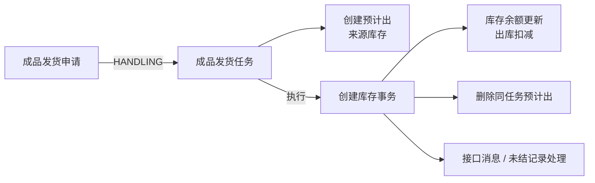

# 销售出库

## 概述

销售出库是 WMS 库房管理中面向成品销售业务的核心模块，负责管理成品从仓库出库至客户的全流程物流活动。本模块与 MES 生产完工入库、QMS 质量检验、SCP 供应链集成，是离散制造业「销售预测→备货→出库→结算」闭环的关键环节。

主要功能包括：

- **备货管理**：根据销售订单或发货计划按库存分配规则预留成品，仓管员扫码执行备货出库
- **成品发货**：发货申请→发货任务→发货记录，完成销售出库过账，触发库存账务减少
- **客户退货**：退货申请→退货任务→退货记录，退货入库并联动质检评估
- **结算出库**：面向结算场景的出库记录管理，支撑财务对账

## BATCH-01 标准占位

> 状态：首轮占位，待基于 DDL、DO、DTO、前端页面、后端服务和测试环境继续核验。下方历史字段和流程说明未完成字段真实性校正前，不作为接口、导入或测试依据。

销售出库包含备货、发货、客户退货、结算出库等申请/任务/记录类业务，应引用[申请、任务与记录模型](../../02-业务模型/01-申请任务记录模型.md)。本页后续只补销售出库特有的来源、字段、状态差异、库存影响、接口影响、终端入口和异常分支。

| 主题 | 当前占位 | 后续取证 |
| --- | --- | --- |
| 字段真实性 | 保留历史草稿，新增字段事实需待核验。 | 从 WMS DDL、DO、DTO、VO、前端配置校正真实字段名。 |
| 新增/编辑/导入 | 待补备货、发货、退货、结算出库对象的维护规则。 | 前端表单、导入类、后端校验、测试环境。 |
| 列表与详情 | 待补默认列表字段、查询字段、详情分组和快速跳转。 | 前端列表配置、详情组件、用户关注字段。 |
| 动作与状态 | 待补备货、发货执行、客户退货、撤销、结算等动作前置条件。 | 前端按钮、后端服务、状态枚举/字典。 |
| 库存挂接 | 预计应影响预计出、库存事务和库存余额；客户退货可能影响预计入/入库事务。 | 库存服务调用、事务类型、余额更新逻辑。 |
| 权限与日志 | 按 [RBAC 与动作权限取证模板](../../15-版本路线图/RBAC与动作权限取证模板.md) 逐项补。 | 菜单权限、按钮权限、接口权限、数据范围、操作日志。 |
| 终端操作 | 待补 PDA/线边端备货、发货、扫码和退货入口。 | 终端菜单、路由、扫码页面和接口。 |
| 图示与示例 | 保留流程图；待补销售发货出库、客户退货入库和库存过账样例。 | 测试数据、服务规则、业务确认。 |

## 当前页面事实卡（第二轮源码已证实）

> 本节仅覆盖标准成品发货 `deliver` 链路。备货、客户退货、结算出库虽位于本页面范围，但应分别取证，不因名称相近而继承本节的库存或接口规则。

### 已证实的实体与任务生成

标准成品发货使用 `request_deliver_*`、`job_deliver_*`、`record_deliver_*` 主明细表。申请状态进入 `HANDLING` 时生成发货任务；服务会按推荐的库存余额明细组装任务，再将任务明细按规则拆分。

| 环节 | 当前实现 | 培训与测试要点 |
| --- | --- | --- |
| 来源关联 | 申请服务关联发货计划、备货记录等对象，并在任务生成中读取业务类型配置。 | 不能直接推断每张发货申请都来源于销售订单或备货单。 |
| 任务库存定位 | 任务明细保存来源库位、来源批次、货主、库存状态、数量等信息。 | 预计出按来源库位、批次、货主、库存状态和数量创建。 |
| 任务状态 | 任务执行服务使用状态机，完成后写事务并清理预计出。 | 状态编码、可承接/关闭/执行的具体前置需继续由前端与状态枚举核验。 |
| 终端 | PDA 存在发货任务、发货明细、发货记录页面。 | 扫码、装车、签收等现场规则不在本轮擅自补写。 |

### 已证实的库存与接口链路



1. 任务生成时创建预计出，来源维度至少包含来源库位、批次、货主、库存状态与数量。
2. 任务执行与直接创建记录两条服务路径均调用库存事务服务；余额更新依循[库存数据挂接模型](../../02-业务模型/02-库存数据挂接模型.md)。
3. 执行任务后按任务号删除预计出，并处理包装父子关系；因此“发货任务已生成”与“库存已实际扣减”必须在培训中区分。
4. 任务服务发送“成品发货已发未结记录”接口消息；记录服务还存在 U9 调用方法。但真实启用条件、消息投递可靠性、幂等和失败补偿尚未完成验证，不能写成已完成的 ERP 回写承诺。

### 当前详情、快速跳转与历史草稿校正

建议成品发货详情按“来源与客户/计划”“来源库存与预计出”“任务执行与包装”“记录、事务与接口”分组，并提供发货申请、任务、记录、库存余额、预计出、库存事务的快速跳转。

本页下方 `SalesOrder`、`ShippingPlan`、`StockingApp`、`DeliveryApp` 等早期字段和固定流程均为待校正草稿。它们不可代替当前 `request_deliver_*`、`job_deliver_*`、`record_deliver_*` 的真实字段；客户退货与结算出库另行取证后再补充。

---

## 领域模型

### 实体关系图（ER）

```
┌──────────────────┐     ┌──────────────────┐     ┌──────────────────┐
│    销售订单       │     │     发货计划       │     │     备货申请       │
│  SalesOrder      │     │  ShippingPlan    │     │  StockingApp    │
├──────────────────┤     ├──────────────────┤     ├──────────────────┤
│ salesOrderId     │────→│ salesOrderId     │     │ salesOrderId    │
│ salesOrderNo     │     │ shippingPlanId   │────→│ shippingPlanId  │
│ customerId       │     │ plannedDate      │     │ stockingAppId   │
│ plannedDate      │     │ status           │     │ status          │
│ status           │     └──────────────────┘     │ warehouseId     │
└──────────────────┘                             │ applicantId     │
       │                                         └──────────────────┘
       │                                                │
       │ 触发                                           │ 触发
       ↓                                                ↓
┌──────────────────┐     ┌──────────────────┐     ┌──────────────────┐
│    备货任务       │     │    发货申请       │     │    发货任务       │
│  StockingTask    │     │  DeliveryApp    │     │  DeliveryTask   │
├──────────────────┤     ├──────────────────┤     ├──────────────────┤
│ stockingTaskId   │     │ deliveryAppId   │     │ deliveryTaskId  │
│ stockingAppId    │     │ salesOrderId    │     │ deliveryAppId   │
│ materialId       │     │ deliveryAppNo   │     │ materialId      │
│ warehouseId      │     │ customerId      │     │ plannedQty      │
│ warehouseZoneId  │     │ plannedDate     │     │ actualQty       │
│ warehouseLocId   │     │ status          │     │ actualLocId     │
│ plannedQty       │     └──────────────────┘     │ status          │
│ actualQty        │            │                   └──────────────────┘
│ status          │            ↓                          │
└──────────────────┘     ┌──────────────────┐            │ 生成
       │                  │    发货记录       │            ↓
       │                  │  DeliveryRecord │     ┌──────────────────┐
       └─────── 扫码出库 ─→│ deliveryRecordId│←────│   库存账务       │
                          │ deliveryTaskId   │     │  InventoryLedger│
                          │ materialId      │     ├──────────────────┤
                          │ actualQty       │     │ inventoryId     │
                          │ inventoryTransId │     │ materialId      │
                          │ operatorId      │     │ warehouseId     │
                          │ operateTime     │     │ warehouseZoneId │
                          └──────────────────┘     │ warehouseLocId  │
                                                 │ transType=OUT  │
                                                 │ transQty       │
                                                 └──────────────────┘
```

### 核心实体说明

| 实体 | 中文名 | 说明 |
|------|--------|------|
| SalesOrder | 销售订单 | 来自 CRM/ERP 系统的客户订购单据，含品名/数量/交期 |
| ShippingPlan | 发货计划 | 销售预测或订单分解后的发货排程计划 |
| StockingApp | 备货申请 | 按销售单触发库存预留/分配，生成备货任务 |
| StockingTask | 备货任务 | 仓管员执行的备货操作，含扫码出库确认 |
| DeliveryApp | 发货申请 | 备货完成后，发起正式发货请求 |
| DeliveryTask | 发货任务 | 仓库操作员执行的出库任务，含数量/库位确认 |
| DeliveryRecord | 发货记录 | 销售出库的正式记录，触发库存过账 |
| CustomerReturn | 客户退货 | 退货申请/任务/记录，联动质检评估 |
| SettlementOutbound | 结算出库 | 面向结算场景的出库记录 |
| InventoryLedger | 库存账务 | 库存变动流水，支撑库存报表和成本核算 |

### 关联关系

```
销售订单 ←→ 发货计划（订单行项目 一对多）
销售订单 ←→ 备货申请（按订单触发备货 多对一）
销售订单 ←→ 发货申请（按订单发起发货 多对一）
备货申请 ←→ 备货任务（申请拆解为任务 多对一）
发货申请 ←→ 发货任务（申请拆解为任务 多对一）
发货任务 ←→ 发货记录（任务完结生成记录 一对一）
发货记录 → 库存账务（触发出库过账 一对多）
客户退货 ←→ 质检单（退货入库后触发质检 多对一）
```

---

## 核心流程

### 销售出库主流程

```
                              ┌─────────────────────┐
                              │    销售订单/发货计划   │
                              │  SalesOrder/ShippingPlan│
                              └──────────┬──────────┘
                                         │
                                         │ 触发备货
                                         ↓
                         ┌──────────────────────────────┐
                         │  Step 1: 备货申请 StockingApp  │
                         │  ├─ 按销售订单分配库存锁定      │
                         │  ├─ 计算备货数量和库位          │
                         │  └─ 生成备货任务               │
                         └──────────────┬────────────────┘
                                        │
                                        │仓管员接单
                                        ↓
                         ┌──────────────────────────────┐
                         │  Step 2: 备货任务 StockingTask │
                         │  ├─ 扫描销售单/物料条码        │
                         │  ├─ 核对库位和数量             │
                         │  ├─ 执行备货（实物出库）        │
                         │  └─ 确认备货完成               │
                         └──────────────┬────────────────┘
                                        │
                                        │触发发货
                                        ↓
                         ┌──────────────────────────────┐
                         │  Step 3: 发货申请 DeliveryApp  │
                         │  ├─ 创建发货申请单              │
                         │  ├─ 选择承运商/物流方式         │
                         │  └─ 确认发货信息               │
                         └──────────────┬────────────────┘
                                        │
                                        │调度派单
                                        ↓
                         ┌──────────────────────────────┐
                         │  Step 4: 发货任务 DeliveryTask │
                         │  ├─ 仓库操作员接单             │
                         │  ├─ 扫描物料/库位/车辆         │
                         │  ├─ 确认出库数量               │
                         │  └─ 生成发货记录               │
                         └──────────────┬────────────────┘
                                        │
                                        │过账
                                        ↓
                         ┌──────────────────────────────┐
                         │  Step 5: 发货记录 DeliveryRecord│
                         │  ├─ 库存账务递减               │
                         │  ├─ 关联销售订单完成            │
                         │  └─ 推送ERP/财务系统           │
                         └──────────────────────────────┘
```

### 客户退货流程

```
┌─────────────────────┐
│   客户发起退货申请    │
│ CustomerReturnApp   │
└──────────┬──────────┘
           │
           │审核受理
           ↓
┌─────────────────────┐
│   客户退货任务        │
│ CustomerReturnTask  │
├─────────────────────┤
│  ├─ 退货收货确认      │
│  ├─ 外观检验         │
│  └─ 录入退货数量      │
└──────────┬──────────┘
           │
           │退货入库+质检
           ↓
┌─────────────────────┐
│   客户退货记录        │
│ CustomerReturnRecord│
├─────────────────────┤
│  ├─ 库存账务递增      │
│  ├─ 关联质检单       │
│  └─ 退货处理决策     │
└─────────────────────┘
```

### 结算出库流程

```
┌─────────────────────┐
│   结算出库申请        │
│ SettlementOutApp    │
└──────────┬──────────┘
           │
           │审批
           ↓
┌─────────────────────┐
│   结算出库记录        │
│ SettlementOutRecord │
├─────────────────────┤
│  ├─ 出库过账         │
│  ├─ 关联结算单       │
│  └─ 财务凭证生成     │
└─────────────────────┘
```

---

## 字段说明

### 销售订单 SalesOrder

| 字段名 | 中文名 | 类型 | 约束 | 影响业务 | 备注 |
|--------|--------|------|------|----------|------|
| salesOrderId | 销售订单ID | VARCHAR(50) | 必填 | 备货/发货/结算（唯一标识） | 销售订单在MOM系统中的唯一标识 |
| salesOrderNo | 销售订单号 | VARCHAR(50) | 必填 | 备货/发货/结算（业务关联） | 业务单据编号，用于跨系统追溯 |
| customerId | 客户ID | VARCHAR(50) | 必填 | 发货/退货（收货方） | 引用客户主数据 |
| customerName | 客户名称 | VARCHAR(200) | 必填 | 单据展示 | 客户主数据名称 |
| salesOrderType | 订单类型 | ENUM | 字典项 | 业务分类（标准/紧急/试样） | 区 分标准订单、紧急订单、试样订单 |
| plannedDate | 计划发货日期 | DATE | 必填 | 发货计划排程 | 客户要求的发货截止日期 |
| actualShipDate | 实际发货日期 | DATE | 非必填 | 发货记录 | 实际发货完成日期 |
| status | 订单状态 | ENUM | 字典项 | 备货/发货（状态流转） | 待备货/备货中/已备货/已发货/已完成/已取消 |
| totalQty | 总数量 | DECIMAL(18,6) | 必填 | 备货分配（按比例分配） | 订单总量 |
| shippedQty | 已发货数量 | DECIMAL(18,6) | 非必填 | 发货进度跟踪 | 已完成发货的累计数量 |
| currency | 币种 | VARCHAR(10) | 非必填 | 成本核算 | 默认客户主数据币种 |
| remark | 备注 | VARCHAR(500) | 非必填 | | 补充说明 |

### 发货计划 ShippingPlan

| 字段名 | 中文名 | 类型 | 约束 | 影响业务 | 备注 |
|--------|--------|------|------|----------|------|
| shippingPlanId | 发货计划ID | VARCHAR(50) | 必填 | 备货/发货（业务关联） | 发货计划的唯一标识 |
| shippingPlanNo | 发货计划号 | VARCHAR(50) | 必填 | 备货/发货（追溯） | 业务单据编号 |
| salesOrderId | 销售订单ID | VARCHAR(50) | 必填 | 备货（触发来源） | 关联销售订单 |
| planDate | 计划日期 | DATE | 必填 | 发货排程 | 计划发货日期 |
| status | 状态 | ENUM | 字典项 | 业务流转 | 待确认/已确认/已备货/已发货 |
| totalPlanQty | 计划总数量 | DECIMAL(18,6) | 必填 | 备货分配 | 发货计划总量 |
| remark | 备注 | VARCHAR(500) | 非必填 | | 补充说明 |

### 备货申请 StockingApp

| 字段名 | 中文名 | 类型 | 约束 | 影响业务 | 备注 |
|--------|--------|------|------|----------|------|
| stockingAppId | 备货申请ID | VARCHAR(50) | 必填 | 备货任务（业务关联） | 备货申请的唯一标识 |
| stockingAppNo | 备货申请号 | VARCHAR(50) | 必填 | 追溯/对账 | 业务单据编号 |
| salesOrderId | 销售订单ID | VARCHAR(50) | 必填 | 触发来源 | 关联销售订单 |
| shippingPlanId | 发货计划ID | VARCHAR(50) | 非必填 | 触发来源 | 关联发货计划（可选） |
| warehouseId | 仓库ID | VARCHAR(50) | 必填 | 备货任务（库区分配） | 引用仓库主数据 |
| applicantId | 申请人ID | VARCHAR(50) | 必填 | 流程审批 | 发起备货申请的用户 |
| applyDate | 申请日期 | DATETIME | 必填 | 流程时效 | 申请时间戳 |
| status | 状态 | ENUM | 字典项 | 任务生成 | 待分配/已分配/已取消 |
| priority | 优先级 | ENUM | 字典项 | 备货排序（紧急/标准/低） | 影响仓管员备货任务优先级 |
| remark | 备注 | VARCHAR(500) | 非必填 | | 补充说明 |

### 备货任务 StockingTask

| 字段名 | 中文名 | 类型 | 约束 | 影响业务 | 备注 |
|--------|--------|------|------|----------|------|
| stockingTaskId | 备货任务ID | VARCHAR(50) | 必填 | 发货（触发来源） | 备货任务的唯一标识 |
| stockingAppId | 备货申请ID | VARCHAR(50) | 必填 | 任务归属 | 关联备货申请 |
| materialId | 物料ID | VARCHAR(50) | 必填 | 扫码出库 | 引用物料主数据 |
| materialCode | 物料编码 | VARCHAR(50) | 必填 | 扫码出库 | 物料号 |
| warehouseId | 仓库ID | VARCHAR(50) | 必填 | 出库库位 | 引用仓库主数据 |
| warehouseZoneId | 库区ID | VARCHAR(50) | 必填 | 出库库区 | 引用库区主数据 |
| warehouseLocId | 库位ID | VARCHAR(50) | 必填 | 扫码确认 | 引用库位主数据 |
| plannedQty | 计划数量 | DECIMAL(18,6) | 必填 | 备货核对 | 应出库数量 |
| actualQty | 实际数量 | DECIMAL(18,6) | 必填 | 过账依据 | 实际出库数量 |
| stockingType | 备货类型 | ENUM | 字典项 | 分类（正常/紧急） | 区分正常备货和紧急备货 |
| status | 状态 | ENUM | 字典项 | 流程控制 | 待备货/备货中/已完成/异常 |
| operatorId | 操作员ID | VARCHAR(50) | 非必填 | 追溯 | 执行备货的仓管员 |
| scanTime | 扫码时间 | DATETIME | 非必填 | 追溯 | 扫码确认时间 |
| completeTime | 完成时间 | DATETIME | 非必填 | 时效分析 | 备货完成时间 |
| remark | 备注 | VARCHAR(500) | 非必填 | | 补充说明 |

### 发货申请 DeliveryApp

| 字段名 | 中文名 | 类型 | 约束 | 影响业务 | 备注 |
|--------|--------|------|------|----------|------|
| deliveryAppId | 发货申请ID | VARCHAR(50) | 必填 | 发货任务（业务关联） | 发货申请的唯一标识 |
| deliveryAppNo | 发货申请号 | VARCHAR(50) | 必填 | 追溯/对账 | 业务单据编号 |
| salesOrderId | 销售订单ID | VARCHAR(50) | 必填 | 关联来源 | 关联销售订单 |
| customerId | 客户ID | VARCHAR(50) | 必填 | 发货信息 | 收货方信息 |
| customerName | 客户名称 | VARCHAR(200) | 必填 | 发货信息 | 收货方名称 |
| deliveryAddress | 收货地址 | VARCHAR(500) | 必填 | 物流执行 | 客户收货地址 |
| contactPerson | 联系人 | VARCHAR(100) | 非必填 | 物流执行 | 收货方联系人 |
| contactPhone | 联系电话 | VARCHAR(50) | 非必填 | 物流执行 | 收货方联系电话 |
| plannedDate | 计划发货日期 | DATE | 必填 | 物流排程 | 计划发货日期 |
| carrierId | 承运商ID | VARCHAR(50) | 非必填 | 物流跟踪 | 引用承运商主数据 |
| carrierName | 承运商名称 | VARCHAR(200) | 非必填 | 物流跟踪 | 承运商名称 |
| transportMode | 运输方式 | ENUM | 字典项 | 物流执行（快递/零担/整车） | 运输方式字典 |
| totalQty | 总数量 | DECIMAL(18,6) | 必填 | 任务分配 | 发货总量 |
| status | 状态 | ENUM | 字典项 | 任务生成 | 待发货/已派车/已发货/已签收 |
| applicantId | 申请人ID | VARCHAR(50) | 必填 | 流程审批 | 发起发货申请的用户 |
| applyDate | 申请日期 | DATETIME | 必填 | 流程时效 | 申请时间戳 |
| remark | 备注 | VARCHAR(500) | 非必填 | | 补充说明 |

### 发货任务 DeliveryTask

| 字段名 | 中文名 | 类型 | 约束 | 影响业务 | 备注 |
|--------|--------|------|------|----------|------|
| deliveryTaskId | 发货任务ID | VARCHAR(50) | 必填 | 发货记录（业务关联） | 发货任务的唯一标识 |
| deliveryAppId | 发货申请ID | VARCHAR(50) | 必填 | 任务归属 | 关联发货申请 |
| materialId | 物料ID | VARCHAR(50) | 必填 | 扫码出库 | 引用物料主数据 |
| materialCode | 物料编码 | VARCHAR(50) | 必填 | 扫码出库 | 物料号 |
| plannedQty | 计划数量 | DECIMAL(18,6) | 必填 | 任务核对 | 应出库数量 |
| actualQty | 实际数量 | DECIMAL(18,6) | 必填 | 过账依据 | 实际出库数量 |
| actualLocId | 实际库位ID | VARCHAR(50) | 非必填 | 扫码确认 | 实际出库库位 |
| status | 状态 | ENUM | 字典项 | 流程控制 | 待发货/发货中/已完成/异常 |
| operatorId | 操作员ID | VARCHAR(50) | 非必填 | 追溯 | 执行发货的操作员 |
| scanTime | 扫码时间 | DATETIME | 非必填 | 追溯 | 扫码确认时间 |
| vehicleNo | 车牌号 | VARCHAR(50) | 非必填 | 物流跟踪 | 承运车辆车牌 |
| completeTime | 完成时间 | DATETIME | 非必填 | 时效分析 | 发货完成时间 |
| remark | 备注 | VARCHAR(500) | 非必填 | | 补充说明 |

### 发货记录 DeliveryRecord

| 字段名 | 中文名 | 类型 | 约束 | 影响业务 | 备注 |
|--------|--------|------|------|----------|------|
| deliveryRecordId | 发货记录ID | VARCHAR(50) | 必填 | 库存账务（业务关联） | 发货记录的的唯一标识 |
| deliveryRecordNo | 发货记录号 | VARCHAR(50) | 必填 | 追溯/对账 | 业务单据编号 |
| deliveryTaskId | 发货任务ID | VARCHAR(50) | 必填 | 任务追溯 | 关联发货任务 |
| deliveryAppId | 发货申请ID | VARCHAR(50) | 必填 | 单据追溯 | 关联发货申请 |
| salesOrderId | 销售订单ID | VARCHAR(50) | 必填 | 业务追溯 | 关联销售订单 |
| materialId | 物料ID | VARCHAR(50) | 必填 | 过账 | 引用物料主数据 |
| materialCode | 物料编码 | VARCHAR(50) | 必填 | 过账 | 物料号 |
| warehouseId | 仓库ID | VARCHAR(50) | 必填 | 库存账务 | 引用仓库主数据 |
| warehouseZoneId | 库区ID | VARCHAR(50) | 必填 | 库存账务 | 引用库区主数据 |
| warehouseLocId | 库位ID | VARCHAR(50) | 必填 | 库存账务 | 引用库位主数据 |
| actualQty | 实际出库数量 | DECIMAL(18,6) | 必填 | 库存账务递减 | 过账数量 |
| inventoryTransId | 库存事务ID | VARCHAR(50) | 必填 | 账务追溯 | 关联库存账务记录 |
| customerId | 客户ID | VARCHAR(50) | 必填 | [报表统计](../../06-MES-生产管理/05-报表统计/index.md) | 收货方 |
| carrierId | 承运商ID | VARCHAR(50) | 非必填 | 物流跟踪 | 承运商 |
| vehicleNo | 车牌号 | VARCHAR(50) | 非必填 | 物流跟踪 | 车牌号 |
| waybillNo | 运单号 | VARCHAR(50) | 非必填 | 物流跟踪 | 物流运单号 |
| operatorId | 操作员ID | VARCHAR(50) | 必填 | 追溯 | 执行出库的操作员 |
| operateTime | 操作时间 | DATETIME | 必填 | 账务时效 | 出库时间戳 |
| remark | 备注 | VARCHAR(500) | 非必填 | | 补充说明 |

### 客户退货申请 CustomerReturnApp

| 字段名 | 中文名 | 类型 | 约束 | 影响业务 | 备注 |
|--------|--------|------|------|----------|------|
| returnAppId | 退货申请ID | VARCHAR(50) | 必填 | 退货任务（业务关联） | 退货申请的唯一标识 |
| returnAppNo | 退货申请号 | VARCHAR(50) | 必填 | 追溯/对账 | 业务单据编号 |
| salesOrderId | 销售订单ID | VARCHAR(50) | 必填 | 关联来源 | 关联原销售订单 |
| deliveryRecordId | 原发货记录ID | VARCHAR(50) | 必填 | 退货依据 | 关联原发货记录 |
| customerId | 客户ID | VARCHAR(50) | 必填 | 退货信息 | 发起退货的客户 |
| returnReason | 退货原因 | ENUM | 字典项 | 质检评估（质量/错发/拒收/其他） | 退货原因分类 |
| returnQty | 退货数量 | DECIMAL(18,6) | 必填 | 入库依据 | 申请退货数量 |
| applicantId | 申请人ID | VARCHAR(50) | 必填 | 流程审批 | 发起退货申请的用户 |
| applyDate | 申请日期 | DATETIME | 必填 | 流程时效 | 申请时间戳 |
| status | 状态 | ENUM | 字典项 | 任务生成 | 待审核/已受理/已退货/已拒绝 |
| qualityCheckId | 质检单ID | VARCHAR(50) | 非必填 | 质检联动 | 关联质检单（退货入库后触发） |
| remark | 备注 | VARCHAR(500) | 非必填 | | 补充说明 |

### 客户退货任务 CustomerReturnTask

| 字段名 | 中文名 | 类型 | 约束 | 影响业务 | 备注 |
|--------|--------|------|------|----------|------|
| returnTaskId | 退货任务ID | VARCHAR(50) | 必填 | 退货记录（业务关联） | 退货任务的唯一标识 |
| returnAppId | 退货申请ID | VARCHAR(50) | 必填 | 任务归属 | 关联退货申请 |
| materialId | 物料ID | VARCHAR(50) | 必填 | 入库确认 | 引用物料主数据 |
| warehouseId | 仓库ID | VARCHAR(50) | 必填 | 退货入库库区 | 引用仓库主数据 |
| warehouseZoneId | 库区ID | VARCHAR(50) | 必填 | 退货入库库位 | 引用库区主数据 |
| warehouseLocId | 库位ID | VARCHAR(50) | 必填 | 退货入库位置 | 引用库位主数据 |
| returnQty | 退货数量 | DECIMAL(18,6) | 必填 | 入库核对 | 实际退货数量 |
| inspectionResult | 外观检验结果 | ENUM | 字典项 | 质检评估（合格/不合格/待检） | 退货入库前检验 |
| status | 状态 | ENUM | 字典项 | 流程控制 | 待收货/收货中/已完成/异常 |
| operatorId | 操作员ID | VARCHAR(50) | 非必填 | 追溯 | 执行退货收货的操作员 |
| receiveTime | 收货时间 | DATETIME | 非必填 | 追溯 | 退货收货确认时间 |
| completeTime | 完成时间 | DATETIME | 非必填 | 时效分析 | 退货完成时间 |
| remark | 备注 | VARCHAR(500) | 非必填 | | 补充说明 |

### 客户退货记录 CustomerReturnRecord

| 字段名 | 中文名 | 类型 | 约束 | 影响业务 | 备注 |
|--------|--------|------|------|----------|------|
| returnRecordId | 退货记录ID | VARCHAR(50) | 必填 | 库存账务（业务关联） | 退货记录的的唯一标识 |
| returnRecordNo | 退货记录号 | VARCHAR(50) | 必填 | 追溯/对账 | 业务单据编号 |
| returnTaskId | 退货任务ID | VARCHAR(50) | 必填 | 任务追溯 | 关联退货任务 |
| returnAppId | 退货申请ID | VARCHAR(50) | 必填 | 单据追溯 | 关联退货申请 |
| salesOrderId | 销售订单ID | VARCHAR(50) | 必填 | 业务追溯 | 关联原销售订单 |
| materialId | 物料ID | VARCHAR(50) | 必填 | 过账 | 引用物料主数据 |
| materialCode | 物料编码 | VARCHAR(50) | 必填 | 过账 | 物料号 |
| warehouseId | 仓库ID | VARCHAR(50) | 必填 | 库存账务 | 引用仓库主数据 |
| warehouseZoneId | 库区ID | VARCHAR(50) | 必填 | 库存账务 | 引用库区主数据 |
| warehouseLocId | 库位ID | VARCHAR(50) | 必填 | 库存账务 | 引用库位主数据 |
| returnQty | 实际退货数量 | DECIMAL(18,6) | 必填 | 库存账务递增 | 过账数量 |
| qualityResult | 质检结果 | ENUM | 字典项 | 退货处理（合格/降级使用/报废） | 质检评估结论 |
| inventoryTransId | 库存事务ID | VARCHAR(50) | 必填 | 账务追溯 | 关联库存账务记录 |
| operatorId | 操作员ID | VARCHAR(50) | 必填 | 追溯 | 执行退货的操作员 |
| operateTime | 操作时间 | DATETIME | 必填 | 账务时效 | 退货入库时间戳 |
| remark | 备注 | VARCHAR(500) | 非必填 | | 补充说明 |

### 结算出库申请 SettlementOutApp

| 字段名 | 中文名 | 类型 | 约束 | 影响业务 | 备注 |
|--------|--------|------|------|----------|------|
| settlementAppId | 结算出库申请ID | VARCHAR(50) | 必填 | 结算出库记录（业务关联） | 结算出库申请的唯一标识 |
| settlementAppNo | 结算出库申请号 | VARCHAR(50) | 必填 | 追溯/对账 | 业务单据编号 |
| settlementNo | 结算单号 | VARCHAR(50) | 必填 | 财务追溯 | 关联结算单号 |
| settlementType | 结算类型 | ENUM | 字典项 | 分类（按量结算/按账期结算） | 区 分不同结算方式 |
| applicantId | 申请人ID | VARCHAR(50) | 必填 | 流程审批 | 发起申请的用户 |
| applyDate | 申请日期 | DATETIME | 必填 | 流程时效 | 申请时间戳 |
| status | 状态 | ENUM | 字典项 | 审批流转 | 待审批/已审批/已拒绝 |
| remark | 备注 | VARCHAR(500) | 非必填 | | 补充说明 |

### 结算出库记录 SettlementOutRecord

| 字段名 | 中文名 | 类型 | 约束 | 影响业务 | 备注 |
|--------|--------|------|------|----------|------|
| settlementRecordId | 结算出库记录ID | VARCHAR(50) | 必填 | 财务追溯 | 结算出库记录的唯一标识 |
| settlementRecordNo | 结算出库记录号 | VARCHAR(50) | 必填 | 追溯/对账 | 业务单据编号 |
| settlementAppId | 结算出库申请ID | VARCHAR(50) | 必填 | 申请追溯 | 关联结算出库申请 |
| salesOrderId | 销售订单ID | VARCHAR(50) | 必填 | 业务追溯 | 关联销售订单 |
| materialId | 物料ID | VARCHAR(50) | 必填 | 过账 | 引用物料主数据 |
| warehouseId | 仓库ID | VARCHAR(50) | 必填 | 库存账务 | 引用仓库主数据 |
| outQty | 出库数量 | DECIMAL(18,6) | 必填 | 库存账务递减 | 过账数量 |
| inventoryTransId | 库存事务ID | VARCHAR(50) | 必填 | 账务追溯 | 关联库存账务记录 |
| financialDocNo | 财务凭证号 | VARCHAR(50) | 非必填 | 财务对账 | ERP财务凭证号 |
| operatorId | 操作员ID | VARCHAR(50) | 必填 | 追溯 | 执行出库的操作员 |
| operateTime | 操作时间 | DATETIME | 必填 | 账务时效 | 出库时间戳 |
| remark | 备注 | VARCHAR(500) | 非必填 | | 补充说明 |

### 库存账务 InventoryLedger（销售出库相关）

| 字段名 | 中文名 | 类型 | 约束 | 影响业务 | 备注 |
|--------|--------|------|------|----------|------|
| inventoryTransId | 库存事务ID | VARCHAR(50) | 必填 | 财务追溯（唯一标识） | 库存账务记录的唯一标识 |
| transType | 事务类型 | ENUM | 字典项 | [报表统计](../../06-MES-生产管理/05-报表统计/index.md)（SO_OUT-[销售出库](index.md)/RTN_IN-退货入库/STL_OUT-结算出库） | 区分不同出库类型 |
| transQty | 事务数量 | DECIMAL(18,6) | 必填 | 库存计算 | 变动数量（正数入库/负数出库） |
| materialId | 物料ID | VARCHAR(50) | 必填 | 库存关联 | 引用物料主数据 |
| warehouseId | 仓库ID | VARCHAR(50) | 必填 | 库存关联 | 引用仓库主数据 |
| warehouseZoneId | 库区ID | VARCHAR(50) | 必填 | 库区维度统计 | 引用库区主数据 |
| warehouseLocId | 库位ID | VARCHAR(50) | 必填 | 库位维度统计 | 引用库位主数据 |
| sourceDocId | 来源单据ID | VARCHAR(50) | 必填 | 业务追溯 | 关联发货记录/退货记录等 |
| sourceDocType | 来源单据类型 | VARCHAR(50) | 必填 | 单据追溯 | 如 DeliveryRecord/CustomerReturnRecord |
| operatorId | 操作员ID | VARCHAR(50) | 必填 | 追溯 | 执行操作的用户 |
| operateTime | 操作时间 | DATETIME | 必填 | 账务时效/报表 | 账务时间戳 |
| remark | 备注 | VARCHAR(500) | 非必填 | | 补充说明 |

---

## 字段约束说明

| 约束类型 | 说明 |
|----------|------|
| 字典项 | status（待备货/备货中/已备货/已发货/已完成/已取消）、transportMode（快递/零担/整车）、returnReason（质量/错发/拒收/其他）、qualityResult（合格/降级使用/报废）、transType（SO_OUT/RTN_IN/STL_OUT）、priority（紧急/标准/低）、stockingType（正常/紧急） |
| 联动影响 | StockingTask.actualQty→更新库存账务（出库）；DeliveryRecord.actualQty→库存账务递减；CustomerReturnRecord.returnQty→库存账务递增；库存账务记录生成后触发ERP同步，推送财务凭证 |

---

## 状态流转

### 销售出库状态机

```
[待备货] → [备货中] → [已备货]
               ↓
          [备货异常] ←→ [待备货]

[待发货] → [已派车] → [发货中] → [已发货] → [已签收]
               ↓            ↓
          [发货异常] ←→ [待发货]

备货任务完成 → 触发发货申请 → 发货任务完成 → 生成发货记录 → 库存账务递减 → 推送ERP
```

### 客户退货状态机

```
[待审核] → [已受理] → [待退货] → [收货中] → [已完成]
                ↓                    ↓
           [已拒绝]              [退货异常]
```

---

## 业务规则

1. **库存锁定规则**：备货申请提交后，系统按销售订单数量锁定对应仓库库存，形成预留库存。备货任务完成后释放锁定并执行实际出库。

2. **序列号管理**：如果物料启用序列号管理，备货/发货时必须扫描序列号，系统校验序列号与销售订单的匹配关系。

3. **批号追溯**：如果物料启用批号管理，出库时自动按先进先出（FIFO）规则分配批号，确保批号追溯。

4. **库存预警**：发货记录生成后，系统检查库存是否低于安全库存阈值，低于阈值时触发库存预警通知。

5. **物流同步**：发货记录完成后，自动推送物流信息至承运商系统，获取实时物流状态。

6. **退货质检联动**：客户退货收货完成后，自动创建质检单，质检结果决定退货是合格入库、降级使用还是报废。

7. **结算出库与普通出库区别**：结算出库不关联发货任务，直接基于结算单执行出库过账，用于按结算周期结费的场景。

## 相关模块接口

### 依赖模块

| 模块 | 接口方向 | 说明 |
|------|----------|------|
| WMS_INVENTORY | [库存管理](../09-库存管理/index.md) | 检查成品库存可用量 |
| DBC_MATERIAL | [物料主数据](../../04-DBC-主数据管理/01-物料管理/01-物料基本信息.md) | 获取物料信息 |
| DBC_CUSTOMER | [客户主数据](../../04-DBC-主数据管理/03-客户管理/01-客户.md) | 获取客户信息用于发货 |
| DBC_WAREHOUSE | [仓库主数据](../../04-DBC-主数据管理/04-工厂建模/01-仓库管理.md) | 获取仓库信息 |

### 被依赖模块

| 模块 | 接口方向 | 说明 |
|------|----------|------|
| SCP_PURCHASE | [采购供应链](../../10-SCP-供应链平台/index.md) | 发货状态同步至供应链跟踪 |
| ERP_FINANCE | [ERP 财务](../../01-总体框架/architecture.md) | 出库过账同步至财务存货出账 |
