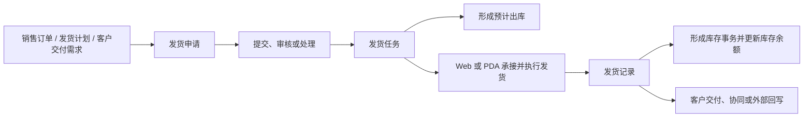
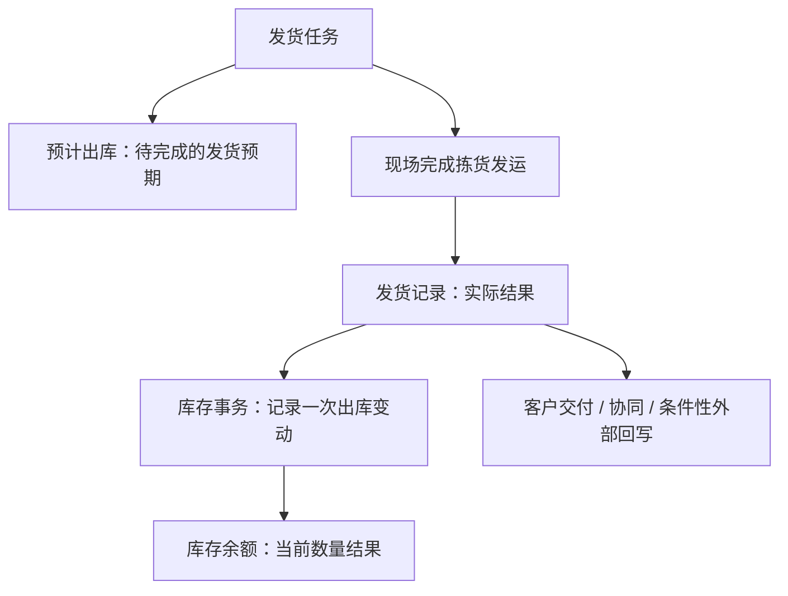

# 销售出库

> 适用基线：测试环境目标 / `dev` 分支 / 2026-07-15。
> 阅读对象：销售协同人员、仓库备货/发运人员、客户交付人员及需要追溯出库结果的业务人员。

## 业务目的与适用范围

销售出库把客户交付需求转化为仓库可执行的备货、发运和实际出库结果。它连接销售订单或发货计划、成品可用库存、现场拣货与装运，以及库存扣减和后续客户/外部协同，确保“要发什么、发给谁、从哪里发、实际发了多少”能够完整追溯。

本页说明标准发货主链。通用的申请、任务和记录概念见[申请、任务与记录模型](../../02-业务模型/01-申请任务记录模型.md)；本页只说明销售出库的来源、现场执行、库存影响和异常处理。备货、客户退货、销售结算出库等相邻入口在本页只界定边界，不共用未经证实的状态机。

## 如何使用本组文档

| 你的目的 | 建议阅读 |
| --- | --- |
| 想理解客户交付如何变成可追溯的出库和库存结果 | 本页。按一笔发货、角色、关键决策和异常处理理解主线。 |
| 正在发起发货申请、承接任务、使用 PDA、撤销或追溯一笔发货 | [销售出库-维护与查询参考](销售出库-维护与查询参考.md)。该页按申请、任务、记录和查询任务展开。 |
| 需要核对字段技术名、服务链路或状态实现 | 由文档维护人员查询内部证据底稿；业务读者不需要阅读。 |

## 使用前准备

开始发货前，应确认以下条件：

| 需要确认什么 | 为什么重要 |
| --- | --- |
| 来源单据 | 当前可从销售订单、发货计划、客户交付需求或备货结果带入发货信息；实际可选择范围受业务配置限制。 |
| 客户、交付地点和交接信息 | 确保成品发往正确对象和地点；客户月台等资料应事先维护。 |
| 可用库存、库位、批次和包装 | 决定可拣货范围及追溯要求；执行时按库存管理精度核对余额。 |
| 质量与放行状态 | 避免未放行、隔离或冻结库存被用于交付。 |
| 运输、承运或发运信息 | 支持装运交接和交付协同。 |
| 执行权限与终端 | Web 和 PDA 都存在执行入口；具体谁可以发起、处理、承接或撤销，取决于当前权限和业务配置。 |

!!! example "📷 截图占位"
    发货申请新增页。标出销售来源、客户、客户月台、物料明细、出库库存状态和发运信息；使用脱敏测试数据。

## 一笔销售出库如何完成

这条链路中，申请表达“需要对哪一笔客户交付进行发货”，任务把工作分配给仓库现场，记录保存实际发运结果。申请进入处理后会生成任务并形成预计出库；实际发货记录完成后，系统再形成出库库存事务、更新余额，并清理对应预计出库。

!!! example "📝 示例数据占位"
    客户订单 100 件，备货/发货 100 件、实发 98 件、缺货 2 件。展示订单、申请、任务、发运记录、库存结果和客户交付处理。

### 发货过程中要作出的关键判断

| 判断点 | 应先确认什么 | 判断后的影响 |
| --- | --- | --- |
| 是否可以发起发货 | 来源单据、客户、物料、数量和交期是否与交付需求一致。 | 决定是否建立申请，避免把错误交付带入后续任务。 |
| 从哪里拣货 | 库位、库存状态、批次/包装和质量放行情况。 | 决定实际交付对象与可追溯性。 |
| 如何现场执行 | 任务是否要求扫描包装、批次、库位，是否允许修改数量或库位。 | 决定使用 Web 还是 PDA 及现场录入方式。 |
| 差异怎样处理 | 是少发、多发、错料、错批次、运输异常还是需要撤销。 | 决定保留何种原因、是否补发或回退。 |
| 发货后如何确认结果 | 发货记录、库存事务和库存余额是否可追溯。 | 决定是否已完成本次出库，或需转入后续协同。 |

## 三类业务对象分别做什么

| 对象 | 用业务语言理解 | 使用者最关心什么 |
| --- | --- | --- |
| 发货申请 | 对一笔客户交付提出发货处理请求，汇集客户、来源单据、物料和计划信息。 | 客户与来源是否正确、物料是否匹配、是否可以进入处理。 |
| 发货任务 | 把申请转成现场可执行的拣货与发运工作。 | 谁来执行、发什么、发多少、从哪个库位、是否需要扫描或允许差异。 |
| 发货记录 | 保存已实际完成的发运结果。 | 实发多少、何时由谁执行、是否已影响库存、是否还要协同或回写。 |
| 撤销结果 | 记录已发货后的回退处理。 | 原因、数量、对库存和外部协同的影响。 |

## 角色与操作分工

| 角色/岗位 | 典型工作 | 需要进一步确认的内容 |
| --- | --- | --- |
| 发货申请发起人 | 从来源单据或计划创建申请，核对客户、物料和交付信息。 | 是否由销售、计划或仓库发起，以组织流程配置为准。 |
| 审核或处理人员 | 对申请执行提交后的审核、同意、驳回或处理。 | 自动提交、自动同意、自动处理策略及实际审批主体。 |
| 仓库执行人员 | 承接任务，扫描或录入实际拣货发运信息，完成任务。 | Web/PDA 权限、任务分配及数量/库位可修改范围。 |
| 客户/运输协同人员 | 处理承运、装运、交付地点和后续协同信息。 | 外部回写、结算或接口是否在本业务中触发。 |

## 状态与关键动作

销售出库页面提供以下动作。动作是否在某个状态展示、是否受角色限制，需以测试环境和权限配置最终确认；培训时不能仅凭看到按钮就假定所有人都能执行。

| 所属对象 | 常见动作 | 业务结果 |
| --- | --- | --- |
| 发货申请 | 新增、修改、删除、提交、同意、驳回、处理、关闭、重新添加、导入。 | 将交付需求从待处理申请推进为可执行任务，或结束本次申请。 |
| 发货任务 | 承接、放弃、执行发货、关闭、撤销、调整任务配置。 | 形成现场执行结果；处理申请生成任务时会建立对应的预计出库信息。 |
| 发货记录 | 查询、撤销发货记录。 | 已完成发货会形成出库库存结果；撤销需关注冲抵事务和外部回写。 |

!!! example "📐 图示占位"
    销售出库状态图。应明确申请、任务、记录各自的状态、允许动作、少发和撤销分支；以测试环境状态值为准。

## 现场执行：Web 与 PDA

发货任务可以在 Web 端或 PDA 端执行。PDA 更适合库内扫码和现场确认，当前已定位成品发货任务、成品直接发货等终端入口。现场执行时通常需要：

- 按任务定位待发物料，核对客户、来源单据和数量；
- 按库存管理精度核对物料、包装/父包装、批次、来源库位和库存状态；
- 是否允许修改数量、库位、批次、包装号，是否允许少发、多发或重复扫码，受任务配置控制；
- 扫描或实物不匹配时停止操作，不要强行完成。

### 现场执行建议步骤

1. 扫描或查询任务，核对客户、来源单据和物料。
2. 按任务要求扫描包装、批次和库位，或录入实际数量。
3. 出现数量、批次或客户信息异常时，不要直接强行完成；根据配置选择少发、异常登记或转入后续处理。
4. 提交后查询发货记录，确认库存事务、余额变化及是否进入客户/外部协同后续环节。

!!! example "📷 截图占位"
    PDA 发货任务列表、拣货详情、扫描库位/包装、少发或异常提示。每张截图都应标出操作顺序与关键校验。

## 对库存和相关业务的影响

销售出库不是“点击完成就直接改库存”的孤立动作。当前已确认的业务关系是：

1. 发货申请进入处理后，系统生成发货任务并建立预计出库信息，用于表达待发货的库存预期。
2. 任务执行时按库存管理精度核验余额；通过后生成发货记录，并形成出库库存事务。
3. 库存事务再更新库存余额；同时清理任务对应的预计出库。
4. 发货记录还可以作为客户交付协同、冲销接口或结算相关处理的来源；冲销/接口是否触发受规则开关和接口类型控制，不能把“已发货”直接等同于外部入账完成。

库存余额的变化应从发货记录和库存事务追溯，不要用预计出库代替实际扣减，也不要用手工改余额掩盖少发或多发。

!!! example "📝 示例数据占位"
    计划 100、实发 98、缺货 2 的发货示例。应展示预计数量、实际数量、记录、库存变动和后续处理对象；具体状态以测试环境验证后补充。

## 相邻业务入口与边界

销售出库分组周边还有多条相关但不可混写的业务入口。培训和排错时应先确认当前处理的是哪一类对象：

| 相邻入口 | 与标准发货的关系 | 本阶段写法 |
| --- | --- | --- |
| 发货计划 | 可作为申请来源之一，表达计划层交付安排。 | 作为来源与联查对象说明。 |
| 备货申请/任务/记录 | 可先形成备货结果，再转入发货；不是同一对象链。 | 只说明边界，规则待专项取证。 |
| 客户退货 | 处理客户退回，方向与出库相反。 | 不与发货共用状态和库存结论。 |
| 销售结算出库 | 面向结算场景的独立申请/记录入口。 | 不写成标准发货的必经后续。 |
| 寄售/在途、发货调整 | 存在独立菜单与对象。 | 登记待确认，不并入本页主流程。 |

## 数量差异、缺货与撤销

| 场景 | 当前可确认的处理方向 | 需要补充的内容 |
| --- | --- | --- |
| 少发/多发 | 任务结构支持数量修改、少发/多发等控制开关；是否允许取决于任务配置。 | 差异原因、审批要求、默认配置和页面提示。 |
| 库存不足 | 执行时按余额与库存定位信息核验；余额不足不得假装完成。 | 缺货后补发、关闭或转异常协同的标准动作。 |
| 扫码或库位不匹配 | 可由任务配置要求扫描、校验或限制修改。 | 常见提示、处理人和绕过规则。 |
| 撤销发货 | 发货记录提供撤销入口；撤销会影响已形成的库存，并可能触发冲销类后续处理。 | 冲抵记录、反向库存结果、外部系统回退和规则开关的测试证据。 |

!!! example "📷 截图占位"
    少发提示、库存不足提示或撤销确认窗口。

## 查询、详情与追溯

### 推荐查询方式

| 要找什么 | 推荐条件 | 可判断的问题 |
| --- | --- | --- |
| 一批待处理交付 | 发货申请号、销售订单号、客户、发货计划号。 | 是否已经进入申请、审核或任务阶段。 |
| 现场待执行工作 | 任务号、状态、客户、销售订单号。 | 谁可以承接、是否正在执行、是否被关闭或撤销。 |
| 实际出库结果 | 发货记录号、销售订单号、客户、客户交货单号。 | 实发结果、库存影响及接口/协同线索。 |

当前申请、任务、记录页面均可围绕单据号、客户、销售订单、发货计划和状态定位。业务查询应先使用单据号、订单或客户定位，再查看明细数量与库存结果。

### 详情分组与快速跳转

| 分组 | 应展示什么 | 可联查什么 |
| --- | --- | --- |
| 基本信息 | 单据号、状态、客户、交付地点、来源单据、处理人和时间。 | 来源申请、来源任务、发货计划或销售订单。 |
| 交付与明细 | 物料、单位、计划数量、实发数量、批次、包装和库位。 | 物料详情、客户物料、库存相关查询。 |
| 执行与差异 | 承接信息、扫描结果、数量差异、撤销信息。 | PDA 执行记录、撤销或冲抵结果。 |
| 后续处理 | 库存变动、客户协同、外部回写。 | 库存事务、库存余额、撤销记录。 |
| 系统信息 | 创建、更新、接口结果和审计信息。 | 操作/接口日志（后续补齐）。 |

!!! example "📷 截图占位"
    申请、任务、记录详情页的分组和联查入口。后续确认实际 Tab 顺序与跳转过滤条件。

## 常见问题与处理

| 情况 | 建议处理 |
| --- | --- |
| 销售订单或计划无法带入 | 先确认来源单据状态、客户资料和当前业务类型是否满足可选条件。 |
| 库存有数但无法发货 | 核对库存状态、冻结、质量放行、库位、批次/包装和任务分配条件。 |
| 扫描批次/包装不匹配 | 停止操作，核对任务明细和可用库存，不要强行发货。 |
| 实发数量与订单不一致 | 记录少发/多发原因，并按交付异常流程处理。 |
| 发货完成但余额未变化 | 先查发货记录，再查库存事务和库存余额；同时确认是否仍有异步或接口处理。 |
| 把备货、退货或结算出库当成同一流程 | 先回到对应菜单对象；不同子域不能共用未经证实的完成状态。 |

## 当前限制与待确认事项

- 申请、任务、记录的具体状态值、自动提交/自动同意/自动处理策略和真实审批主体尚需测试环境验证；在明确前，文档只描述已知业务动作，不承诺固定状态流转。
- 备货、客户退货、寄售/在途、销售结算出库、发货调整等子域的完整闭环尚未逐项闭合；本页只保证标准发货主链的可讲、可查写法。
- 冲销接口受规则开关和接口类型控制；不得将“已发货”直接培训为统一的物流、结算和外部入账完成状态。
- 数量差异、库位/批次修改、PDA 与 Web 权限边界需补充典型配置与现场截图后才能形成操作标准。

## 图示、截图与示例任务

| 类型 | 后续需要补充的内容 | 目的 |
| --- | --- | --- |
| 全流程图 | 来源单据到申请、任务、记录、库存和后续协同的路径。 | 支持入门培训。 |
| 状态图 | 申请、任务、记录的状态与动作，含少发、撤销分支。 | 解释“什么状态能做什么”。 |
| Web 截图 | 申请、任务、记录列表与详情。 | 支持查询和业务角色培训。 |
| PDA 截图 | 任务承接、扫码、发货、异常提示。 | 支持现场操作培训。 |
| 示例数据 | 正常发运、缺货少发、批次不匹配、撤销四类业务。 | 支持数量、库存影响与异常处理讲解。 |
