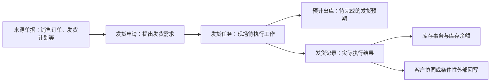

# 销售出库-维护与查询参考

> 适用基线：测试环境目标 / `dev` 分支 / 2026-07-15。
> 用途：配合[销售出库业务说明](index.md)使用。本页用于操作、查询、测试和异常定位；端到端业务背景和培训主线以主文档为准。本阶段以标准发货申请—任务—记录为主线；备货、客户退货、销售结算出库作为可联查分支，不混用规则。

## 快速定位

| 你要做什么 | 先看哪里 |
| --- | --- |
| 理解选择器、余额核验与门禁 | “字段说明” |
| 从来源单据发起发货 | “申请：建立待发货交付” |
| 到现场拣货或发运 | “任务：承接与现场执行” |
| 查实际结果或撤销 | “记录：实际发货结果” |
| 查库存为什么没有变化 | “库存影响与追溯” |
| 使用 PDA | “终端执行参考” |
| 对照收货样板写法 | [采购收货-维护与查询参考](../03-采购收货/01-采购收货-维护与查询参考.md)（本页写出库差异） |
| 想先理解发货为什么要经过申请、任务和记录 | 返回[销售出库业务说明](index.md)。 |

## 字段说明
相对采购收货的核心差异：客户/月台替代供应商；**预计出**替代预计入；执行时按精度**核验余额**后出库。备货、客户退货、结算出库等**不共用**本表状态结论。

写法约定见[页面数据字典规范](../../02-业务模型/04-页面数据字典规范.md)；粒度通例见[库存管理精度与唯一粒度](../../02-业务模型/08-库存管理精度与唯一粒度.md)。

### 字段说明总表
| 字段 | 业务作用 | 谁在何时维护/选择 | 业务约束摘要 | 影响哪些功能 | 变更或错选风险 |
| --- | --- | --- | --- | --- | --- |
| 业务类型 | 发货场景策略入口 | 申请建立时确定 | 按标准发货场景使用 | 自动动作、编号、接口路径 ❓ | 错选偏离主链 |
| 销售订单 / 发货计划 | 交付范围 | 申请新增时选择 | 符合可发状态与类型（❓） | 明细、任务、追溯 | 整单发错 |
| 客户 | 交付对象 | 多由来源回填 | 通常锁定 | 装运、协同、对账 | 与实物不符 |
| 客户月台 | 装运交接点 | 选择或回填 | 应与客户一致（校验线索） | 现场装运 | 月台错位（`GAP-047`） |
| 承运 / 运输方式 / 车牌 | 发运识别 | 申请或现场维护 | 选择器来源 ❓ | 交接与协同 | 运输信息错误 |
| 明细物料 | 应发物料 | 来源明细带入 | 来源范围内 | 拣选、事务 | 选不到先查来源 |
| 出库库存状态范围 | 可拣状态集合 | 申请/任务配置 | 限制余额过滤 | 执行核验 | 状态过宽误发未放行库存 |
| 计划 / 实发数量 | 控制出库量 | 计划来自来源；实发现场 | 少发/多发受任务配置 | 预计出、事务、余额 | 缺货假装完成 |
| 来源库位 / 批次 / 包装 | 出库粒度 | 执行选择或扫描 | 余额业务键 + 可用量核验 | 出库事务 | 扫错导致扣错行 |
| 申请/任务/记录/撤销状态 | 门禁 | 系统迁移 | 处理→任务+预计出；完成清预计出 | 提交、执行、撤销 | 撤销与外部冲销开关（`GAP-068`） |
| 创建人/时间等 | 审计 | 系统写入 | 勿当可维护项 | 追溯 | — |

### 选择器可选范围
| 选择字段 | 选择对象 | 可选范围 | 范围依赖 | 选中后带回或锁定 | 选不到时通常原因 |
| --- | --- | --- | --- | --- | --- |
| 销售订单 / 发货计划 | 订单或计划 | 可发货状态且符合当前业务类型（❓） | 业务类型；客户；权限 ❓ | 客户、月台草稿、可发明细 | 未发布/关闭、类型不符、无剩余可发 |
| 客户 | 客户主数据 | 多回填；若可选应为可用客户 | 来源单据 | 名称等 | 停用、权限外 |
| 客户月台 | 客户月台 | **属于当前客户**的有效月台 | 已选客户 | 装运点信息 | 客户未维护月台、不一致 |
| 明细物料 | 来源明细内物料 | 来源范围内；可用成品等用途 ❓ | 来源单 | 单位、计划量 | 不在来源、停用 |
| 拣选库存余额 | 库存余额 | 物料匹配 + 出库状态范围内 + 库位/批次/包装符合任务 + **可用量足够** | 出库状态范围、任务扫描、权限 ❓ | 锁定来源库位与追溯维度 | 状态不可发、冻结、余额不足、粒度不符 |
| 承运商等 | 承运主数据或字典 | ❓ | — | 运输展示 | 未维护 |

### 联动 / 回填 / 数量 / 采集（摘要）

| 模式 | 本页要点（相对收货） |
| --- | --- |
| P4 | 更换来源单 → 重载客户与明细；更换客户 → 清空或重选月台；变更仓库 → 清空拣选库位。 |
| P5 | 来源回填客户/订单信息通常锁定；选中余额后锁定批次包装库位（任务允许改除外）。 |
| P7 | 实发受计划与可用量约束；预计出在处理生成任务时建立，完成时清理。 |
| P8 | 包装/父包装、批次、来源库位、库存状态为执行核验维度；不匹配必须停止。 |

### 状态-动作摘要（P9）

| 对象 | 允许动作（入口存在） | 前置检查 | 成功后的下游影响 | 禁止或风险说明 |
| --- | --- | --- | --- | --- |
| 发货申请 | 新增、修改、删除、提交、同意、驳回、处理、关闭、重新添加、导入 | 来源与明细完整；自动策略 ❓ | 处理生成任务并建预计出 | 已有任务/记录勿随意删 |
| 发货任务 | 承接、放弃、执行、关闭、撤销、调整配置 | 余额按精度核验 | 形成记录与出库事务，清理预计出 | 余额不足不得假装完成 |
| 发货记录 | 查询、撤销 | 已有实发 | 库存结果；条件性冲销/接口（`GAP-068`） | 撤销须联查外部回退 |
| 备货/客户退货/结算出库 | 各自入口 | 各自规则 | — | **禁止**套用本表 |

## 业务对象关系

现场操作应先判断自己正在处理的是“待确认的申请”“待执行的任务”还是“已经产生的发货记录”。三者名称相近，但可做的动作、需要核对的信息和后续影响不同。

## 页面与业务对象

| 菜单入口 | 当前对象链 | 使用说明 |
| --- | --- | --- |
| 发货申请 | 申请 → 任务 → 记录 | 标准客户交付发货主入口。 |
| 发货任务 | 任务 → 现场执行 → 记录 | 仓库拣选、扫码和发运的主要入口。 |
| 发货记录 | 实际记录 → 库存事务/余额 | 查询实际发货及库存结果。 |
| 发货撤销记录 | 已撤销结果 | 查询回退处理，不能当作删除历史。 |
| 发货计划 | 计划 → 可转申请 | 计划层来源与联查对象。 |
| 备货申请/任务/记录 | 独立对象链 | 可先备货再发货；规则待专项确认。 |
| 客户退货 | 独立对象链 | 客户退回，不与发货混用。 |
| 销售结算出库 | 独立申请/记录入口 | 结算场景，不写成标准发货必经后续。 |

## 申请：建立待发货交付

### 应核对的信息

| 信息组 | 业务用途 |
| --- | --- |
| 来源单据与客户 | 确认本次发货发给谁、来自哪张订单或计划。 |
| 销售订单、发货计划、客户交货单 | 用于核对交付范围与后续追溯。 |
| 客户月台、承运、运输方式、车牌 | 用于装运交接和现场识别。 |
| 物料、单位与数量 | 形成现场发货任务的基础。 |
| 出库库存状态与地点要求 | 限制可拣库存范围，避免误发未放行库存。 |

当前页面可关联发货计划、销售订单、客户和客户月台等信息；业务类型按发货场景使用，不应由操作人员随意替换。

### 常用动作

| 动作 | 目的 | 操作提醒 |
| --- | --- | --- |
| 新增/修改 | 建立或更正待发货交付。 | 来源单据带入的客户、订单等信息通常不应随意改写。 |
| 提交、同意、驳回、处理 | 推进申请进入下一步。 | 申请进入处理后会生成任务并形成预计出库；是否自动执行取决于业务配置。 |
| 关闭、重新添加 | 结束或重新处理申请。 | 应先判断是否已经生成任务或记录。 |
| 导入 | 批量建立发货申请。 | 模板、模式和校验规则待实测；不导入系统编号、历史状态或审计信息。 |

!!! example "📷 截图占位"
    来源单据选择、客户/月台带入、申请提交与处理入口。

## 任务：承接与现场执行

任务是仓库现场真正要完成的工作。它保存来源申请、客户、物料、数量、来源库位和批次/包装等执行信息，并在申请处理生成任务时形成预计出库。

| 现场要确认什么 | 为什么重要 |
| --- | --- |
| 任务号、来源申请和客户 | 防止处理错交付对象。 |
| 物料、单位、计划数量 | 用于核对实际拣货。 |
| 库位、库存状态、批次和包装 | 决定实际库存定位和追溯粒度；执行时会核验余额。 |
| 是否允许改数量、库位、批次、包装 | 这些限制由任务配置决定，不能凭经验绕过。 |

### 常用动作

| 动作 | 业务结果 |
| --- | --- |
| 承接 | 将待处理任务交给当前执行人。 |
| 放弃 | 放回或退出当前执行责任；具体后续状态需测试确认。 |
| 执行发货 | 按任务完成扫描和数量确认，形成实际发货结果，并清理对应预计出库。 |
| 关闭或撤销 | 结束未完成任务或取消任务；需同时检查预计出库和下游影响。 |

!!! example "📷 截图占位"
    任务列表、承接操作、任务配置限制和执行入口。

## 记录：实际发货结果

发货记录用于追溯“实际发了什么、发了多少、谁在何时执行”，并且是后续库存、客户协同和条件性外部回写的重要来源。

| 你要查什么 | 推荐查看内容 |
| --- | --- |
| 实发结果 | 发货记录号、来源申请/任务、客户、物料、实发数量、库位、批次、包装。 |
| 库存结果 | 对应库存事务和库存余额是否已产生变化。 |
| 协同/回写线索 | 外部凭证号、接口处理结果或结算相关信息。 |
| 撤销影响 | 原发货记录、撤销结果、库存反向影响和外部回写状态。 |

### 常用动作

| 动作 | 何时使用 | 需要关注什么 |
| --- | --- | --- |
| 查询与联查 | 确认交付和库存结果时。 | 以记录、事务、余额三者联查为准。 |
| 撤销发货记录 | 已确认的发货需要回退时。 | 应核对库存冲抵、后续单据和外部系统是否同步回退；接口类冲销可能受规则开关控制。 |

!!! example "📷 截图占位"
    发货记录详情、库存联查入口、撤销确认提示。

## 库存影响与追溯

| 发生时点 | 系统业务结果 | 如何追溯 |
| --- | --- | --- |
| 申请处理生成任务 | 形成预计出库，表达待完成的发货预期。 | 从任务号查预计出库。 |
| 完成发货 | 形成发货记录和出库库存事务，并清理对应预计出库。 | 从发货记录查库存事务。 |
| 库存事务完成 | 更新库存余额。 | 按物料、库位、批次、包装、库存状态等库存信息查询余额。 |
| 条件性后续处理 | 可能进入客户协同、冲销接口或结算相关处理。 | 从发货记录的后续线索或关联号查询，不以“已发货”直接推断外部完成。 |

如果“发货完成但库存查不到”，不要先认定为失败。应依次检查：发货记录是否已生成、库存事务是否已生成、查询条件是否覆盖完整库存粒度、是否仍有异步或接口处理。

## 终端执行参考

| 场景 | PDA 当前操作特点 |
| --- | --- |
| 定位任务 | 已定位成品发货任务入口；可按任务信息进行现场执行。 |
| 直接发货 | 菜单存在成品直接发货入口；与标准任务执行的状态边界待实测。 |
| 拣货发运 | 需按任务核对话料、包装/批次、来源库位和库存状态。 |
| 数量与库位修改 | 受任务配置控制；不匹配时必须停止并走异常处理。 |
| 备货/退货终端 | 另有备货、客户退货等 PDA 入口，不得与标准发货混操作。 |

!!! example "📷 截图占位"
    PDA 任务定位、拣货扫描、少发提示、直接发货四个关键界面。

## 查询与详情参考

| 查询对象 | 建议默认看什么 | 常用筛选 |
| --- | --- | --- |
| 发货申请 | 单据号、状态、客户、销售订单、发货计划、客户交货单。 | 单据号、销售订单号、客户、发货计划。 |
| 发货任务 | 单据号、来源申请、状态、客户、销售订单、执行人。 | 单据号、状态、客户、销售订单。 |
| 发货记录 | 单据号、状态、来源申请/任务、客户、销售订单、执行时间。 | 单据号、销售订单号、客户、客户交货单。 |
| 撤销记录 | 原记录号、撤销原因、处理时间和库存影响线索。 | 原发货记录号、客户、销售订单。 |

详情页宜按“基本信息、交付与明细、执行与差异、后续处理、系统信息”分组；后续需要在测试环境确认实际分组、页签和跳转过滤条件。

## 操作前的快速核对

| 你准备做的操作 | 最少先核对什么 |
| --- | --- |
| 发起或修改申请 | 来源单据、客户、交付地点、物料、单位与计划数量。 |
| 承接或执行任务 | 任务状态、执行人、扫描要求、库位/批次/包装、库存状态和数量修改限制。 |
| 少发、多发或撤销 | 差异原因、任务配置、是否已有库存结果和外部协同线索。 |
| 查询“是否已出库” | 发货记录、库存事务、库存余额及预计出库是否已清理。 |

## 待补充的状态图与示例

!!! example "📐 图示占位"
    申请、任务、记录的状态图。需要通过测试环境确认每个状态、动作前置条件、少发/撤销分支后绘制；不得使用历史草稿中的未验证状态。

!!! example "📝 示例数据占位"
    正常发运、缺货少发、批次不匹配、撤销四笔脱敏业务数据；每笔应串联来源单据、申请、任务、记录、库存结果和后续处理。

## 仍待业务确认

- 自动提交、自动同意、自动处理和直接生成记录等策略的实际配置及适用场景；
- 备货转入发货、客户退货、寄售/在途、销售结算出库和发货调整的完整状态与库存闭环；
- 少发、多发、重复扫码和数量/库位修改的默认策略；
- 撤销发货后的冲抵、外部系统回退和规则开关触发条件；
- 实际详情分组、关联 Tab、跳转过滤条件和 RBAC 边界。
