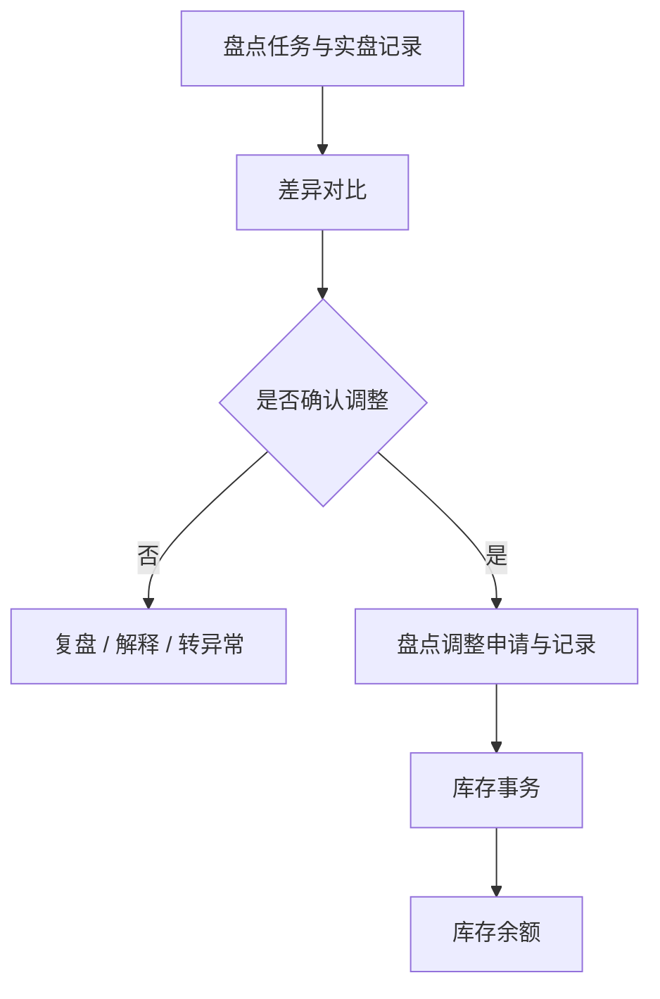

# 盘点管理

> 适用基线：测试环境目标 / `dev` 分支 / 2026-07-15。
> 阅读对象：测试、实施、运维（主）；仓库主管、盘点、财务/审计协同人员（顺带）。

## 业务目的与适用范围

盘点管理用于比较系统库存与现场实物，发现差异后按受控流程确认和调整，使库存余额能够持续接近真实现场。它覆盖盘点计划、申请、任务、现场记录、差异对比和盘点调整等环节；重点不是“把数字改成一样”，而是保留差异来源、盘点过程和最终调整依据。读完本页，应能判断盘点差异出现在哪个环节、为什么盘点执行本身不直接改库存，以及调整生效前后分别该查什么。

本页讲清盘点的业务主线。通用的申请、任务和记录概念见[申请、任务与记录模型](../../02-业务模型/01-申请任务记录模型.md)。盘点执行与盘点调整是不同对象链；历史“差异库存单独建账再出库”的说法与当前可证实实现不一致，不能再作为标准培训流程。

## 如何使用本组文档

| 你的目的 | 建议阅读 |
| --- | --- |
| 想理解盘点如何发现并受控处理账实差异 | 本页。 |
| 正在建计划、执行盘点、对比差异或做调整 | [盘点管理-维护与查询参考](盘点管理-维护与查询参考.md)。 |

## 使用前准备

| 需要确认什么 | 为什么重要 |
| --- | --- |
| 盘点范围与时间 | 明确盘哪些仓库、库区、库位、物料或库存状态。 |
| 盘点方式与责任人 | 决定全盘、循环盘点、抽盘等组织方式及任务分配。 |
| 账面库存基准 | 用于与实际扫描/计数结果进行比较。 |
| 批次、包装、容器和库存状态 | 防止仅按物料汇总而遗漏追溯维度。 |
| 作业冻结或并发规则 | 避免盘点期间继续收发造成无法解释的差异。 |

!!! example "📷 截图占位"
    盘点计划或申请页面，标出盘点范围、责任人、计划时间和盘点方式。

## 一次盘点如何完成

盘点任务组织现场执行，盘点记录保存实盘结果，差异对比说明账实差在哪里，调整申请和记录负责将已经确认的差异转为受控库存结果。发现差异后，不应跳过对比和原因确认直接修改余额，也不应改走普通[库内作业](../11-库内作业/index.md)掩盖差异。

当前可证实的调整方式是：盘点调整按正负数量生成入/出库存事务。历史“先入差异库再出库/报废”的流程不能写成现行标准。

!!! example "📝 示例数据占位"
    某库位账面 100 件、实盘 96 件。展示盘点任务、实盘记录、差异对比、调整申请、调整记录和库存结果。

### 关键判断

| 判断点 | 应先确认什么 | 对业务的影响 |
| --- | --- | --- |
| 盘什么 | 仓库/库位、物料范围、库存状态、批次/包装和盘点方式。 | 决定任务范围和账面基准。 |
| 如何记实物 | 扫码、逐件/逐箱计数、容器信息和现场异常。 | 决定实盘记录的可靠性。 |
| 是否存在差异 | 账面数量、实盘数量、地点和追溯维度是否按同一口径比较。 | 决定是否进入差异分析。 |
| 是否可调整 | 差异原因、复核结果、审批和是否存在并发业务。 | 决定是否形成正式调整记录。 |

### 关键字段业务角色

完整语义见[维护与查询参考](盘点管理-维护与查询参考.md)。盘点执行**不直接改余额**；只有盘点调整按正负数量生成事务（`GAP-043`：历史差异库流程不是现行标准）。盘点范围选择通例见[通用选择器过滤惯例](../../02-业务模型/12-通用选择器过滤惯例.md)、[库位与仓储级联惯例](../../02-业务模型/13-库位与仓储级联惯例.md)。

| 字段/配置点 | 在系统中的作用 | 关键行为要点（取值/范围/联动/门禁） | 维护或操作时要警惕什么 |
| --- | --- | --- | --- |
| 盘点范围（仓/区/位/物料/状态） | 决定盘什么 | 范围不清不得下发任务 | 漏范围导致假性盘盈盘亏 |
| 账面数量 | 比较基准 | 从库存余额按唯一粒度带出，见[库存管理精度与唯一粒度](../../02-业务模型/08-库存管理精度与唯一粒度.md) | 只按物料汇总会比错 |
| 实盘数量与采集维度 | 现场事实 | 库位/状态/批次/包装须与账面同口径 | 漏扫包装造成假差异 |
| 差异数量 | 决策是否调整 | 对比阶段只展示，不改账 | 勿在对比阶段改余额 |
| 调整原因与审批 | 改账门禁 | 未确认原因不得调整 | 用库内作业消差异 |
| 计划/任务/调整状态 | 门禁 | 调整为申请+记录，无独立调整任务菜单 | 已盘未调 → 库存不变属正常 |

## 业务对象分别做什么

| 对象 | 用业务语言理解 | 使用者最关心什么 |
| --- | --- | --- |
| 盘点计划 | 约定盘点范围、时间和组织方式。 | 盘哪些、何时盘、谁负责。 |
| 盘点申请/任务 | 把计划落实为可执行工作，并带出账面基准。 | 现场要盘什么、账面是多少。 |
| 盘点记录 | 保存实盘结果。 | 实际数到了什么、在哪里。 |
| 差异对比 | 比较账面与实盘。 | 差在哪个维度、差多少。 |
| 盘点调整申请/记录 | 将已确认差异转为库存结果。 | 是否已生成库存事务并更新余额。 |

盘点调整当前菜单以申请和记录为主，未见独立调整任务菜单；现场盘点任务与调整不要混为一谈。

## 角色与关键动作

| 角色/岗位 | 典型工作 |
| --- | --- |
| 仓库主管 | 组织范围、分派任务、复核差异。 |
| 盘点人员 | 现场扫码/计数，形成实盘记录。 |
| 库存/管理或财务协同 | 确认差异原因并批准调整。 |

| 所属对象 | 常见动作 | 业务结果 |
| --- | --- | --- |
| 计划/申请 | 新增、修改、处理、关闭。 | 形成可执行盘点范围。 |
| 盘点任务 | 承接、执行、关闭。 | 形成实盘记录；本身不直接改余额。 |
| 差异对比 | 查询、确认差异。 | 决定是否进入调整。 |
| 盘点调整 | 申请、确认、形成调整记录。 | 生成库存事务并更新余额。 |

## 差异与库存影响

盘点主链（计划/任务/记录/对比）用于发现差异，**不直接**形成库存事务。只有进入盘点调整后，才按确认后的正负数量生成入/出库存事务并更新余额。

| 关联业务 | 应关注什么 |
| --- | --- |
| 库存管理 | 盘点前账面余额、调整后的事务和余额结果。 |
| 库内作业 | 未完成调拨、报废等是否造成干扰差异。 |
| 收货/发料/出库 | 盘点时间窗内是否存在尚未完成的业务。 |
| 终端操作 | PDA 扫码、重复扫描等现场风险。 |

## 查询、详情与联查

| 想解决的问题 | 推荐定位方式 | 建议联查 |
| --- | --- | --- |
| 哪些区域待盘点 | 计划号、任务状态、仓库/库位、盘点日期或执行人。 | 计划/申请、任务明细。 |
| 实盘结果是什么 | 盘点记录号、物料、库位、批次/包装。 | 账面余额、差异对比。 |
| 为什么产生差异 | 差异对比、物料/库位、实盘与账面数量。 | 相关收发、库内作业、库存事务。 |
| 调整是否已生效 | 调整记录号、差异来源和处理时间。 | 库存事务、库存余额。 |

### 详情分组与快速跳转

| 分组 | 应展示什么 | 可联查什么 |
| --- | --- | --- |
| 盘点范围与计划 | 计划号、仓/区/位/物料范围、时间窗。 | 盘点计划。 |
| 任务与执行 | 任务状态、执行人、现场进度。 | 盘点任务明细。 |
| 实盘明细 | 实盘数量与采集维度。 | 账面余额。 |
| 差异对比 | 差异维度与数量。 | 相关收发、库内作业。 |
| 调整与审批 | 调整申请/记录、原因与审批。 | 盘点调整记录。 |
| 库存影响 | 调整事务与余额变化。 | 库存事务、库存余额。 |
| 系统信息 | 创建、更新与审计。 | — |

!!! example "📷 截图占位"
    盘点计划/任务/记录/调整详情分组与库存联查；状态：待截图。

## 常见问题与处理

| 情况 | 建议处理 |
| --- | --- |
| 同一物料盘出多条结果 | 核对库位、库存状态、批次、托盘和包装，不要只按物料合并。 |
| 盘点期间仍发生收发 | 记录时间窗和并发业务，按盘点规则决定冻结、重盘或差异解释。 |
| 想用报废/计划外消掉差异 | 停止；已确认的账实差应走盘点调整，而不是普通库内作业。 |
| 按旧流程找“差异库” | 先按调整正负事务核对现行结果；差异库流程是否恢复需产品确认。 |
| 已确认差异但无法调整 | 核对审批、任务状态、相关库存冻结及权限。 |

## 当前限制与待确认事项

- 盘点计划、申请、任务、记录、对比、调整的实际状态与自动生成关系需测试验证；
- 全盘/循环盘点/抽盘的配置、冻结策略和任务分派规则需补场景；
- 差异库存相关菜单与现行调整主链的关系待产品确认，不能写成必经步骤；
- PDA 扫码、重复扫描、离线处理和复盘操作需补真实截图与错误示例。

## 待补充的图示与示例
| 类型 | 后续需要补充的内容 | 目的 |
| --- | --- | --- |
| 流程图 | 计划、任务、记录、差异、调整和库存结果。 | 支持盘点培训。 |
| 差异决策图 | 发现差异后的复盘、原因确认、调整或转异常分支。 | 防止直接改余额。 |
| Web/PDA 截图 | 计划配置、扫码盘点、差异对比、调整审批。 | 支持现场执行。 |
| 示例数据 | 正常无差异、盘亏、盘盈、批次/库位错误四类样例。 | 支持差异解释。 |
