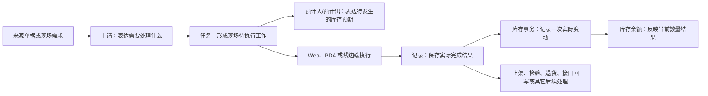
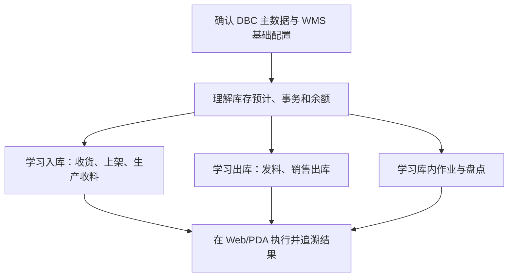

# WMS 库房管理

> 适用基线：测试环境目标 / `dev` 分支 / 2026-07-15。
> 阅读对象：仓库主管、收发货与库内作业人员、生产物流人员、盘点人员、采购/质量协同人员、现场 PDA 使用人员和需要追溯库存结果的业务人员。

## 模块解决什么问题

WMS（库房管理）负责把仓储业务意图落实为可执行的现场工作，并沉淀为可以查询、追溯和核对的库存结果。它覆盖物料到货后的收货与上架、生产用料与收料、销售发货、库内移动、盘点调整，以及与这些作业相关的库存查询和终端操作。

简单说：上游单据或现场需求说明“要做什么”，WMS 将其组织为申请、任务和执行记录；实际执行后，系统通过库存预计、库存事务和库存余额表达“将发生什么、发生了什么、目前还剩什么”。不同业务的具体状态、权限、数量规则和后续处理不能只因名称相似就互相套用，必须在各分组页面逐项确认。

WMS 不负责在此处重新定义物料、供应商、客户、仓库、库位、工艺等基础事实；这些由 [DBC 主数据管理](../04-DBC-主数据管理/index.md)维护。WMS 也不把 PDA 作为独立业务模块：PDA 和线边端是现场执行入口，业务规则仍以对应的 WMS 业务页为准。

## 测试 / 实施从哪读

| 你的目的 | 建议路径 |
| --- | --- |
| 验证「到货→收货→上架→余额」主链 | [采购收货](03-采购收货/index.md) → [采购上架](05-采购上架/index.md) → [库存管理](09-库存管理/index.md) |
| 讲清申请/任务/记录与预计/事务/余额 | 本页「一笔仓储业务如何形成库存结果」→ [库存管理](09-库存管理/index.md) → 共享模型链接 |
| 配置日历/事务类型/自动流转后再验业务 | [系统设置](02-系统设置/index.md) → 再跑对应业务分组 |
| 设计发料/生产收料与 MES 边界场景 | [发料管理](06-发料管理/index.md)、[生产收料](07-生产收料/index.md) + [MES](../06-MES-生产管理/index.md) |
| 现场 PDA 与 Web 对照 | [终端操作](13-终端操作/index.md) + 对应业务主文档（规则以 Web 业务页为准） |

## 配置依赖概览

| 配置 / 主数据 | 影响什么 | 在哪确认 |
| --- | --- | --- |
| DBC 物料、包装、仓/区/位、伙伴、业务类型 | 任务可选对象、地点与单据分类 | [DBC](../04-DBC-主数据管理/index.md) |
| 系统日历 / 账期日历 | 可作业时段与期间归属 | [系统设置](02-系统设置/index.md) |
| 事务类型 | 库存变动口径、是否允许负数等 | [系统设置](02-系统设置/index.md) |
| 计划设置 | 申请/任务/记录自动提交、生成与流转 | [系统设置](02-系统设置/index.md) |
| 标签与条码、价格/科目资料 | 扫码识别、结算解释（按业务是否读取） | [基础数据](01-基础数据/index.md) |
| 各业务任务配置（少收/多收/扫码/库位等） | 现场可执行范围与门禁 | 各业务**主文档**「配置如何起作用」 |

通例见[申请、任务与记录模型](../02-业务模型/01-申请任务记录模型.md)、[库存数据挂接模型](../02-业务模型/02-库存数据挂接模型.md)。

## 谁会使用本模块

| 角色 | 常见目标 | 建议从哪里开始 |
| --- | --- | --- |
| 仓库收货人员 | 接收供应商或生产现场送达的物料，完成收货、上架或异常处理。 | 采购收货、采购上架、终端操作。 |
| 发料与生产物流人员 | 根据需求备料、发料、补料或接收生产产出。 | 发料管理、生产收料、生产管理。 |
| 成品仓与发运人员 | 备货、发货、处理客户退货和相关追溯。 | 销售出库、库存管理。 |
| 库内作业与盘点人员 | 调拨、转库、报废、计划外出入库、盘点和差异处理。 | 库内作业、盘点管理、库存管理。 |
| 仓库主管与业务查询人员 | 查询库存、预计、任务执行和差异，判断是否需要进一步处理。 | 库存管理，再回查对应业务分组。 |
| 现场 PDA 使用人员 | 扫描、承接任务、执行收发、上架、盘点和库内移动。 | 终端操作及对应的 Web 业务页。 |

## 一笔仓储业务如何形成库存结果

这张图是 WMS 的统一理解框架：申请、任务、记录分别表达业务意图、现场工作和实际结果；预计、事务、余额分别用于观察预期、变动和当前结果。采购收货已作为一条完整业务链路，核实了“任务形成预计入、记录形成库存事务、事务更新余额”；其它业务是否采用相同对象、何时更新或是否存在反向处理，仍应以对应业务页为准。

!!! example "📝 示例数据占位"
    以“供应商到货 100 件、实收 98 件、拒收 2 件”为例，说明从来源单据、收货任务到库存记录、余额查询和后续处理的完整路径。

## 建议学习与操作顺序

首次使用不必按所有菜单逐页学习。建议先理解基础数据和库存对象，再按本岗位实际作业学习相应的入库、出库或库内业务。

| 建议顺序 | 先理解什么 | 解决什么问题 | 对应业务分组 |
| --- | --- | --- | --- |
| 1 | 基础数据、系统设置和 DBC 主数据边界 | 明确业务可选择的物料、地点、伙伴、日历、事务或标签入口从哪里来。 | 基础数据、系统设置、DBC。 |
| 2 | 库存预计、库存事务、库存余额 | 区分“计划发生、实际变动、当前数量”，建立统一查询语言。 | 库存管理。 |
| 3 | 入库主线 | 理解采购到货、收货、上架和生产产出如何进入库存。 | 采购收货、采购上架、生产收料、生产管理。 |
| 4 | 出库主线 | 理解生产发料、成品发货和退货如何影响库存。 | 发料管理、采购退货、销售出库。 |
| 5 | 库内控制 | 理解调拨、转库、报废、计划外出入库和盘点差异处理。 | 库内作业、盘点管理。 |
| 6 | 终端执行与追溯 | 将 Web 中的业务任务与 PDA 扫码、现场异常和结果查询连起来。 | 终端操作及各业务分组。 |

## 业务分组与学习入口

| 建议顺序 | 业务分组 | 先理解什么 | 学完能做什么 |
| --- | --- | --- | --- |
| 1 | 基础数据 | WMS 页面中的基础数据、标签和成本相关入口与 DBC/平台能力的边界。 | 判断某项资料应在哪维护、在哪使用。 |
| 2 | 系统设置 | 日历、事务类型、计划设置等受控配置如何影响仓储运行。 | 在变更前判断需要核对的影响范围。 |
| 3 | 采购收货 | 供应商到货怎样形成收货任务、记录和库存结果。 | 完成或追溯一笔采购收货。 |
| 4 | 采购退货 | 已收或待处理物料怎样退回供应商并保留来源追溯。 | 理解退货场景与需要核对的影响。 |
| 5 | 采购上架 | 收货后的物料怎样进入目标库位或后续状态。 | 完成或追溯一笔上架业务。 |
| 6 | 发料管理 | 生产需求怎样转化为备料、发料或补料。 | 支持生产用料的仓储执行。 |
| 7 | 生产收料 | 生产过程中的收料、退料和隔离处理如何影响仓储。 | 支持生产物流协同。 |
| 8 | 生产管理 | 生产计划、制品收货、拆解、返修和上架如何与库存衔接。 | 理解生产结果进入仓储的不同场景。 |
| 9 | 库存管理 | 如何查询预计、事务、余额和历史变动。 | 回答“库存为什么是这个数”。 |
| 10 | 销售出库 | 备货、发货、客户退货和结算出库如何协同。 | 支持成品交付和结果追溯。 |
| 11 | 库内作业 | 库内移动、报废、计划外出入库和调整如何受控执行。 | 处理非标准收发和内部变动。 |
| 12 | 盘点管理 | 盘点如何发现差异、形成调整并留痕。 | 支持账实核对和差异闭环。 |
| 13 | 终端操作 | PDA/线边端怎样承接任务和扫码执行。 | 在现场正确使用终端，不重复定义业务规则。 |

当前可先从[采购收货](03-采购收货/index.md)和[库存管理](09-库存管理/index.md)理解一条已核实的入库与库存追溯路径。其它分组按上述顺序补齐分组说明、学习导航和页面大纲。

## 使用本模块前需要准备什么

| 需要准备什么 | 为什么需要 | 由谁确认 |
| --- | --- | --- |
| 可用的物料、伙伴、仓库/库位、包装和业务类型 | 决定任务和记录能否正确带入对象、数量和地点。 | 主数据负责人、仓库与业务负责人。 |
| 当前业务来源或现场需求 | 明确本次是采购到货、生产用料、销售发货、调拨还是盘点。 | 对应业务发起人或现场主管。 |
| 执行角色与终端条件 | 决定谁可承接、是否应使用 PDA、是否需要扫码或现场设备。 | 仓库主管、系统管理员。 |
| 差异处理原则 | 在少收、多收、质量异常、库位不符或盘点差异时避免绕过流程。 | 业务负责人、质量/仓库主管。 |
| 查询与追溯口径 | 明确应从申请、任务、记录、预计、事务还是余额开始查。 | 仓库主管、业务查询人员。 |

!!! example "📷 截图占位"
    WMS 菜单全景。标出入库、出库、库存、库内作业、盘点和终端操作入口，使用脱敏测试环境截图。

## 与 DBC 和其它模块怎样协作

| 协作对象 | WMS 依赖什么 | WMS 产生什么 | 使用者应如何追溯 |
| --- | --- | --- | --- |
| DBC 主数据管理 | 物料、伙伴、地点、包装、工艺相关基础信息和部分业务配置。 | 可执行的仓储任务、记录和库存结果。 | 选择或识别问题回查 DBC；实际数量和作业结果回查 WMS。 |
| 采购/供应协同 | 采购订单、送货通知、到货或退货相关来源信息。 | 收货、退货及后续库存结果。 | 从来源单据定位 WMS 申请、任务和收货/退货记录。 |
| MES 生产管理 | 生产需求、工单或生产执行相关信息。 | 发料、生产收料、制品收货和库存结果。 | 从生产业务回查 WMS 的任务、记录和库存变动。 |
| QMS 质量管理 | 检验要求或质量判断。 | 需要检验、隔离、退货或后续处理的仓储结果。 | 先确认业务来源和收货/库存结果，再查询质量处理。 |
| 平台能力与基础设施 | 标签、打印、导入、附件、消息、日志等公共能力。 | 业务入口、操作痕迹和可追溯线索。 | 在 WMS 找到业务对象，再按公共能力页面定位模板、日志或消息。 |

## 常见问题与处理

| 情况 | 建议先做什么 | 不建议怎么做 |
| --- | --- | --- |
| 找不到应执行的任务 | 先按单据号、来源号、状态、执行人或供应商/物料定位，并确认任务是否已被承接或关闭。 | 不要绕过任务直接修改库存余额。 |
| 已完成作业但库存查询不到结果 | 依次检查记录是否生成、是否形成库存事务、查询条件是否正确、是否仍有上架/检验等后续处理。 | 不要只因余额暂未显示就重复执行一次业务。 |
| 数量、批次、包装或库位不匹配 | 按任务配置和现场规则处理少收、多收、拒收、差异或异常。 | 不要用正常完成代替异常处理，或绕过扫码限制。 |
| 不确定应在哪个页面维护数据 | 先区分“主数据定义事实、WMS 执行业务并产生结果”。 | 不要在 WMS 与 DBC 重复新建同一基础资料。 |
| PDA 页面与 Web 页面不同 | 先确认终端只是在执行任务还是在维护业务数据，再回到对应 WMS 业务页判断规则。 | 不要把 PDA 菜单或按钮显示等同于所有业务权限和状态规则。 |

## 术语与相关文档

| 主题 | 建议阅读 |
| --- | --- |
| 申请、任务、记录的通用概念 | [申请、任务与记录模型](../02-业务模型/01-申请任务记录模型.md) |
| 库存预计、事务、余额与唯一粒度 | [库存数据挂接模型](../02-业务模型/02-库存数据挂接模型.md)、[库存管理精度与唯一粒度](../02-业务模型/08-库存管理精度与唯一粒度.md) |
| WMS 依赖的基础资料与配置 | [DBC 主数据管理概述](../04-DBC-主数据管理/index.md) |
| 采购收货（参考路径） | [采购收货](03-采购收货/index.md)、[采购收货-维护与查询参考](03-采购收货/01-采购收货-维护与查询参考.md) |
| 标签、条码和打印的长期归属 | [标签、条码与打印](../03-基础设施/01-标签、条码与打印.md) |

## 待补充的图示与示例
| 类型 | 后续需要补充的内容 | 目的 | 资料来源 |
| --- | --- | --- | --- |
| WMS 全景图 | 入库、出库、库存、库内、盘点和终端操作之间的业务关系。 | 支持新员工建立仓储业务全貌。 | 菜单、业务负责人确认、已验证业务模型。 |
| 库存对象示例 | 以一笔收货或发料解释预计、事务、余额分别如何变化。 | 避免将预期、流水和当前数量混为一谈。 | 脱敏测试数据与库存查询截图。 |
| Web/PDA 对照截图 | 同一任务在 Web 与 PDA 上的定位、承接、执行和查询入口。 | 支持现场培训和问题定位。 | 脱敏测试环境截图。 |
| 异常流转示例 | 少收、拒收、库位不符、盘点差异等场景的处理路线。 | 帮助使用者避免绕过业务规则。 | 测试环境数据、业务确认和状态验证。 |
