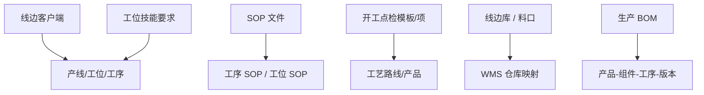
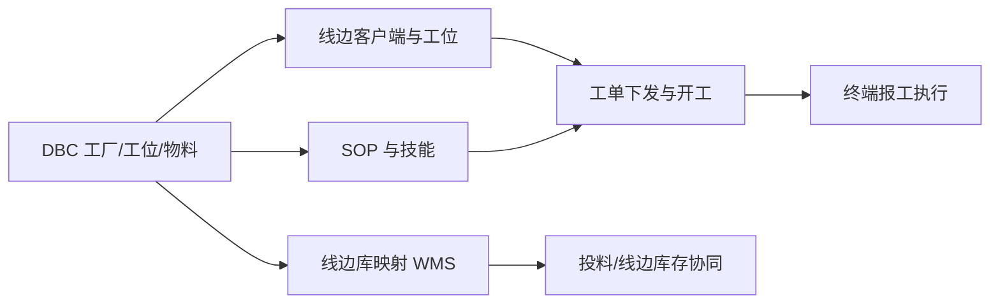

# 基础建模

> 适用基线：测试环境目标 / `dev` 分支 / 2026-07-15。
> 阅读对象：工艺/线边实施、生产主管；维护步骤见[基础建模-维护与查询参考](基础建模-维护与查询参考.md)。

## 业务目的与适用范围

基础建模维护线边执行所需的配置底座：线边客户端、SOP 与挂接、工位技能要求、开工点检模板、线边库/料口映射，以及生产 BOM（工序用料）。工厂/产线/工位主数据以 DBC 为准；人员技能等级主数据当前菜单多在 DBC；本页写 MES 侧已证实配置。

旧稿虚构 ER（线边端/SOP/技能大量英文字段）废弃，不以之为培训事实。

## 如何使用本组文档

| 你的目的 | 建议阅读 |
| --- | --- |
| 想理解线边开产前要配什么 | 本页。 |
| 正在配客户端、SOP、点检、线边库 | [基础建模-维护与查询参考](基础建模-维护与查询参考.md)。 |
| 想看路线与工单如何消费这些配置 | [工艺管理](../02-工艺管理/index.md)、[计划管理](../03-计划管理/index.md)。 |
| 想看线边怎么操作 | [终端操作](../06-终端操作/index.md)。 |

## 使用前准备

| 需要确认什么 | 为什么重要 |
| --- | --- |
| 产线、工位、工序主数据 | 客户端、SOP、技能、料口都挂这些编码。 |
| 物料与 BOM 版本 | 生产 BOM、工序 SOP 常按物料区分。 |
| 技能等级字典（DBC） | 工位技能要求引用技能/等级编码。 |
| WMS 仓库/库位编码 | 线边库需映射 WMS 侧编码才能协同库存。 |
| 哪些终端账号可登录线边 | 客户端绑定系统用户/登录方式。 |

!!! example "📷 截图占位"
    线边端配置列表与 SOP 挂接页；脱敏。

## 对象关系

| 对象 | 业务含义 |
| --- | --- |
| 线边客户端 | 终端编码/名称、IP/MAC、所属产线、绑定工位集合、工序、工人、状态、登录方式、关联系统用户、可用性。 |
| SOP 文件 | SOP 编码/名称、文件类型与版本、附件路径、生效/失效、状态、分组类型、校验摘要。 |
| 工序 SOP 配置 | 工序 + 可选物料 ↔ SOP 文件/版本；决定某工序展示哪份指导书。 |
| 工位 SOP 配置 | 工位维度挂接 SOP（菜单已存在；细则以页面为准）。 |
| 工位技能要求 | 工位所需技能编码/名称/类型与等级；上岗校验引用。 |
| 人员技能 / 技能等级 | 当前主入口多在 DBC；MES 侧消费编码，不在本页重复维护细则。 |
| 开工点检项 / 模板 | 开工前检查项与模板；模板可关联工艺路线/产品（开工点检分组）。 |
| 设备点检项关联 | MES 侧设备与点检项配置入口；设备点检执行主链仍见 EAM。 |
| 线边库 | 线边仓库编码/名称/类型、状态，以及对应 WMS 仓库编码/名称。 |
| 料口 / 线边库工位配置 | 料口编码、类型、关联线边库；工位与线边库关系（菜单：料口线边库配置、线边库工位配置等）。 |
| 生产 BOM | 产品物料、组件物料/用量/单位、工序、BOM 编码与版本、关键件标识、发料类型等工序用料结构。 |
| 线边弹窗配置 | 线边端提示/弹窗行为配置（辅助，不替代业务规则）。 |

## 一次建模如何支撑开产

## 关键判断

| 判断点 | 应先确认什么 | 影响 |
| --- | --- | --- |
| 客户端绑错工位 | 工位集合与工序是否匹配当前产线。 | 领不到作业或领错作业。 |
| SOP 挂在工序还是工位 | 现场以哪一层展示为准。 | 指导书版本不一致。 |
| 技能要求过严/过松 | 等级与人员技能是否匹配。 | 上岗拦截或漏检。 |
| 线边库未映射 WMS | `wmsStoreCode` 是否有效。 | 发料/线边库存对不上。 |
| 生产 BOM 与路线版本 | 工单 BOM 版本与路线是否同批。 | 用料与工艺脱节。 |

## 与 DBC、工艺、计划、WMS、EAM 的边界

| 协同方 | 本页负责 | 不在本页展开 |
| --- | --- | --- |
| DBC | 引用工厂/工位/物料；消费技能主数据 | 仓库/工位主数据维护本身 |
| 工艺管理 | 为路线执行提供 SOP/技能/点检前提 | 路线图形与转序门槛 |
| 计划管理 | 开工点检、客户端就绪影响可否开产 | 工单状态机 |
| WMS | 线边库编码映射与协同前提 | 库存事务与余额 |
| EAM | MES 点检项/关联配置线索 | 设备点检工单执行主链 |

## 查询与联查

| 场景 | 建议看什么 | 联查 |
| --- | --- | --- |
| 终端登不上 | 客户端状态、用户绑定、登录方式。 | 系统用户、终端页。 |
| 无 SOP 可看 | 工序/工位 SOP 是否挂到当前物料与版本。 | SOP 文件状态。 |
| 开工被点检拦住 | 开工点检模板是否覆盖本路线/产品。 | 计划工单状态（待点检）。 |
| 线边无料 | 线边库/料口映射、线边库存。 | WMS 发料、线边库存页。 |
| 用料不对 | 生产 BOM 版本与工单 BOM 版本。 | 计划工单、DBC BOM。 |

## 常见问题与处理

| 情况 | 建议处理 |
| --- | --- |
| 把产线/工位当成 MES 基础建模核心新建 | 主数据在 DBC；本页只配线边关系。 |
| 把 EAM 点检工单写成 MES 基础建模 | 开工点检在 MES；设备点检执行回 EAM。 |
| 旧稿“生产 BOM 含完整工艺路线图” | 生产 BOM 是工序用料；路线在工艺管理。 |
| 技能全部写在 MES | 等级/人员技能菜单当前在 DBC。 |

## 当前限制与待确认事项

- `MES-BASE`：SOP 强制校验、线边库存↔WMS 余额、点检职责切分、生产 BOM vs DBC BOM（总账）。
- 截图与环境核对见内部 `字段证据/MES/P2截图与环境核对任务清单`。

## 图示、截图与示例任务

| 类型 | 后续补充 | 目的 |
| --- | --- | --- |
| 客户端—工位绑定截图 | 一产线多工位。 | 培训。 |
| SOP 挂接样例 | 同工序不同物料两份 SOP。 | 验收。 |
| 线边库映射样例 | MES 编码 ↔ WMS 编码。 | 验收。 |
