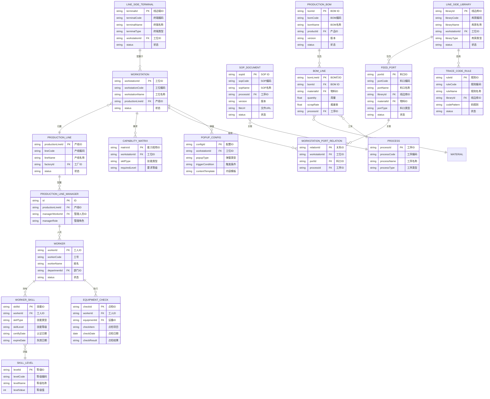
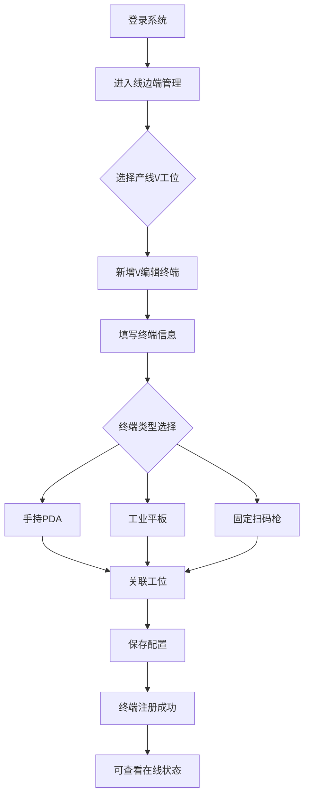
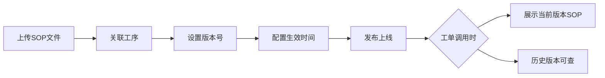
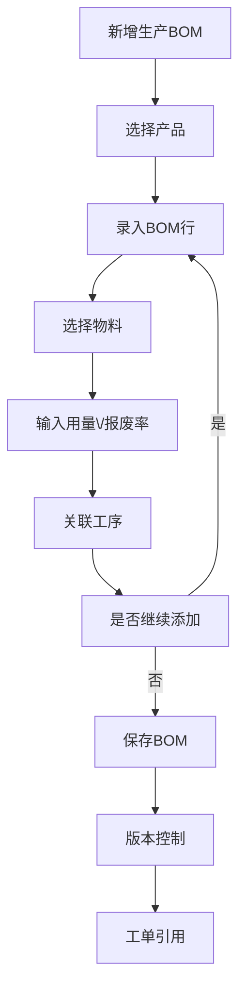
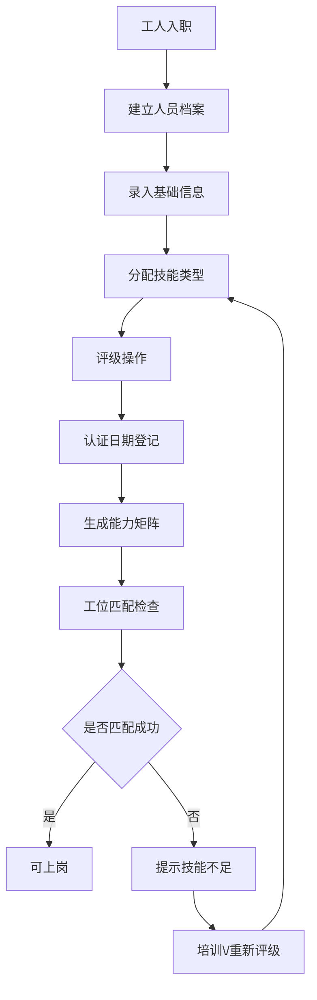
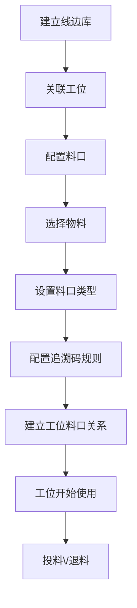

# 基础建模

## 概述

基础建模模块是 MES 生产管理系统的核心底座，承载产线、工位、人员、物料、工艺文件等主数据的统一维护。本模块与 DBC 主数据、EAM 设备管理深度联动，为上层工单执行、质量追溯、报工报损等业务提供数据支撑。

### 核心职责

- 产线工位边的移动终端设备配置与管理
- 工序作业指导书（SOP）配置与版本控制
- 生产 BOM 管理（含工艺路线信息）
- 工人技能体系与能力矩阵配置
- 线边库与料口配置（工位旁的物料暂存区）

---

## 领域模型

### ER 概念模型

### 实体关系说明

| 源实体 | 目标实体 | 关系说明 |
|--------|----------|----------|
| 线边端 | 工位 | 1:N，一个工位可配置多个线边端 |
| 工位 | 产线 | N:1，一个产线包含多个工位 |
| SOP文件 | 工序 | N:1，一个工序可关联多个SOP版本 |
| 生产BOM | BOM行 | 1:N，一个BOM包含多行投料 |
| BOM行 | 物料 | N:1，投料物料来源 |
| BOM行 | 工序 | N:1，明确投料对应的工序 |
| 工人 | 工人技能 | 1:N，一个工人可拥有多项技能 |
| 技能等级 | 工人技能 | N:1，技能对应具体等级 |
| 工位 | 能力矩阵 | 1:N，一个工位有多种技能需求 |
| 线边库 | 料口 | 1:N，一个线边库含多个料口 |
| 料口 | 工位料口关系 | 1:N，一个料口可服务于多个工位 |
| 线边库 | 追溯码规则 | 1:N，一个线边库可配置多条码规则 |

---

## 核心流程

### 流程 1：线边端配置流程

### 流程 2：SOP 文件管理流程

### 流程 3：生产 BOM 配置流程

### 流程 4：工人技能管理流程

### 流程 5：线边库与料口配置流程

---

## 字段说明

### 线边端管理 (LineSideTerminal)

| 字段名 | 类型 | 必填 | 说明 |
|--------|------|------|------|
| terminalId | string | 是 | 线边端ID (待截图确认) |
| terminalCode | string | 是 | 终端编码 (待截图确认) |
| terminalName | string | 是 | 终端名称 (待截图确认) |
| terminalType | string | 是 | 终端类型：PDA、平板、扫码枪 (待截图确认) |
| workstationId | string | 是 | 所属工位ID (待截图确认) |
| ipAddress | string | 否 | IP地址 (待截图确认) |
| macAddress | string | 否 | MAC地址 (待截图确认) |
| status | string | 是 | 状态：在线、离线、故障 (待截图确认) |
| lastHeartbeat | datetime | 否 | 最后心跳时间 (待截图确认) |
| createdBy | string | 否 | 创建人 (待截图确认) |
| createdTime | datetime | 否 | 创建时间 (待截图确认) |
| updatedBy | string | 否 | 更新人 (待截图确认) |
| updatedTime | datetime | 否 | 更新时间 (待截图确认) |

### SOP 文件管理 (SopDocument)

| 字段名 | 类型 | 必填 | 说明 |
|--------|------|------|------|
| sopId | string | 是 | SOP ID (待截图确认) |
| sopCode | string | 是 | SOP编码 (待截图确认) |
| sopName | string | 是 | SOP名称 (待截图确认) |
| processId | string | 是 | 关联工序ID (待截图确认) |
| processName | string | 否 | 工序名称 (待截图确认) |
| version | string | 是 | 版本号，格式如 v1.0 (待截图确认) |
| fileUrl | string | 是 | 文件存储地址 (待截图确认) |
| fileType | string | 否 | 文件类型：PDF、图片、视频 (待截图确认) |
| effectiveDate | date | 是 | 生效日期 (待截图确认) |
| expiryDate | date | 否 | 失效日期 (待截图确认) |
| status | string | 是 | 状态：草稿、已发布、已作废 (待截图确认) |
| createdBy | string | 否 | 创建人 (待截图确认) |
| createdTime | datetime | 否 | 创建时间 (待截图确认) |

### 工序 SOP 配置管理 (ProcessSopConfig)

| 字段名 | 类型 | 必填 | 说明 |
|--------|------|------|------|
| configId | string | 是 | 配置ID (待截图确认) |
| processId | string | 是 | 工序ID (待截图确认) |
| processCode | string | 否 | 工序编码 (待截图确认) |
| processName | string | 否 | 工序名称 (待截图确认) |
| sopId | string | 是 | SOP文档ID (待截图确认) |
| displayOrder | int | 否 | 显示顺序 (待截图确认) |
| isMandatory | boolean | 否 | 是否强制查看 (待截图确认) |
| createdBy | string | 否 | 创建人 (待截图确认) |
| createdTime | datetime | 否 | 创建时间 (待截图确认) |

### 生产 BOM (ProductionBom)

| 字段名 | 类型 | 必填 | 说明 |
|--------|------|------|------|
| bomId | string | 是 | BOM ID (待截图确认) |
| bomCode | string | 是 | BOM编码 (待截图确认) |
| bomName | string | 是 | BOM名称 (待截图确认) |
| productId | string | 是 | 产品ID (待截图确认) |
| productCode | string | 否 | 产品编码 (待截图确认) |
| productName | string | 否 | 产品名称 (待截图确认) |
| version | string | 是 | BOM版本 (待截图确认) |
| bomType | string | 否 | BOM类型：标准、返工、拆解 (待截图确认) |
| status | string | 是 | 状态：草稿、已审核、已发布 (待截图确认) |
| effectiveDate | date | 否 | 生效日期 (待截图确认) |
| remark | string | 否 | 备注 (待截图确认) |
| createdBy | string | 否 | 创建人 (待截图确认) |
| createdTime | datetime | 否 | 创建时间 (待截图确认) |

### BOM 行 (BomLine)

| 字段名 | 类型 | 必填 | 说明 |
|--------|------|------|------|
| bomLineId | string | 是 | BOM行ID (待截图确认) |
| bomId | string | 是 | 所属BOM ID (待截图确认) |
| lineNo | int | 是 | 行号 (待截图确认) |
| materialId | string | 是 | 物料ID (待截图确认) |
| materialCode | string | 否 | 物料编码 (待截图确认) |
| materialName | string | 否 | 物料名称 (待截图确认) |
| quantity | decimal | 是 | 用量 (待截图确认) |
| unit | string | 否 | 单位 (待截图确认) |
| scrapRate | decimal | 否 | 报废率，默认0 (待截图确认) |
| processId | string | 否 | 投料工序ID (待截图确认) |
| processName | string | 否 | 投料工序名称 (待截图确认) |
| isOptional | boolean | 否 | 是否可选投料 (待截图确认) |
| createdBy | string | 否 | 创建人 (待截图确认) |
| createdTime | datetime | 否 | 创建时间 (待截图确认) |

### 工人管理 (Worker)

| 字段名 | 类型 | 必填 | 说明 |
|--------|------|------|------|
| workerId | string | 是 | 工人ID (待截图确认) |
| workerCode | string | 是 | 工号 (待截图确认) |
| workerName | string | 是 | 姓名 (待截图确认) |
| gender | string | 否 | 性别 (待截图确认) |
| idCard | string | 否 | 身份证号 (待截图确认) |
| phone | string | 否 | 联系电话 (待截图确认) |
| departmentId | string | 否 | 部门ID (待截图确认) |
| departmentName | string | 否 | 部门名称 (待截图确认) |
| entryDate | date | 否 | 入职日期 (待截图确认) |
| workerType | string | 否 | 人员类型：正式、临时、外包 (待截图确认) |
| status | string | 是 | 状态：在职、离职、退休 (待截图确认) |
| createdBy | string | 否 | 创建人 (待截图确认) |
| createdTime | datetime | 否 | 创建时间 (待截图确认) |

### 人员技能管理 (WorkerSkill)

| 字段名 | 类型 | 必填 | 说明 |
|--------|------|------|------|
| skillId | string | 是 | 技能ID (待截图确认) |
| workerId | string | 是 | 工人ID (待截图确认) |
| workerCode | string | 否 | 工号 (待截图确认) |
| workerName | string | 否 | 姓名 (待截图确认) |
| skillType | string | 是 | 技能类型 (待截图确认) |
| skillTypeName | string | 否 | 技能类型名称 (待截图确认) |
| skillLevel | string | 是 | 技能等级ID (待截图确认) |
| skillLevelName | string | 否 | 技能等级名称 (待截图确认) |
| certifyDate | date | 否 | 认证日期 (待截图确认) |
| expireDate | date | 否 | 失效日期 (待截图确认) |
| certifyFileUrl | string | 否 | 证书文件URL (待截图确认) |
| status | string | 是 | 状态：有效、过期、撤销 (待截图确认) |
| createdBy | string | 否 | 创建人 (待截图确认) |
| createdTime | datetime | 否 | 创建时间 (待截图确认) |

### 人员能力矩阵 (CapabilityMatrix)

| 字段名 | 类型 | 必填 | 说明 |
|--------|------|------|------|
| matrixId | string | 是 | 能力矩阵ID (待截图确认) |
| workstationId | string | 是 | 工位ID (待截图确认) |
| workstationCode | string | 否 | 工位编码 (待截图确认) |
| workstationName | string | 否 | 工位名称 (待截图确认) |
| skillType | string | 是 | 技能类型 (待截图确认) |
| skillTypeName | string | 否 | 技能类型名称 (待截图确认) |
| requiredLevel | string | 是 | 要求等级ID (待截图确认) |
| requiredLevelName | string | 否 | 要求等级名称 (待截图确认) |
| isMandatory | boolean | 否 | 是否强制要求 (待截图确认) |
| createdBy | string | 否 | 创建人 (待截图确认) |
| createdTime | datetime | 否 | 创建时间 (待截图确认) |

### 技能等级 (SkillLevel)

| 字段名 | 类型 | 必填 | 说明 |
|--------|------|------|------|
| levelId | string | 是 | 等级ID (待截图确认) |
| levelCode | string | 是 | 等级编码 (待截图确认) |
| levelName | string | 是 | 等级名称 (待截图确认) |
| levelValue | int | 是 | 等级值，数字越大等级越高 (待截图确认) |
| skillType | string | 否 | 所属技能类型 (待截图确认) |
| description | string | 否 | 等级说明 (待截图确认) |
| createdBy | string | 否 | 创建人 (待截图确认) |
| createdTime | datetime | 否 | 创建时间 (待截图确认) |

### 设备点检管理 (EquipmentCheck)

| 字段名 | 类型 | 必填 | 说明 |
|--------|------|------|------|
| checkId | string | 是 | 点检ID (待截图确认) |
| workerId | string | 是 | 点检人员ID (待截图确认) |
| workerName | string | 否 | 点检人员姓名 (待截图确认) |
| equipmentId | string | 是 | 设备ID (待截图确认) |
| equipmentCode | string | 否 | 设备编码 (待截图确认) |
| equipmentName | string | 否 | 设备名称 (待截图确认) |
| checkItem | string | 是 | 点检项目 (待截图确认) |
| checkDate | date | 是 | 点检日期 (待截图确认) |
| checkTime | time | 否 | 点检时间 (待截图确认) |
| checkResult | string | 是 | 点检结果：合格、不合格、待处理 (待截图确认) |
| checkMethod | string | 否 | 点检方法 (待截图确认) |
| checkStandard | string | 否 | 点检标准 (待截图确认) |
| actualValue | string | 否 | 实际值 (待截图确认) |
| isAbnormal | boolean | 否 | 是否异常 (待截图确认) |
| remark | string | 否 | 备注 (待截图确认) |
| createdBy | string | 否 | 创建人 (待截图确认) |
| createdTime | datetime | 否 | 创建时间 (待截图确认) |

### 产线管理人员配置 (ProductionLineManager)

| 字段名 | 类型 | 必填 | 说明 |
|--------|------|------|------|
| id | string | 是 | ID (待截图确认) |
| productionLineId | string | 是 | 产线ID (待截图确认) |
| productionLineName | string | 否 | 产线名称 (待截图确认) |
| managerWorkerId | string | 是 | 管理人员ID (待截图确认) |
| managerWorkerCode | string | 否 | 管理人员工号 (待截图确认) |
| managerWorkerName | string | 否 | 管理人员姓名 (待截图确认) |
| managerRole | string | 是 | 管理角色：线长、班组长、车间主任 (待截图确认) |
| effectiveDate | date | 否 | 生效日期 (待截图确认) |
| expiryDate | date | 否 | 失效日期 (待截图确认) |
| status | string | 是 | 状态：生效、失效 (待截图确认) |
| createdBy | string | 否 | 创建人 (待截图确认) |
| createdTime | datetime | 否 | 创建时间 (待截图确认) |

### 线边弹窗配置 (PopupConfig)

| 字段名 | 类型 | 必填 | 说明 |
|--------|------|------|------|
| configId | string | 是 | 配置ID (待截图确认) |
| workstationId | string | 是 | 工位ID (待截图确认) |
| workstationName | string | 否 | 工位名称 (待截图确认) |
| popupType | string | 是 | 弹窗类型：投料确认、异常上报、质量检验 (待截图确认) |
| triggerCondition | string | 否 | 触发条件表达式 (待截图确认) |
| contentTemplate | string | 否 | 内容模板 (待截图确认) |
| displayDuration | int | 否 | 显示时长（秒） (待截图确认) |
| isEnabled | boolean | 否 | 是否启用 (待截图确认) |
| priority | int | 否 | 优先级，数字越小越优先 (待截图确认) |
| createdBy | string | 否 | 创建人 (待截图确认) |
| createdTime | datetime | 否 | 创建时间 (待截图确认) |

### 线边库管理 (LineSideLibrary)

| 字段名 | 类型 | 必填 | 说明 |
|--------|------|------|------|
| libraryId | string | 是 | 线边库ID (待截图确认) |
| libraryCode | string | 是 | 库房编码 (待截图确认) |
| libraryName | string | 是 | 库房名称 (待截图确认) |
| workstationId | string | 是 | 所属工位ID (待截图确认) |
| workstationName | string | 否 | 工位名称 (待截图确认) |
| libraryType | string | 是 | 库房类型：原材料、半成品、成品 (待截图确认) |
| storageLocation | string | 否 | 库位 (待截图确认) |
| capacity | decimal | 否 | 容量 (待截图确认) |
| currentStock | decimal | 否 | 当前库存 (待截图确认) |
| status | string | 是 | 状态：启用、停用 (待截图确认) |
| remark | string | 否 | 备注 (待截图确认) |
| createdBy | string | 否 | 创建人 (待截图确认) |
| createdTime | datetime | 否 | 创建时间 (待截图确认) |

### 料口管理 (FeedPort)

| 字段名 | 类型 | 必填 | 说明 |
|--------|------|------|------|
| portId | string | 是 | 料口ID (待截图确认) |
| portCode | string | 是 | 料口编码 (待截图确认) |
| portName | string | 是 | 料口名称 (待截图确认) |
| libraryId | string | 是 | 所属线边库ID (待截图确认) |
| libraryName | string | 否 | 线边库名称 (待截图确认) |
| materialId | string | 是 | 对应物料ID (待截图确认) |
| materialCode | string | 否 | 物料编码 (待截图确认) |
| materialName | string | 否 | 物料名称 (待截图确认) |
| portType | string | 是 | 料口类型：投料口、出料口、检验口 (待截图确认) |
| portDirection | string | 否 | 料口方向：左、右、上、下 (待截图确认) |
| isAutomatic | boolean | 否 | 是否自动供料 (待截图确认) |
| feedSpeed | string | 否 | 供料速度 (待截图确认) |
| status | string | 是 | 状态：启用、停用、故障 (待截图确认) |
| createdBy | string | 否 | 创建人 (待截图确认) |
| createdTime | datetime | 否 | 创建时间 (待截图确认) |

### 追溯码规则 (TraceCodeRule)

| 字段名 | 类型 | 必填 | 说明 |
|--------|------|------|------|
| ruleId | string | 是 | 规则ID (待截图确认) |
| ruleCode | string | 是 | 规则编码 (待截图确认) |
| ruleName | string | 是 | 规则名称 (待截图确认) |
| libraryId | string | 是 | 所属线边库ID (待截图确认) |
| libraryName | string | 否 | 线边库名称 (待截图确认) |
| codePattern | string | 是 | 码规则，如：{factoryCode}{date}{sequence} (待截图确认) |
| codePrefix | string | 否 | 码前缀 (待截图确认) |
| codeLength | int | 否 | 码长度 (待截图确认) |
| generateMode | string | 否 | 生成模式：自动、手动 (待截图确认) |
| containsDate | boolean | 否 | 是否包含日期 (待截图确认) |
| dateFormat | string | 否 | 日期格式 (待截图确认) |
| containsSequence | boolean | 否 | 是否包含序列号 (待截图确认) |
| sequenceStart | int | 否 | 序列号起始值 (待截图确认) |
| status | string | 是 | 状态：启用、停用 (待截图确认) |
| createdBy | string | 否 | 创建人 (待截图确认) |
| createdTime | datetime | 否 | 创建时间 (待截图确认) |

### 工位料口关系 (WorkstationPortRelation)

| 字段名 | 类型 | 必填 | 说明 |
|--------|------|------|------|
| relationId | string | 是 | 关系ID (待截图确认) |
| workstationId | string | 是 | 工位ID (待截图确认) |
| workstationName | string | 否 | 工位名称 (待截图确认) |
| portId | string | 是 | 料口ID (待截图确认) |
| portName | string | 否 | 料口名称 (待截图确认) |
| processId | string | 否 | 关联工序ID (待截图确认) |
| processName | string | 否 | 工序名称 (待截图确认) |
| useSequence | int | 否 | 使用顺序 (待截图确认) |
| isActive | boolean | 否 | 是否激活 (待截图确认) |
| effectiveDate | date | 否 | 生效日期 (待截图确认) |
| expiryDate | date | 否 | 失效日期 (待截图确认) |
| createdBy | string | 否 | 创建人 (待截图确认) |
| createdTime | datetime | 否 | 创建时间 (待截图确认) |

---

## 与 DBC 主数据的联动

基础建模模块与 DBC 主数据模块存在以下联动关系：

| MES 实体 | DBC 实体 | 联动说明 |
|----------|----------|----------|
| 工人管理 | 人员档案 | 工人基础信息同步至 DBC，技能信息由 MES 维护 |
| 生产 BOM | 标准 BOM | MES 生产 BOM 继承 DBC BOM 结构，增加工艺属性 |
| 物料 | 物料主数据 | 投料物料从 DBC 物料档案同步 |
| 工序 | 工序字典 | 工序信息从 DBC 工序字典同步 |
| 设备 | 设备台账 | 设备点检引用 EAM 设备台账 |