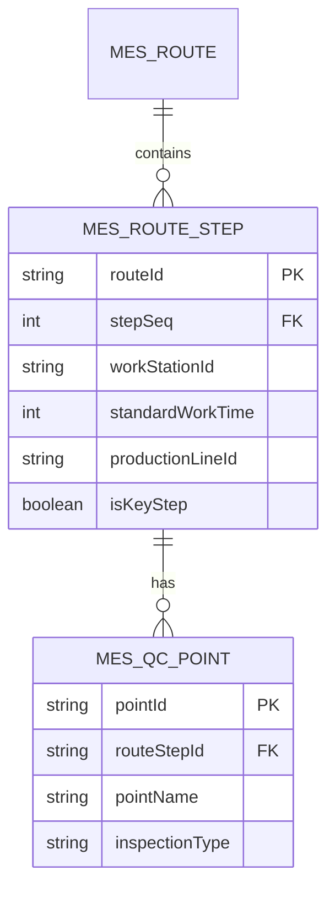
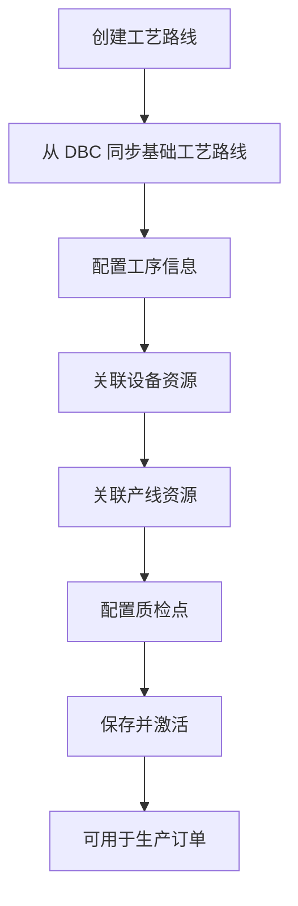

# 工艺管理

## 1. 概述

工艺管理是 MES 系统的核心模块，负责定义和管理物料的加工工序顺序。MES 工艺路线是 DBC（主数据）工艺路线的执行版，在 DBC 工艺路线的基础上增加了工时、设备、产线等执行信息。

工艺管理的核心目标：

- 建立标准化的工艺路线，确保生产过程的一致性
- 关联工时、设备、产线资源，支持精细化生产调度
- 支持质检点配置，实现生产过程质量控制
- 与 DBC 工艺路线保持同步，维持数据一致性

---

## 2. 领域模型

### 2.1 实体关系图（ER）

### 2.2 核心实体说明

| 实体名 | 中文名 | 说明 |
|--------|--------|------|
| MesRoute | 工艺路线 | 顶层实体，定义物料的整体加工路径 |
| MesRouteStep | 工序 | 工艺路线中的每道加工工序 |
| MesQcPoint | 质检点 | 工序上配置的质检控制点 |

---

## 3. 核心流程

### 3.1 工艺路线创建流程

### 3.2 工序配置说明

每道工序包含以下核心信息：

| 字段 | 说明 |
|------|------|
| `stepSeq` (待截图确认) | 工序序号，标识加工顺序 |
| `stepName` (待截图确认) | 工序名称 |
| `workStationId` (待截图确认) | 工位/设备 ID |
| `standardWorkTime` (待截图确认) | 标准作业时间（分钟） |
| `productionLineId` (待截图确认) | 产线 ID |
| `isKeyStep` (待截图确认) | 是否关键工序 |

---

## 4. 字段说明

### 4.1 工艺路线（MesRoute）

| 字段名 | 中文名 | 类型 | 说明 |
|--------|--------|------|------|
| `routeId` (待截图确认) | 工艺路线ID | String | 主键 |
| `routeName` (待截图确认) | 工艺路线名称 | String |  |
| `materialId` (待截图确认) | 物料ID | String | 关联物料 |
| `routeVersion` (待截图确认) | 路线版本 | String | 用于版本管理 |
| `status` (待截图确认) | 状态 | String | DRAFT/ACTIVE/ARCHIVED |
| `dbcRouteId` (待截图确认) | DBC工艺路线ID | String | 关联DBC工艺路线 |
| `createdBy` (待截图确认) | 创建人 | String |  |
| `createdAt` (待截图确认) | 创建时间 | DateTime |  |
| `updatedBy` (待截图确认) | 更新人 | String |  |
| `updatedAt` (待截图确认) | 更新时间 | DateTime |  |

### 4.2 工序（MesRouteStep）

| 字段名 | 中文名 | 类型 | 说明 |
|--------|--------|------|------|
| `stepId` (待截图确认) | 工序ID | String | 主键 |
| `routeId` (待截图确认) | 工艺路线ID | String | 外键，关联工艺路线 |
| `stepSeq` (待截图确认) | 工序序号 | Integer | 加工顺序 |
| `stepName` (待截图确认) | 工序名称 | String |  |
| `workStationId` (待截图确认) | 工位ID | String | 所需设备/工位 |
| `standardWorkTime` (待截图确认) | 标准工时 | Integer | 单位：分钟 |
| `productionLineId` (待截图确认) | 产线ID | String | 所属产线 |
| `isKeyStep` (待截图确认) | 关键工序 | Boolean | true=关键工序 |
| `stepDescription` (待截图确认) | 工序描述 | String | 作业说明 |
| `createdBy` (待截图确认) | 创建人 | String |  |
| `createdAt` (待截图确认) | 创建时间 | DateTime |  |
| `updatedBy` (待截图确认) | 更新人 | String |  |
| `updatedAt` (待截图确认) | 更新时间 | DateTime |  |

### 4.3 质检点（MesQcPoint）

| 字段名 | 中文名 | 类型 | 说明 |
|--------|--------|------|------|
| `pointId` (待截图确认) | 质检点ID | String | 主键 |
| `stepId` (待截图确认) | 工序ID | String | 外键，关联工序 |
| `pointName` (待截图确认) | 质检点名称 | String |  |
| `inspectionType` (待截图确认) | 质检类型 | String | IPQC/FQC/OQC |
| `samplingRatio` (待截图确认) | 抽样比例 | Decimal |  |
| `createdBy` (待截图确认) | 创建人 | String |  |
| `createdAt` (待截图确认) | 创建时间 | DateTime |  |
| `updatedBy` (待截图确认) | 更新人 | String |  |
| `updatedAt` (待截图确认) | 更新时间 | DateTime |  |

---

## 5. 与 DBC 工艺路线的关系

| 维度 | DBC 工艺路线 | MES 工艺路线 |
|------|-------------|-------------|
| 定位 | 主数据定义 | 执行版本 |
| 内容 | 基础工序顺序 | DBC内容 + 工时/设备/产线 |
| 版本控制 | 独立管理 | 与DBC版本关联 |
| 使用场景 | 数据建模 | 生产执行 |

## 相关模块接口

### 依赖模块

| 模块 | 接口方向 | 说明 |
|------|----------|------|
| DBC_ROUTING | [工艺路线](../../04-DBC-主数据管理/08-工艺建模/02-工艺路线.md) | 继承 DBC 工艺路线基础工序顺序 |
| DBC_PROCESS | [工序管理](../../04-DBC-主数据管理/08-工艺建模/01-工序管理.md) | 获取工序字典数据 |
| DBC_MATERIAL | [物料主数据](../../04-DBC-主数据管理/01-物料管理/01-物料基本信息.md) | 获取物料工艺属性 |
| MES_BASIC | [基础建模](../01-基础建模/index.md) | 获取 SOP 文档、工位能力矩阵 |

### 被依赖模块

| 模块 | 接口方向 | 说明 |
|------|----------|------|
| MES_PLANNING | [计划管理](../03-计划管理/index.md) | 工艺路线作为工单工艺拆分的依据 |
| QMS_IPQC | [生产检验](../../07-QMS-质量管理/03-生产检验/index.md) | 工序检验标准取自工艺路线配置 |

> **关系说明**：MES 工艺路线在 DBC 工艺路线基础上增加执行属性，形成可执行的工艺规范。