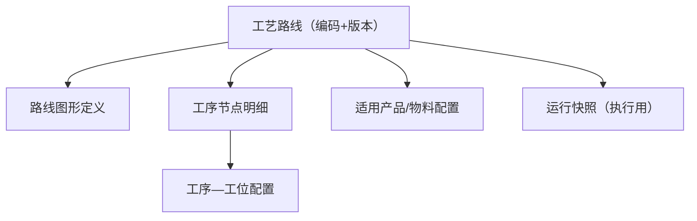

# 工艺管理

> 适用基线：测试环境目标 / `dev` 分支 / 2026-07-15。
> 阅读对象：测试、实施、运维（主）；工艺工程师等现场角色（顺带）；维护步骤见[工艺管理-维护与查询参考](工艺管理-维护与查询参考.md)。

## 业务目的与适用范围

工艺管理把“某产品/物料按什么顺序、经哪些工序、受哪些转序与并行约束”维护成可执行的工艺路线，供计划拆分、线边执行与追溯引用。读完本页，应能判断改一条路线为何要升版而不是覆盖、转序卡住时该查门槛还是策略配置。

本页只写 **MES 工艺路线** 已证实能力。DBC 侧若仍有工艺建模入口，以[DBC 工艺路线](../../04-DBC-主数据管理/08-工艺建模/02-工艺路线.md)的边界说明为准：目录位置不等于实现归属。

## 如何使用本组文档

| 你的目的 | 建议阅读 |
| --- | --- |
| 理解路线、版本、图形与转序/分派如何生效 | 本页：准备 → 一次维护 → 关键判断 → 边界 |
| 弄清升版/转序门槛/抢单派单如何改变现场，或据此验证 | 本页「写实示例」「建议验证点」「常见问题」 |
| 具体新建/改版/启停或查字段矩阵 | [工艺管理-维护与查询参考](工艺管理-维护与查询参考.md) |
| 看订单如何绑定路线并下发快照 | [计划管理](../03-计划管理/index.md) |
| 查工序主数据（字典） | [DBC 工序管理](../../04-DBC-主数据管理/08-工艺建模/01-工序管理.md)；**可执行路线仍以本分组为准** |

## 使用前准备

| 需要确认什么 | 为什么重要 |
| --- | --- |
| 物料/产品与 BOM 版本 | 路线常绑定物料与 BOM。 |
| 工序与工位主数据 | 节点与工位配置依赖已建主数据。 |
| 版本策略 | 改工艺通常发新版本，避免覆盖在用版本。 |
| 是否已有在制工单 | 变更在用路线可能影响在制与追溯。 |

!!! example "📷 截图占位"
    工艺路线列表与图形编辑器；脱敏。

## 对象关系

| 对象 | 业务含义 |
| --- | --- |
| 工艺路线头 | 路线编码、名称、类型、版本、状态、物料、BOM/BOM 版本、备注；可含前置校验开关与校验规则。 |
| 图形定义 | 可视化编辑路线图，保存时解析为节点配置。 |
| 工序节点明细 | 节点顺序、工序编码/名称/类型、节拍、前后工序、节点扩展数据；可配置转序门槛、批量转序策略、是否并行及并行上限、作业分派模式等。 |
| 产品关联 | 路线与产品/物料的适用关系（编辑时回显）。 |
| 工位配置 | 工序与工位的对应关系，可导入导出。 |
| 运行快照 | 执行侧使用的路线快照（含图形），避免执行中被主数据随意改写。 |

## 一次维护如何生效

路线在 MES 维护；工序编码等字典仍引用 DBC。DBC 侧若仍有工艺建模菜单，以[DBC 工艺路线](../../04-DBC-主数据管理/08-工艺建模/02-工艺路线.md)边界说明为准：**目录位置不等于实现归属**，日常改版以本分组菜单为准。投料发料与完工入库不在本页，见 WMS。

!!! example "📝 示例数据占位"
    物料 P-100 路线 RT-01 v1/v2；节点 OP10→OP20；最小合格转序=10；分派=抢单。展示升版与在制快照差异。

!!! example "写实示例：给定配置 → 期望行为"
    **给定：** 物料 P-100 已有 RT-01 v1 被工单 WO-A 下发并生成运行快照；现升版为 v2，OP10 最小合格转序数量改为 10、分派改为抢单；新工单 WO-B 绑定 v2 后下发。
    **期望：**

    1. WO-A 在制仍按 v1 快照执行，不会因主数据升版自动改门闸。
    2. WO-B 按下发时快照使用 v2：OP10 合格累计未达 10 不可转 OP20；线边按抢单认领作业。
    3. 只改图形未成功保存时，节点明细不完整 → 现场无可用工序路径。
    4. 多工位并行开启但上限非法时，保存失败，不得带着半成品配置下发。

### 建议验证点

- 新建路线：头信息 + 图形保存后节点齐全，可按产品查到。
- 升版：在制工单仍走旧快照；新单引用新版。
- 最小合格转序数量：未达标拦截 / 达标可转各一单。
- 分派：抢单认领与派单指定工位各验一单。
- 改主数据后现场仍旧：用运行快照/工单版本解释，勿只看最新路线列表。

## 关键判断

| 判断点 | 应先确认什么 | 影响 |
| --- | --- | --- |
| 新建还是升版 | 是否已有在用版本被计划引用。 | 决定改旧版还是发新版。 |
| 图形与明细是否一致 | 保存图形后节点是否完整生成。 | 避免只改图未落明细。 |
| 转序过严/过松 | 最小合格转序数量、批量转序策略。 | 直接影响线边能否流转。 |
| 并行与派工 | 是否允许并行、抢单还是派工。 | 影响工位任务领取方式。 |

### 关键字段业务角色

完整选择器范围、转序/分派矩阵与联动见[维护与查询参考](工艺管理-维护与查询参考.md)。本表只列主线关键项。

| 字段/配置点 | 在系统中的作用 | 关键行为要点（取值/范围/联动/门禁） | 维护或操作时要警惕什么 |
| --- | --- | --- | --- |
| 路线编码 + 版本 | 工艺身份与改版边界 | 改工艺优先升版；在用版本被计划/快照引用后勿覆盖 | 覆盖在用版会导致在制与追溯错位 |
| 物料 / BOM / BOM 版本 | 路线适用对象与用料版本 | 先选物料再绑 BOM；产品关联回显依赖此组 | 选错物料会把错误路线挂到计划 |
| 路线状态 | 能否被计划引用 | 文案与启停以页面字典为准（`MES-ROUTE`） | 勿臆造 DRAFT/ACTIVE 当培训事实 |
| 工序节点 / 前后序 | 执行路径 | 保存图形后须落明细；工序来自主数据 | 只改图未保存 → 现场无节点 |
| 最小合格转序数量 | 批量转序门禁 | 合格累计达阈值才可转下序 | 过严堵线、过松提前流转 |
| 批量转序策略 | 按工单累计放行或按任务立即转 | 空配置默认工单累计达标 | 策略与报工粒度不匹配会卡转序 |
| 并行 / 并行上限 | 同工序多工位 | 并行开启时上限须合法，否则保存失败 | 非法并行配置无法保存 |
| 作业分派模式 | 抢单或派单 | 空=未配置；与工位配置一起验收 | 选错则线边领取方式不符 |
| 工序—工位 / 主工位 | 现场可执行工位 | 多工位须明确主工位 | 工位对不上 → 抢单/派单失败 |
| 运行快照 | 执行侧冻结工艺 | **工单下发时**落库；在制读快照非最新主数据 | 改主数据不等于改在制 |

### 选择器范围（骨架）

| 选择字段 | 选择对象 | 可选范围（当前可写） | 范围依赖 | 选不到时通常原因 |
| --- | --- | --- | --- | --- |
| 物料 / BOM / 版本 | 主数据 | 可用物料；BOM 与物料匹配 | 物料 | BOM 版本不符、停用 |
| 工序 | DBC/MES 工序主数据 | 已建工序 | — | 工序未维护 |
| 工位 / 主工位 | 工位主数据 | 与工序配置对应的可用工位 | 工序—工位表 | 未配工位、无主工位 |
| 适用产品/物料 | 产品关联 | 编辑时回显；一头多物料选用规则 ❓（`MES-ROUTE`） | 路线头 | 关联未保存 |
| 路线状态（启停） | 路线头 | 字典文案以页面为准；计划可引用状态集 ❓ | — | 未启用仍想被计划选中 |

## 与计划、质量、仓储的边界

| 协同方 | 本页负责 | 不在本页展开 |
| --- | --- | --- |
| 计划/工单 | 提供可引用的路线与版本 | 订单状态机、拆单规则 |
| QMS | 可在节点扩展中承载检验相关配置线索 | 检验方案、判定、放行 |
| WMS | 不直接改库存；完工/投料只提供生产侧事实 | 投料发料、完工入库见 [发料](../../05-WMS-库房管理/06-发料管理/index.md) / [生产收料](../../05-WMS-库房管理/07-生产收料/index.md) |
| DBC | 引用工序/物料/工厂主数据；**可执行路线维护在 MES** | 把 MES 路线当成仅 DBC 只读副本；DBC「工艺路线」页目录≠归属 |

## 查询与联查

| 场景 | 建议看什么 | 联查 |
| --- | --- | --- |
| 按物料找路线 | 路线列表按物料/产品过滤。 | 物料主数据。 |
| 执行与主数据不一致 | 是否在用运行快照、版本是否切换。 | 计划/工单、终端。 |
| 工位对不上 | 工序—工位配置是否覆盖。 | 工位主数据、终端。 |
| 导入失败 | 导入错误文件与模板字段。 | [导入导出](../../03-基础设施/04-导入、导出与批量操作.md)。 |

## 常见问题与处理

| 情况 | 建议处理 |
| --- | --- |
| 旧文档写“从 DBC 同步出 MES 路线” | 以当前实现为准：路线维护在 MES；DBC 页已说明目录≠归属。 |
| 改了路线现场仍走旧工艺 | 查工单绑定版本与运行快照，而非只看最新主数据。 |
| 状态枚举文案不确定 | 以页面字典为准，不臆造 DRAFT/ACTIVE 等英文状态当培训事实。 |
| 质检点独立实体 | 当前以路线节点/扩展配置为线索；独立质检点主数据尚未证实为旧稿那种三表模型。 |

## 当前限制与待确认事项

- `MES-ROUTE`：路线状态字典/启停、节点扩展↔QMS 检验映射、路线—产品选用规则（总账）。
- 运行快照在**工单下发**时落库，细则见[计划管理](../03-计划管理/index.md)。旧稿虚构字段名与 ER 不得继续引用。

## 待补充的图示与示例
| 类型 | 后续补充 | 目的 |
| --- | --- | --- |
| 图形编辑截图 | 起止节点与工序连线。 | 培训。 |
| 版本对照 | 同物料两版本差异。 | 验收。 |
