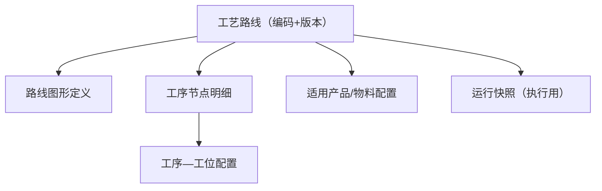

# 工艺管理

> 适用基线：测试环境目标 / `dev` 分支 / 2026-07-15。
> 阅读对象：工艺工程师、MES 实施顾问；维护步骤见[工艺管理-维护与查询参考](工艺管理-维护与查询参考.md)。

## 业务目的与适用范围

工艺管理把“某产品/物料按什么顺序、经哪些工序、受哪些转序与并行约束”维护成可执行的工艺路线，供计划拆分、线边执行与追溯引用。

本页只写 **MES 工艺路线** 已证实能力。DBC 侧若仍有工艺建模入口，以[DBC 工艺路线](../../04-DBC-主数据管理/08-工艺建模/02-工艺路线.md)的边界说明为准：目录位置不等于实现归属。

## 如何使用本组文档

| 你的目的 | 建议阅读 |
| --- | --- |
| 想理解路线、版本、图形与工序节点 | 本页。 |
| 正在新建/改版/启停路线 | [工艺管理-维护与查询参考](工艺管理-维护与查询参考.md)。 |
| 想看订单如何用路线 | [计划管理](../03-计划管理/index.md)。 |
| 想查工序主数据 | [DBC 工序管理](../../04-DBC-主数据管理/08-工艺建模/01-工序管理.md)。 |

## 使用前准备

| 需要确认什么 | 为什么重要 |
| --- | --- |
| 物料/产品与 BOM 版本 | 路线常绑定物料与 BOM。 |
| 工序与工位主数据 | 节点与工位配置依赖已建主数据。 |
| 版本策略 | 改工艺通常发新版本，避免覆盖在用版本。 |
| 是否已有在制工单 | 变更在用路线可能影响在制与追溯。 |

【截图占位：工艺路线列表与图形编辑器；脱敏。】

## 对象关系

| 对象 | 业务含义 |
| --- | --- |
| 工艺路线头 | 路线编码、名称、类型、版本、状态、物料、BOM/BOM 版本、备注；可含前置校验开关与校验规则。 |
| 图形定义 | 可视化编辑路线图，保存时解析为节点配置。 |
| 工序节点明细 | 节点顺序、工序编码/名称/类型、节拍、前后工序、节点扩展数据；可配置转序门槛、批量转序策略、是否并行及并行上限、作业分派模式等。 |
| 产品关联 | 路线与产品/物料的适用关系（编辑时回显）。 |
| 工位配置 | 工序与工位的对应关系，可导入导出。 |
| 运行快照 | 执行侧使用的路线快照（含图形），避免执行中被主数据随意改写。 |

## 一次维护如何生效

## 关键判断

| 判断点 | 应先确认什么 | 影响 |
| --- | --- | --- |
| 新建还是升版 | 是否已有在用版本被计划引用。 | 决定改旧版还是发新版。 |
| 图形与明细是否一致 | 保存图形后节点是否完整生成。 | 避免只改图未落明细。 |
| 转序过严/过松 | 最小合格转序数量、批量转序策略。 | 直接影响线边能否流转。 |
| 并行与派工 | 是否允许并行、抢单还是派工。 | 影响工位任务领取方式。 |

## 与计划、质量、仓储的边界

| 协同方 | 本页负责 | 不在本页展开 |
| --- | --- | --- |
| 计划/工单 | 提供可引用的路线与版本 | 订单状态机、拆单规则 |
| QMS | 可在节点扩展中承载检验相关配置线索 | 检验方案、判定、放行 |
| WMS | 不直接改库存 | 投料发料、完工入库 |
| DBC | 引用工序/物料/工厂主数据 | 把 MES 路线当成仅 DBC 只读副本 |

## 查询与联查

| 场景 | 建议看什么 | 联查 |
| --- | --- | --- |
| 按物料找路线 | 路线列表按物料/产品过滤。 | 物料主数据。 |
| 执行与主数据不一致 | 是否在用运行快照、版本是否切换。 | 计划/工单、终端。 |
| 工位对不上 | 工序—工位配置是否覆盖。 | 工位主数据、终端。 |
| 导入失败 | 导入错误文件与模板字段。 | [导入导出](../../03-基础设施/04-导入、导出与批量操作.md)。 |

## 常见问题与处理

| 情况 | 建议处理 |
| --- | --- |
| 旧文档写“从 DBC 同步出 MES 路线” | 以当前实现为准：路线维护在 MES；DBC 页已说明目录≠归属。 |
| 改了路线现场仍走旧工艺 | 查工单绑定版本与运行快照，而非只看最新主数据。 |
| 状态枚举文案不确定 | 以页面字典为准，不臆造 DRAFT/ACTIVE 等英文状态当培训事实。 |
| 质检点独立实体 | 当前以路线节点/扩展配置为线索；独立质检点主数据未在本刀证实为旧稿那种三表模型。 |

## 当前限制与待确认事项

- `MES-ROUTE`：路线状态字典/启停、节点扩展↔QMS 检验映射、路线—产品选用规则（总账）。
- 运行快照在**工单下发**时落库，细则见[计划管理](../03-计划管理/index.md)。旧稿虚构字段名与 ER 不得继续引用。

## 图示、截图与示例任务

| 类型 | 后续补充 | 目的 |
| --- | --- | --- |
| 图形编辑截图 | 起止节点与工序连线。 | 培训。 |
| 版本对照 | 同物料两版本差异。 | 验收。 |
