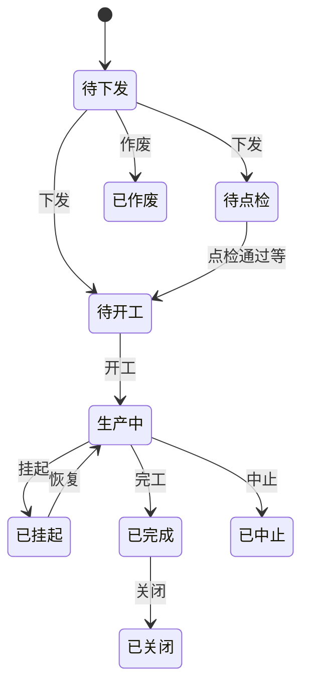

# 计划管理

> 适用基线：测试环境目标 / `dev` 分支 / 2026-07-15。
> 阅读对象：测试、实施、运维（主）；计划员、生产主管等现场角色（顺带）；操作步骤见[计划管理-维护与查询参考](计划管理-维护与查询参考.md)。

## 业务目的与适用范围

计划管理把外部/计划层的生产需求落实为可下发、可开工的生产工单，并管理工单在计划与执行之间的状态流转。线边扫码报工细则见[终端操作](../06-终端操作/index.md)；完工后库存落地见 WMS [生产管理](../../05-WMS-库房管理/08-生产管理/index.md) / [生产收料](../../05-WMS-库房管理/07-生产收料/index.md)；工艺路线主数据见[工艺管理](../02-工艺管理/index.md)。读完本页，应能判断一张工单卡在下发还是开工、改计划为何有时不会回写运行工单。

本页只写当前可确认的 **ERP 订单、生产订单、生产工单（计划层）、下发后的运行工单、并行组与状态动作**。旧稿中的虚构 ER 字段与英文状态不得继续当作培训事实。

## 如何使用本组文档

| 你的目的 | 建议阅读 |
| --- | --- |
| 想理解订单如何变成可执行工单 | 本页。 |
| 正在建单、拆分、下发、开工或挂起 | [计划管理-维护与查询参考](计划管理-维护与查询参考.md)。 |
| 想核对路线版本与运行快照 | [工艺管理](../02-工艺管理/index.md)。 |
| 想查投料发料或完工入库 | WMS 发料 / 生产收料 / 生产管理。 |

## 使用前准备

| 需要确认什么 | 为什么重要 |
| --- | --- |
| 物料、BOM、工艺路线与版本 | 下发时会按工单绑定路线生成运行快照。 |
| 工厂、车间、产线、班次 | 工单执行资源定位。 |
| 任务模式（单件 / 批量 / 普通批量） | 影响开工后追溯任务与报工方式。 |
| 是否来自 ERP、是否已转换/锁定 | 避免重复转换或改已锁订单。 |
| 是否并行开制多产品 | 决定是否建并行工单组并统一下发/开工。 |

!!! example "📷 截图占位"
    生产订单列表与工单列表（状态列）；脱敏。

## 对象关系

| 对象 | 业务含义 |
| --- | --- |
| ERP 订单 | 外部来源订单：物料、数量、计划起止、下达/实际时间、系统状态等；可锁定、关闭、取消；可验证并转换为生产侧订单。转换状态区分未转换/已转换。 |
| 生产订单 | MES 生产指令头：订单号、主订单、来源 ERP 订单、物料、订单数量、确认/已交/废品/返工数量、单位、车间、工厂、锁定标识、状态等。 |
| 生产工单（计划层） | 可排产对象：工单号、主工单号、来源生产订单、类型、工厂/车间/产线/班次、物料、数量、计划/实际时间、工艺路线、BOM/版本、任务模式、并行组、队列序、状态。 |
| 运行工单 | 下发后生成的执行副本；携带执行用路线/物料等快照，避免执行中被计划主数据随意改写。 |
| 并行工单组 | 多张待下发工单编组，可统一下发、整组开工/挂起/恢复/中止，并支持线边多 Tab 布局与扫码路由。 |
| 状态流转日志 / 完工状态 | 查询工单动作与完工进展的辅助入口（菜单以环境为准）。 |

## 工单状态
字典类型为工单执行状态。业务名称如下：

| 状态 | 典型含义 |
| --- | --- |
| 待下发 | 计划层已建，尚未形成运行工单。 |
| 待点检 | 下发后待点检环节（是否强制以现场配置为准）。 |
| 待开工 | 已具备开工条件，等待开工。 |
| 生产中 | 已开工，线边可报工流转。 |
| 已挂起 | 临时暂停；可恢复。 |
| 已完成 | 完工达成。 |
| 已关闭 | 关闭结束。 |
| 已作废 | 作废，不再执行。 |
| 已中止 | 中止执行。 |
| 已退料 | 退料相关终态/标记（细则待与发料联查）。 |

实际可达路径以服务校验为准；报工也可能触发自动完工/关闭（见状态日志操作类型）。上图用于培训理解，不替代权限与前置校验。

## 一次从订单到执行如何生效

## 关键判断

| 判断点 | 应先确认什么 | 影响 |
| --- | --- | --- |
| 改计划还是改运行 | 工单是否已下发。 | 已下发后改计划队列序可能不回写运行表。 |
| 单独下发还是整组下发 | 是否属于并行组。 | 组内成员应统一动作，避免半组执行。 |
| 升工艺版本是否影响在制 | 运行快照绑定的路线版本。 | 在制走快照；新单才吃新版本。 |
| 任务模式选错 | 单件/批量/普通批量。 | 追溯粒度与报工入口不同。 |
| ERP 已转换仍想改 | 锁定与转换状态。 | 可能需解锁或走变更流程（以实测为准）。 |

### 关键字段业务角色

完整状态-动作表与选择器范围见[维护与查询参考](计划管理-维护与查询参考.md)。本表只列主线关键项。物料/路线/可用主数据选择通例见[通用选择器过滤惯例](../../02-业务模型/12-通用选择器过滤惯例.md)；工厂→车间→产线为生产现场层级，**勿套用**仓→区→位通例。

| 字段/配置点 | 在系统中的作用 | 关键行为要点（取值/范围/联动/门禁） | 维护或操作时要警惕什么 |
| --- | --- | --- | --- |
| ERP 转换/锁定状态 | 外部订单能否转入 MES | 已转换勿重复转换；锁定后变更受控 | 重复转换或改已锁单 |
| 生产订单状态 | 生产指令头门禁 | 字典全量文案 ❓（`MES-PLAN`） | 勿臆造英文状态 |
| 工单状态 | 下发/开工/挂起/完工门禁 | 见上文状态表；实际可达路径以服务校验为准 | 非预期状态强行动作 |
| 工艺路线 / 版本 | 下发时生成运行快照 | 须选可引用路线；下发后在制读快照 | 缺路线无法下发 |
| 工厂/车间/产线/班次 | 执行资源定位 | 级联选有效工厂建模对象 | 资源错 → 线边找不到 |
| 任务模式 | 追溯与报工粒度 | 单件 / 批量 / 普通批量 | 选错粒度导致追溯入口不符 |
| 并行组 | 多工单统一生命周期 | 创建要求成员待下发且未分组 | 半组下发导致现场混乱 |
| 计划队列序 | 排产顺序 | 已下发后改序可能不回写运行表 | 以为改序即改现场顺序 |
| 物料 / 数量 | 生产对象与计划量 | 拆分数量之和应可核对 | 超量拆分难对账 |

### 选择器范围（骨架）

| 选择字段 | 选择对象 | 可选范围（当前可写） | 范围依赖 | 选不到时通常原因 |
| --- | --- | --- | --- | --- |
| 物料 | 物料主数据 | 可用；可制造等用途过滤 ❓（`FSEM-001`） | 通例见[通用选择器过滤惯例](../../02-业务模型/12-通用选择器过滤惯例.md) | 停用、用途不符、权限外 |
| 工艺路线 / 版本 | MES 工艺路线 | 须为可被计划引用的状态；精确状态集 ❓（`MES-ROUTE`） | 物料/BOM | 未启用、状态不可引用 |
| 工厂 / 车间 / 产线 / 班次 | 工厂建模 | 生产现场层级级联；**勿套用**仓→区→位 | 上游工厂/车间 | 未建产线、跨厂选错 |
| 并行组成员 | 待下发工单 | 成员须待下发且未分组 | 工单状态 | 已下发/已在组 |
| ERP 订单 | 外部订单 | 未转换或按规则可再处理；锁定后受控 | 转换/锁定状态 | 已转换仍重复选、已锁 |

## 与工艺、终端、仓储、质量的边界

| 协同方 | 本页负责 | 不在本页展开 |
| --- | --- | --- |
| 工艺管理 | 引用路线编码/版本；**下发时**落运行快照 | 路线图形与节点维护 |
| 终端操作 | 提供可开工的运行工单 | 扫码、工位作业、装箱细节 |
| WMS | 工单/完工事实作为投料发料与完工入库的生产侧前提 | 库存事务、预计入/出与余额规则 |
| QMS | 过程检验可挂在执行节点（配置线索） | 检验方案与判定、放行 |
| PS/排程 | 若未来存在排程结果来源，可在此联查 | 排程算法、版本对比与甘特（见 [PS 排程管理](../../11-PS-排程管理/index.md)；当前实现未在本仓库证实，勿把本页工单规则抄成 PS） |

**当前边界：** 完工后库存落地联查 [WMS 生产收料](../../05-WMS-库房管理/07-生产收料/index.md) / [生产管理（制品收货）](../../05-WMS-库房管理/08-生产管理/index.md)；发料侧与 MES 生产收料任务消息见 `GAP-067`。投料发料规则见 [WMS 发料管理](../../05-WMS-库房管理/06-发料管理/index.md)（`GAP-066`）。

**待确认：** 已退料与发料回冲全闭环、生产订单字典全量文案 → `MES-PLAN`；NG/过程检验自动建单 → `GAP-071`。

## 查询与联查

| 场景 | 建议看什么 | 联查 |
| --- | --- | --- |
| ERP 未进 MES | ERP 订单转换状态、锁定。 | 接口调用信息（若走集成）。 |
| 下发失败 | 工单状态、路线/产线是否齐全。 | 工艺路线、错误提示。 |
| 现场工艺与主数据不一致 | 运行快照版本 vs 最新路线。 | 工艺管理、状态日志。 |
| 挂起失败 | 是否有执行中工位作业。 | 终端/工位作业。 |
| 已完工无库存 | 完工记录与 WMS 收货/入库。 | WMS 生产管理。 |

### 详情分组与快速跳转

| 分组 | 应展示什么 | 可联查什么 |
| --- | --- | --- |
| 订单/工单身份 | 单号、物料、数量、状态。 | ERP 订单、生产订单。 |
| 资源与路线 | 工厂/车间/产线/班次、工艺路线版本。 | 工艺管理、工厂建模。 |
| 下发与运行 | 运行工单、快照版本、并行组。 | 终端操作、状态日志。 |
| 执行进展 | 开工/挂起/完工线索。 | 工位作业、报工。 |
| 仓储协同 | 发料/收料/入库结果。 | WMS 发料、生产收料/制品收货。 |
| 系统信息 | 创建、更新与审计。 | — |

!!! example "📷 截图占位"
    生产订单/工单详情分组与工艺/WMS 联查；状态：待截图。

## 常见问题与处理

| 情况 | 建议处理 |
| --- | --- |
| 旧文档写三层“ERP→生产订单→工单”但字段名全是臆造 | 以本页对象与维护参考为准。 |
| 把 WMS「生产计划」菜单当成 MES 计划 | WMS 生产计划属仓储生产协同，不在本分组。 |
| 批量报工/尾箱规则写进计划页 | 属执行与装箱能力，放到终端/专项页，本页只保留任务模式边界。 |
| 状态英文 DRAFT/ACTIVE | 工单状态以「待下发/生产中…」为准，见上表。 |

## 当前限制与待确认事项

- `MES-PLAN`：生产订单字典文案、待点检强制、已退料↔发料回冲、历史菜单并存（总账）。
- 跨模块库存闭环另见 `GAP-066` / `GAP-067` / `WMS-PROD`。

## 待补充的图示与示例
| 类型 | 后续补充 | 目的 |
| --- | --- | --- |
| 转换与拆分截图 | ERP→生产订单→多工单。 | 培训。 |
| 状态流转样例 | 下发→开工→挂起→恢复→完工。 | 验收。 |
| 并行组样例 | 组创建、统一下发、线边多 Tab。 | 验收。 |
