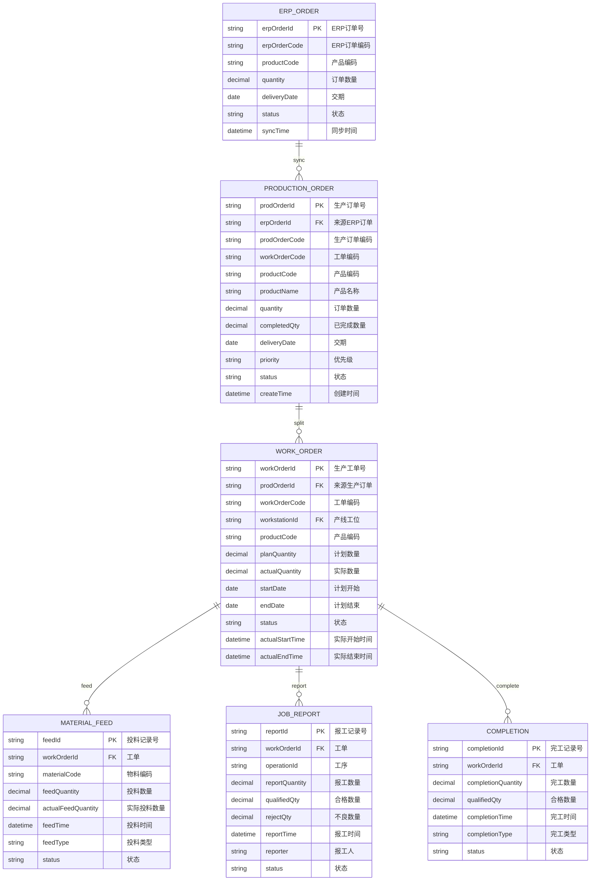
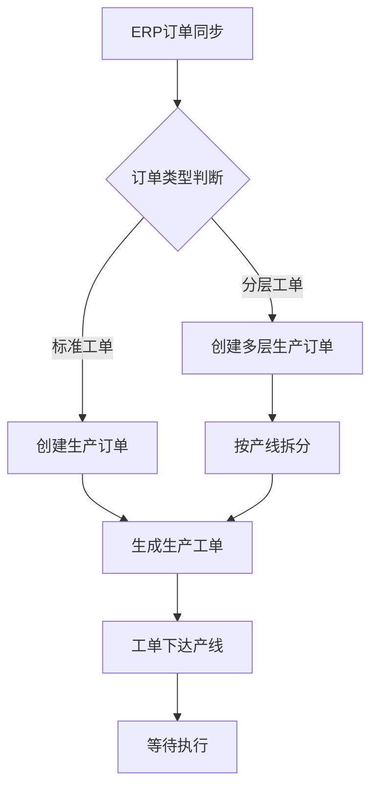
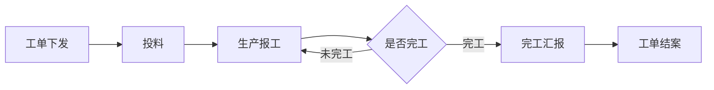

# 计划管理

## 概述

计划管理是 MES 生产执行系统的核心模块，负责将 ERP 订单逐级拆解为可执行的生产工单，并驱动投料、报工、完工等生产全生命周期。

**核心链路**：

```
ERP订单 → 生产订单（MES拆解） → 生产工单（产线执行） → 完工汇报
```

| 实体 | 来源 | 作用 |
|------|------|------|
| ERP订单 | 从 ERP 同步 | 接收工单指令 |
| 生产订单 | MES 下达 | 生产指令，含物料/数量/交期 |
| 生产工单 | MES 产线执行 | 投料/报工/完工围绕工单执行 |

---

## 领域模型

### ER 图



### 实体说明

| 实体 | 说明 |
|------|------|
| ERP_ORDER | 从 ERP 系统同步过来的工单，是整个链路的数据源头 |
| PRODUCTION_ORDER | MES 系统的生产订单，对 ERP 订单进行拆解和细化，含物料清单、工艺路线 |
| WORK_ORDER | 产线执行层面的工单，关联具体产线工位，是报工和投料的核心载体 |
| MATERIAL_FEED | 工单的投料记录，支持按工序、按批次投料 |
| JOB_REPORT | 工单的报工记录，记录各工序完成情况 |
| COMPLETION | 工单完工记录，标记生产完成 |

---

## 核心流程

### 订单同步与拆分流程



### 生产执行流程



### 流程说明

**1. ERP订单同步**

- 从 ERP 系统按同步规则拉取工单数据
- 支持全量同步和增量同步两种模式
- 同步时校验数据完整性

**2. 生产订单创建**

- 将 ERP 订单转换为 MES 生产订单
- 携带物料清单、工艺路线、交期等信息
- 根据产品类型决定是否需要多层级拆分

**3. 生产工单生成**

- 按产线、按工序拆分生产订单
- 每个工单关联具体的产线工位
- 计算计划开始/结束时间

**4. 工单下达与执行**

- 工单下达至产线终端
- 产线操作工进行投料、报工
- 实时采集生产进度

**5. 完工与结案**

- 工单完成后进行完工汇报
- 系统自动计算完成率
- 工单结案归档

---

## ERP订单管理

### 概述

ERP 订单是从 ERP 系统同步过来的工单，作为 MES 的数据源头。同步后生成的记录称为"生产订单"。

### 字段说明

| 字段名 | 类型 | 说明 | 备注 |
|--------|------|------|------|
| erpOrderId | string | ERP订单号 | 主键 |
| erpOrderCode | string | ERP订单编码 | (待截图确认) |
| productCode | string | 产品编码 | (待截图确认) |
| quantity | decimal | 订单数量 | (待截图确认) |
| deliveryDate | date | 交期 | (待截图确认) |
| status | string | 状态 | (待截图确认) |
| syncTime | datetime | 同步时间 | (待截图确认) |

### 状态说明

| 状态值 | 说明 |
|--------|------|
| pending | 待同步 |
| synced | 已同步 |
| cancelled | 已取消 |

---

## 生产订单管理

### 概述

生产订单是 MES 系统的生产指令，由 ERP 订单转换生成。包含完整的物料清单、工艺路线、交期信息。

### 字段说明

| 字段名 | 类型 | 说明 | 备注 |
|--------|------|------|------|
| prodOrderId | string | 生产订单号 | 主键 |
| erpOrderId | string | 来源ERP订单 | 外键 |
| prodOrderCode | string | 生产订单编码 | (待截图确认) |
| workOrderCode | string | 工单编码 | (待截图确认) |
| productCode | string | 产品编码 | (待截图确认) |
| productName | string | 产品名称 | (待截图确认) |
| quantity | decimal | 订单数量 | (待截图确认) |
| completedQty | decimal | 已完成数量 | (待截图确认) |
| deliveryDate | date | 交期 | (待截图确认) |
| priority | string | 优先级 | (待截图确认) |
| status | string | 状态 | (待截图确认) |
| createTime | datetime | 创建时间 | (待截图确认) |

### 状态说明

| 状态值 | 说明 |
|--------|------|
| created | 已创建 |
| released | 已下达 |
| inProgress | 生产中 |
| completed | 已完成 |
| closed | 已结案 |
| cancelled | 已取消 |

---

## 生产工单管理

### 概述

生产工单是 MES 产线执行层面的工单，是投料、报工、完工的核心载体。每个生产订单可拆分为多个生产工单。

### 字段说明

| 字段名 | 类型 | 说明 | 备注 |
|--------|------|------|------|
| workOrderId | string | 生产工单号 | 主键 |
| prodOrderId | string | 来源生产订单 | 外键 |
| workOrderCode | string | 工单编码 | (待截图确认) |
| workstationId | string | 产线工位 | (待截图确认) |
| productCode | string | 产品编码 | (待截图确认) |
| planQuantity | decimal | 计划数量 | (待截图确认) |
| actualQuantity | decimal | 实际数量 | (待截图确认) |
| startDate | date | 计划开始 | (待截图确认) |
| endDate | date | 计划结束 | (待截图确认) |
| status | string | 状态 | (待截图确认) |
| actualStartTime | datetime | 实际开始时间 | (待截图确认) |
| actualEndTime | datetime | 实际结束时间 | (待截图确认) |

### 状态说明

| 状态值 | 说明 |
|--------|------|
| created | 已创建 |
| released | 已下达 |
| scheduled | 已排程 |
| inProgress | 生产中 |
| paused | 已暂停 |
| completed | 已完工 |
| cancelled | 已取消 |

---

## 投料管理

### 概述

投料管理记录生产工单的物料消耗，支持按工序、按批次投料，确保物料追溯。

### 字段说明

| 字段名 | 类型 | 说明 | 备注 |
|--------|------|------|------|
| feedId | string | 投料记录号 | 主键 |
| workOrderId | string | 工单 | 外键 |
| materialCode | string | 物料编码 | (待截图确认) |
| feedQuantity | decimal | 投料数量 | (待截图确认) |
| actualFeedQuantity | decimal | 实际投料数量 | (待截图确认) |
| feedTime | datetime | 投料时间 | (待截图确认) |
| feedType | string | 投料类型 | (待截图确认) |
| status | string | 状态 | (待截图确认) |

### 投料类型说明

| 类型值 | 说明 |
|--------|------|
| normal | 正常投料 |
| supplemental | 补料 |
| rework | 返工投料 |
| trial | 试料 |

---

## 报工管理

### 概述

报工管理记录生产工单各工序的完成情况，采集产量、质量数据，是生产进度统计的基础。

### 字段说明

| 字段名 | 类型 | 说明 | 备注 |
|--------|------|------|------|
| reportId | string | 报工记录号 | 主键 |
| workOrderId | string | 工单 | 外键 |
| operationId | string | 工序 | (待截图确认) |
| reportQuantity | decimal | 报工数量 | (待截图确认) |
| qualifiedQty | decimal | 合格数量 | (待截图确认) |
| rejectQty | decimal | 不良数量 | (待截图确认) |
| reportTime | datetime | 报工时间 | (待截图确认) |
| reporter | string | 报工人 | (待截图确认) |
| status | string | 状态 | (待截图确认) |

---

## 完工管理

### 概述

完工管理记录生产工单的完工情况，包括完工数量、完工类型、完工时间。

### 字段说明

| 字段名 | 类型 | 说明 | 备注 |
|--------|------|------|------|
| completionId | string | 完工记录号 | 主键 |
| workOrderId | string | 工单 | 外键 |
| completionQuantity | decimal | 完工数量 | (待截图确认) |
| qualifiedQty | decimal | 合格数量 | (待截图确认) |
| completionTime | datetime | 完工时间 | (待截图确认) |
| completionType | string | 完工类型 | (待截图确认) |
| status | string | 状态 | (待截图确认) |

### 完工类型说明

| 类型值 | 说明 |
|--------|------|
| normal | 正常完工 |
| partial | 部分完工 |
| early | 提前完工 |
| overdue | 逾期完工 |
| rework | 返工完工 |