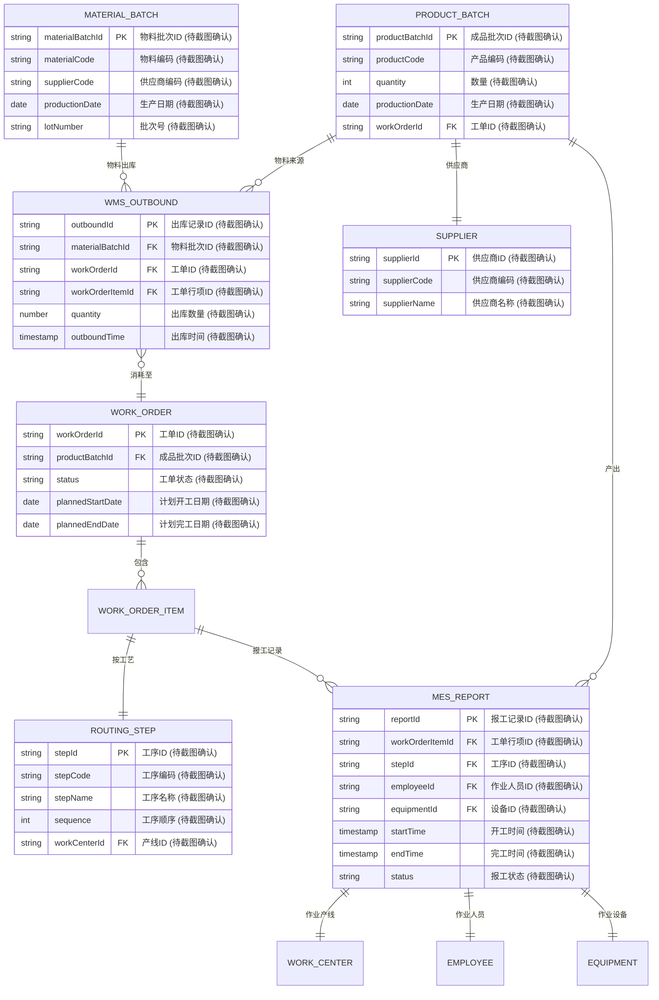
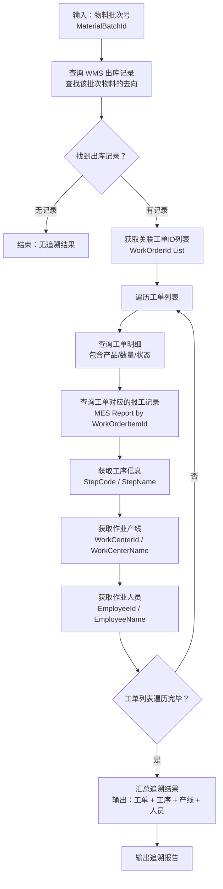
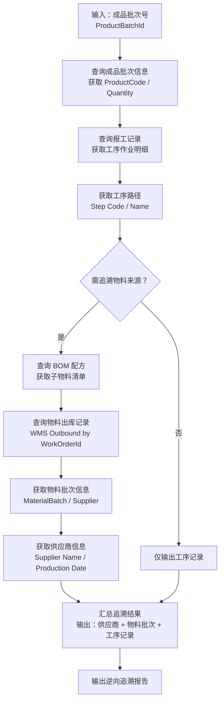

# 追溯管理

## 1. 概述

追溯管理是 MES 系统中保障产品质量与合规性的核心模块，通过对物料流动、工序作业、成品生产的全链路数据采集与关联，实现"来源可查、去向可追、责任可究"的追溯目标。

### 1.1 追溯类型

| 追溯类型 | 方向 | 查询起点 | 查询终点 | 典型场景 |
|---------|------|---------|---------|---------|
| **正向追溯** | 物料 → 成品 | 物料批次 | 工单/工序/产线/操作人 | 物料不良时，追溯该物料用在了哪些批次/工单 |
| **逆向追溯** | 成品 → 物料 | 成品批次 | 供应商/生产日期/工序记录 | 成品异常时，追溯原辅材料来源与生产过程 |

### 1.2 追溯数据来源

| 数据来源 | 内容说明 |
|---------|---------|
| **MES 报工记录** | 工序完工扫描，记录实际加工人员、设备、工序、开工/完工时间 |
| **WMS 出库记录** | 物料消耗批次，记录物料从哪个批次出库、用在哪个工单哪道工序 |
| **工艺路线** | 定义产品经过的工序顺序，是追溯路径的基准 |
| **BOM 配方** | 界定物料与成品的父子关系，是正向/逆向追溯的关联基础 |

---

## 2. 领域模型

### 2.1 实体关系图（ER 图）

### 2.2 核心关联关系说明

| 关联路径 | 说明 |
|---------|------|
| 物料批次 → 出库记录 → 工单 | 正向追溯主线：某物料用到哪些工单 |
| 工单 → 报工记录 → 工序/产线/人员 | 工单执行明细追溯 |
| 成品批次 → 报工记录（逆查） | 逆向追溯：成品由哪些工序产出 |
| 成品批次 → 出库记录（逆查） → 物料批次 → 供应商 | 逆向追溯：成品物料来源 |

---

## 3. 核心流程

### 3.1 正向追溯流程（物料 → 成品）

**业务场景**：物料发生不良，需追溯该物料用在了哪些工单/产线，以便隔离与召回。

**关键节点说明**：

| 节点 | 操作 | 输出 |
|-----|------|-----|
| 输入 | 录入物料批次号 | 待追溯的起点 |
| WMS 查询 | 根据 `materialBatchId` 查 `WMS_OUTBOUND` | 出库记录列表 |
| 工单明细 | 根据 `workOrderId` 查 `WORK_ORDER` | 产品/数量/计划日期 |
| 报工记录 | 根据 `workOrderItemId` 查 `MES_REPORT` | 工序/人员/设备/时间 |
| 汇总输出 | 合并输出完整追溯链 | 正向追溯报告 |

### 3.2 逆向追溯流程（成品 → 物料）

**业务场景**：成品发生质量问题，需追溯原辅材料供应商、生产日期、工序记录，以便定位根因与召回。

**关键节点说明**：

| 节点 | 操作 | 输出 |
|-----|------|-----|
| 输入 | 录入成品批次号 | 追溯起点 |
| 报工追溯 | 查 `MES_REPORT` 关联 `WORK_ORDER` | 工单执行明细 |
| BOM 展开 | 查 `BOM` 获取子物料 | 物料清单 |
| 物料溯源 | 查 `WMS_OUTBOUND` → `MATERIAL_BATCH` | 物料批次及供应商 |
| 汇总输出 | 合并输出完整追溯链 | 逆向追溯报告 |

---

## 4. 字段说明

### 4.1 物料批次表（Material Batch）

| 字段名 | 中文名 | 数据类型 | 说明 |
|-------|-------|---------|------|
| `materialBatchId` | 物料批次ID | String | 主键，唯一标识物料批次 (待截图确认) |
| `materialCode` | 物料编码 | String | 物料的编码标识 (待截图确认) |
| `materialName` | 物料名称 | String | 物料名称 (待截图确认) |
| `supplierCode` | 供应商编码 | String | 物料供应商编码 (待截图确认) |
| `supplierName` | 供应商名称 | String | 物料供应商名称 (待截图确认) |
| `productionDate` | 生产日期 | Date | 物料生产日期 (待截图确认) |
| `lotNumber` | 批次号 | String | 供应商提供的批次号 (待截图确认) |
| `specification` | 规格型号 | String | 物料规格 (待截图确认) |
| `unitOfMeasure` | 单位 | String | 计量单位 (待截图确认) |
| `quantity` | 数量 | Number | 当前批次库存数量 (待截图确认) |
| `warehouseId` | 仓库ID | String | 存放仓库 (待截图确认) |
| `createdTime` | 创建时间 | Timestamp | 批次创建时间 (待截图确认) |

### 4.2 WMS 出库记录表（WMS Outbound）

| 字段名 | 中文名 | 数据类型 | 说明 |
|-------|-------|---------|------|
| `outboundId` | 出库记录ID | String | 主键，唯一标识一次出库 (待截图确认) |
| `materialBatchId` | 物料批次ID | String | 外键，关联物料批次 (待截图确认) |
| `workOrderId` | 工单ID | String | 外键，关联工单 (待截图确认) |
| `workOrderItemId` | 工单行项ID | String | 外键，关联工单行项 (待截图确认) |
| `productBatchId` | 成品批次ID | String | 外键，关联成品批次 (待截图确认) |
| `quantity` | 出库数量 | Number | 本次出库数量 (待截图确认) |
| `outboundTime` | 出库时间 | Timestamp | 物料出库时间 (待截图确认) |
| `outboundType` | 出库类型 | String | 类型如：工单领料 / 退货出库等 (待截图确认) |
| `operatorId` | 操作人ID | String | 执行出库操作的人员 (待截图确认) |
| `sourceWarehouseId` | 源仓库ID | String | 出库源仓库 (待截图确认) |
| `destinationType` | 目标类型 | String | 目标如：产线 / 工序等 (待截图确认) |

### 4.3 工单表（Work Order）

| 字段名 | 中文名 | 数据类型 | 说明 |
|-------|-------|---------|------|
| `workOrderId` | 工单ID | String | 主键，唯一标识工单 (待截图确认) |
| `workOrderCode` | 工单编号 | String | 工单编码 (待截图确认) |
| `productCode` | 产品编码 | String | 工单生产的产品编码 (待截图确认) |
| `productName` | 产品名称 | String | 工单生产的产品名称 (待截图确认) |
| `productBatchId` | 成品批次ID | String | 外键，关联成品批次 (待截图确认) |
| `quantity` | 计划数量 | Number | 工单计划生产数量 (待截图确认) |
| `completedQuantity` | 已完成数量 | Number | 工单已完成数量 (待截图确认) |
| `status` | 工单状态 | String | 状态如：待生产 / 生产中 / 已完成 / 已关闭 (待截图确认) |
| `plannedStartDate` | 计划开工日期 | Date | 工单计划开始日期 (待截图确认) |
| `plannedEndDate` | 计划完工日期 | Date | 工单计划结束日期 (待截图确认) |
| `actualStartDate` | 实际开工日期 | Date | 工单实际开始日期 (待截图确认) |
| `actualEndDate` | 实际完工日期 | Date | 工单实际结束日期 (待截图确认) |
| `workCenterId` | 产线ID | String | 执行工单的产线 (待截图确认) |
| `priority` | 优先级 | Integer | 工单优先级 (待截图确认) |
| `createdBy` | 创建人 | String | 工单创建人 (待截图确认) |
| `createdTime` | 创建时间 | Timestamp | 工单创建时间 (待截图确认) |

### 4.4 报工记录表（MES Report）

| 字段名 | 中文名 | 数据类型 | 说明 |
|-------|-------|---------|------|
| `reportId` | 报工记录ID | String | 主键，唯一标识报工记录 (待截图确认) |
| `workOrderId` | 工单ID | String | 外键，关联工单 (待截图确认) |
| `workOrderItemId` | 工单行项ID | String | 外键，关联工单行项 (待截图确认) |
| `stepId` | 工序ID | String | 外键，关联工序 (待截图确认) |
| `stepCode` | 工序编码 | String | 报工工序编码 (待截图确认) |
| `stepName` | 工序名称 | String | 报工工序名称 (待截图确认) |
| `employeeId` | 作业人员ID | String | 外键，关联作业人员 (待截图确认) |
| `employeeName` | 作业人员姓名 | String | 报工作业人员姓名 (待截图确认) |
| `equipmentId` | 设备ID | String | 外键，关联作业设备 (待截图确认) |
| `equipmentName` | 设备名称 | String | 报工作业设备名称 (待截图确认) |
| `workCenterId` | 产线ID | String | 作业产线 (待截图确认) |
| `workCenterName` | 产线名称 | String | 作业产线名称 (待截图确认) |
| `quantity` | 报工数量 | Number | 本次报工数量 (待截图确认) |
| `qualifiedQuantity` | 合格数量 | Number | 报工合格数量 (待截图确认) |
| `rejectedQuantity` | 不合格数量 | Number | 报工不合格数量 (待截图确认) |
| `startTime` | 开工时间 | Timestamp | 工序实际开工时间 (待截图确认) |
| `endTime` | 完工时间 | Timestamp | 工序实际完工时间 (待截图确认) |
| `status` | 报工状态 | String | 状态如：进行中 / 已完成 (待截图确认) |
| `reportType` | 报工类型 | String | 类型如：首检 / 巡检 / 末检 (待截图确认) |
| `remark` | 备注 | String | 报工备注信息 (待截图确认) |
| `createdTime` | 创建时间 | Timestamp | 记录创建时间 (待截图确认) |

### 4.5 成品批次表（Product Batch）

| 字段名 | 中文名 | 数据类型 | 说明 |
|-------|-------|---------|------|
| `productBatchId` | 成品批次ID | String | 主键，唯一标识成品批次 (待截图确认) |
| `productBatchCode` | 成品批次编号 | String | 成品批次编码 (待截图确认) |
| `productCode` | 产品编码 | String | 产品编码 (待截图确认) |
| `productName` | 产品名称 | String | 产品名称 (待截图确认) |
| `quantity` | 数量 | Number | 成品批次数量 (待截图确认) |
| `productionDate` | 生产日期 | Date | 成品生产日期 (待截图确认) |
| `workOrderId` | 工单ID | String | 外键，关联工单 (待截图确认) |
| `workCenterId` | 产线ID | String | 生产产线 (待截图确认) |
| `status` | 批次状态 | String | 状态如：待入库 / 已入库 / 已发货 (待截图确认) |
| `serialNumber` | 序列号 | String | 成品序列号 (待截图确认) |
| `shelfLife` | 有效期 | Date | 成品有效期 (待截图确认) |
| `createdTime` | 创建时间 | Timestamp | 记录创建时间 (待截图确认) |

### 4.6 工序表（Routing Step）

| 字段名 | 中文名 | 数据类型 | 说明 |
|-------|-------|---------|------|
| `stepId` | 工序ID | String | 主键，唯一标识工序 (待截图确认) |
| `stepCode` | 工序编码 | String | 工序编码 (待截图确认) |
| `stepName` | 工序名称 | String | 工序名称 (待截图确认) |
| `routingId` | 工艺路线ID | String | 外键，关联工艺路线 (待截图确认) |
| `sequence` | 工序顺序 | Integer | 在工艺路线中的顺序 (待截图确认) |
| `workCenterId` | 产线ID | String | 作业产线 (待截图确认) |
| `workCenterName` | 产线名称 | String | 作业产线名称 (待截图确认) |
| `standardHours` | 标准工时 | Number | 工序标准工时 (待截图确认) |
| `description` | 工序描述 | String | 工序详细描述 (待截图确认) |
| `isKeyStep` | 是否关键工序 | Boolean | 是否为关键质量控制点 (待截图确认) |

### 4.7 产线表（Work Center）

| 字段名 | 中文名 | 数据类型 | 说明 |
|-------|-------|---------|------|
| `workCenterId` | 产线ID | String | 主键，唯一标识产线 (待截图确认) |
| `workCenterCode` | 产线编码 | String | 产线编码 (待截图确认) |
| `workCenterName` | 产线名称 | String | 产线名称 (待截图确认) |
| `departmentId` | 部门ID | String | 所属部门 (待截图确认) |
| `departmentName` | 部门名称 | String | 部门名称 (待截图确认) |
| `location` | 位置 | String | 产线位置 (待截图确认) |
| `status` | 产线状态 | String | 状态如：正常 / 维护中 / 停用 (待截图确认) |
| `capacity` | 产能 | Number | 日产能 (待截图确认) |
| `createdTime` | 创建时间 | Timestamp | 记录创建时间 (待截图确认) |

### 4.8 供应商表（Supplier）

| 字段名 | 中文名 | 数据类型 | 说明 |
|-------|-------|---------|------|
| `supplierId` | 供应商ID | String | 主键，唯一标识供应商 (待截图确认) |
| `supplierCode` | 供应商编码 | String | 供应商编码 (待截图确认) |
| `supplierName` | 供应商名称 | String | 供应商名称 (待截图确认) |
| `contactPerson` | 联系人 | String | 供应商联系人 (待截图确认) |
| `contactPhone` | 联系电话 | String | 联系电话 (待截图确认) |
| `address` | 地址 | String | 供应商地址 (待截图确认) |
| `supplierType` | 供应商类型 | String | 类型如：原材料 / 包材 / 设备 (待截图确认) |
| `status` | 状态 | String | 状态如：合格 / 不合格 / 待审核 (待截图确认) |
| `createdTime` | 创建时间 | Timestamp | 记录创建时间 (待截图确认) |

### 4.9 人员表（Employee）

| 字段名 | 中文名 | 数据类型 | 说明 |
|-------|-------|---------|------|
| `employeeId` | 员工ID | String | 主键，唯一标识员工 (待截图确认) |
| `employeeCode` | 员工工号 | String | 员工工号 (待截图确认) |
| `employeeName` | 员工姓名 | String | 员工姓名 (待截图确认) |
| `departmentId` | 部门ID | String | 所属部门 (待截图确认) |
| `departmentName` | 部门名称 | String | 部门名称 (待截图确认) |
| `position` | 岗位 | String | 岗位职位 (待截图确认) |
| `workCenterId` | 产线ID | String | 所属产线 (待截图确认) |
| `skillLevel` | 技能等级 | String | 技能等级如：初级 / 中级 / 高级 (待截图确认) |
| `status` | 状态 | String | 状态如：在职 / 离职 (待截图确认) |
| `createdTime` | 创建时间 | Timestamp | 记录创建时间 (待截图确认) |

### 4.10 设备表（Equipment）

| 字段名 | 中文名 | 数据类型 | 说明 |
|-------|-------|---------|------|
| `equipmentId` | 设备ID | String | 主键，唯一标识设备 (待截图确认) |
| `equipmentCode` | 设备编码 | String | 设备编码 (待截图确认) |
| `equipmentName` | 设备名称 | String | 设备名称 (待截图确认) |
| `equipmentType` | 设备类型 | String | 类型如：加工设备 / 检测设备 (待截图确认) |
| `workCenterId` | 产线ID | String | 所属产线 (待截图确认) |
| `manufacturer` | 制造商 | String | 设备制造商 (待截图确认) |
| `model` | 型号 | String | 设备型号 (待截图确认) |
| `serialNumber` | 序列号 | String | 设备序列号 (待截图确认) |
| `purchaseDate` | 购置日期 | Date | 设备购置日期 (待截图确认) |
| `status` | 设备状态 | String | 状态如：正常 / 维修中 / 报废 (待截图确认) |
| `createdTime` | 创建时间 | Timestamp | 记录创建时间 (待截图确认) |

---

## 5. 接口规范

### 5.1 正向追溯接口

| 接口名称 | 方法 | 路径 | 说明 |
|---------|------|------|------|
| 查询物料追溯链 | GET | `/api/mes/traceability/material/{materialBatchId}` | 根据物料批次ID查询正向追溯链 |
| 查询工单物料消耗 | GET | `/api/mes/traceability/workorder/{workOrderId}/material-consumption` | 查询工单的物料消耗明细 |
| 批量物料追溯 | POST | `/api/mes/traceability/material/batch` | 批量查询多物料批次的追溯链 |

### 5.2 逆向追溯接口

| 接口名称 | 方法 | 路径 | 说明 |
|---------|------|------|------|
| 查询成品追溯链 | GET | `/api/mes/traceability/product/{productBatchId}` | 根据成品批次ID查询逆向追溯链 |
| 查询成品工序记录 | GET | `/api/mes/traceability/product/{productBatchId}/process-records` | 查询成品生产工序记录 |
| 查询成品物料来源 | GET | `/api/mes/traceability/product/{productBatchId}/material-source` | 查询成品物料来源及供应商信息 |

---

## 6. 业务规则

### 6.1 追溯精度

| 追溯类型 | 精度要求 |
|---------|---------|
| 正向追溯 | 精确到物料批次、工单、工序、产线、操作人、时间 |
| 逆向追溯 | 精确到成品批次、供应商、生产日期、工序记录 |

### 6.2 数据时效性

- 报工记录须在工序完工后 **30 分钟内** 上报系统
- WMS 出库记录须在物料出库时 **实时** 同步至 MES
- 追溯查询支持 **T+0** 实时数据

### 6.3 追溯权限

- 追溯查询操作须记录操作日志
- 敏感批次追溯须具备相应权限方可查看完整供应商信息