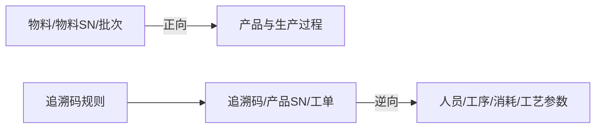

# 追溯管理

> 适用基线：测试环境目标 / `dev` 分支 / 2026-07-15。
> 阅读对象：质量、工艺、客诉处理人员；操作见[追溯管理-维护与查询参考](追溯管理-维护与查询参考.md)。

## 业务目的与适用范围

追溯管理基于生产过程中沉淀的报工、工位作业、物料消耗、设备参数与完工事实，提供 **正向（物料→产品）** 与 **逆向（产品/码→过程）** 查询，并维护追溯码规则。本页是查询与规则配置说明，不替代现场报工采集（见[终端操作](../06-终端操作/index.md)）。

旧稿虚构 ER 与未核验字段废弃。

## 如何使用本组文档

| 你的目的 | 建议阅读 |
| --- | --- |
| 想理解正逆向查什么 | 本页。 |
| 正在做客诉/批次排查 | [追溯管理-维护与查询参考](追溯管理-维护与查询参考.md)。 |
| 想核对报工/完工原始记录 | [报表统计](../05-报表统计/index.md)。 |

## 使用前准备

| 需要确认什么 | 为什么重要 |
| --- | --- |
| 查询起点（物料码/SN/批次/工单/产品 SN/追溯码） | 决定走正向还是逆向入口。 |
| 现场是否按规则赋码并报工 | 无采集则无链路。 |
| 追溯码规则是否覆盖该物料 | 码段不合规会导致解析失败。 |

!!! example "📷 截图占位"
    正向按物料查询结果与逆向单件详情；脱敏。

## 对象与查询能力

| 能力 | 业务含义 |
| --- | --- |
| 正向：按物料代码 | 该物料参与了哪些产品的生产过程。 |
| 正向：按物料 SN | 该唯一序列号用到了哪个产品。 |
| 正向：按批次号 | 该批次相关产品的生产过程。 |
| 逆向：分页查询 | 按唯一追溯码/产品 SN/物料/批次/工单/生产日期等查追溯任务。 |
| 逆向：物料消耗树 | 以工位消耗记录为节点展示消耗树。 |
| 逆向：人员信息 | 关联报工日志中的人员过程。 |
| 逆向：工序加工信息 | 关联工位作业过程。 |
| 逆向：工艺/设备参数 | 关联设备参数追溯数据。 |
| 逆向：物料消耗分页 | 关联工位消耗日志。 |
| 追溯码规则 | 按物料维护规则信息，约束赋码/解析。 |

## 关键判断

| 判断点 | 应先确认什么 | 影响 |
| --- | --- | --- |
| 查不到 | 是否已报工/消耗/赋码；条件是否过窄。 | 先回报表记录再查追溯。 |
| 正逆向结果不一致 | 起点对象是否同一层级（批次 vs SN）。 | 统一粒度后再比。 |
| 码无法识别 | 追溯码规则与现场打印规则。 | 先修规则再补打/重采。 |

### 关键字段业务角色

查询条件范围与逆向页签数据来源见[维护与查询参考](追溯管理-维护与查询参考.md)。本表只列主线关键项。

| 字段/配置点 | 在系统中的作用 | 关键行为要点（取值/范围/联动/门禁） | 维护或操作时要警惕什么 |
| --- | --- | --- | --- |
| 查询起点（物料码 / SN / 批次） | 决定正向入口与粒度 | 三者不可混用期望同一结果集 | 粒度错 → 空结果或过大结果 |
| 逆向条件（追溯码 / 产品 SN / 工单等） | 定位追溯任务 | 尽量带唯一码或工单号 | 条件过宽难排查 |
| 物料消耗树 | 展示消耗链路 | 节点来自工位消耗日志；↔WMS 出库单号 ❓（`MES-TRACE`） | 勿把树节点当可编辑库存 |
| 人员 / 工序 / 设备参数页签 | 联查过程事实 | 分别来自报工日志、工位作业、设备参数追溯 | 无采集则页签空 |
| 追溯码规则（按物料） | 约束赋码与解析 | 规则须覆盖该物料 | 规则缺失 → 码无法识别 |
| 回收件展示 | 物料属性语义 | 若页面误显「标准件」，按「回收件」理解（`GAP-007`） | 培训勿跟错误标签 |

## 与终端、仓储、质量的边界

| 协同方 | 本页负责 | 不在本页展开 |
| --- | --- | --- |
| 终端/计划 | 消费已产生的过程事实 | 现场如何报工 |
| WMS | 可联查发料/入库批次 | 库存余额规则 |
| QMS | 客诉排查入口之一 | 检验判定与评审 |
| 报表统计 | 追溯页做关联查询；明细列表可回报表 | 报表页字段全集 |

## 当前限制与待确认事项

- `MES-TRACE`：正向树展示样例、消耗树↔WMS 出库单号映射、设备参数覆盖范围（总账）。
- `GAP-007`：追溯相关页面若将物料「回收件」显示为「标准件」，培训与排查一律按「回收件」理解。
- 截图待补。

## 待补充的图示与示例
| 类型 | 后续补充 | 目的 |
| --- | --- | --- |
| 一批次正向全链路 | 物料→多工单→产品。 | 培训。 |
| 一单件逆向四页签 | 人员/工序/消耗/参数。 | 验收。 |
