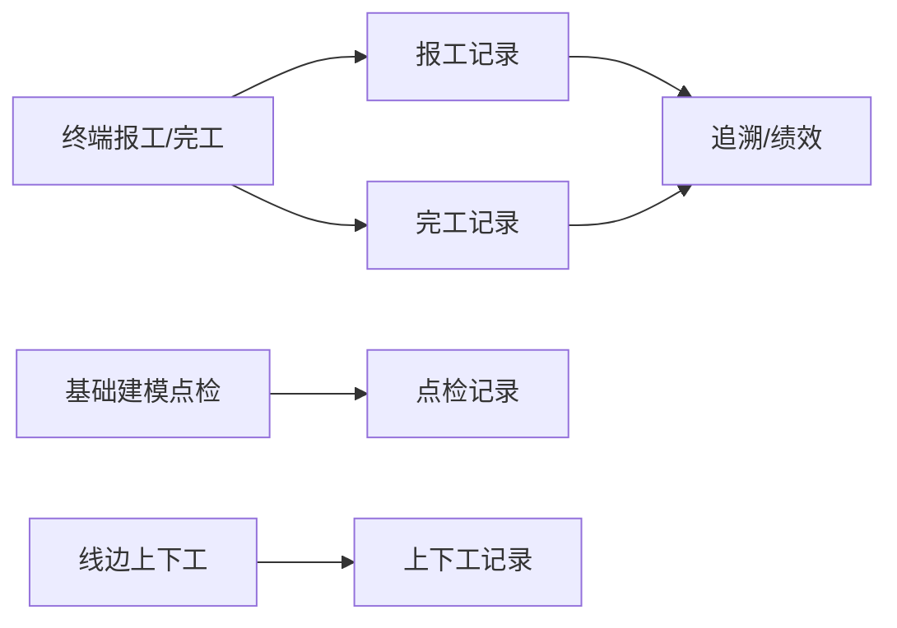

# 报表统计

> 适用基线：测试环境目标 / `dev` 分支 / 2026-07-15。
> 阅读对象：测试、实施、运维（主）；生产统计、质量、班组长等现场角色（顺带）；操作见[报表统计-维护与查询参考](报表统计-维护与查询参考.md)。

## 业务目的与适用范围

报表统计提供 MES 过程与结果类 **记录查询**：报工记录、完工记录、点检记录、上下工记录等，支撑追溯联查、绩效与审计。本页不是积木报表设计器（见基础设施报表说明），也不替代追溯正逆向专题页。

旧稿中“待截图确认”伪字段表废弃。

## 如何使用本组文档

| 你的目的 | 建议阅读 |
| --- | --- |
| 想知道有哪些记录可查 | 本页。 |
| 正在按工单/人员导出核对 | [报表统计-维护与查询参考](报表统计-维护与查询参考.md)。 |
| 想从记录跳到正逆向 | [追溯管理](../04-追溯管理/index.md)。 |

## 记录类型

| 类型 | 业务含义 | 典型用途 |
| --- | --- | --- |
| 报工记录 | 工位/过程报工流水（工单、产品、追溯码、批次、工位、工序、结果、类型、任务模式等）。 | 计件、过程审计、追溯人员页签来源。 |
| 完工记录 | 工单完工事实（数量/包装、完工结果、库位/线边入库状态、追溯码与产品 SN 等）。 | 结案、入库协同、标签联查。 |
| 点检记录 | 点检执行结果查询（开工/相关点检；与 EAM 设备点检记录区分）。 | 开产合规。 |
| 上下工记录 | 线边客户端人员上/下工流水。 | 工时与在岗责任。 |
| 打印相关 | 若环境提供打印历史入口，用于补打与标签审计（以菜单为准）。 | 标签追溯。 |

## 关键判断

| 判断点 | 应先确认什么 | 影响 |
| --- | --- |
| 报工有、追溯无 | 查询条件粒度；是否用了正确码字段。 | 先对齐码再开追溯单。 |
| 完工有、库存无 | 线边入库状态 / WMS 收货。 | 回 WMS 生产管理。 |
| 点检记录找不到 | 是 MES 开工点检还是 EAM 设备点检。 | 选对模块菜单。 |

## 与其他页边界

| 协同方 | 本页负责 | 不在本页展开 |
| --- | --- | --- |
| 终端 | 展示已落库记录 | 现场如何操作 |
| 追溯 | 为追溯提供明细来源 | 正逆向编排 |
| WMS | 完工后入库结果联查 | 库存事务 |
| Infra 报表 | 可嵌入积木报表 | 设计器与数据集 |

## 当前限制与待确认事项

- `MES-RPT`：多套报工/完工菜单并存、打印记录入口、导出字段以页面为准（总账）。

## 待补充的图示与示例
| 类型 | 后续补充 | 目的 |
| --- | --- | --- |
| 报工/完工同工单对照 | 一单全流程。 | 培训。 |
| 导出样例 | 脱敏 Excel。 | 验收。 |
