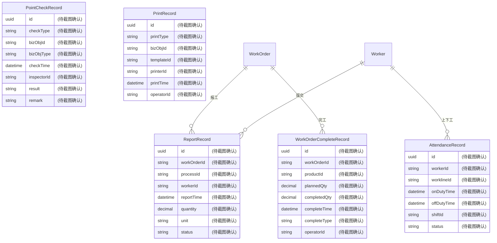
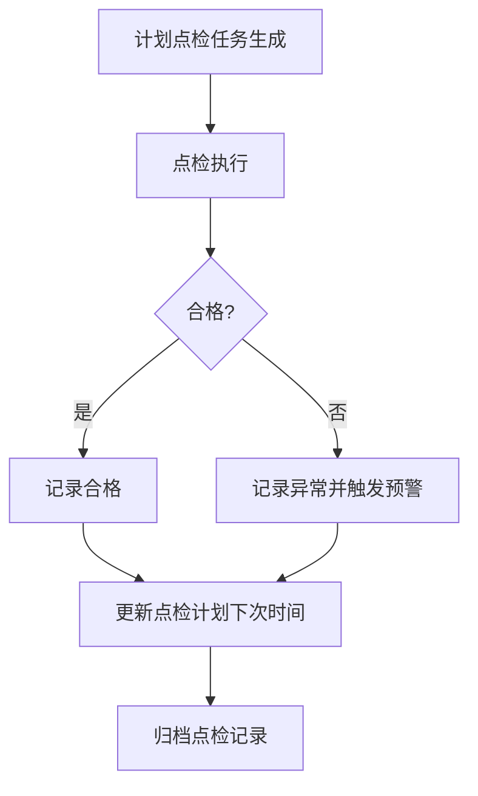
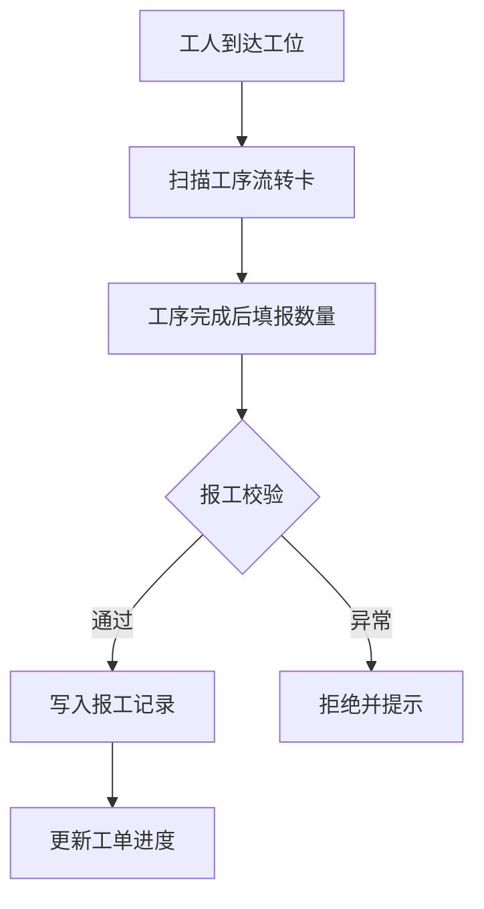
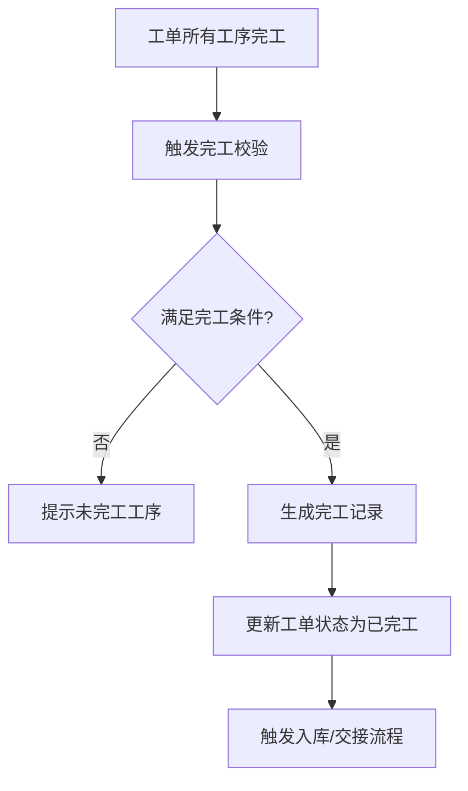
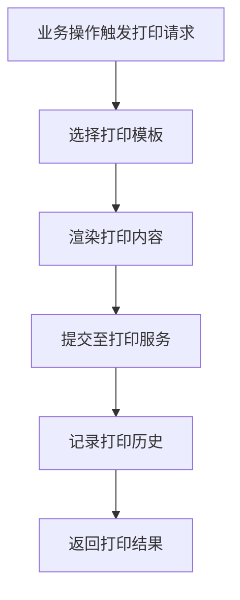
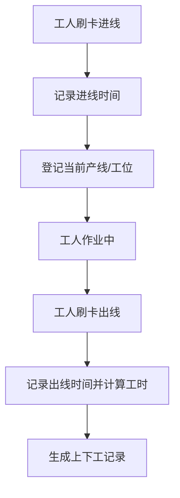

# 报表统计

## 1. 概述

报表统计模块面向离散制造车间，提供五类核心业务记录的查询与统计功能，支撑生产追溯、绩效核算与合规审计。

| 报表类型 | 业务含义 | 典型使用场景 |
|---------|---------|-------------|
| 点检记录 | 设备点检 / 工序点检的执行记录 | 设备保养计划执行追踪 |
| 报工记录 | 工人提交的实际完工数量 | 计件工资核算 |
| 完工记录 | 工单完成的汇总数据 | 工单结案与成本归集 |
| 打印记录 | 工序流转卡 / 条码的打印历史 | 追溯查询、标签补打 |
| 上下工记录 | 工人进出产线的时间 | 考勤关联、班组工时统计 |

---

## 2. 领域模型

### 2.1 ER 实体关系

### 2.2 实体说明

| 实体 | 说明 |
|-----|------|
| PointCheckRecord | 点检记录，关联设备(Equipment)或工序(Process) |
| ReportRecord | 报工记录，关联工单(WorkOrder)和工序(Process) |
| WorkOrderCompleteRecord | 完工记录，关联工单(WorkOrder) |
| PrintRecord | 打印记录，关联流转卡、工单等业务对象 |
| AttendanceRecord | 上下工记录，关联工人(Worker)和产线(Workline) |

---

## 3. 核心流程

### 3.1 点检记录流程

### 3.2 报工记录流程

### 3.3 完工记录流程

### 3.4 打印记录流程

### 3.5 上下工记录流程

---

## 4. 字段说明

### 4.1 点检记录 (PointCheckRecord)

| 字段名 | 中文名 | 数据类型 | 说明 |
|-------|--------|---------|------|
| id | 主键 | UUID | 点检记录唯一标识 |
| checkType | 点检类型 | String | 枚举：EquipmentCheck/ProcessCheck |
| bizObjId | 业务对象ID | String | 设备ID或工序ID |
| bizObjType | 业务对象类型 | String | Equipment/Process |
| checkTime | 点检时间 | DateTime | 执行时间 |
| inspectorId | 点检员ID | String | 执行人 |
| result | 点检结果 | String | OK/NG |
| remark | 备注 | String | 异常描述等 |

### 4.2 报工记录 (ReportRecord)

| 字段名 | 中文名 | 数据类型 | 说明 |
|-------|--------|---------|------|
| id | 主键 | UUID | 报工记录唯一标识 |
| workOrderId | 工单ID | String | 关联工单 |
| processId | 工序ID | String | 关联工序 |
| workerId | 报工员ID | String | 提交人 |
| reportTime | 报工时间 | DateTime | 提交时间 |
| quantity | 报工数量 | Decimal | 实际完工数量 |
| unit | 单位 | String | 件/个/千克等 |
| status | 状态 | String | Submitted/Approved/Rejected |

### 4.3 完工记录 (WorkOrderCompleteRecord)

| 字段名 | 中文名 | 数据类型 | 说明 |
|-------|--------|---------|------|
| id | 主键 | UUID | 完工记录唯一标识 |
| workOrderId | 工单ID | String | 关联工单 |
| productId | 产品ID | String | 产品物料 |
| plannedQty | 计划数量 | Decimal | 工单计划数量 |
| completedQty | 完工数量 | Decimal | 实际完工数量 |
| completeTime | 完工时间 | DateTime | 完工时刻 |
| completeType | 完工类型 | String | Normal/Early/Overdue |
| operatorId | 操作员ID | String | 执行人 |

### 4.4 打印记录 (PrintRecord)

| 字段名 | 中文名 | 数据类型 | 说明 |
|-------|--------|---------|------|
| id | 主键 | UUID | 打印记录唯一标识 |
| printType | 打印类型 | String | RouterCard/Barcode/Label |
| bizObjId | 业务对象ID | String | 流转卡ID/工单ID等 |
| templateId | 模板ID | String | 打印模板 |
| printerId | 打印机ID | String | 目标设备 |
| printTime | 打印时间 | DateTime | 打印时刻 |
| operatorId | 操作员ID | String | 打印人 |

### 4.5 上下工记录 (AttendanceRecord)

| 字段名 | 中文名 | 数据类型 | 说明 |
|-------|--------|---------|------|
| id | 主键 | UUID | 上下工记录唯一标识 |
| workerId | 工人ID | String | 关联工人 |
| worklineId | 产线ID | String | 所属产线 |
| onDutyTime | 进线时间 | DateTime | 刷卡进线时刻 |
| offDutyTime | 出线时间 | DateTime | 刷卡出线时刻 |
| shiftId | 班次ID | String | 所属班次 |
| status | 状态 | String | OnDuty/OffDuty/Abnormal |