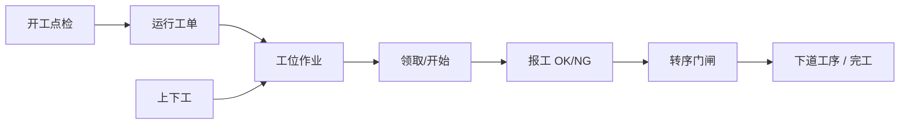

# 终端操作

> 适用基线：测试环境目标 / `dev` 分支 / 2026-07-15。
> 阅读对象：线边班组长、操作工培训讲师、MES 实施；操作步骤见[终端操作-维护与查询参考](终端操作-维护与查询参考.md)。

## 业务目的与适用范围

终端操作说明 **MES 线边客户端** 上如何围绕已下发/已开工的运行工单完成：人员上下工、领取工位作业、开始作业、单件/批量报工、关注转序门闸，以及与开工点检、并行组布局相关的现场差异。

本页不写 WMS PDA 收发货任务（扫描叫料、发料任务、成品收货等属仓储终端）。工单状态机见[计划管理](../03-计划管理/index.md)；抢单/派单与转序策略见[工艺管理](../02-工艺管理/index.md)；客户端与 SOP 配置见[基础建模](../01-基础建模/index.md)。

## 如何使用本组文档

| 你的目的 | 建议阅读 |
| --- | --- |
| 想理解线边一天怎么干活 | 本页。 |
| 正在培训操作工或排查领不到活 | [终端操作-维护与查询参考](终端操作-维护与查询参考.md)。 |
| 想改终端绑定或 SOP | [基础建模](../01-基础建模/index.md)。 |
| 想查报工/上下工历史 | 报工记录、上下工记录等查询菜单。 |

## 使用前准备

| 需要确认什么 | 为什么重要 |
| --- | --- |
| 客户端已配置且可登录 | 无客户端则无法进入线边工作台。 |
| 工单已下发并处于可执行状态 | 待下发工单不能现场开干。 |
| 任务模式（单件/批量/普通批量） | 决定报工入口与校验。 |
| 分派模式（抢单/派单） | 决定作业如何落到工位。 |
| 当前班次、工位、人员技能 | 影响能否领作业、是否被点检/技能拦住。 |

!!! example "📷 截图占位"
    线边工作台工位作业列表与报工确认；脱敏。

## 对象与动作关系

| 对象 | 业务含义 |
| --- | --- |
| 线边客户端会话 | 以配置的客户端+用户进入产线/工位上下文。 |
| 工位作业 | 某工单某工序在工位上的执行单元；状态含待分派、待执行、执行中、暂停、锁定、已完成、异常中止、已装箱等。 |
| 领取/定位 | 按抢单或派单，结合 SN 或顺序，统一领取一条作业。 |
| 报工 | 单件报工、批量报工；设备入口可按工位当前执行中作业报工。 |
| 转序门闸快照 | 查看本工序 OK 累计、门槛、是否已放流。 |
| 并行组执行布局 | 多工单同组时的多 Tab / 全局扫码开关；扫码可路由到组内工单。 |
| 上下工记录 | 工人在客户端上/下工流水，供考勤与责任追溯。 |
| 线边库存（查询） | 线边侧物料可视；库存事务以 WMS 为准。 |

## 现场主路径

## 关键判断

| 判断点 | 应先确认什么 | 影响 |
| --- | --- | --- |
| 领不到作业 | 工单状态、分派模式、工位是否在客户端绑定、是否待分派/待执行。 | 避免误判为“系统坏了”。 |
| 报工失败 | 任务模式是否匹配接口（单件 vs 批量）、作业是否执行中。 | 选错入口必失败。 |
| 无法转序 | 门闸累计与工艺最小合格/策略。 | 继续报工或查工艺配置。 |
| 挂起工单失败 | 是否仍有执行中工位作业。 | 先结束/处理作业再挂起。 |
| 并行组扫错产品 | 扫码路由是否命中组内正确工单。 | 用组视图与追溯码解析核对。 |

### 关键字段业务角色

| 字段/配置点 | 在系统中的作用 | 关键行为要点 | 警惕什么 |
| --- | --- | --- | --- |
| 运行工单状态 | 能否领活/报工 | 须已下发且可执行 | 待下发不能开干 |
| 任务模式 | 报工入口 | 单件/批量/普通批量 | 入口选错必失败 |
| 分派模式 | 领取方式 | 抢单/派单（来自工艺节点） | 领不到活 |
| 报工 OK/NG | 合格与不良结果 | NG→QMS 自动建单 **未证实**（`GAP-071`） | 写成固定建单 |
| 转序门闸 | 能否转下序 | 依赖工艺最小合格/策略 | 堵线 |
| 客户端绑定工位 | 可见作业范围 | 与基础建模一致 | 绑错无作业 |

## 与计划、工艺、仓储、质量的边界

| 协同方 | 本页负责 | 不在本页展开 |
| --- | --- | --- |
| 计划管理 | 消费已下发/生产中工单；现场触发的挂起等仍回计划动作 | 建单、拆分、下发策略 |
| 工艺管理 | 执行分派模式与转序策略 | 改路线主数据 |
| WMS | 线边缺料联查发料；完工后查库存结果入口 | PDA 收发货任务页、库存事务细则 |
| QMS | 报工结果含 OK/NG；不良为质量协同**线索** | 检验方案、申请—任务—记录、评审 |
| 基础建模 | 依赖客户端/SOP/技能/点检就绪 | 配置维护本身 |

**已证实（跨模块，写边界不写细则）：**

- 完工/产出入账查 [WMS 生产收料](../../05-WMS-库房管理/07-生产收料/index.md) / [生产管理](../../05-WMS-库房管理/08-生产管理/index.md)；WMS 发料与生产收料任务对 MES 的消息协同见 `GAP-067`、`WMS-PROD`。
- 库存余额与出入库事务一律以 WMS 为准；本页只提示联查入口。

**未证实（仅登记）：** 报工 NG → QMS 检验申请/任务的精确单据映射见 `GAP-071` / `MES-TERM`，正式培训不写成固定自动建单规则。

## 查询与联查

| 场景 | 建议看什么 | 联查 |
| --- | --- | --- |
| 报工有无落账 | 报工记录、工位作业状态。 | 工单状态流转日志。 |
| 谁在何时操作 | 上下工记录、客户端工人日志。 | 系统用户。 |
| 装箱/尾箱 | BULK 待装箱与人工尾箱能力（执行侧）。 | 计划页任务模式说明。 |
| 线边无料 | 线边库存页 + WMS 发料。 | 基础建模线边库映射。 |

## 常见问题与处理

| 情况 | 建议处理 |
| --- | --- |
| 把 WMS `pages/issue/...` 等 PDA 写成 MES 终端 | 那些是仓储终端，见 WMS 终端操作。 |
| 在终端页重写整套工单状态机 | 回计划管理；本页只写现场差异。 |
| 认为所有报工都走同一按钮 | 单件/批量/设备入口不同，按任务模式选。 |
| 离线细则未证实却写成已支持 | 本刀不宣称通用离线能力；待前端取证。 |

## 当前限制与待确认事项

- `MES-TERM`：线边子页/按钮截图、离线能力、Web 报工 vs 工位作业 API（总账）。
- `GAP-071`：报工 NG → QMS 精确单据映射未证实。

## 待补充的图示与示例
| 类型 | 后续补充 | 目的 |
| --- | --- | --- |
| 抢单 vs 派单操作对比 | 同一产线两种模式。 | 培训。 |
| 单件/批量报工对比 | 两种任务模式。 | 验收。 |
| 并行组多 Tab | 扫码路由命中。 | 验收。 |
