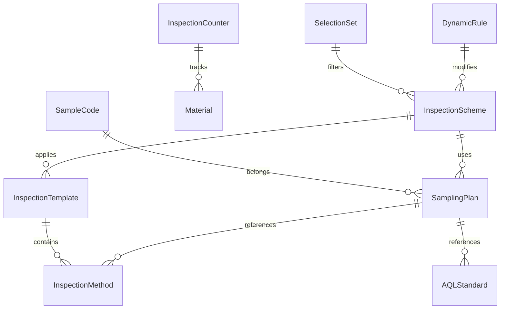
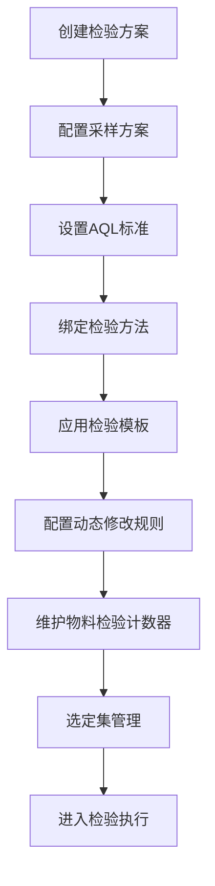

# 物料检验配置

## 模块概述

物料检验配置模块负责定义质检业务的核心规则集，涵盖采样方案、AQL标准、检验方法、模板管理等，支撑来料、过程、成品全链路质量检验活动。

## 领域模型

## 核心流程

## 字段说明

### 采样方案

| 字段名 | 中文名 | 类型 | 约束 | 影响业务 | 备注 |
|--------|--------|------|------|----------|------|
| samplingPlanCode | 采样方案编码 | String | 非空/唯一 | 方案引用 | (待截图确认) |
| samplingPlanName | 采样方案名称 | String | 非空 | 方案展示 | (待截图确认) |
| samplingType | 采样类型 | Enum | 标准/计量/调整型 | 采样算法 | (待截图确认) |
| sampleSize | 样本量 | Integer | >0 | 采样数量 | (待截图确认) |
| samplingLevel | 采样水平 | Enum | S-1/S-2/S-3/I/II/III | 抽样严格度 | (待截图确认) |
| inspectionType | 检验类型 | Enum | 正常/加严/减量 | 检验强度 | (待截图确认) |
| activeFlag | 启用状态 | Boolean | 默认启用 | 是否生效 | (待截图确认) |
| effectiveDate | 生效日期 | Date | - | 方案启用时间 | (待截图确认) |
| expirationDate | 失效日期 | Date | >生效日期 | 方案过期时间 | (待截图确认) |
| description | 方案描述 | String | - | 说明备注 | (待截图确认) |

### 质检

| 字段名 | 中文名 | 类型 | 约束 | 影响业务 | 备注 |
|--------|--------|------|------|----------|------|
| inspectionCode | 质检编码 | String | 非空/唯一 | 记录关联 | (待截图确认) |
| inspectionName | 质检名称 | String | 非空 | 记录展示 | (待截图确认) |
| inspectionCategory | 质检类别 | Enum | 来料/过程/成品/出货 | 质量管控节点 | (待截图确认) |
| inspectionObject | 检验对象 | Enum | 物料/半成品/成品 | 检验范围 | (待截图确认) |
| inspectionMethod | 检验方法 | FK | 引用检验方法 | 检测手段 | (待截图确认) |
| samplingPlan | 采样方案 | FK | 引用采样方案 | 采样规则 | (待截图确认) |
| aqlStandard | AQL标准 | FK | 引用AQL | 合格判定 | (待截图确认) |
| acceptanceRule | 接收规则 | String | - | 合格判定逻辑 | (待截图确认) |
| rejectionRule | 拒收规则 | String | - | 不合格处理 | (待截图确认) |
| reInspectionFlag | 允许复检 | Boolean | 默认否 | 重新检验 | (待截图确认) |

### 样本字码

| 字段名 | 中文名 | 类型 | 约束 | 影响业务 | 备注 |
|--------|--------|------|------|----------|------|
| sampleCode | 样本字码 | String | 非空/唯一 | 样本标识 | (待截图确认) |
| sampleCodeName | 样本字码名称 | String | 非空 | 字码含义 | (待截图确认) |
| samplingPlanCode | 所属采样方案 | FK | 引用采样方案 | 方案归属 | (待截图确认) |
| codeType | 字码类型 | Enum | 字母/数字/混码 | 字码格式 | (待截图确认) |
| codeLength | 字码长度 | Integer | >0 | 字码位数 | (待截图确认) |
| codeSequence | 字码序列 | String | - | 序列定义 | (待截图确认) |
| useCount | 已使用次数 | Integer | >=0 | 使用统计 | (待截图确认) |
| activeFlag | 启用状态 | Boolean | 默认启用 | 是否可用 | (待截图确认) |

### AQL

| 字段名 | 中文名 | 类型 | 约束 | 影响业务 | 备注 |
|--------|--------|------|------|----------|------|
| aqlCode | AQL编码 | String | 非空/唯一 | 标准引用 | (待截图确认) |
| aqlName | AQL名称 | String | 非空 | 标准展示 | (待截图确认) |
| aqlLevel | AQL水平 | Enum | I/II/III/S-1/S-2/S-3 | 检验严格度 | (待截图确认) |
| criticalAQL | 严重AQL值 | Decimal | 0~0.1 | 致命缺陷判定 | (待截图确认) |
| majorAQL | 主要AQL值 | Decimal | 0~0.65 | 严重缺陷判定 | (待截图确认) |
| minorAQL | 次要AQL值 | Decimal | 0~1.5 | 轻微缺陷判定 | (待截图确认) |
| sampleSizeN | 样本量字码N | Integer | - | 对应样本量 | (待截图确认) |
| sampleSizeR | 样本量字码R | Integer | - | 对应样本量 | (待截图确认) |
| acceptanceNumber | 接收数 | Integer | >=0 | 合格判定上限 | (待截图确认) |
| rejectionNumber | 拒收数 | Integer | >接收数 | 不合格判定 | (待截图确认) |
| activeFlag | 启用状态 | Boolean | 默认启用 | 是否生效 | (待截图确认) |

### 采样过程

| 字段名 | 中文名 | 类型 | 约束 | 影响业务 | 备注 |
|--------|--------|------|------|----------|------|
| samplingProcessCode | 采样过程编码 | String | 非空/唯一 | 过程标识 | (待截图确认) |
| samplingProcessName | 采样过程名称 | String | 非空 | 过程展示 | (待截图确认) |
| samplingPlanCode | 所属采样方案 | FK | 引用采样方案 | 方案关联 | (待截图确认) |
| processSequence | 过程顺序 | Integer | >0 | 执行次序 | (待截图确认) |
| samplingStage | 采样阶段 | Enum | 开始/中间/结束 | 采样时机 | (待截图确认) |
| samplingQuantity | 采样数量 | Integer | >0 | 本步采样量 | (待截图确认) |
| samplingPosition | 采样位置 | String | - | 取样位置描述 | (待截图确认) |
| samplingTool | 采样工具 | String | - | 使用器具 | (待截图确认) |
| samplingCondition | 采样条件 | String | - | 环境要求 | (待截图确认) |
| processDescription | 过程描述 | String | - | 操作说明 | (待截图确认) |

### 动态修改规则管理

| 字段名 | 中文名 | 类型 | 约束 | 影响业务 | 备注 |
|--------|--------|------|------|----------|------|
| ruleCode | 规则编码 | String | 非空/唯一 | 规则标识 | (待截图确认) |
| ruleName | 规则名称 | String | 非空 | 规则展示 | (待截图确认) |
| ruleType | 规则类型 | Enum | 数量调整/跳检/加严/放宽 | 规则作用 | (待截图确认) |
| triggerCondition | 触发条件 | String | JSON格式 | 激活条件 | (待截图确认) |
| actionContent | 动作内容 | String | JSON格式 | 规则执行内容 | (待截图确认) |
| inspectionScheme | 适用检验方案 | FK | 引用检验方案 | 方案范围 | (待截图确认) |
| priority | 优先级 | Integer | 1~999 | 执行顺序 | (待截图确认) |
| effectiveStartDate | 生效开始日期 | Date | - | 规则启用时间 | (待截图确认) |
| effectiveEndDate | 生效结束日期 | Date | >开始日期 | 规则失效时间 | (待截图确认) |
| activeFlag | 启用状态 | Boolean | 默认禁用 | 是否生效 | (待截图确认) |

### 物料检验计数器管理

| 字段名 | 中文名 | 类型 | 约束 | 影响业务 | 备注 |
|--------|--------|------|------|----------|------|
| counterCode | 计数器编码 | String | 非空/唯一 | 计数标识 | (待截图确认) |
| materialCode | 物料编码 | String | 非空 | 物料关联 | (待截图确认) |
| supplierCode | 供应商编码 | String | - | 供应商关联 | (待截图确认) |
| inspectionScheme | 检验方案 | FK | 引用检验方案 | 方案绑定 | (待截图确认) |
| totalCount | 累计检验次数 | Integer | >=0 | 统计计数 | (待截图确认) |
| passCount | 累计合格次数 | Integer | >=0 | 合格计数 | (待截图确认) |
| rejectCount | 累计不合格次数 | Integer | >=0 | 不合格计数 | (待截图确认) |
| consecutivePassCount | 连续合格次数 | Integer | >=0 | 连续合格判定 | (待截图确认) |
| consecutiveRejectCount | 连续不合格次数 | Integer | >=0 | 连续不合格判定 | (待截图确认) |
| lastInspectionDate | 最近检验日期 | DateTime | - | 最近检验时间 | (待截图确认) |
| resetFlag | 需重置标志 | Boolean | 默认否 | 计数器重置 | (待截图确认) |

### 选定集管理

| 字段名 | 中文名 | 类型 | 约束 | 影响业务 | 备注 |
|--------|--------|------|------|----------|------|
| selectionSetCode | 选定集编码 | String | 非空/唯一 | 集合标识 | (待截图确认) |
| selectionSetName | 选定集名称 | String | 非空 | 集合展示 | (待截图确认) |
| selectionSetType | 选定集类型 | Enum | 物料/供应商/批次/混合 | 筛选维度 | (待截图确认) |
| selectionCriteria | 筛选条件 | String | JSON格式 | 过滤条件 | (待截图确认) |
| materialList | 物料列表 | String[] | - | 物料选择 | (待截图确认) |
| supplierList | 供应商列表 | String[] | - | 供应商选择 | (待截图确认) |
| effectiveDate | 生效日期 | Date | - | 启用时间 | (待截图确认) |
| expirationDate | 失效日期 | Date | >生效日期 | 过期时间 | (待截图确认) |
| activeFlag | 启用状态 | Boolean | 默认启用 | 是否生效 | (待截图确认) |
| description | 说明 | String | - | 备注 | (待截图确认) |

### 检验方法

| 字段名 | 中文名 | 类型 | 约束 | 影响业务 | 备注 |
|--------|--------|------|------|----------|------|
| inspectionMethodCode | 检验方法编码 | String | 非空/唯一 | 方法标识 | (待截图确认) |
| inspectionMethodName | 检验方法名称 | String | 非空 | 方法展示 | (待截图确认) |
| methodType | 方法类型 | Enum | 目视/量具/仪器/理化/破坏性 | 检测手段分类 | (待截图确认) |
| methodStandard | 执行标准 | String | - | 依据标准 | (待截图确认) |
| measurementRange | 测量范围 | String | - | 适用范围 | (待截图确认) |
| precision | 精度等级 | String | - | 精度要求 | (待截图确认) |
| operationProcedure | 操作步骤 | String | - | 检验流程 | (待截图确认) |
| requiredEquipment | 所需设备 | String[] | - | 配套设备 | (待截图确认) |
| requiredTool | 所需工装 | String[] | - | 配套工装 | (待截图确认) |
| duration | 检验耗时 | Integer | >0 | 预计时长分钟 | (待截图确认) |
| activeFlag | 启用状态 | Boolean | 默认启用 | 是否可用 | (待截图确认) |

### 检验模板

| 字段名 | 中文名 | 类型 | 约束 | 影响业务 | 备注 |
|--------|--------|------|------|----------|------|
| templateCode | 检验模板编码 | String | 非空/唯一 | 模板标识 | (待截图确认) |
| templateName | 检验模板名称 | String | 非空 | 模板展示 | (待截图确认) |
| templateCategory | 模板类别 | Enum | 来料/过程/成品/出货 | 模板用途 | (待截图确认) |
| version | 版本号 | String | 非空 | 版本管理 | (待截图确认) |
| inspectionItems | 检验项目列表 | String[] | - | 项目明细 | (待截图确认) |
| inspectionPoints | 检验点列表 | String[] | - | 检验点配置 | (待截图确认) |
| defaultAQL | 默认AQL | FK | 引用AQL标准 | 缺省标准 | (待截图确认) |
| defaultSamplingPlan | 默认采样方案 | FK | 引用采样方案 | 缺省采样 | (待截图确认) |
| templateStatus | 模板状态 | Enum | 草稿/已审核/已发布/已归档 | 生命周期 | (待截图确认) |
| effectiveDate | 生效日期 | Date | - | 启用时间 | (待截图确认) |
| expirationDate | 失效日期 | Date | >生效日期 | 过期时间 | (待截图确认) |
| createdBy | 创建人 | String | - | 创建记录 | (待截图确认) |
| createdTime | 创建时间 | DateTime | - | 创建时间 | (待截图确认) |
| updatedBy | 更新人 | String | - | 更新记录 | (待截图确认) |
| updatedTime | 更新时间 | DateTime | - | 更新时间 | (待截图确认) |

### 检验方案

| 字段名 | 中文名 | 类型 | 约束 | 影响业务 | 备注 |
|--------|--------|------|------|----------|------|
| inspectionSchemeCode | 检验方案编码 | String | 非空/唯一 | 方案标识 | (待截图确认) |
| inspectionSchemeName | 检验方案名称 | String | 非空 | 方案展示 | (待截图确认) |
| schemeCategory | 方案类别 | Enum | 来料/过程/成品/出货 | 业务场景 | (待截图确认) |
| inspectionTemplate | 检验模板 | FK | 引用检验模板 | 模板应用 | (待截图确认) |
| samplingPlan | 采样方案 | FK | 引用采样方案 | 采样绑定 | (待截图确认) |
| aqlStandard | AQL标准 | FK | 引用AQL标准 | 判定绑定 | (待截图确认) |
| applicableMaterials | 适用物料列表 | String[] | - | 物料范围 | (待截图确认) |
| applicableSuppliers | 适用供应商列表 | String[] | - | 供应商范围 | (待截图确认) |
| selectionSet | 选定集 | FK | 引用选定集 | 筛选条件 | (待截图确认) |
| dynamicRules | 动态规则列表 | FK[] | - | 动态调整规则 | (待截图确认) |
| schemeStatus | 方案状态 | Enum | 草稿/已审核/已发布/已归档 | 生命周期 | (待截图确认) |
| priority | 优先级 | Integer | 1~999 | 执行优先级 | (待截图确认) |
| effectiveDate | 生效日期 | Date | - | 启用时间 | (待截图确认) |
| expirationDate | 失效日期 | Date | >生效日期 | 过期时间 | (待截图确认) |
| createdBy | 创建人 | String | - | 创建记录 | (待截图确认) |
| createdTime | 创建时间 | DateTime | - | 创建时间 | (待截图确认) |
| updatedBy | 更新人 | String | - | 更新记录 | (待截图确认) |
| updatedTime | 更新时间 | DateTime | - | 更新时间 | (待截图确认) |
| description | 方案描述 | String | - | 说明备注 | (待截图确认) |

## 业务规则

1. **AQL等级与采样水平联动规则**：当检验方案切换AQL水平时（如从I级调整为II级），系统自动重算对应样本量字码及接收数/拒收数，并提示操作员确认采样量调整。

2. **连续不合格跳检规则**：当物料检验计数器连续不合格次数达到阈值（默认3次），系统自动触发加严检验规则，提升采样水平和AQL要求至下一等级。

## 关联关系

| 源模块 | 目标模块 | 关联方式 | 说明 |
|--------|----------|----------|------|
| WMS-库房管理 | QMS-物料检验配置 | 检验触发 | WMS入库检验调用QMS检验方案，传递物料批次信息 |
| MES-生产管理 | QMS-物料检验配置 | 过程检验 | MES报工时触发过程检验，获取采样方案和检验模板 |
| QMS-物料检验配置 | WMS-库房管理 | 检验结果回写 | 检验完成后将合格/不合格结果回写WMS，影响库存状态 |
| QMS-物料检验配置 | EAM-设备管理 | 设备信息 | 检验过程中调用EAM设备信息，确认量具校准状态 |
| QMS-物料检验配置 | SCP-供应链平台 | 供应商绩效 | 检验结果作为供应商评分依据，反馈至SCP供应商管理 |

## 相关模块接口

### 依赖模块

| 模块 | 接口方向 | 说明 |
|------|----------|------|
| DBC_MATERIAL | [物料主数据](../../04-DBC-主数据管理/01-物料管理/01-物料基本信息.md) | 获取物料检验属性和分类 |
| EAM_ASSET | [设备台账](../../08-EAM-设备管理/02-设备管理/index.md) | 获取量具/检测设备校准信息 |

### 被依赖模块

| 模块 | 接口方向 | 说明 |
|------|----------|------|
| QMS_IQC | [来料检验](../02-来料检验/index.md) | 提供采样方案和检验模板 |
| QMS_IPQC | [生产检验](../03-生产检验/index.md) | 提供过程检验方案 |
| QMS_OQC | [客户检验](../04-客户检验/index.md) | 提供出货检验方案 |