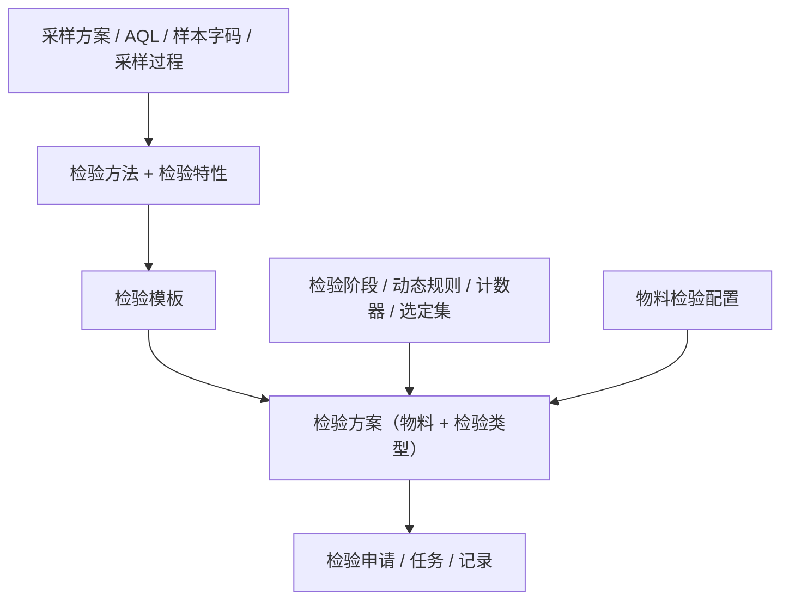

# 检验配置

> 适用基线：测试环境目标 / `dev` 分支 / 2026-07-15。
> 阅读对象：质量工程师、体系工程师、实施顾问；操作步骤见[检验配置-维护与查询参考](检验配置-维护与查询参考.md)。

## 业务目的与适用范围

检验配置把“应如何检验”沉淀为可被执行链引用的规则：抽样与 AQL、检验方法与特性、模板与方案、物料级开关、动态加严/放宽与计数器。来料、生产、客户退回等执行页只消费本配置的结果，不在本页展开申请—任务—记录细节。

通用的申请、任务与记录概念见[申请、任务与记录模型](../../02-业务模型/01-申请任务记录模型.md)。共享执行事实见内部证据「检验执行事实层总览」。

## 如何使用本组文档

| 你的目的 | 建议阅读 |
| --- | --- |
| 想理解配置对象如何拼成可执行方案 | 本页。 |
| 正在维护抽样、方法、模板、方案或物料配置 | [检验配置-维护与查询参考](检验配置-维护与查询参考.md)。 |
| 正在做来料/生产/客户检验执行 | 对应执行分组页。 |

## 使用前准备

| 需要确认什么 | 为什么重要 |
| --- | --- |
| 物料主数据已可用 | 方案与物料检验配置按物料绑定。 |
| 检验类型口径 | 方案按检验类型区分来料、过程、首件、末件、客户退回等。 |
| 抽样标准是否采用 AQL | 决定是否维护 AQL、样本字码与采样过程。 |
| 岗位与操作指导 | 方法/过程可挂岗位与指导，影响任务执行界面。 |
| 是否免检、是否自动建申请 | 方案上的免检与自动创建开关直接影响上游触发。 |

!!! example "📷 截图占位"
    检验方案详情（物料、类型、模板、免检、AQL）。脱敏。

## 配置对象关系

| 对象 | 业务含义 |
| --- | --- |
| 采样方案 / AQL / 样本字码 / 采样过程 | 定义抽多少、按什么水平与接收数判定。 |
| 检验方法 | 可版本化的操作方法与指导（可含视频地址）。 |
| 检验特性 | 定量上下限/目标或定性字典项。 |
| 检验过程（模板内步骤） | 把特性、方法、采样、岗位排成可执行步骤。 |
| 检验模板 | 可复用的过程集合，供方案引用。 |
| 检验方案 | 物料在某检验类型下的生效规则：模板、AQL、水平、拆批、免检、是否改库存状态、是否自动建申请、可选 MES 工序码等。 |
| 检验阶段 | 正常/加严等阶段及跳检、连续合格/不合格切换条件。 |
| 动态修改规则 / 计数器 | 按类型/批次/特征层级调整严格度；按物料+类型+供应商累计合格/不合格次数。 |
| 选定集 / 选定项目 | 定性判定可选值与缺陷等级集合。 |
| 物料检验配置 | 物料是否要求检验等简要开关。 |

## 建议维护顺序

1. 选定集与检验特性（定性/定量基础）。
2. 检验方法、采样方案、AQL、样本字码、采样过程。
3. 检验模板（挂过程步骤）。
4. 检验阶段与动态规则、计数器。
5. 检验方案（绑定物料与类型，设免检/自动建单等）。
6. 物料检验配置复核。

## 关键判断

| 判断点 | 应先确认什么 | 影响 |
| --- | --- | --- |
| 某物料来料是否免检 | 方案免检标识；上游到货确认也会查询免检 | 免检则可能不建检验申请 |
| 严格度如何变化 | 动态规则层级与计数器累计 | 决定后续批次正常/加严/放宽 |
| 过程检验挂哪道工序 | 方案上的 MES 工序码（若使用） | 与工艺节点对齐；映射未证实项见总账 |
| 是否自动建申请 | 方案自动创建开关 + 上游规则开关 | 手工申请与自动申请并存 |

## 与执行、仓储、生产的边界

| 协同方 | 本页负责 | 不在本页展开 |
| --- | --- | --- |
| 来料/生产/客户检验 | 提供方案与抽样判定依据 | ATR 状态与现场录入 |
| WMS | 免检查询、待检触发消费方案 | 库存事务与隔离/放行 |
| MES | 可选工序码配置线索 | 报工 NG 自动建单（`GAP-071`） |
| 质量评审 / 通知单 | 配置不直接定义处置 | 评审与索赔单据 |

## 查询与联查

| 场景 | 建议查什么 |
| --- | --- |
| 执行时找不到方案 | 物料 + 检验类型 + 生效期 + 可用 |
| 抽样数不对 | AQL 行、样本字码、采样过程、方案水平 |
| 到货未建检验 | 是否免检、库存是否待检、到货确认是否成功 |
| 加严未切换 | 计数器累计与动态规则、阶段定义 |

## 限制与待确认

- 菜单「质检」存在空分组节点，以实际挂载子页为准。
- 方案「改库存状态」开关存在；**真正改库存仍以 WMS 为准**。
- 导入导出能力以维护参考与环境按钮为准，不臆造模板列。

!!! example "📷 截图占位"
    采样方案与 AQL 对照；物料检验计数器。

