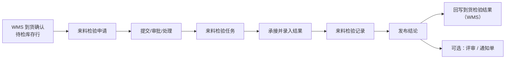

# 来料检验

> 适用基线：测试环境目标 / `dev` 分支 / 2026-07-15。
> 阅读对象：测试、实施、运维（主）；IQC、仓库协同、质量主管等现场角色（顺带）；操作细节见[来料检验-维护与查询参考](来料检验-维护与查询参考.md)。

## 业务目的与适用范围

供应商物料到厂后，哪些要检、谁来检、结论怎样回到货侧——由来料检验完成。读完本页，应能立刻判断三件事：

1. **建单从哪触发**：当前主触发在 WMS「到货确认」的待检库存行；采购收货记录上「创建检验申请」入口已停用（兼容历史消息，实际跳过），不要在收货完成侧空等建单。
2. **为何没有申请**：是否免检、是否待检、到货确认是否成功。
3. **发布后发生什么**：有 ASN 且类型匹配时，合格/不合格等数量与使用决策回写到货侧；库存放行、隔离、退货等**事务以 WMS 为准**，本页不把使用决策当成已改库存。

通用 ATR 见[申请、任务与记录模型](../../02-业务模型/01-申请任务记录模型.md)。收货主链见 WMS [采购收货](../../05-WMS-库房管理/03-采购收货/index.md)。

## 如何使用本组文档

| 你的目的 | 建议阅读 |
| --- | --- |
| 理解到货如何进入 IQC、建单/免检/回写主线 | 本页：准备 → 一笔检验 → 关键判断 → 建议验证点 |
| 处理申请/任务/记录，或查字段与门禁 | [来料检验-维护与查询参考](来料检验-维护与查询参考.md) |
| 维护抽样与方案 | [检验配置](../01-检验配置/index.md) |
| 不合格要评审或索赔 | [质量评审](../05-质量评审/index.md) |

## 使用前准备

| 需要确认什么 | 为什么重要 |
| --- | --- |
| 物料来料检验方案（非免检） | 决定是否建单及抽什么。 |
| 到货确认与库存待检状态 | **当前主触发点**；数量>0 且待检才可能建申请。 |
| 供应商、批次、包装、ASN/采购订单行 | 追溯与回写键。 |
| 自动提交/同意/执行策略 | 申请字段支持自动策略，以环境配置为准。 |

!!! example "📷 截图占位"
    来料检验申请列表（供应商、物料、状态）。

## 一笔来料检验如何完成

链路要点：到货确认对待检明细建申请（建单前可按物料查方案免检）；申请推进为任务，任务形成记录；记录发布后，在条件满足时回写到货侧。库存怎么动，仍看 WMS。

!!! example "写实示例：给定 → 期望"

    **路径 A · 待检建单**

    - **给定：** 到货确认成功；明细数量 100、库存状态待检；物料来料方案非免检。
    - **期望：** 生成来料检验申请（带供应商、物料、ASN/订单行等）；可按策略自动提交/同意/处理进入任务；不要在采购收货记录上等待「创建检验申请」。

    **路径 B · 免检不建**

    - **给定：** 同上到货确认成功且待检，但物料来料方案为免检。
    - **期望：** 不建或跳过申请；在收货侧点已停用的创建入口也不会新建（最多兼容历史日志）。

    **路径 C · 发布回写**

    - **给定：** 记录已录入；评估码接收；使用决策全部合格；包装拆分 90 合格 / 10 不合格；存在 ASN 且类型为采购收货检验。
    - **期望：** 发布后到货侧收到合格/不合格/破坏/冻结等数量与使用决策；是否隔离或放行到 **WMS** 核对——使用决策 ≠ 库存已变。

### 收货建检验为何点了没单

采购收货记录侧「创建检验申请」入口**已停用**：界面或消息可能仍可见，但执行会跳过。检验前置到到货确认。验收与排障时，以「到货确认 → 待检行 → 申请」为准，不要把「收货完成却无申请」当成故障。

## 三类业务对象

| 对象 | 业务含义 | 使用者关心 |
| --- | --- | --- |
| 申请 | 对一批到货提出检验需求：供应商、物料、数量、方案、类型、参考订单/ASN 等。 | 来源是否正确、能否进入任务。 |
| 任务 | 可执行的检验工作：承接人、方案、严格度、明细步骤与包装。 | 抽多少、测什么、谁做。 |
| 记录 | 实际结果与评估码、使用决策；可发布并回写上游。 | 结论、数量拆分、是否已回写。 |

## 状态与关键动作

申请状态：新增、审批中、审批通过、审批驳回、关闭、处理中、部分完成、已完成、中止。
任务状态：待处理、进行中、完成、关闭。
判定：评估码为接收/拒绝；使用决策含全部合格、全部不合格、报废、隔离。

| 所属 | 常见动作 | 业务结果 |
| --- | --- | --- |
| 申请 | 新增、修改、提交、同意、驳回、处理、关闭 | 推进为任务或结束 |
| 任务 | 承接、执行、完成 | 形成记录草稿/结果 |
| 记录 | 录入定量/定性、发布 | 固化结论并触发上游回写 |

!!! example "📐 图示占位"
    申请—任务—记录状态允许动作；以测试环境为准。

## 与 WMS / 配置 / 评审的边界

| 协同方 | 本页负责 | 不在本页展开 |
| --- | --- | --- |
| WMS 到货/收货 | 消费待检触发；发布回写结论与数量 | 收货库存事务、上架、采购退货规则 |
| 检验配置 | 按方案抽样与判定 | 方案主数据维护细节 |
| 质量评审 | 不合格出口线索 | 让步/报废/返修审批链 |
| 库存隔离/放行 | 给出使用决策意图 | WMS 不合格转隔离等事务 |

## 关键判断

| 判断点 | 应先确认什么 | 影响 |
| --- | --- | --- |
| 为何没有申请 | 是否免检、是否待检、到货确认是否成功 | 避免在收货记录上反复点「建检验」 |
| 部分不合格 | 包装合格/不合格/破坏/冻结数量 | 回写数量与后续处置 |
| 是否进评审 | 组织流程与不合格严重度 | 转质量评审或通知单 |
| 结论是否生效 | 记录是否已发布 | 未发布不应假定库存已变 |

### 关键字段业务角色

完整语义与状态门禁见[维护与查询参考](来料检验-维护与查询参考.md)。本表只列主线关键项。

| 字段/配置点 | 在系统中的作用 | 关键行为要点（取值/范围/联动/门禁） | 维护或操作时要警惕什么 |
| --- | --- | --- | --- |
| 触发来源（到货确认待检行） | 决定是否建申请 | 数量>0 且库存状态待检；免检则可能跳过 | 勿在已停用的收货「建检验」入口空等 |
| 供应商 / 物料 / ASN·订单行 | 追溯与回写键 | 多由上游带入 | 键错导致回写失败 |
| 检验方案 / 严格度 | 抽什么、多严 | 按物料+来料类型选方案 | 无方案无法执行 |
| 评估码（接收/拒绝） | 判定结论 | 与使用决策配合 | 拒收未走评审出口 |
| 使用决策 | 合格/不合格/报废/隔离意图 | **库存事务以 WMS 为准** | 决策≠已改库存 |
| 合格/不合格等数量拆分 | 回写到货侧数量 | 有 ASN 且类型匹配时回写 | 数量对不齐对账失败 |
| 申请/任务/记录状态 | ATR 门禁 | 见上文状态名 | 非预期状态强发 |

### 选择器范围（骨架）

通例见[通用选择器过滤惯例](../../02-业务模型/12-通用选择器过滤惯例.md)。下表只写本页差异；精确状态集与权限投影见 `FSEM-006` / `GAP-014`。

| 选择字段 | 选择对象 | 可选范围（当前可写） | 范围依赖 | 选不到时通常原因 |
| --- | --- | --- | --- | --- |
| 供应商 / 物料 | 主数据或上游带入 | 多由到货确认/ASN 带入；手工选时须可用 | 到货行、免检方案 | 非待检、免检、停用、权限外 |
| 检验方案 | 检验配置·方案 | 物料 + 来料类检验类型 + 有效期内；免检则可能不建单 | 物料、检验类型、生效期 | 无方案、类型不符、已过期 |
| 严格度 / 抽样 | 方案与动态规则 | 随方案与计数器阶段 | 方案、供应商累计 | 方案未配 AQL/阶段 |
| 承接人 | 用户/岗位 | ❓ 组织与数据权限投影未逐页实测 | 角色、岗位 | 无权限、未分配岗位 |

### 建议验证点

- 待检到货确认后，非免检物料出现来料检验申请。
- 免检物料不建或跳过申请（与方案一致）。
- 采购收货完成侧「创建检验申请」不再新增申请（兼容入口仅日志/跳过）。
- 申请处理生成任务；承接后可录入定量/定性；发布后有 ASN 时到货侧收到数量拆分与使用决策。
- 未发布时，不以「已选使用决策」假定库存已变；库存后续动作在 WMS 核对。
- 不合格样例按组织流程联查是否进入质量评审或通知单。

## 查询、详情与联查

| 想解决的问题 | 推荐定位方式 | 建议联查 |
| --- | --- | --- |
| 某批到货为何进 IQC | 申请号、供应商、ASN/订单行、物料。 | 到货确认、采购收货线索。 |
| 谁在检、检到哪一步 | 任务号、状态、承接人。 | 方案、严格度、明细步骤。 |
| 结论是否已回写 | 记录号、是否发布、数量拆分。 | 到货回写结果、质量评审。 |

### 详情分组与快速跳转

| 分组 | 应展示什么 | 可联查什么 |
| --- | --- | --- |
| 来源与对象 | 供应商、物料、ASN/订单行、触发来源。 | 到货确认、采购收货。 |
| 方案与严格度 | 检验方案、抽样与严格度。 | 检验配置。 |
| 执行与结果 | 明细步骤、评估码、使用决策、数量拆分。 | — |
| 回写与后续 | 是否已发布、到货回写、评审/通知。 | WMS 到货、质量评审。 |
| 系统信息 | 创建、更新与审计。 | — |

!!! example "📷 截图占位"
    来料检验申请/任务/记录详情分组与到货/评审联查；状态：待截图。

## 限制与待确认

- `FSEM-006`：方案/任务选择器精确状态过滤与权限投影矩阵待测。
- 发货检验等类型码存在，但来料菜单仅覆盖采购收货检验类型执行入口。
- 旧采购收货检验结果回写路径已注释；以到货回写为准。
- PDA「到货检验申请/记录」菜单多为占位无组件，现场以 Web QMS 菜单为准。

!!! example "📝 示例数据占位"
    ASN 到货 100 件待检 → 申请 → 抽检 → 90 合格/10 不合格 → 发布 → 到货回写。
