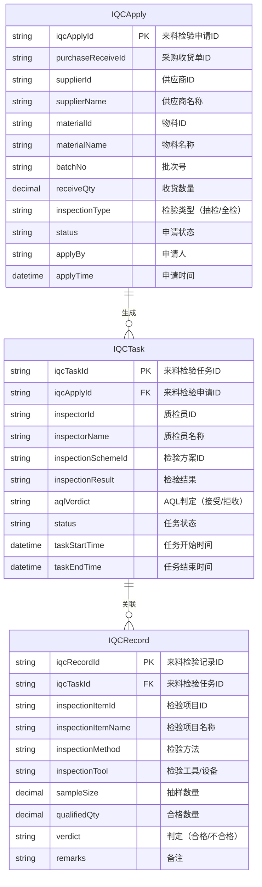
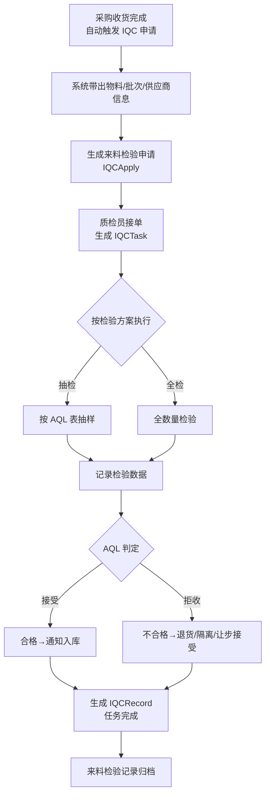

# 来料检验

## 1. 概述

来料检验（Incoming Quality Control, IQC）是质量管理体系的第一道关口，确保采购物料在入库前符合质量标准。系统通过与 WMS 采购收货流程联动，自动触发来料检验申请，依据检验方案（抽检/全检）执行检验，并根据 AQL 判定结果决定物料处置方式。

**核心流程链路**：

```mermaid
sequenceDiagram
    participant采购 as 采购收货
    participantWMS as WMS库房
    participantQMS as 来料检验
    participant仓库 as 仓库

    采购->>WMS: 采购收货完成
    WMS->>QMS: 触发来料检验申请（自动带出物料/批次/供应商）
    QMS->>质检员: 质检员接单
    质检员->>QMS: 执行抽检/全检，记录检验数据
    QMS->>QMS: AQL判定（根据AQL表判定批次是否接受）
    alt 合格
        QMS->>仓库: 合格→入库
    else 不合格
        QMS->>仓库: 不合格→退货/隔离/让步接受
    end
```

**业务规则**：

- 触发时机：采购收货单审核通过后自动创建来料检验申请
- 检验方式：由检验方案定义（抽检/全检），根据供应商、物料类型、批次大小综合判定
- AQL 判定：依据 GB/T 2828.1-2012 标准，根据抽样数量和接受准则判定批次是否接受
- 不合格处置：退货（退回供应商）、隔离（待评审）、让步接受（特采入库）

---

## 2. 领域模型

### 2.1 实体关系图



### 2.2 核心实体说明

| 实体 | 说明 | 生命周期 |
|------|------|----------|
| IQCApply（来料检验申请） | 采购收货后自动创建，汇总待检物料信息 | 收货触发→任务关联后状态变更 |
| IQCTask（来料检验任务） | 质检员接单后生成，记录检验执行信息 | 接单→执行→判定完成 |
| IQCRecord（来料检验记录） | 按检验项目逐条记录检验数据 | 随任务创建，支持多条记录 |

---

## 3. 核心流程

### 3.1 来料检验完整流程



### 3.2 AQL 判定规则

AQL（Acceptable Quality Limit）判定依据 GB/T 2828.1-2012，典型判定表：

| 批量范围 | 抽样水平 | AQL=1.0<br/>接受数/拒收数 | AQL=2.5<br/>接受数/拒收数 |
|----------|----------|--------------------------|--------------------------|
| 51-90 | S-2 | 1/2 | 2/3 |
| 91-150 | S-3 | 2/3 | 3/4 |
| 151-280 | S-4 | 3/4 | 5/6 |
| 281-500 | I | 5/6 | 7/8 |
| 501-1200 | II | 7/8 | 10/11 |
| 1201-3200 | III | 10/11 | 14/15 |

---

## 4. 字段说明

### 4.1 来料检验申请（IQCApply）

| 字段名 | 中文名称 | 数据类型 | 说明 |
|--------|----------|----------|------|
| iqcApplyId | 来料检验申请ID | string | 主键 (待截图确认) |
| purchaseReceiveId | 采购收货单ID | string | 关联WMS采购收货单 (待截图确认) |
| supplierId | 供应商ID | string | 供应商主键 (待截图确认) |
| supplierName | 供应商名称 | string | 供应商全称 (待截图确认) |
| materialId | 物料ID | string | 物料主键 (待截图确认) |
| materialName | 物料名称 | string | 物料名称 (待截图确认) |
| batchNo | 批次号 | string | 采购批次号 (待截图确认) |
| receiveQty | 收货数量 | decimal | 本次收货数量 (待截图确认) |
| inspectionType | 检验类型 | string | 枚举：抽样检验/全数检验 (待截图确认) |
| status | 申请状态 | string | 待接单/已接单/已完成/已取消 (待截图确认) |
| applyBy | 申请人 | string | 制单人 (待截图确认) |
| applyTime | 申请时间 | datetime | 制单时间 (待截图确认) |

### 4.2 来料检验任务（IQCTask）

| 字段名 | 中文名称 | 数据类型 | 说明 |
|--------|----------|----------|------|
| iqcTaskId | 来料检验任务ID | string | 主键 (待截图确认) |
| iqcApplyId | 来料检验申请ID | string | 关联IQCApply外键 (待截图确认) |
| inspectorId | 质检员ID | string | 接单质检员ID (待截图确认) |
| inspectorName | 质检员名称 | string | 接单质检员姓名 (待截图确认) |
| inspectionSchemeId | 检验方案ID | string | 关联检验方案配置 (待截图确认) |
| inspectionResult | 检验结果 | string | 合格/不合格/待评审 (待截图确认) |
| aqlVerdict | AQL判定 | string | 接受ACCEPT/拒收REJECT (待截图确认) |
| status | 任务状态 | string | 待检验/检验中/已完成 (待截图确认) |
| taskStartTime | 任务开始时间 | datetime | 质检员接单时间 (待截图确认) |
| taskEndTime | 任务结束时间 | datetime | 检验完成时间 (待截图确认) |

### 4.3 来料检验记录（IQCRecord）

| 字段名 | 中文名称 | 数据类型 | 说明 |
|--------|----------|----------|------|
| iqcRecordId | 来料检验记录ID | string | 主键 (待截图确认) |
| iqcTaskId | 来料检验任务ID | string | 关联IQCTask外键 (待截图确认) |
| inspectionItemId | 检验项目ID | string | 检验项目主键 (待截图确认) |
| inspectionItemName | 检验项目名称 | string | 外观/尺寸/性能/功能等 (待截图确认) |
| inspectionMethod | 检验方法 | string | 目测/测量/实测/仪器检测 (待截图确认) |
| inspectionTool | 检验工具 | string | 卡尺/千分尺/硬度计/光谱仪等 (待截图确认) |
| sampleSize | 抽样数量 | decimal | 本项目抽检数量 (待截图确认) |
| qualifiedQty | 合格数量 | decimal | 合格品数量 (待截图确认) |
| verdict | 判定 | string | 合格/不合格 (待截图确认) |
| remarks | 备注 | string | 不合格原因/异常描述等 (待截图确认) |