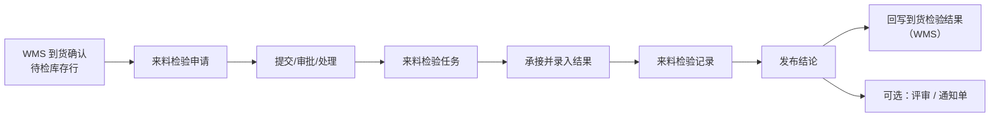

# 来料检验

> 适用基线：测试环境目标 / `dev` 分支 / 2026-07-15。
> 阅读对象：IQC、仓库协同、质量主管；操作见[来料检验-维护与查询参考](来料检验-维护与查询参考.md)。

## 业务目的与适用范围

来料检验把供应商到货中需要质量确认的物料，转化为可追溯的检验申请、任务与记录，并给出接收/拒绝与使用决策结论。库存放行、隔离、退货等**事务以 WMS 为准**；本页只写检验链与触发/回写边界。

通用 ATR 见[申请、任务与记录模型](../../02-业务模型/01-申请任务记录模型.md)。收货主链见 WMS [采购收货](../../05-WMS-库房管理/03-采购收货/index.md)。

## 如何使用本组文档

| 你的目的 | 建议阅读 |
| --- | --- |
| 想理解到货如何进入 IQC | 本页。 |
| 正在处理申请/任务/记录 | [来料检验-维护与查询参考](来料检验-维护与查询参考.md)。 |
| 想维护抽样与方案 | [检验配置](../01-检验配置/index.md)。 |
| 不合格要评审或索赔 | [质量评审](../05-质量评审/index.md)。 |

## 使用前准备

| 需要确认什么 | 为什么重要 |
| --- | --- |
| 物料来料检验方案（非免检） | 决定是否建单及抽什么。 |
| 到货确认与库存待检状态 | **当前主触发点**在到货确认的待检行，而非采购收货完成。 |
| 供应商、批次、包装、ASN/采购订单行 | 追溯与回写键。 |
| 自动提交/同意/执行策略 | 申请字段支持自动策略，以环境配置为准。 |

!!! example "📷 截图占位"
    来料检验申请列表（供应商、物料、状态）。

## 一笔来料检验如何完成

说明：

1. 采购收货记录侧「创建检验申请」入口**已停用**（兼容历史消息，实际跳过），检验前置到到货确认。
2. 到货确认仅对数量>0 且库存状态为待检的明细建申请；建单前可按物料查询方案免检。
3. 记录发布后，存在 ASN 且类型为采购收货检验时，向到货侧回写包装合格/不合格/破坏/冻结数量与使用决策。

## 三类业务对象

| 对象 | 业务含义 | 使用者关心 |
| --- | --- | --- |
| 申请 | 对一批到货提出检验需求：供应商、物料、数量、方案、类型、参考订单/ASN 等。 | 来源是否正确、能否进入任务。 |
| 任务 | 可执行的检验工作：承接人、方案、严格度、明细步骤与包装。 | 抽多少、测什么、谁做。 |
| 记录 | 实际结果与评估码、使用决策；可发布并回写上游。 | 结论、数量拆分、是否已回写。 |

## 状态与关键动作

申请状态（培训名）：新增、审批中、审批通过、审批驳回、关闭、处理中、部分完成、已完成、中止。
任务状态：待处理、进行中、完成、关闭。
判定：评估码为接收/拒绝；使用决策含全部合格、全部不合格、报废、隔离。

| 所属 | 常见动作 | 业务结果 |
| --- | --- | --- |
| 申请 | 新增、修改、提交、同意、驳回、处理、关闭 | 推进为任务或结束 |
| 任务 | 承接、执行、完成 | 形成记录草稿/结果 |
| 记录 | 录入定量/定性、发布 | 固化结论并触发上游回写 |

!!! example "📐 图示占位"
    申请—任务—记录状态允许动作；以测试环境为准。

## 与 WMS / 配置 / 评审的边界

| 协同方 | 本页负责 | 不在本页展开 |
| --- | --- | --- |
| WMS 到货/收货 | 消费待检触发；发布回写结论 | 收货库存事务、上架、采购退货规则 |
| 检验配置 | 按方案抽样与判定 | 方案主数据维护细节 |
| 质量评审 | 不合格出口线索 | 让步/报废/返修审批链 |
| 库存隔离/放行 | 给出使用决策 | WMS 不合格转隔离等事务 |

## 关键判断

| 判断点 | 应先确认什么 | 影响 |
| --- | --- | --- |
| 为何没有申请 | 是否免检、是否待检、到货确认是否成功 | 避免在收货记录上反复点「建检验」 |
| 部分不合格 | 包装合格/不合格/破坏/冻结数量 | 回写数量与后续处置 |
| 是否进评审 | 组织流程与不合格严重度 | 转质量评审或通知单 |
| 结论是否生效 | 记录是否已发布 | 未发布不应假定库存已变 |

### 关键字段业务角色

完整语义与状态门禁见[维护与查询参考](来料检验-维护与查询参考.md)。本表只列主线关键项。

| 字段/配置点 | 行为模式 | 在系统中的作用 | 关键行为要点（取值/范围/联动/门禁） | 维护或操作时要警惕什么 |
| --- | --- | --- | --- | --- |
| 触发来源（到货确认待检行） | P2 / P9 | 决定是否建申请 | 数量>0 且库存状态待检；免检则可能跳过 | 勿在已停用的收货「建检验」入口空等 |
| 供应商 / 物料 / ASN·订单行 | P2 / P5 | 追溯与回写键 | 多由上游带入 | 键错导致回写失败 |
| 检验方案 / 严格度 | P2 / P12 | 抽什么、多严 | 按物料+来料类型选方案 | 无方案无法执行 |
| 评估码（接收/拒绝） | P1 / P9 | 判定结论 | 与使用决策配合 | 拒收未走评审出口 |
| 使用决策 | P1 / P12 | 合格/不合格/报废/隔离意图 | **库存事务以 WMS 为准** | 决策≠已改库存 |
| 合格/不合格等数量拆分 | P7 | 回写到货侧数量 | 有 ASN 且类型匹配时回写 | 数量对不齐对账失败 |
| 申请/任务/记录状态 | P9 | ATR 门禁 | 见上文状态名 | 非预期状态强发 |

## 限制与待确认

- 发货检验等类型码存在，但来料菜单仅覆盖采购收货检验类型执行入口。
- 旧采购收货检验结果回写路径已注释；以到货回写为准。
- PDA「到货检验申请/记录」菜单多为占位无组件，现场以 Web QMS 菜单为准。

!!! example "📝 示例数据占位"
    ASN 到货 100 件待检 → 申请 → 抽检 → 90 合格/10 不合格 → 发布 → 到货回写。

