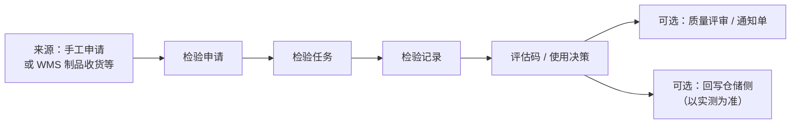

# 生产检验

> 适用基线：测试环境目标 / `dev` 分支 / 2026-07-15。
> 阅读对象：测试、实施、运维（主）；IPQC、生产质量、线边协同等现场角色（顺带）；操作见[生产检验-维护与查询参考](生产检验-维护与查询参考.md)。

## 业务目的与适用范围

生产检验覆盖制造过程中的质量确认：开线首件、收尾末件、过程巡检，以及未单独拆分的其他过程场景。菜单拆为四套申请—任务—记录，共用同一套 ATR 结构，靠检验类型与菜单过滤区分。读完本页，应能立刻判断三件事：

1. **该走哪套菜单**：首件 / 末件 / 巡检 / 其他，与组织时机和方案类型一致。
2. **为何自动出现（或未出现）检验单**：已证实一类触发是 WMS 制品收货；MES 报工 NG → 自动建单**未证实**（`GAP-071`），勿空等。
3. **结论后库存怎么动**：使用决策是意图；隔离/报废/放行等**事务以 WMS 为准**。

工艺节点检验配置线索见 MES [工艺管理](../../06-MES-生产管理/02-工艺管理/index.md)；工单执行见[计划管理](../../06-MES-生产管理/03-计划管理/index.md) / [终端操作](../../06-MES-生产管理/06-终端操作/index.md)。方案与抽样见[检验配置](../01-检验配置/index.md)。

| 菜单分组 | 典型用途 |
| --- | --- |
| 首件检验 | 开线/换型后首件确认。 |
| 末件检验 | 批次或班次结束确认。 |
| 巡检检验 | 过程巡回抽检（**不是** EAM 设备巡检）。 |
| 其他检验 | 未单独拆分的过程检验场景。 |

## 如何使用本组文档

| 你的目的 | 建议阅读 |
| --- | --- |
| 理解四套分工、触发边界与一笔主线 | 本页：准备 → 一笔检验 → 关键判断 → 建议验证点 |
| 处理首件/末件/巡检/其他申请任务记录，或查字段 | [生产检验-维护与查询参考](生产检验-维护与查询参考.md) |
| 配方案与工序码 | [检验配置](../01-检验配置/index.md) |
| 不合格要评审 | [质量评审](../05-质量评审/index.md) |

## 使用前准备

| 需要确认什么 | 为什么重要 |
| --- | --- |
| 对应检验类型的方案 | 首件/末件/巡检等类型码不同；勿串到来料方案。 |
| 工单号、产线、物料、批次/包装 | 追溯与评审明细可能引用。 |
| 触发方式 | **已证实**：WMS 制品收货可自动建检验（类型码与「巡检」枚举名相同的码）。**未证实**：MES 报工 NG 自动建 QMS 单（`GAP-071`）。 |
| 手工申请权限 | 四套菜单均可手工维护申请。 |

!!! example "📷 截图占位"
    首件检验申请与任务列表。

## 一笔生产检验如何完成

四套菜单共用同一套申请/任务/记录数据结构，靠检验类型与菜单过滤区分。

| 对象 | 业务含义 |
| --- | --- |
| 申请 | 提出过程检验需求；可带生产相关参考号、方案、数量。 |
| 任务 | 分配执行；含过程步骤与包装。 |
| 记录 | 保存实测与结论；可发布。 |

申请/任务状态口径与来料相同（新增…已完成；待处理…关闭）。判定：接收/拒绝；使用决策：全部合格/全部不合格/报废/隔离。

!!! example "写实示例：给定 → 期望"

    **路径 A · 手工首件**

    - **给定：** 开线换型；物料已配首件类型方案；有权限在「首件检验」建申请。
    - **期望：** 申请类型与方案为首件；处理生成任务；承接后可录入步骤；发布后可追溯工单/产线。勿进巡检菜单录首件。

    **路径 B · 制品收货触发**

    - **给定：** WMS 制品收货成功；规则/开关允许建检验；类型码与「巡检」枚举名同码场景。
    - **期望：** 出现检验申请，可用收货记录号/回调号联查；菜单展示可能落在「巡检」口径，须联查类型，勿与菜单名简单等同。

    **路径 C · 报工 NG 无单**

    - **给定：** MES 报工 NG；现场等待自动出 QMS 检验单。
    - **期望：** **不保证**自动建单（`GAP-071`）；应按组织流程手工建对应类型申请，或仅把报工作协同线索。

    **路径 D · 不合格出口**

    - **给定：** 记录评估码拒绝或使用决策不合格/报废/隔离；组织要求进 MRB。
    - **期望：** 可联查质量评审；库存后续到 WMS 核对——使用决策 ≠ 库存已变。

## 与 MES / WMS / 配置的边界

| 协同方 | 本页负责 | 不在本页展开 |
| --- | --- | --- |
| 检验配置 | 消费对应类型方案与抽样 | 方案主数据维护细节 |
| MES 工单/报工 | 提供可关联的生产上下文；不良为协同线索 | NG→自动建检验单映射（`GAP-071`） |
| MES 工艺 | 方案可配工序码作线索 | 路线图形与节点扩展细节 |
| WMS 制品收货 | 可触发建申请 | 完工入库库存事务 |
| WMS 库存状态调整 | 给出质量结论意图 | 隔离/报废移动单据 |
| 质量评审 | 不合格出口线索 | 让步/报废/返修审批链 |
| EAM 设备巡检 | — | **不是**本页「巡检检验」 |

## 关键判断

| 判断点 | 应先确认什么 | 影响 |
| --- | --- | --- |
| 用首件还是巡检菜单 | 组织定义的时机与方案类型 | 选错类型会导致方案与统计错位 |
| 制品收货后出现的检验单 | 类型码与菜单过滤 | 可能出现在「巡检」口径下，需联查类型 |
| 报工 NG 后无检验单 | 是否仅线索、是否需手工申请 | 勿假定自动建单 |
| 不合格出口 | 是否进评审 | 见质量评审 |
| 结论是否影响库存 | 记录是否发布 + WMS 是否已处置 | 决策≠已改库存 |

### 关键字段业务角色

完整表见[维护与查询参考](生产检验-维护与查询参考.md)。本表只列主线关键项。

| 字段/配置点 | 在系统中的作用 | 关键行为要点 | 警惕什么 |
| --- | --- | --- | --- |
| 检验类型（首件/末件/巡检/其他） | 菜单与方案分流 | 四套 ATR 同结构、靠类型区分 | 选错菜单→方案/统计错 |
| 工单/产线/物料/批次 | 生产上下文 | 手工或上游带入 | 无上下文难追溯 |
| 触发：WMS 制品收货 | 自动建申请（已证实一类） | 类型码与「巡检」枚举名同码场景 | 与菜单名勿简单等同 |
| 触发：MES 报工 NG | **未证实**自动建单 | 仅作协同线索（`GAP-071`） | 勿写成固定自动建单 |
| 评估码 / 使用决策 | 判定与处置意图 | 同来料口径；**库存归 WMS** | 决策≠库存已变 |
| ATR 状态 | 门禁 | 同来料九态/四态 | 非预期状态强发 |

### 选择器范围（骨架）

| 选择字段 | 选择对象 | 可选范围（当前可写） | 范围依赖 | 选不到时通常原因 |
| --- | --- | --- | --- | --- |
| 检验类型入口 | 首件/末件/巡检/其他菜单 | 四套 ATR 同结构，靠类型区分 | 菜单与权限 | 进错菜单→方案错 |
| 工单 / 产线 / 物料 | 生产上下文 | 手工或上游带入；可用主数据通例见[通用选择器过滤惯例](../../02-业务模型/12-通用选择器过滤惯例.md) | 工单状态 ❓ | 无在制上下文、停用 |
| 检验方案 | 检验配置 | 物料 + 对应生产类检验类型 + 有效期 | 类型、物料 | 无方案、类型不符 |
| MES 报工 NG → 申请 | （自动） | **未证实**自动建单（`GAP-071`） | — | 勿空等自动单 |

### 建议验证点

- 四套菜单均可手工建申请并生成任务、完成记录；类型与方案不串到来料。
- 首件场景在首件菜单完成；勿用巡检菜单顶替验收。
- 制品收货在开关/规则允许时能建检验申请；回调号可联查；类型与菜单展示关系以环境样例核对。
- 报工 NG **不**假定自动出单；需手工时有操作路径。
- 未发布时不以「已选使用决策」假定库存已变；库存后续在 WMS 核对。
- 不合格样例可联查质量评审（按组织流程）；与 EAM 设备巡检菜单不混淆。

## 查询、详情与联查

| 想解决的问题 | 推荐定位方式 | 建议联查 |
| --- | --- | --- |
| 某工单质量确认做到哪 | 工单号 + 四套记录过滤 | MES 报工（NG 线索）、方案类型 |
| 制品收货为何出/未出检验单 | 收货记录号/回调号 | WMS 制品收货、规则开关 |
| 结论是否生效 | 记录是否发布、使用决策 | 质量评审、WMS 库存处置 |

## 限制与待确认

- `GAP-071`：MES 报工 NG → QMS 检验单据映射未证实；正式培训仅作协同线索。
- `FSEM-006`：生产检验选择器状态集与权限投影待测。
- 检验类型枚举另有「过程检验」「性能检验」等，菜单未全部单列。
- 制品收货触发使用的类型码与枚举业务名「巡检」一致；与菜单「巡检检验」关系以环境样例核对。
- 记录发布对制品收货回写的代码路径曾有注释，是否启用需联调。

!!! example "📝 示例数据占位"
    工单 WO 首件申请 → 任务 → 记录不合格 → 转评审。
