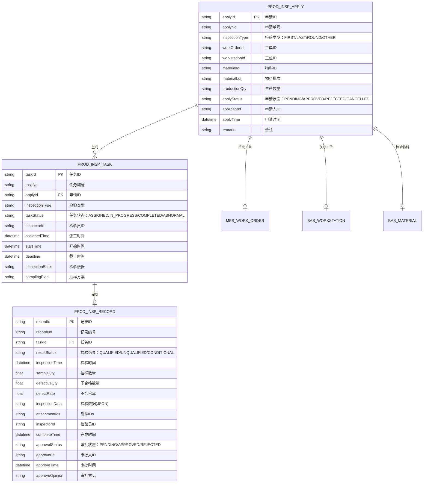
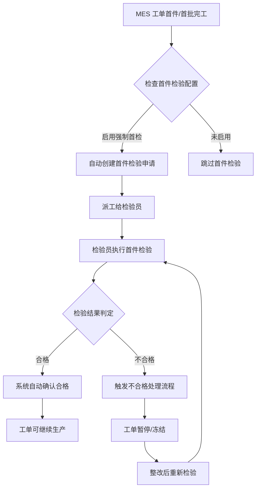
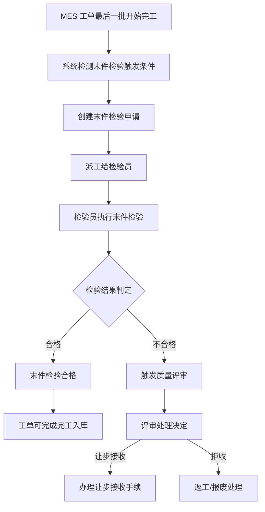
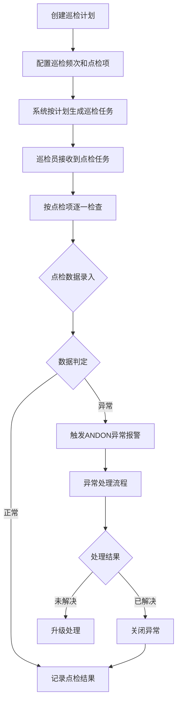
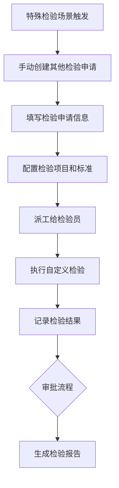

# 03-生产检验

## 概述

生产检验是 QMS 质量管理模块的核心组成部分，覆盖离散制造业生产过程中的质量检验活动。通过对首件、末件、巡检及其他检验场景的规范管理，确保产品质量稳定可控，满足客户要求和行业标准。

### 业务范围

| 检验类型 | 触发方式 | 检验目的 |
|---------|---------|---------|
| 首件检验 | MES 工单首件/首批完工强制触发 | 验证工艺参数和物料的正确性，防止批量性质量问题 |
| 末件检验 | 工单最后一批完工前执行 | 确认生产收尾阶段质量稳定性 |
| 巡检检验 | 按计划/频次定时执行 | 监控生产过程稳定性，及时发现异常 |
| 其他检验 | 特殊场景手动发起 | 满足个性化检验需求 |

---

## 领域模型

### ER 实体关系图



### 核心实体说明

| 实体名称 | 英文名 | 说明 |
|---------|-------|------|
| 生产检验申请 | ProdInspApply | 发起检验的申请单，记录检验基本信息 |
| 生产检验任务 | ProdInspTask | 检验任务派工单，分配给具体检验人员 |
| 生产检验记录 | ProdInspRecord | 检验结果的详细记录，包含检验数据和判定结论 |
| MES工单 | MesWorkOrder | 关联的生产工单，作为检验的触发源 |
| 工位 | BasWorkstation | 执行检验的生产工位 |
| 物料 | BasMaterial | 被检验的物料信息 |

---

## 核心流程

### 首件检验流程



**业务规则**：
- 首件检验未通过时，工单状态置为 `HALTED`，禁止继续生产
- 首件检验合格后自动触发 MES 工单解锁
- 首件检验支持加急处理，设置检验截止时间

### 末件检验流程



**业务规则**：
- 末件检验主要验证生产收尾阶段设备状态和工艺稳定性
- 末件检验结果影响整张工单的质量评级
- 支持与首件检验结果对比分析

### 巡检检验流程



**业务规则**：
- 巡检点检项支持：开关类、数值类、记录类、观察类
- 异常报警自动推送至车间看板和班组长
- 巡检数据支持趋势分析，预测设备健康状态

### 其他检验流程



**业务规则**：
- 其他检验适用于：模具检验、工装检验、过程变更确认等场景
- 检验项目和判定标准可自定义配置
- 支持引用已有检验标准或新建标准

---

## 字段说明

### 生产检验申请 (ProdInspApply)

| 字段名 | 中文名 | 数据类型 | 必填 | 说明 |
|-------|-------|---------|-----|------|
| applyId | 申请ID | String | 是 | 主键 UUID |
| applyNo | 申请单号 | String | 是 | 格式：SJ-YYYYMMDD-XXXX (待截图确认) |
| inspectionType | 检验类型 | Enum | 是 | FIRST/LAST/ROUND/OTHER |
| workOrderId | 工单ID | String | 否 | 关联 MES 工单 (待截图确认) |
| workOrderNo | 工单编号 | String | 否 | MES 工单编号 (待截图确认) |
| workstationId | 工位ID | String | 否 | 关联工位 (待截图确认) |
| workstationName | 工位名称 | String | 否 | 工位名称 (待截图确认) |
| materialId | 物料ID | String | 是 | 被检验物料 (待截图确认) |
| materialCode | 物料编码 | String | 是 | 物料编码 (待截图确认) |
| materialName | 物料名称 | String | 是 | 物料名称 (待截图确认) |
| materialLot | 物料批次 | String | 否 | 物料批次号 (待截图确认) |
| productionQty | 生产数量 | Number | 是 | 检验对应的生产数量 (待截图确认) |
| applyStatus | 申请状态 | Enum | 是 | PENDING/APPROVED/REJECTED/CANCELLED |
| applicantId | 申请人ID | String | 是 | 申请人用户ID (待截图确认) |
| applicantName | 申请人姓名 | String | 是 | 申请人姓名 (待截图确认) |
| applyTime | 申请时间 | DateTime | 是 | 申请提交时间 |
| approveId | 审批人ID | String | 否 | 审批人ID (待截图确认) |
| approveName | 审批人姓名 | String | 否 | 审批人姓名 (待截图确认) |
| approveTime | 审批时间 | DateTime | 否 | 审批时间 |
| approveOpinion | 审批意见 | String | 否 | 审批意见 (待截图确认) |
| remark | 备注 | String | 否 | 备注信息 |
| ext1 | 扩展字段1 | String | 否 | 扩展字段 (待截图确认) |
| ext2 | 扩展字段2 | String | 否 | 扩展字段 (待截图确认) |
| ext3 | 扩展字段3 | String | 否 | 扩展字段 (待截图确认) |
| createTime | 创建时间 | DateTime | 是 | 系统自动生成 |
| createBy | 创建人 | String | 是 | 创建人ID |
| updateTime | 更新时间 | DateTime | 否 | 最后更新时间 |
| updateBy | 更新人 | String | 否 | 更新人ID |

### 生产检验任务 (ProdInspTask)

| 字段名 | 中文名 | 数据类型 | 必填 | 说明 |
|-------|-------|---------|-----|------|
| taskId | 任务ID | String | 是 | 主键 UUID |
| taskNo | 任务编号 | String | 是 | 格式：RW-YYYYMMDD-XXXX (待截图确认) |
| applyId | 申请ID | String | 是 | 关联检验申请 |
| applyNo | 申请单号 | String | 是 | 关联申请单号 |
| inspectionType | 检验类型 | Enum | 是 | FIRST/LAST/ROUND/OTHER |
| taskStatus | 任务状态 | Enum | 是 | ASSIGNED/IN_PROGRESS/COMPLETED/ABNORMAL |
| inspectorId | 检验员ID | String | 是 | 检验员用户ID (待截图确认) |
| inspectorName | 检验员姓名 | String | 是 | 检验员姓名 (待截图确认) |
| assignedTime | 派工时间 | DateTime | 是 | 任务派工时间 |
| startTime | 开始时间 | DateTime | 否 | 实际开始检验时间 |
| deadline | 截止时间 | DateTime | 是 | 检验截止时间 (待截图确认) |
| inspectionBasis | 检验依据 | String | 否 | 检验依据标准 (待截图确认) |
| samplingPlan | 抽样方案 | String | 否 | 抽样方案描述 (待截图确认) |
| inspectionItems | 检验项目 | JSON | 是 | 检验项目明细 (待截图确认) |
| taskSource | 任务来源 | Enum | 是 | AUTO/MANUAL：AUTO=自动派工，MANUAL=手动派工 |
| completeTime | 完成时间 | DateTime | 否 | 检验任务完成时间 |
| completeRemark | 完成备注 | String | 否 | 完成备注 (待截图确认) |
| createTime | 创建时间 | DateTime | 是 | 系统自动生成 |
| createBy | 创建人 | String | 是 | 创建人ID |
| updateTime | 更新时间 | DateTime | 否 | 最后更新时间 |
| updateBy | 更新人 | String | 否 | 更新人ID |

### 生产检验记录 (ProdInspRecord)

| 字段名 | 中文名 | 数据类型 | 必填 | 说明 |
|-------|-------|---------|-----|------|
| recordId | 记录ID | String | 是 | 主键 UUID |
| recordNo | 记录编号 | String | 是 | 格式：JL-YYYYMMDD-XXXX (待截图确认) |
| taskId | 任务ID | String | 是 | 关联检验任务 |
| taskNo | 任务编号 | String | 是 | 关联任务编号 |
| applyId | 申请ID | String | 是 | 关联检验申请 |
| applyNo | 申请单号 | String | 是 | 关联申请单号 |
| inspectionType | 检验类型 | Enum | 是 | FIRST/LAST/ROUND/OTHER |
| resultStatus | 检验结果 | Enum | 是 | QUALIFIED/UNQUALIFIED/CONDITIONAL |
| inspectionTime | 检验时间 | DateTime | 是 | 实际检验时间 |
| sampleQty | 抽样数量 | Number | 是 | 抽样数量 (待截图确认) |
| defectiveQty | 不合格数量 | Number | 是 | 不合格数量 (待截图确认) |
| defectRate | 不合格率 | Number | 是 | 不合格率计算值 (待截图确认) |
| inspectionData | 检验数据 | JSON | 是 | 各检验项目的具体数据和判定结果 (待截图确认) |
| defectDetails | 不合格明细 | JSON | 否 | 不合格项明细 (待截图确认) |
| attachmentIds | 附件IDs | String | 否 | 附件ID列表，逗号分隔 (待截图确认) |
| inspectorId | 检验员ID | String | 是 | 检验员ID (待截图确认) |
| inspectorName | 检验员姓名 | String | 是 | 检验员姓名 (待截图确认) |
| completeTime | 完成时间 | DateTime | 是 | 检验完成时间 |
| approvalStatus | 审批状态 | Enum | 是 | PENDING/APPROVED/REJECTED |
| approverId | 审批人ID | String | 否 | 审批人ID (待截图确认) |
| approverName | 审批人姓名 | String | 否 | 审批人姓名 (待截图确认) |
| approveTime | 审批时间 | DateTime | 否 | 审批时间 |
| approveOpinion | 审批意见 | String | 否 | 审批意见 (待截图确认) |
| compareWithFirst | 与首件对比 | JSON | 否 | 末件检验时与首件检验数据对比 (待截图确认) |
| qualityLevel | 质量等级 | Enum | 否 | A/B/C/D 质量等级评定 (待截图确认) |
| createTime | 创建时间 | DateTime | 是 | 系统自动生成 |
| createBy | 创建人 | String | 是 | 创建人ID |
| updateTime | 更新时间 | DateTime | 否 | 最后更新时间 |
| updateBy | 更新人 | String | 否 | 更新人ID |

### 巡检计划 (ProdInspPlan) - 巡检特有

| 字段名 | 中文名 | 数据类型 | 必填 | 说明 |
|-------|-------|---------|-----|------|
| planId | 计划ID | String | 是 | 主键 UUID |
| planNo | 计划编号 | String | 是 | 巡检计划编号 (待截图确认) |
| planName | 计划名称 | String | 是 | 巡检计划名称 (待截图确认) |
| planType | 计划类型 | Enum | 是 | ROUTINE/SPECIAL：常规/专项巡检 |
| workstationId | 工位ID | String | 是 | 巡检工位 (待截图确认) |
| workstationName | 工位名称 | String | 是 | 工位名称 (待截图确认) |
| frequencyType | 频次类型 | Enum | 是 | HOUR/DAY/WEEK/MONTH：按小时/天/周/月 |
| frequencyValue | 频次值 | Number | 是 | 频次数值，如2表示每2小时 (待截图确认) |
| inspectionItems | 点检项目 | JSON | 是 | 点检项目配置 (待截图确认) |
| startDate | 计划开始日期 | Date | 是 | 计划开始执行日期 |
| endDate | 计划结束日期 | Date | 否 | 计划结束日期 (待截图确认) |
| planStatus | 计划状态 | Enum | 是 | ACTIVE/SUSPENDED/STOPPED |
| inspectorIds | 巡检员IDs | String | 是 | 巡检员ID列表，逗号分隔 (待截图确认) |
| remark | 备注 | String | 否 | 备注信息 |
| createTime | 创建时间 | DateTime | 是 | 系统自动生成 |
| createBy | 创建人 | String | 是 | 创建人ID |

### 巡检记录 (ProdInspRoundRecord) - 巡检特有

| 字段名 | 中文名 | 数据类型 | 必填 | 说明 |
|-------|-------|---------|-----|------|
| roundRecordId | 巡检记录ID | String | 是 | 主键 UUID |
| roundRecordNo | 巡检记录编号 | String | 是 | 格式：XJ-YYYYMMDD-XXXX (待截图确认) |
| planId | 计划ID | String | 是 | 关联巡检计划 |
| planNo | 计划编号 | String | 是 | 巡检计划编号 |
| workstationId | 工位ID | String | 是 | 巡检工位 (待截图确认) |
| workstationName | 工位名称 | String | 是 | 工位名称 (待截图确认) |
| inspectionTime | 巡检时间 | DateTime | 是 | 实际巡检时间 |
| inspectorId | 巡检员ID | String | 是 | 巡检员ID (待截图确认) |
| inspectorName | 巡检员姓名 | String | 是 | 巡检员姓名 (待截图确认) |
| itemResults | 点检项结果 | JSON | 是 | 各点检项的检查结果 (待截图确认) |
| hasAbnormal | 是否有异常 | Boolean | 是 | 是否有异常情况 |
| abnormalDesc | 异常描述 | String | 否 | 异常情况描述 (待截图确认) |
| andonTicketId | 安灯单ID | String | 否 | 触发生成的安灯单ID (待截图确认) |
| remark | 备注 | String | 否 | 备注信息 |
| createTime | 创建时间 | DateTime | 是 | 系统自动生成 |
| createBy | 创建人 | String | 是 | 创建人ID |

---

## 枚举值说明

### 检验类型 (InspectionType)

| 编码 | 中文名 | 说明 |
|-----|-------|------|
| FIRST | 首件检验 | MES 工单首件/首批完工后强制触发 |
| LAST | 末件检验 | 工单最后一批完工前检验 |
| ROUND | 巡检检验 | 按计划定时执行的过程巡检 |
| OTHER | 其他检验 | 特殊场景的自定义检验 |

### 申请状态 (ApplyStatus)

| 编码 | 中文名 | 说明 |
|-----|-------|------|
| PENDING | 待审批 | 申请提交待审批 |
| APPROVED | 已审批 | 申请已通过审批 |
| REJECTED | 已驳回 | 申请被驳回 |
| CANCELLED | 已取消 | 申请已取消 |

### 任务状态 (TaskStatus)

| 编码 | 中文名 | 说明 |
|-----|-------|------|
| ASSIGNED | 已派工 | 任务已分配给检验员 |
| IN_PROGRESS | 检验中 | 检验员正在执行检验 |
| COMPLETED | 已完成 | 检验任务已完成 |
| ABNORMAL | 异常 | 检验过程中发现异常 |

### 检验结果 (ResultStatus)

| 编码 | 中文名 | 说明 |
|-----|-------|------|
| QUALIFIED | 合格 | 检验项目全部合格 |
| UNQUALIFIED | 不合格 | 检验项目存在不合格项 |
| CONDITIONAL | 条件合格 | 存在不合格项但可让步接收 |

### 审批状态 (ApprovalStatus)

| 编码 | 中文名 | 说明 |
|-----|-------|------|
| PENDING | 待审批 | 检验结果待审批 |
| APPROVED | 已审批 | 检验结果已审批通过 |
| REJECTED | 已驳回 | 检验结果被驳回需返工 |

---

## 接口规范

### 1. 创建生产检验申请

**请求路径**：POST `/api/qms/prod-insp/apply`

**请求体**：
```json
{
  "inspectionType": "FIRST",
  "workOrderId": "WO20260520001",
  "workstationId": "WS001",
  "materialId": "MAT20250001",
  "materialLot": "LOT2026052001",
  "productionQty": 100,
  "remark": "首件检验"
}
```

**响应体**：
```json
{
  "code": 200,
  "message": "success",
  "data": {
    "applyId": "APL202605200001",
    "applyNo": "SJ-20260520-0001"
  }
}
```

### 2. 分页查询检验申请

**请求路径**：GET `/api/qms/prod-insp/apply/page`

**查询参数**：
| 参数名 | 类型 | 必填 | 说明 |
|-------|-----|-----|------|
| inspectionType | String | 否 | 检验类型 |
| applyStatus | String | 否 | 申请状态 |
| workOrderNo | String | 否 | 工单编号 |
| startDate | Date | 否 | 申请开始日期 |
| endDate | Date | 否 | 申请结束日期 |
| pageNum | Integer | 否 | 页码，默认1 |
| pageSize | Integer | 否 | 每页条数，默认20 |

### 3. 执行生产检验

**请求路径**：POST `/api/qms/prod-insp/inspect`

**请求体**：
```json
{
  "taskId": "TASK20260520001",
  "inspectionTime": "2026-05-20 10:30:00",
  "sampleQty": 10,
  "defectiveQty": 0,
  "inspectionData": [
    {
      "itemCode": "DIM001",
      "itemName": "外观检验",
      "checkValue": "合格",
      "result": "QUALIFIED"
    }
  ],
  "remark": "检验正常"
}
```

### 4. 查询巡检记录

**请求路径**：GET `/api/qms/prod-insp/round-record/page`

**查询参数**：
| 参数名 | 类型 | 必填 | 说明 |
|-------|-----|-----|------|
| planId | String | 否 | 巡检计划ID |
| workstationId | String | 否 | 工位ID |
| hasAbnormal | Boolean | 否 | 是否有异常 |
| startDate | Date | 否 | 巡检开始日期 |
| endDate | Date | 否 | 巡检结束日期 |
| pageNum | Integer | 否 | 页码，默认1 |
| pageSize | Integer | 否 | 每页条数，默认20 |

---

## 相关模块接口

### 依赖模块

| 模块 | 接口方向 | 说明 |
|------|----------|------|
| QMS_CONFIG | [检验配置](../01-检验配置/index.md) | 获取采样方案、AQL 标准、检验模板 |
| MES_PLANNING | [计划管理](../../06-MES-生产管理/03-计划管理/index.md) | 获取工单信息，触发首件/末件检验 |
| MES_ROUTING | [工艺管理](../../06-MES-生产管理/02-工艺管理/index.md) | 获取工序质检点配置 |
| DBC_MATERIAL | [物料主数据](../../04-DBC-主数据管理/01-物料管理/01-物料基本信息.md) | 获取物料检验属性 |

### 被依赖模块

| 模块 | 接口方向 | 说明 |
|------|----------|------|
| MES_PLANNING | [计划管理](../../06-MES-生产管理/03-计划管理/index.md) | 检验结果影响工单状态流转（合格→生产/不合格→冻结） |
| WMS_PROD_RECEIVE | [生产收料](../../05-WMS-库房管理/07-生产收料/index.md) | 检验不合格时限制入库 |
| ANDON_FAULT | [故障记录](../../09-ANDON-异常管理/01-故障记录/index.md) | 巡检异常自动触发 ANDON 报警 |
| QMS_REVIEW | [质量评审](../05-质量评审/index.md) | 末件检验不合格触发质量评审 |

## 与其他模块的交互

### 与 MES 模块

- **工单状态同步**：首件检验合格后，MES 工单状态由 `WAIT_FIRST_INSP` 变为 `IN_PRODUCTION`
- **检验触发**：MES 工单首件/末件完工时，自动触发 QMS 检验申请创建
- **报工联动**：检验结果影响 MES 报工是否可继续

### 与 WMS 模块

- **物料批次追溯**：检验记录关联物料批次，支持正向和反向追溯
- **入库限制**：检验不合格时，限制物料入库或引导至待处理库区

### 与 QMS 质量管理其他模块

- **不合格处理**：检验不合格时，触发 QMS 不合格处理流程
- **质量评审**：末件检验不合格时，可触发质量评审会议

### 与 ANDON 模块

- **异常报警**：巡检发现异常时，自动触发 ANDON 异常报警
- **报警升级**：异常未及时处理时，自动升级至班组长/车间主任

---

## 业务规则汇总

### 检验触发规则

| 检验类型 | 触发条件 | 自动/手动 | 是否强制 |
|---------|---------|----------|---------|
| 首件检验 | MES 工单首件/首批完工 | 自动 | 是 |
| 末件检验 | MES 工单最后一批开始完工 | 自动 | 是 |
| 巡检检验 | 到达巡检计划设定时间点 | 自动 | 是 |
| 其他检验 | 用户手动发起 | 手动 | 否 |

### 状态联动规则

| 当前状态 | 触发事件 | 目标状态 | 联动操作 |
|---------|---------|---------|---------|
| WAIT_FIRST_INSP | 首件检验合格 | IN_PRODUCTION | MES 工单解锁 |
| WAIT_FIRST_INSP | 首件检验不合格 | FIRST_INSP_FAILED | MES 工单冻结 |
| IN_PRODUCTION | 末件检验发起 | WAIT_LAST_INSP | - |
| WAIT_LAST_INSP | 末件检验合格 | CLOSED | 允许完工入库 |
| WAIT_LAST_INSP | 末件检验不合格 | QUALITY_EXCEPTION | 触发[质量评审](../05-质量评审/index.md) |

### 权限控制规则

| 操作 | 角色 |
|-----|-----|
| 创建检验申请 | 生产操作员、质检员 |
| 执行检验 | 质检员 |
| 审批检验结果 | 质量工程师、质检组长 |
| 取消检验申请 | 申请人、质检组长 |
| 维护巡检计划 | 质量工程师 |
